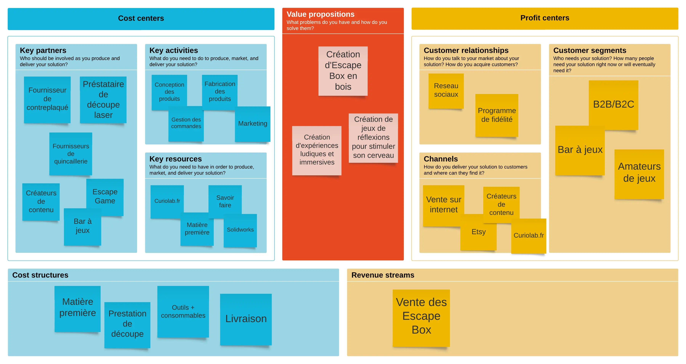
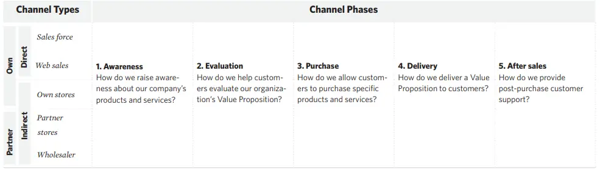


**Aucun**


# MON

L’objectif de ce MON est de me concentrer sur la notion de Business Model d’une entreprise. Pour mettre en pratique les connaissances que je vais acquérir durant ce MON, je vais établir une première ébauche du Business Model de mon projet entrepreneurial. Ce projet consiste en la création d’une entreprise de conception d’Escape Box.
J’ai utilisé les ressources suivantes :

- [Mon de Gabriel Barbé](../../../../2022-2023/Barbé-Gabriel/mon/Business)
- Business Model Generation_ A Handbook for Visionaries, Game Changers, and Challengers

## Le Business Model Canva

Pour commencer cette étude, il faut déjà savoir ce que signifie un Business Model. D’après le livre Business Model Génération, **un Business Model décrit la logique de la façon dont une organisation crée, délivre, et capture de la valeur.**

Ce Business Model peut être décrit par 9 blocs différents qui couvrent les 4 domaines principaux d’une entreprise :

- Les clients
- L’offre
- L’infrastructure
- La viabilité financière

Nous pouvons regrouper ces 9 blocs dans, ce qu’on appelle, un **Business Model Canva** (BMC).

Je ne vais pas trop rentrer dans les détails de chaque bloc car Gabriel Barbe l’a déjà fait pour son MON. Je vais plutôt expliquer les différents aspects de mon projet au travers de ces blocs

Voici la première ébauche du Business Model Canvas de mon projet

## Proposition de valeur

*Le bloc propositions de valeur décrit l'ensemble des produits et services qui créent de la valeur pour un segment de clientèle spécifique.*

La première question à se poser est : Quelle valeur offrons-nous au client ?

Je veux offrir un moyen de partager une activité avec ses amis ou sa famille de façon ludique. Je veux aussi proposer un objet esthétique, que l’on peut afficher dans sa maison ou son appartement.

Pour les bars à jeux, cela peut être un moyen d’attirer de nouveaux clients

## Segments clients

*Les segments de clientèle définissent les différents groupes de personnes ou d'organisations qu'une entreprise vise à atteindre et à servir*

Il existe différents types de segments de clients : marché de masse, marché de niche, segmenté.

Pour mon projet, je pense que je peux viser deux types de clients. Soit je choisis de toucher le maximum de personnes en proposant un produit avec un prix attractif et accessible au plus grand nombre, soit je choisis de me concentrer plus sur les amateurs de ce type de jeux ( collectionneurs, joueurs fréquents) en proposant un produit plus complexe et donc plus cher.

Etant donné que mon produit existe déjà et que je peux difficilement le modifier, je vais m’adresser à un **marché de niche** en me concentrant sur les amateurs de ce style de jeux. En effet, je pourrai difficilement baisser le prix du produit pour toucher le maximum de personne. 

Ensuite, je souhaite aussi vendre mon produit à des **bar à jeux**, qui peuvent être un bon moyen de me faire connaître.

## Canaux

*Le bloc "Canaux" décrit la manière dont une entreprise communique avec ses segments de clientèle et les atteint afin d'offrir une proposition de valeur*

Les canaux peuvent être définis en  5 phases distinctes :

*Business Model Generation_ A Handbook for Visionaries, Game Changers, and Challengers*

Je me suis posé beaucoup de questions sur la façon dont j’allais vendre mon produit. Je cherchais un moyen simple à mettre en place sans m’engager dans des démarches administratives lourdes.
Au début je me suis dit que j’allais vendre mon produit grâce à mon site internet que j’allais créer. 

Mais le plus compliqué est de savoir comment faire connaître mon site internet pour que les gens achète mon produit. De plus, pour acheter sur un site internet, il faut que ce site inspire confiance. Cela me semble compliqué de mettre tout ça en place. 

C’est pourquoi j’ai réfléchi à d’autres moyens de vendre mon produit. En discutant autour de moi  notamment avec une personne qui a crée son entreprise (que j’ai rencontré au fablab de l’école), je me suis intéressé à [Etsy](https://www.etsy.com/fr/). 
**Etsy** est une plateforme en ligne qui se concentre principalement sur la vente d’article fait main.
Il existe déjà sur cette plateforme des produits comme le mien. Utiliser cette plateforme me permettrait de toucher plus facilement mes segments de clientèle. De plus, cela m’aidera à voir si il existe une attirance pour ce type de produit sans prendre de risques.

## Relations clients

*Le bloc “Relations clients” décrit les types de relations qu'une entreprise établit avec des segments de clientèle spécifiques*

Cette section est compliqué pour mon cas car, pour l’instant, je vais vendre qu’un seul produit. Je ne peux donc pas fidéliser un client. 
Cependant pour les questions de services clients, **Etsy** met en place un moyen de contacter le créateur.

## Revenus

*Le bloc des flux de revenus représente l'argent qu'une entreprise génère à partir de chaque segment de clientèle (les coûts doivent être soustraits des recettes pour
pour créer des revenus)*

Ici c’est simple, mes revenus seront générés exclusivement par la vente de mes produits. Il me restera à fixer le prix de mes produits en fonctions des coût de production et de la marge que je veux appliquée.

## Les ressources clés

*Le bloc des ressources clés décrit les actifs les plus importants nécessaires au fonctionnement d'un modèle d'entreprise*

Pour que mon entreprise fonctionne, j’ai besoin de plusieurs ressources.
Tout d’abord, j’ai besoin de matière première pour fabriquer mes Escape Box. Cela comprends du contreplaqué et de la quincaillerie.
Ensuite il me faut le savoir faire. Mon activité reposera essentiellement sur ma capacité à concevoir une Escape Box de qualité. Cela nécessite la connaissance d’un logiciel de conception 3d mais surtout des connaissances en Game Design.   

## Les activités clés

*Le module des activités clés décrit les choses les plus importantes qu'une entreprise doit faire
pour que son modèle d'entreprise fonctionne*

J’ai distingué 4 activités clés pour le bon fonctionnement de mon entreprise :

- Conception du produit (prototypage, test)
- Fabrication du produit
- Gestion des commandes
- Marketing

Je suis encore à l’étape de conception du produit. Je suis en train de réaliser mon premier prototype en bois au Fablab de l’école. Cela prend plus de temps que prévu car il faut faire pleins de tests sur la découpe laser pour avoir la bonne pièce. 

Pour la fabrication du produit, comme je n’aurai pas de découpe laser, je souhaite trouver un prestataire français qui fera les découpe pour moi. Cela me fournira des pièces de meilleurs qualités et le prestataires s’occupera également de l’approvisionnement en contreplaqué. Cela aura forcément un impact sur le prix du produit mais c’est la seule solution possible à mettre en place pour l’instant. Si jamais mon projet fonctionne, je pourrai internaliser ce process de fabrication.

Ensuite, il va falloir que je gère les commandes. Il faut que je me renseigne sur les prix des livraisons, quelle entreprise choisir pour la distribution.

## Les partenaires clés

*Le module "Partenariats clés" décrit le réseau de fournisseurs et de partenaires qui participent fonctionnement du modèle d'entreprise*

Pour les partenaires je vais avoir besoin de fournisseurs de contreplaqué et de prestataire de découpe comme je l’ai expliqué précédemment.
Ensuite je vais avoir des prescripteurs, qui permettront de faire connaitre mon entreprise.

Je vais avoir les bars à jeux, qui vont être à la fois mes clients et mes prescripteurs. Je peux aussi faire appel à des créateurs de contenu. Je pense, par exemple à Fabien Olicard, qui fait beaucoup de vidéos de résolution de casse-tête. Je pourrai aussi contacter des Escape Game pour y faire ma pub.

## La structure de coûts

*La structure des coûts décrit tous les coûts encourus pour faire fonctionner un modèle d'entreprise*

Les principaux coût seront :

- Matière première (contreplaqué, consommable, quincaillerie)
- Prestation de découpe
- Livraison

Dans un premier temps, je compte déployer mon activité dans mon domicile. Il n’y aura donc pas de local à payer.

## Conclusion

Ce MON m’a permis de mettre au clair les idées que j’avais. J’ai pu revoir les bases de la conception d’un Business Model. Cela m’a forcé à réfléchir au delà du produit car jusqu’ici j’avais la tête dans le guidon. La prochaine étape est de confronter ce business model à la réalité.

| Taches                                                            | Temps passé |
|----------------------------------------------------------------------------|--------------|
| **Lecture du MON de Gabriel**                                              | 30 min             |
| **Lecture de Business Model Generation (Chapitre 1)**                      | 2h             |
| **Première ébauche du BMC**                                                | 2h           |
| **Correction BMC**                                                         | 1h           |
| **Detail des blocs**                                                         | 3h           |

