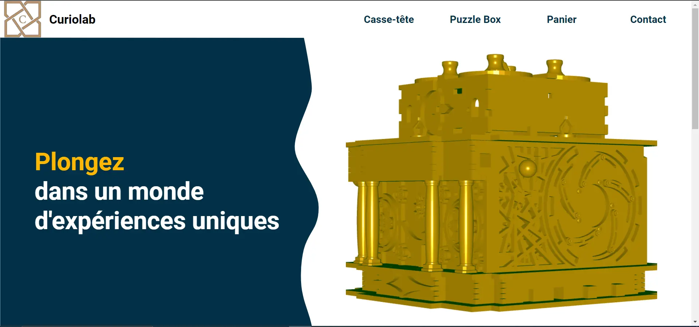
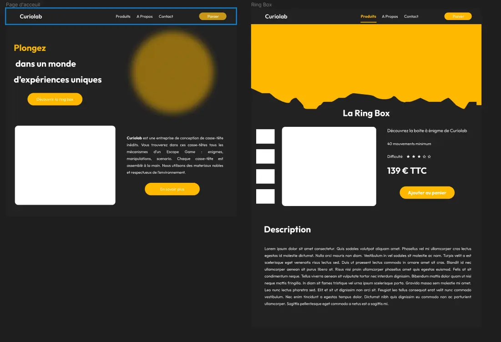
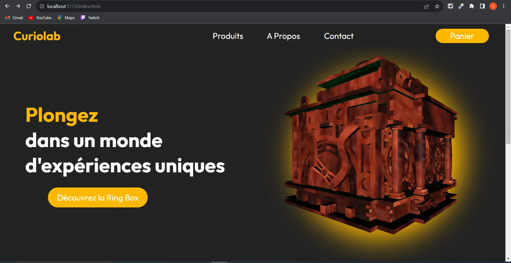
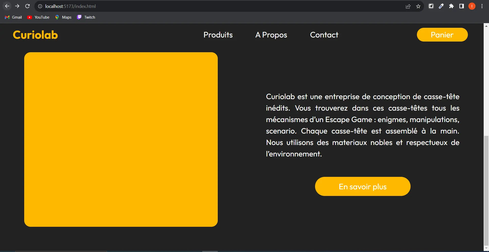
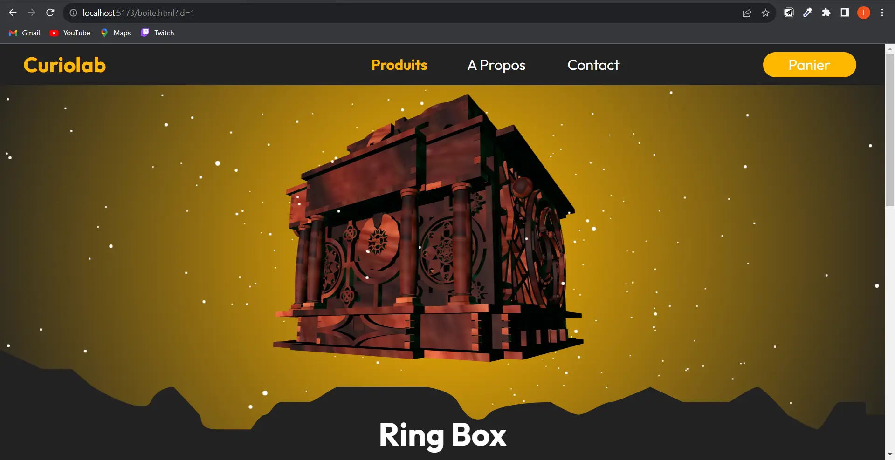
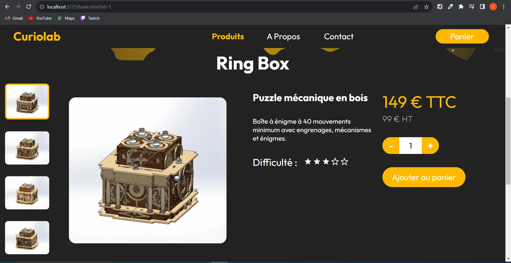
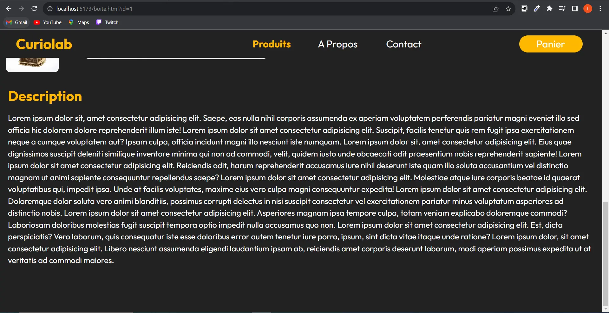
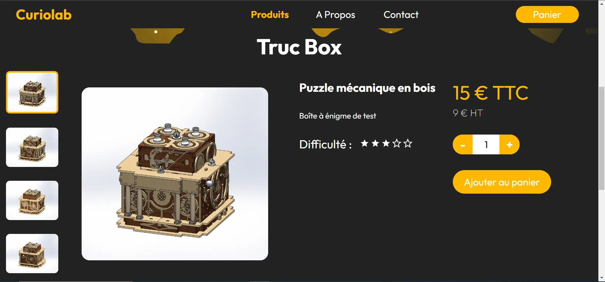


Lien de mon repo Github : https://github.com/LucasRioual/Curiolab/tree/main



## Sommaire 
1. Présentation
2. Objectif du sprint 1
3. Sprint 1
4. Bilan du sprint 1 et objectif pour le sprint 2
5. Sprint 2
6. Bilan du POK

## Présentation

Depuis un certain temps maintenant, je travaille sur un projet de conception d'entreprise. Le but de cette entreprise est de vendre des **Escape Game portatifs**. J'ai bientôt fini la conception de mon premier produit et je souhaite pouvoir le vendre sur un site web.

Pour vous donner une idée plus claire de ce que je fait, voici un modèle 3D de mon premier objet.


Je souhaite donc utiliser les **POK** pour developper le site web qui permettra de découvrir l'entreprise et acheter ses produits.

## Objectif du sprint 1

L'objectif global du sprint 1 est d'avoir une page d'acceuil fonctionnelle et jolie. Plus precisement, cette page aura :

* Une barre de navigation au dessus du site
* Une section presentant l'entreprise (avec son slogan et le modèle 3d).
* Une section permettant de visualiser les différents produits
* Une section "à propos"

## Sprint 1

### Première étape : la Maquette

Avant de me lancer dans le developpement, j'ai décidé de creer un wireframe. Cela me permet de poser mes idées. 
J'ai réalisé ce wireframe sur Figma. Ensuite, j'ai créé une maquette sur **Illustrator** en me basant sur le wireframe.

<div style = " display: flex; justify-content: center">


</div>

J'ai choisi de ne pas surcharger le site d'information. Je préfère quelque chose de sobre avec peu d'information à l'écran.
Dans l'espace blanc, en haut, je veux mettre le modèle 3d de mon objet.

### Deuxième étape : le développement

Maintenant que la maquette est faite, je peux attaquer le développement.
J'ai essayé d'être fidèle à la maquette en reflechissant à un site responsive. 
Voici le resultat du sprint 1 :




La première étape était d'implementer la barre de navigation. J'ai ajouté un effet lorsque la souris passe sur un élement. Lorsque la souris passe sur un élement, une sous-section s'affiche avec différentes catégories.

Ensuite j'ai utilisé un SVG pour la partie principale qui donne cet effet de vague. J'ai exporté le fichier SVG depuis la maquette.

La partie qui m'a le plus posé de problème est l'importation du modèle 3D. J'ai eu des soucis de format car Three.js ne peut importer que des fichier .glb. Comme j'ai fait le modèle 3D sur Solidworks, j'ai dû passer par Blender pour convertir le fichier. Cependant, je n'ai pas réussi à importer les textures.

Pour la section **"Nos Produits"**, j'ai ajouté un effet de zoom lorsque la souris passe sur un élement.

## Bilan du sprint 1 

Je n'ai pas réalisé tous mes objectifs initiaux. En effet, la page d'accueil de mon site n'est pas finie. Il me reste à réaliser des sections qui permettent d'en savoir plus sur l'entreprise. De plus, le site n'est pas responsive. Il s'adapte mals au différentes tailles d'écran.

## Objectif du sprint 2 

Pour le sprint 2, je souhaite finir la page d'**accueil** et réaliser la page présentant le **produit**.

Pour la **page d'accueil** :

* Trouver une charte graphique qui me plaît
* Régler le problème de texture du modèle 3D
* Remplacer la section **"Nos Produits** par une section présentant l'entreprise

Pour la **page Produit**

* Afficher une modèle 3D intéractif
* Afficher des photos du produits
* Afficher des informations utiles (prix, titre, description, difficulté ...).
* Afficher une description détaillée du produit.

## Sprint 2

### Retour sur la maquette

Je n’étais pas  satisfait de ma première maquette. Je n’arrivais pas à me projeter et avancer dans le code car je trouvais le design moyen. J’ai donc fait le choix de retravailler la maquette.

Je suis donc retourné sur Figma pour réaliser une maquette plus fidèle à mes envies.



L’objectif est de rajouter le modèle 3d en haut de la page produit et en haut de la page accueil.

Une fois la maquette réalisée, j’ai pu continuer le code.

### Page d’accueil

Pour cette page, je n’ai pas eu beaucoup de travail à faire car j’avais déjà quasiment fini lors du sprint 1. J’ai simplement modifié la deuxième section pour inclure une présentation succincte de l’entreprise. 





La texture de la boîte m’a posé encore beaucoup de problème. Toutes les textures de Blender ne sont pas importable dans Three.js. Je n’ai pas encore trouvé de solution à ce problème, mais je compte me pencher dessus plus sérieusement lorsque j’aurai fini la conception de ma boîte.

Le bouton “en savoir plus” n’est pas fonctionnel car je n’ai pas crée la page présentant l’entreprise.

### Page Produit







Voilà le résultat de ma page **Produit.**

**Le modèle 3D** est interactif. On peut tourner autour avec la souris. En plus, j’ai rajouté des particules qui gravitent autour de la boîte. Pour cela, j’ai utilisé [ce tuto](https://www.youtube.com/watch?v=Uh7yvnBnLj0&t=606s).

J’ai un petit soucis de lumière. Quand on tourne l’objet, on ne distingue plus ses formes car la scène devient trop sombre

Ensuite, je voulais que cette page soit dynamique. C’est à dire que cette page s’adapte en fonction du produit visualisé. J’ai donc crée un fichier JSON avec 4 produits tests :

```jsx
[
      {
        "id": 1,
        "titre": "Ring Box",
        "soustitre": "Puzzle mécanique en bois",
        "description": "Boîte à énigme à 40 mouvements minimum avec engrenages, mécanismes et énigmes.",
        "prix": 149,
        "prixht": 99,
        "difficulte":3,
        "ressource":"./Ressource/RingBox"
        
   
      },
      {
        "id": 2,
        "titre": "Truc Box",
        "soustitre": "Puzzle mécanique en bois",
        "description": "Boîte à énigme de test",
        "prix": 15,
        "prixht": 9,
        "difficulte":2,
        "ressource":"./Ressource/RingBox"
   
      },
      {
        "id": 3,
        "titre": "Troisième boîte",
        "soustitre": "Puzzle mécanique en bois",
        "description": "Boîte à énigme de test",
        "prix": 15,
        "prixht": 9,
        "difficulte":2,
        "ressource":"./Ressource/RingBox"
   
      },
      {
        "id": 4,
        "titre": "Quatrième boîte",
        "soustitre": "Puzzle mécanique en bois",
        "description": "Boîte à énigme de test",
        "prix": 15,
        "prixht": 9,
        "difficulte":2,
        "ressource":"./Ressource/RingBox"
   
      }
      
]
```

L’attribut “Ressource” désigne le dossier qui contient les images de la boîte et le modèle 3d. Pour l’instant, toutes les boîtes désignent le même dossier.

Ainsi, cette page est dynamique et affiche les données en fonction de ce tableau JSON.



Voilà la page si on affiche **“Truc Box”**.

## Bilan du sprint 2

Globalement, je suis content du résultat. J’ai pu découvrir beaucoup de notion de frontend grâce à ce projet mais ce projet m’a pris plus de 20h.  

Ce projet est encore loin d’être fini si je veux vraiment avoir un site web commercial.

J’aimerai continuer ce projet pendant le temps 2 en me concentrant sur le backend. Notamment pour gérer le panier et l’affichage des produits.


