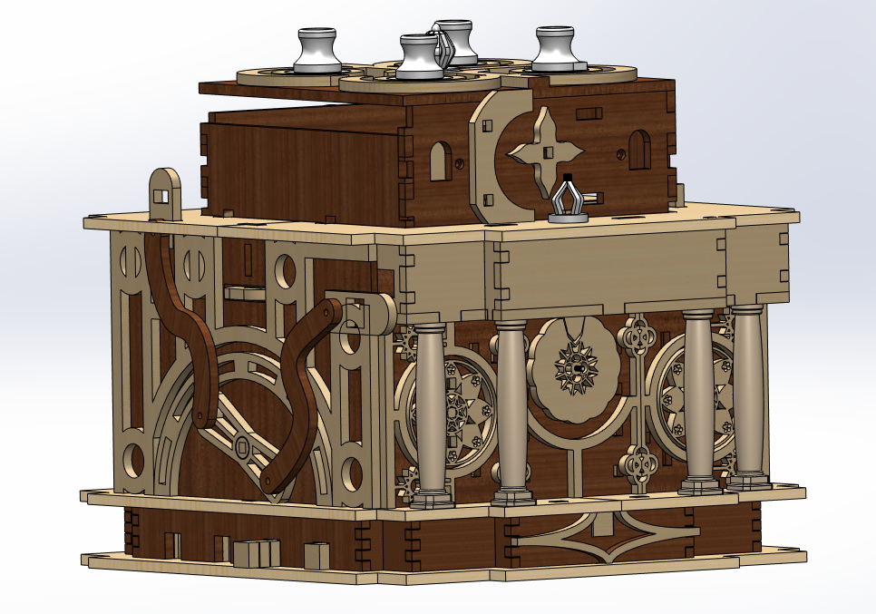
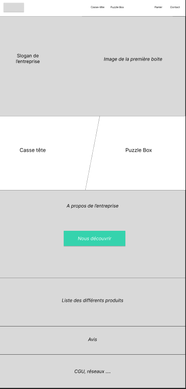
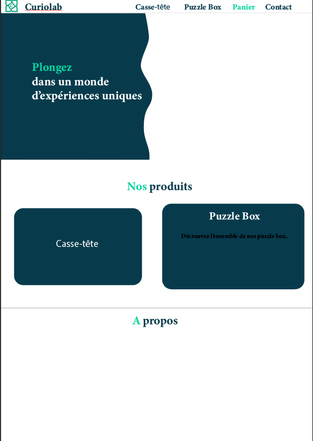
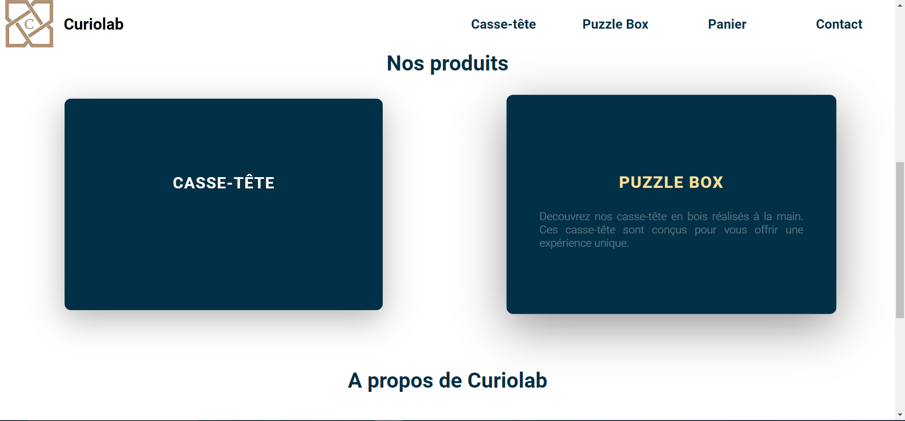


Lien de mon repo Github : https://github.com/LucasRioual/Curiolab/tree/main


## Mes objectifs

## Sommaire 
1. Présentation
2. Objectif du sprint 1
3. Sprint 1
4. Bilan du sprint 1 et objectif pour le sprint 2
5. Sprint 2
6. Bilan du POK

## Présentation

Depuis un certain temps maintenant, je travaille sur un projet de conception d'entreprise. Le but de cette entreprise est de vendre des **Escape Game portatifs**. J'ai bientôt fini la conception de mon premier produit et je souhaite pouvoir le vendre sur un site web.

Pour vous donner une idée plus claire de ce que je fait, voici un modèle 3D de mon premier objet.

Je souhaite donc utiliser les **POK** pour developper le site web qui permettra de découvrir l'entreprise et acheter ses produits.

## Objectif du sprint 1

L'objectif global du sprint 1 est d'avoir une page d'acceuil fonctionnelle et jolie. Plus precisement, cette page aura :

* Une barre de navigation au dessus du site
* Une section presentant l'entreprise (avec son slogan et le modèle 3d).
* Une section permettant de visualiser les différents produits
* Une section "à propos"

## Sprint 1

### Première étape : la Maquette

Avant de me lancer dans le developpement, j'ai décidé de creer un wireframe. Cela me permet de poser mes idées. 
J'ai réalisé ce wireframe sur Figma. Ensuite, j'ai créé une maquette sur **Illustrator** en me basant sur le wireframe.

J'ai choisi de ne pas surcharger le site d'information. Je préfère quelque chose de sobre avec peu d'information à l'écran.
Dans l'espace blanc, en haut, je veux mettre le modèle 3d de mon objet.

### Deuxième étape : le développement

Maintenant que la maquette est faite, je peux attaquer le développement.
J'ai essayé d'être fidèle à la maquette en reflechissant à un site responsive. 
Voici le resultat du sprint 1 :

La première étape était d'implementer la barre de navigation. J'ai ajouté un effet lorsque la souris passe sur un élement. Lorsque la souris passe sur un élement, une sous-section s'affiche avec différentes catégories.

Ensuite j'ai utilisé un SVG pour la partie principale qui donne cet effet de vague. J'ai exporté le fichier SVG depuis la maquette.

La partie qui m'a le plus posé de problème est l'importation du modèle 3D. J'ai eu des soucis de format car Three.js ne peut importer que des fichier .glb. Comme j'ai fait le modèle 3D sur Solidworks, j'ai dû passer par Blender pour convertir le fichier. Cependant, je n'ai pas réussi à importer les textures.

Pour la section **"Nos Produits"**, j'ai ajouté un effet de zoom lorsque la souris passe sur un élement.

## Bilan du sprint 1 

Je n'ai pas réalisé tous mes objectifs initiaux. En effet, la page d'acceuil de mon site n'est pas finie. Il me reste à réaliser des sections qui permettent d'en savoir plus sur l'entreprise. De plus, le site n'est pas responsive. Il s'adapte mals au différentes tailles d'écran.

Pour le sprint 2, je souhaite :

* Finir la page d'acceuil
* Réaliser la page présentant le produit
