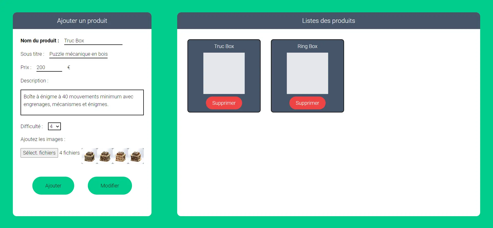


Lien de mon repo Github : https://github.com/LucasRioual/Curiolab/tree/main



## **Sommaire**

1. Présentation
2. Objectif du sprint 1
3. Sprint 1
4. Bilan du sprint 1 et objectif pour le sprint 2
5. Sprint 2
6. Bilan du POK


## **Objectif du sprint 1**

L’objectif du sprint 1 est d’appliquer mes connaissances en backend que j’ai acquises grâce au précèdent MON à mon site web Curiolab. Je souhaite donc créer une page admin qui permet d’ajouter, modifier ou retirer des produits de mon site internet. Je vais utiliser Node.js avec Express pour le backend et MongoDB pour la base de donnée  :

| Objectif                                        | Complexité                    | Temps estimé |
|-------------------------------------------------|-------------------------------|--------------|
| **Développer la page admin**                     |  4                             | 4h             |
|   Section pour ajouter ou modifier un produit    |                               |            |
|   Section pour visualiser les produits           |                               |              |
|   Possibilité de supprimer des produits          |                               |              |
| **Développer le backend**                         | 3                              | 4h             |
|   Connexion avec MongoDB                         |                               |              |
|   Route pour créer un produit                    |                             |           |
|   Route pour récupérer tous les produits         |                               |              |
|   Route pour récupérer un seul produit           |                               |              |
|   Route pour modifier un produit                 |                               |              |
|   Route pour supprimer un produit                |                               |              |
| **Modifier le front pour accéder à cette API**   | 1                             | 1h           |
| **Déployer le projet sur le serveur distant OVH**| 2                             | 2h           |


## Sprint 1

### Page Administrateur

L’objectif de cette page est de pouvoir ajouter/modifier ou supprimer des produits de la base de données.

Pour développer cette page Administrateur, j’ai choisi d’utiliser **React** et **Tailwindcss**. Ce sont des outils que j’ai appris à utiliser lors du [MON 2.1](../../mon/temps-2.1). 

Je me suis pas du tout concentré sur le design de la page, car le coeur de POK est le développement du backend.

J’ai donc fait un formulaire sur la gauche de l’écran qui permet d’ajouter ou modifier un produit. Sur la droite, il y a une section pour visualiser les différents produits existants.

Pour chaque produit, nous pouvons afficher le détail de ses caractéristiques sur la partie gauche de l’écran. Nous pouvons ensuite modifier ses caractéristiques. Un bouton supprimer est également présent sur chaque item.



Vous trouverez le repo Github ici : https://github.com/LucasRioual/curiolab-admin

### Backend avec Node.js, Express et MongoDB

J'ai décidé de développer le backend avec **Node.js** et **Express** car j'ai fait mon [MON 1.2](../../mon/temps-1.2) sur ces technos.

Voici les différents EndPoints que je dois développer :

```js
router.post('/', stuffCtrl.createStuff);
router.get('/', stuffCtrl.getAllStuff);
router.get('/:id', stuffCtrl.getOneStuff);
router.put('/:id', stuffCtrl.modifyStuff);
router.delete('/:id', stuffCtrl.deleteStuff);
```

Mon schéma de donnée :

```js
const stuffSchema = mongoose.Schema({
  titre: { type: String, required: true },
  sousTitre: { type: String, required: true },
  description: { type: String, required: true },
  prix: { type: Number, required: true },
  difficulte: { type: Number, required: true },
});
```
Par exemple, voici la fonction qui permet d'ajouter un produit dans la base de donnée :

```js
exports.createStuff = (req, res, next) => {
  const stuff = new Stuff({
    titre : req.body.titre,
    sousTitre : req.body.sousTitre,
    description : req.body.description,
    prix : req.body.prix,
    difficulte : req.body.difficulte,
  });
  stuff.save().then(
    () => {
      res.status(201).json({
        message: 'Post saved successfully!'
      });
    }
  ).catch(
    (error) => {
      res.status(400).json({
        error : error
      });
    }
  );
}
```
Vous trouverez le repo Github ici : https://github.com/LucasRioual/curiolab-backend

### Récupérer les données de l’API depuis le site Curiolab

Ici, il n’y a pas eu beaucoup de travail à faire, car il fallait simplement modifier la méthode qui récupèrait les données. 

Voici la requête que j’effectue à l’API : 

```js
const getOneStuff = async (id) => {
  try{
    const response = await fetch(`http://localhost:10411/api/stuff/${id}`);
    const piece = await response.json();
    console.log(piece);
    document.getElementById("txt-Ring").innerText = piece.titre;
    document.getElementById("txt-titre").innerText = piece.sousTitre;
    document.getElementById("txt-description").innerText = piece.description;
    document.getElementById("txt-prix").innerText = piece.prix + " € TTC";
    document.getElementById("txt-prix-HT").innerText = piece.prix - (piece.prix * 0.2) + " € HT";
    
  }
  catch(error){
    console.error(error);
  }
}
```

Vous trouverez le repo Github ici : https://github.com/LucasRioual/Curiolab


### Bilan par rapport aux objectifs fixés

J'ai globalement respecté mes objectifs. Pour la page administrateur il y a beaucoup d'améliorations possible. Par exemple, lorsqu'on ajoute un produit, nous sommes obligés d'actualiser la page pour voir le produit. IL y a pleins de détails comme celui ci à améliorer.
Ensuite, nous ne pouvons pas envoyer les images du produit au serveur.

Ensuite, le site qui tourne sur le serveur OVH ne fonctionne pas comme en local. En effet, selon le chemin que nous prenons dans le site, toutes le ressources ne s'affichent pas.

## Sprint 2

### Objectif pour le sprint 2

Je souhaite me concentrer sur une démarche CI/CD pour déployer mon site sur le serveur OVH.

Comme je ne connais rien, il est difficile d’écrire un backlog. C’est pourquoi, je vais d’abord consulter le travail qui a déjà été fait les années précédentes et me documenter. Suite à cela, je pourrai faire un Backlog.

Je me suis beaucoup basé sur le POK de Tuncay [POK de Tuncay](../../../../2022-2023/Bilgi-Tuncay/pok/ServeurDistant/) pour ce sprint. Après avoir lu de la documentation sur la démarche CI/CD, je vais plutôt me concentrer sur la création un script shell qui permettra de récupérer les derniers changements sur la branch main de mon projet et de lancer le projet en production. Cela me permettra d’éviter de copier mon projet à chaque fois.

J’ai une partie front et une partie backend et je veux pouvoir déployer l’un sans déployer l’autre


| Objectif                                                           | Temps estimé |
|----------------------------------------------------------------------------|--------------|
| **Documentation**                                                 | 3h             |
| **Faire fonctionner l’application sur le serveur distant**        | 2h             |
| **Créer une session de terminal persistante**                      | 1h           |
| **Création du premier script qui permet de récupérer la branch main du back et du front**   | 1h           |
| **Amélioration du script**                                         | 3h           |


### Déploiement sur le serveur distant avec Github

La première étape est de faire fonctionner mon application web sur le serveur distant.
Je peux séparer mon projet en 2 parties. Il y a les fichiers statiques (html, css, image …) et mon application Node.js.

Sur le serveur OVH, le répertoire principal de mon application est **`/node`**. À l'intérieur de ce répertoire, il y a un sous-répertoire appelé **`/static`** qui contient les fichiers statiques de l'application. Un serveur Nginx est en cours d'exécution sur le serveur OVH et il est configuré pour traiter les requêtes entrantes. Lorsqu'une requête commence par **`/static/`**, Nginx sert directement les fichiers correspondants du répertoire **`/node/static`**. Autrement, la requête est transmise à mon application Node.js.

Cependant, la toute première requête envoyée est **`'/'`**. Dans ce cas, c'est l'application Node.js qui la reçoit. Pour renvoyer le fichier **`index.html`**, Node.js doit rediriger la requête vers le chemin **`/static`**. Voici comment j'implémente cela dans le code, en utilisant Express :

```bash
app.get('/', (req, res) => {
    res.redirect('/static/');
  });
```

Je m’assure également que le port d’écoute de mon application est le bon.

Je me rends donc dans le dossier **`/node/static`** pour cloner la branche main de mon repo git qui représente le front de mon application. J’exécute ces commandes :

```bash
git init
git remote add origin https://github.com/LucasRioual/Curiolab.git
git pull origin main
```

Je fais la même chose pour le backend dans le dossier **`/node`** et je lance le serveur

```bash
git init
git remote add origin https://github.com/LucasRioual/curiolab-backend.git
git pull origin master
npm install
node server
```

Je sais pas pourquoi ma branche s’appelle master et pas main

Mon site est maintenant accessible à [http://node.persil.ovh1.ec-m.fr/](http://node.persil.ovh1.ec-m.fr/static/)

### Créer une session de terminal persistante

Le problème est que lorsque je ferme le terminal, mon application ne fonctionne plus. Il faut maintenant que je créer une session de terminal persistante.
Pour cela j’utilise Screen. Screen permet de démarrer des processus dans une session et de les laisser s'exécuter même après la déconnexion du terminal.

Voici la commande que j’ai exécuté :

```bash
screen -d -m -S Curiolab node server.js
```

On peut voir la liste des process :

```bash
persil@ovh1 ~/node (git)-[master] % screen -ls
There is a screen on:
        806506.Curiolab (16/01/2024 19:14:47)   (Detached)
1 Socket in /run/screen/S-persil.
```

Je peux maintenant fermer le terminal sans tuer mon application.

### Premier script pour automatiser ces taches

Maintenant, je veux pouvoir actualiser mon application à l’aide d’un script lorsqu’un changement est fait sur la branch main de mon repo.

La première étape est de créer un script qui récupère simplement les fichier statiques pour les mettre dans **`/node/static`**

```bash
#!/bin/sh

cd /home/persil/node/static

git pull origin main
echo "Fichier static mis à jour"
```

Je veux rajouter des paramètres pour choisir de modifier le front ou le backend.

```bash
#!/bin/sh

while getopts ":hfb" opt; do
	case $opt in
		h)
			echo "-f : déployer le frontend dans static"
			echo "-b : déployer le backend dans node"
			echo "-h : afficher l'aide"
			exit 0 
			;;
		f)
			cd /home/persil/node/static
			git pull origin main
			echo "Fichier static mis à jour"
			exit 0
			;;
		b)
			cd /home/persil/node
			git pull origin master
			npm install
			echo "Backend déployer"
			exit 0
			;;
		\?)
			echo "Option invalid: $OPTARG" >&2
			exit 1
			;;
		esac
	done
```

### Amélioration du script

Le problème pour le backend, c’est que l’instance screen ne prend pas en compte les changement, il faut donc kill l’ancien process et recréer un autre process. 
Merci Tuncay qui explique comment kill un process dans son [POK](../../../../2022-2023/Bilgi-Tuncay/pok/ServeurDistant/) :

```bash
 ps -ef | grep Curiolab |head -n -1 | awk '{print $2}' | xargs kill -15
```

J’avoue que je ne comprends pas cette ligne mais ça marche.

```bash
persil@ovh1 ~/node (git)-[master] % screen -ls
No Sockets found in /run/screen/S-persil.
```

Le problème c’est que si il n’y a pas de process en cours, cela fait planter le script. J’ai donc demandé à chat GPT de me créer une condition pour vérifier si un process est en cours 

Voici donc mon script final

```bash
#!/bin/sh

while getopts ":hfb" opt; do
        case $opt in
                h)
                        echo "-f : déployer le frontend dans static"
                        echo "-b : déployer le backend dans node"
                        echo "-h : afficher l'aide"
                        exit 0
                        ;;
                f)
                        cd /home/persil/node/static
                        git pull origin main
                        echo "Fichier static mis à jour"
                        exit 0
                        ;;
                b)
                        cd /home/persil/node
                        git pull origin master
                        npm install
                        echo "Backend déployer"
                        if ps aux | grep -v grep | grep -q Curiolab; then
                                ps -ef | grep Curiolab |head -n -1 | awk '{print $2}' | xargs kill -15
                                echo "Process tué"
                        else
                                echo "il n'y a pas de process"
                        fi
                        screen -d -m -S Curiolab node server
                        echo "Screen relancé"
                        exit 0
                        ;;
                \?)
                        echo "Option invalid: $OPTARG" >&2
                        exit 1
                        ;;
                esac
        done
```

### Conclusion

Voici le temps que j’ai passé sur le Sprint 2 :

| Objectif                                                           | Temps passé |
|----------------------------------------------------------------------------|--------------|
| **Documentation**                                                 | 3h             |
| **Faire fonctionner l’application sur le serveur distant**        | 2h             |
| **Créer une session de terminal persistante**                      | 1h           |
| **Création du premier script qui permet de récupérer la branch main du back et du front**   | 2h           |
| **Amélioration du script**                                         | 2h           |


Pour conclure j’ai simplement mis un premier pied dans le devops. Il existe des outils puissants qui permettent de créer des pipeline CI/CD comme Jenkins. Pourquoi pas approfondir ce sujet dans le futur

### Ressources

https://resources.github.com/ci-cd/
https://www.data-transitionnumerique.com/devops-jenkins/


