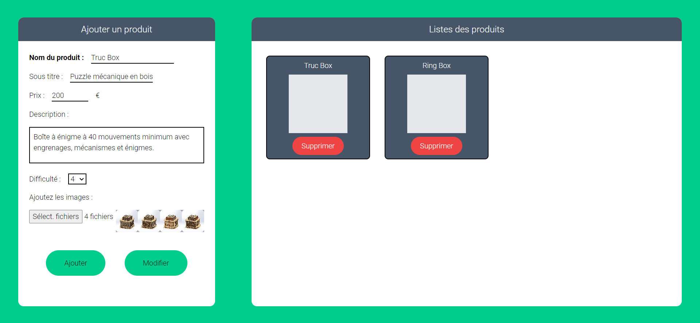


Lien de mon repo Github : https://github.com/LucasRioual/Curiolab/tree/main



## **Sommaire**

1. Présentation
2. Objectif du sprint 1
3. Sprint 1
4. Bilan du sprint 1 et objectif pour le sprint 2
5. Sprint 2
6. Bilan du POK


## **Objectif du sprint 1**

L’objectif du sprint 1 est d’appliquer mes connaissances en backend que j’ai acquises grâce au précèdent MON à mon site web Curiolab. Je souhaite donc créer une page admin qui permet d’ajouter, modifier ou retirer des produits de mon site internet. Je vais utiliser Node.js avec Express pour le backend et MongoDB pour la base de donnée  :

| Objectif                                        | Complexité                    | Temps estimé |
|-------------------------------------------------|-------------------------------|--------------|
| **Développer la page admin**                     |  4                             | 4h             |
|   Section pour ajouter ou modifier un produit    |                               |            |
|   Section pour visualiser les produits           |                               |              |
|   Possibilité de supprimer des produits          |                               |              |
| **Développer le backend**                         | 3                              | 4h             |
|   Connexion avec MongoDB                         |                               |              |
|   Route pour créer un produit                    |                             |           |
|   Route pour récupérer tous les produits         |                               |              |
|   Route pour récupérer un seul produit           |                               |              |
|   Route pour modifier un produit                 |                               |              |
|   Route pour supprimer un produit                |                               |              |
| **Modifier le front pour accéder à cette API**   | 1                             | 1h           |
| **Déployer le projet sur le serveur distant OVH**| 2                             | 2h           |


## Sprint 1

### Page Administrateur

L’objectif de cette page est de pouvoir ajouter/modifier ou supprimer des produits de la base de données.

Pour développer cette page Administrateur, j’ai choisi d’utiliser **React** et **Tailwindcss**. Ce sont des outils que j’ai appris à utiliser lors du [MON 2.1](../../mon/temps-2.1). 

Je me suis pas du tout concentré sur le design de la page, car le coeur de POK est le développement du backend.

J’ai donc fait un formulaire sur la gauche de l’écran qui permet d’ajouter ou modifier un produit. Sur la droite, il y a une section pour visualiser les différents produits existants.

Pour chaque produit, nous pouvons afficher le détail de ses caractéristiques sur la partie gauche de l’écran. Nous pouvons ensuite modifier ses caractéristiques. Un bouton supprimer est également présent sur chaque item.



Vous trouverez le repo Github ici : https://github.com/LucasRioual/curiolab-admin

### Backend avec Node.js, Express et MongoDB

J'ai décidé de développer le backend avec **Node.js** et **Express** car j'ai fait mon [MON 1.2](../../mon/temps-1.2) sur ces technos.

Voici les différents EndPoints que je dois développer :

```js
router.post('/', stuffCtrl.createStuff);
router.get('/', stuffCtrl.getAllStuff);
router.get('/:id', stuffCtrl.getOneStuff);
router.put('/:id', stuffCtrl.modifyStuff);
router.delete('/:id', stuffCtrl.deleteStuff);
```

Mon schéma de donnée :

```js
const stuffSchema = mongoose.Schema({
  titre: { type: String, required: true },
  sousTitre: { type: String, required: true },
  description: { type: String, required: true },
  prix: { type: Number, required: true },
  difficulte: { type: Number, required: true },
});
```
Par exemple, voici la fonction qui permet d'ajouter un produit dans la base de donnée :

```js
exports.createStuff = (req, res, next) => {
  const stuff = new Stuff({
    titre : req.body.titre,
    sousTitre : req.body.sousTitre,
    description : req.body.description,
    prix : req.body.prix,
    difficulte : req.body.difficulte,
  });
  stuff.save().then(
    () => {
      res.status(201).json({
        message: 'Post saved successfully!'
      });
    }
  ).catch(
    (error) => {
      res.status(400).json({
        error : error
      });
    }
  );
}
```
Vous trouverez le repo Github ici : https://github.com/LucasRioual/curiolab-backend

### Récupérer les données de l’API depuis le site Curiolab

Ici, il n’y a pas eu beaucoup de travail à faire, car il fallait simplement modifier la méthode qui récupèrait les données. 

Voici la requête que j’effectue à l’API : 

```js
const getOneStuff = async (id) => {
  try{
    const response = await fetch(`http://localhost:10411/api/stuff/${id}`);
    const piece = await response.json();
    console.log(piece);
    document.getElementById("txt-Ring").innerText = piece.titre;
    document.getElementById("txt-titre").innerText = piece.sousTitre;
    document.getElementById("txt-description").innerText = piece.description;
    document.getElementById("txt-prix").innerText = piece.prix + " € TTC";
    document.getElementById("txt-prix-HT").innerText = piece.prix - (piece.prix * 0.2) + " € HT";
    
  }
  catch(error){
    console.error(error);
  }
}
```

Vous trouverez le repo Github ici : https://github.com/LucasRioual/Curiolab


### Déploiement sur le serveur distant OVH

Pour vous montrer le résultat, j’ai souhaité déployer mon site sur le serveur OVH.

J’ai rencontré quelques problèmes liés aux chemins pour accéder aux ressources. 

Ensuite, ma page admin ne peux pas accéder à l’API car il y a des problèmes CORS. J’ai essayé d’utiliser le Middleware cors d’express mais cela ne marche toujours pas.

Vous pouvez retrouver le site à cette adresse : http://node.persil.ovh1.ec-m.fr/

### Bilan par rapport aux objectifs fixés

J'ai globalement respecté mes objectifs. Pour la page administrateur il y a beaucoup d'améliorations possible. Par exemple, lorsqu'on ajoute un produit, nous sommes obligés d'actualiser la page pour voir le produit. IL y a pleins de détails comme celui ci à améliorer.
Ensuite, nous ne pouvons pas envoyer les images du produit au serveur.

Ensuite, le site qui tourne sur le serveur OVH ne fonctionne pas comme en local. En effet, selon le chemin que nous prenons dans le site, toutes le ressources ne s'affichent pas.


### Objectif pour le sprint 2

Pour le sprint 2, je vais me concentrer sur le déploiement de mon application sur le serveur OVH.

Je souhaite utiliser Github action pour mettre à jour mon site quand je commit sur la branch main de mon repo Github (comme le site de do_It).


