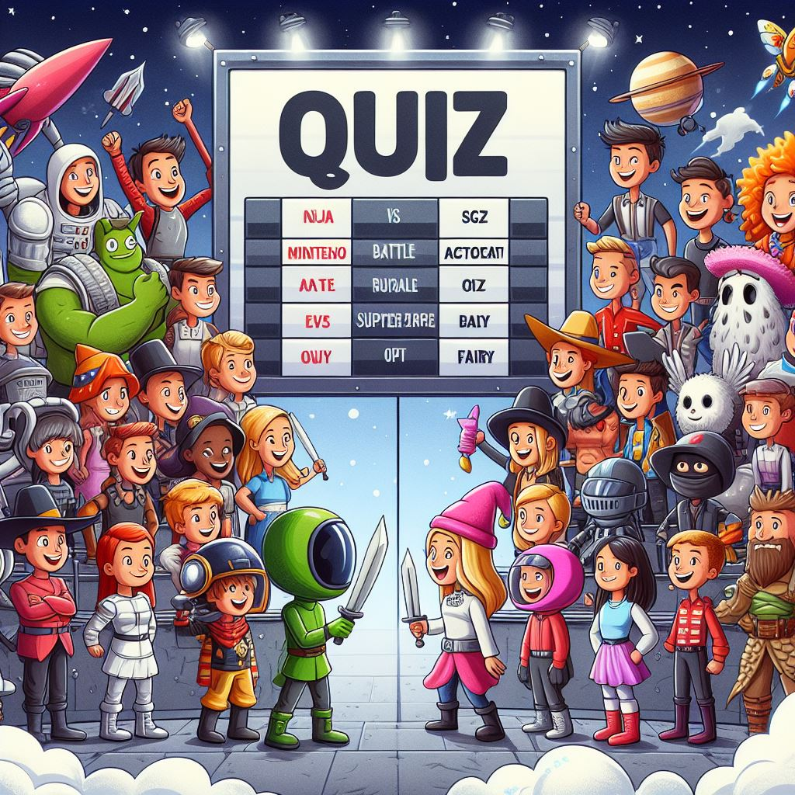


Il faut mettre des trucs ici


## **Objectif du POK**

L’objectif de ce POK est de créer un jeu de Quiz multijoueur en mode Battle Royale. Le but du jeu est d’être le dernier survivant de la partie en répondant juste à toutes les questions.
Nous sommes deux pour réaliser ce POK : Moi, le grand Lucas Rioual, et mon larbin Samy Diafat.

Nous avons choisi cette thématique pour créer une application web avec Spring Boot. 

## Cahier des charges

### Backend

J’ai demandé à Chat GPT de rédiger le cahier des charges pour le backend. Voici ce que je lui ai demandé :

*Je souhaite développer une application web de quiz en ligne multijoueur et battle royale.
Le backend sera crée avec Spring Boot.
L'objectif de cette application web est que plusieurs utilisateurs se connectent à une session. Lorsque la session est lancée par l'organisateur, chaque joueur se retrouve dans la partie avec la première réponse.  Si le joueur a bon, il reste dans la partie, sinon il est éliminé. Lorsque la partie est terminé, on a accès au classement de la partie.
Rédige moi tous les endpoints à prendre en compte en expliquant le fonctionnement*

1. **Création d'une nouvelle session de jeu :**
    - **`POST /api/sessions`**
        - Description : Crée une nouvelle session de jeu.
        - Paramètres : Aucun (les détails de la session seront générés automatiquement).
        - Réponse : Retourne l'ID de la session nouvellement créée.
2. **Rejoindre une session en tant que joueur :**
    - **`POST /api/sessions/{sessionId}/players`**
        - Description : Permet à un joueur de rejoindre une session existante.
        - Paramètres : Nom du joueur.
        - Réponse : Retourne l'ID du joueur et l'ID de la session.
3. **Démarrer la partie (pour l'organisateur) :**
    - **`POST /api/sessions/{sessionId}/start`**
        - Description : Lance la partie pour la session donnée.
        - Paramètres : Aucun.
        - Réponse : Indique que la partie a commencé.
4. **Obtenir la question actuelle pour un joueur :**
    - On utilisera des websockets pour envoyer les questions en temps réel
5. **Soumettre la réponse d'un joueur :**
    - **`POST /api/sessions/{sessionId}/players/{playerId}/answer`**
        - Description : Soumet la réponse d'un joueur pour la question actuelle.
        - Paramètres : ID de la réponse choisie.
        - Réponse : Indique si la réponse est correcte et si le joueur reste dans la partie.
6. **Obtenir le classement de la partie :**
    - **`GET /api/sessions/{sessionId}/ranking`**
        - Description : Récupère le classement des joueurs pour la session donnée.
        - Paramètres : Aucun.
        - Réponse : Liste des joueurs classés par leur performance dans la partie.
7. **Quitter la partie (pour un joueur) :**
    - **`DELETE /api/sessions/{sessionId}/players/{playerId}`**
        - Description : Permet à un joueur de quitter la partie.
        - Paramètres : Aucun.
        - Réponse : Indique que le joueur a quitté la partie.
    

### Frontend :

1. **Page d'accueil :**
    - Permet de créer une nouvelle session.
    - Permet de rejoindre une session existante en tant que joueur.
2. **Page de préparation de la session (Organisateur) :**
    - Affiche les détails de la session en cours de création.
    - Permet de démarrer la partie lorsque tous les joueurs sont prêts.
3. **Page de la session de jeu (Joueur) :**
    - Affiche la question en cours et les options de réponse.
    - Permet au joueur de sélectionner une réponse et de la soumettre.
    - Affiche le temps restant pour répondre à la question.
    - Indique si la réponse était correcte et si le joueur reste dans la partie.
4. **Page de résultat de la partie :**
    - Affiche le classement final des joueurs.
    - Donne la possibilité de revenir à la page d'accueil pour rejoindre une nouvelle session.
5. **Page d'erreur :**
    - Affiche les messages d'erreur en cas de problème (session inexistante, joueur déjà dans la session, etc.).
    - Donne la possibilité de revenir à la page précédente ou à la page d'accueil.

## **Objectif du sprint 1**

L’objectif du sprint 1 est de développer les fonctionnalités les plus importantes pour avoir une première version assez rapidement.

| Objectif                                        | Temps estimé |
|--------------------------------------------------|--------------|
| **Créer la maquette Figma de toutes les pages**    | 5h             |
| **Développement frontend**                          |              |
| Setup du projet                                   | 30 min            |
| Page d'accueil                                    | 2h            |
| Page de la session                                | 3h            |
| Page de la partie                                 | 2h            |
| **Développement backend**                          |              |
| Setup du projet                                   | 30 min            |
| Mise en place de la base de donnée                | 3h            |
| Obtenir la question actuelle pour un joueur (webSocket)     | 3h            |
| Soumettre la réponse d'un joueur                  | 1h            |

## Sprint 1

