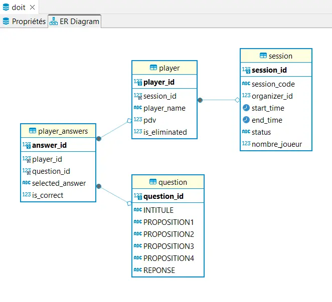
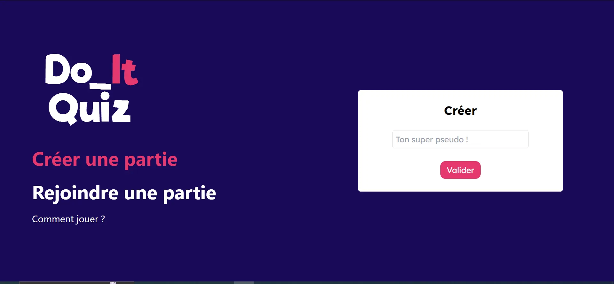


Back-End avec Spring Boot (Java) et une base de données MySQL, Front-End en React Js



[Front](https://github.com/LucasRioual/quiz-front)
[Back](https://github.com/SamyDiafat/DoItQuizz-backend)



## **Objectif du POK**

L’objectif de ce POK est de créer un jeu de Quiz multijoueur en mode Battle Royale. Le but du jeu est d’être le dernier survivant de la partie en répondant juste à toutes les questions.
Nous sommes deux pour réaliser ce POK : Lucas Rioual et   Samy Diafat.

Nous avons choisi cette thématique pour créer une application web avec Spring Boot. 

## Cahier des charges

### Backend

J’ai demandé à Chat GPT de rédiger le cahier des charges pour le backend. Voici ce que je lui ai demandé :

*Je souhaite développer une application web de quiz en ligne multijoueur et battle royale.
Le backend sera crée avec Spring Boot.
L'objectif de cette application web est que plusieurs utilisateurs se connectent à une session. Lorsque la session est lancée par l'organisateur, chaque joueur se retrouve dans la partie avec la première réponse.  Si le joueur a bon, il reste dans la partie, sinon il est éliminé. Lorsque la partie est terminé, on a accès au classement de la partie.
Rédige moi tous les endpoints à prendre en compte en expliquant le fonctionnement*

1. **Création d'une nouvelle session de jeu :**
    - **`POST /api/sessions`**
        - Description : Crée une nouvelle session de jeu.
        - Paramètres : Aucun (les détails de la session seront générés automatiquement).
        - Réponse : Retourne l'ID de la session nouvellement créée.
2. **Rejoindre une session en tant que joueur :**
    - **`POST /api/sessions/{sessionId}/players`**
        - Description : Permet à un joueur de rejoindre une session existante.
        - Paramètres : Nom du joueur.
        - Réponse : Retourne l'ID du joueur et l'ID de la session.
3. **Démarrer la partie (pour l'organisateur) :**
    - **`POST /api/sessions/{sessionId}/start`**
        - Description : Lance la partie pour la session donnée.
        - Paramètres : Aucun.
        - Réponse : Indique que la partie a commencé.
4. **Obtenir la question actuelle pour un joueur :**
    - On utilisera des websockets pour envoyer les questions en temps réel
5. **Soumettre la réponse d'un joueur :**
    - **`POST /api/sessions/{sessionId}/players/{playerId}/answer`**
        - Description : Soumet la réponse d'un joueur pour la question actuelle.
        - Paramètres : ID de la réponse choisie.
        - Réponse : Indique si la réponse est correcte et si le joueur reste dans la partie.
6. **Obtenir le classement de la partie :**
    - **`GET /api/sessions/{sessionId}/ranking`**
        - Description : Récupère le classement des joueurs pour la session donnée.
        - Paramètres : Aucun.
        - Réponse : Liste des joueurs classés par leur performance dans la partie.
7. **Quitter la partie (pour un joueur) :**
    - **`DELETE /api/sessions/{sessionId}/players/{playerId}`**
        - Description : Permet à un joueur de quitter la partie.
        - Paramètres : Aucun.
        - Réponse : Indique que le joueur a quitté la partie.
    

### Frontend :

1. **Page d'accueil :**
    - Permet de créer une nouvelle session.
    - Permet de rejoindre une session existante en tant que joueur.
2. **Page de préparation de la session (Organisateur) :**
    - Affiche les détails de la session en cours de création.
    - Permet de démarrer la partie lorsque tous les joueurs sont prêts.
3. **Page de la session de jeu (Joueur) :**
    - Affiche la question en cours et les options de réponse.
    - Permet au joueur de sélectionner une réponse et de la soumettre.
    - Affiche le temps restant pour répondre à la question.
    - Indique si la réponse était correcte et si le joueur reste dans la partie.
4. **Page de résultat de la partie :**
    - Affiche le classement final des joueurs.
    - Donne la possibilité de revenir à la page d'accueil pour rejoindre une nouvelle session.
5. **Page d'erreur :**
    - Affiche les messages d'erreur en cas de problème (session inexistante, joueur déjà dans la session, etc.).
    - Donne la possibilité de revenir à la page précédente ou à la page d'accueil.


## **Objectif du sprint 1**

L’objectif du sprint 1 est de développer les fonctionnalités les plus importantes pour avoir une première version assez rapidement.

| Objectif                                        | Temps estimé | Temps réalisé Samy |Temps réalisé Lucas |
|--------------------------------------------------|--------------|
| **Créer la maquette Figma de toutes les pages**    | 5h             | 10h | 5h |
| **Développement frontend**                          |              |
| Setup du projet                                   | 30 min            |0| 1h|
| Page d'accueil                                    | 2h            |0| 2h |
| Page de la session                                | 3h            |0| 1h|
| Page de la partie                                 | 2h            |0| 1h|
| **Développement backend**                          |              |
| Setup du projet                                   | 30 min            |2h| 0|
| Mise en place de la base de données et des routes               | 3h            |8h| 0|
| Obtenir la question actuelle pour un joueur (webSocket)     | 3h            |0| 0|
| Soumettre la réponse d'un joueur                  | 1h            |0|0 |

## Sprint 1

Le temps estimé pour réaliser la maquette a été très largement sous-estimé (Lucas voulait faire ça à la vite mais Samy l'a rappelé à l'ordre).

Le développement du back-end a pris plus de temps que prévu également.

Pour le front, nous avons choisi de partir sur du React et Tailwind CSS car Lucas avait déjà utilisé ces outils.
Le temps pour le développement des trois premières pages a été respecté . Cependant le setup du projet a mis plus de temps que prévu (comme à chaque fois). Pour l'instant, il n'y a aucune interaction entre le front et le back. On verra ça pour le deuxième sprint


Voici quelques livrables issus du Sprint 1 

### Maquette Figma


D'abord le squelette que l'on a imaginé :


Puis la maquette :


### Schéma de la base de données

Le schéma de données utilisé pour le back-end :




### Front-End

Page d'accueil :



Page de salon :


Page de partie :


## **Objectif du sprint 2**

L’objectif du sprint 2 est de proposer une version jouable du jeu.

| Objectif                                        | Temps estimé | Temps réalisé Samy |Temps réalisé Lucas |
|--------------------------------------------------|--------------|
| **Développement frontend**                          |              |
| Page de fin de Game                                 | 1h           | 0h | 0h|
| Connection à l'API pour créer/rejoindre             | 1h           |0h| 3h|
| Afficher les joueurs de la session en temps réel    | 3h           |0h| 1h |
| Connection Question/réponse à l'API                 | 3h           |0h| 0h|
| Hôte qui passe à la prochaine question              | 1h           |0h| 0h |
| Page d'élimination                                  | 30 min           |0h| 30 min |
| Afficher le nombre de vie en temps réel             | 1h          |1h| 0h|
| Afficher les stats réels                            | 2h          |0h| 0h|
| **Développement backend**                          |              | | |
| Implémenter les webSockets                         | 3h          |1h| 6h |
| Créer les routes qu'on a pas prévu                 | 3h          |0h| |
| **Mise en production**                             | 5h            |0h| 4h |


## Sprint 2


Après avoir beaucoup travaillé durant sprint 1 (20h), il a été dur pour Samy de reprendre le projet après une longue pause. Il faut être honnête, reprendre un projet après l'avoir arrêté brusquement est bien plus compliqué que ce que je pensais.
Cependant, le back-end développé durant le premier sprint a permis à Lucas d'avoir un début d'application fonctionnel.


### Déploiement avec Docker

 Au début de ce sprint, Lucas a voulu se concentrer sur la conteneurisation de l'API, de la base de donnée et du front. 

Il s'est d'abord concentré sur cet aspect car il pensait que c'est l'étape qui allait poser le plus de problème. Et c'est pas faux.

 L'objectif de cette étape était de créer une pipeline d'intégration continue, comme on l'avait vu dans le cours de Docker. Cependant, il y a eu beaucoup de problème avec la connexion entre la base de donnée mysql et l'api Spring Boot. Voici le DockerFile utilisé :

```jsx
version: '1'
services:
  mysql:
    image: mysql:8.0
    ports:
      - "3306:3306"
    environment:
      MYSQL_ROOT_PASSWORD: password
      MYSQL_USER: doit_user
      MYSQL_PASSWORD: doit_user_password
      MYSQL_DATABASE: doit

  spring-boot-app:
    build:
      context: ./backend/quizz
      dockerfile: Dockerfile

    environment:
      SPRING_DATASOURCE_URL: jdbc:mysql://mysql:3306/doit?allowPublicKeyRetrieval=true&useSSL=false&createDatabaseIfNotExist=true
      SPRING_DATASOURCE_USERNAME: doit_user
      SPRING_DATASOURCE_PASSWORD: doit_user_password

    ports:
      - "8080:8080"
    depends_on:
      - mysql

  react-app:
    build:
      context: ./frontend
      dockerfile: Dockerfile
    ports:
      - "3000:80"

```

Le problème était que lorsque que le conteneur était exécuté, cela afficher une erreur car les tables de la base de donnée était vide. Après beaucoup de temps passé dessus, Lucas a abandonné pour ce concentrer sur l’interaction entre l’API et React.

### Connection entre Spring Boot et React avec des websockets

Cette partie était beaucoup plus longue que prévue. Pour afficher les joueurs en temps réel dans le salon, nous voulions utiliser des webSockets. Lucas avait déjà utilisé ce genre de chose pour l’application du Killer avec Node. Mais l’implémentation avec Spring Boot était plus compliqué que sur Node.js.

Lucas a perdu beaucoup de temps (5h) car la version [socket.io](http://socket.io) utilisé avec React était différente de celle utilisé par Spring Boot. 
Malgré cela, nous avons réussi à connecter les joueurs ensemble dans un même salon. Nous avons pas eu le temps de faire la suite du projet.


## Conclusion


Le projet n'est malheureusement pas abouti, mais nous pensons qu'avec 10h de travail supplémentaire chacun nous aurions pu avoir une version en ligne jouable.
Le frontend est tout de même disponible à cette adresse : [https://quiz-front-one.vercel.app/](https://quiz-front-one.vercel.app/)
Le site est statique car l'API n'est pas déployé.

