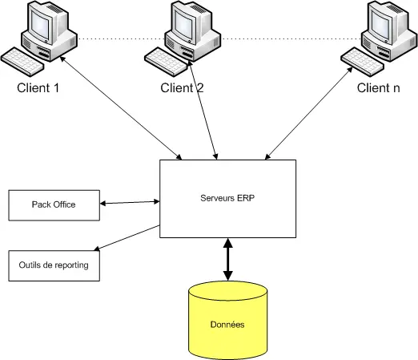
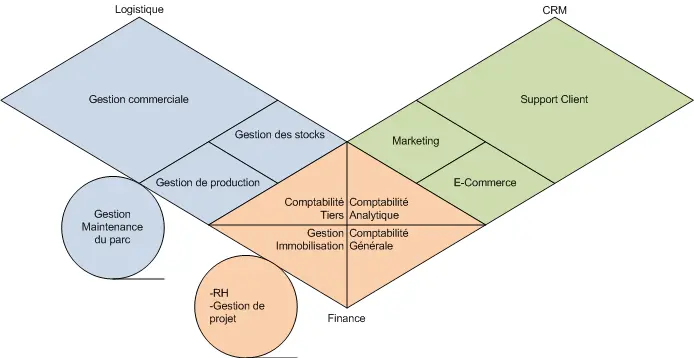
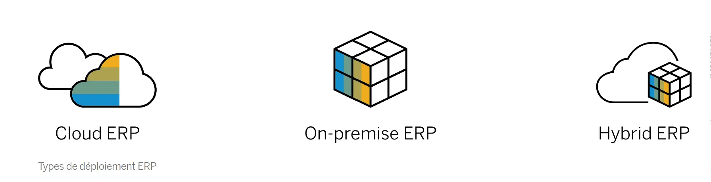

## Sommaire

1. Définition
2. L'histoire des ERP
3. Architecture et fonctionnement d'un ERP
4. Différents types d'ERP
5. Une démarche d'implémentation du progiciel dans l'entreprise
6. Conclusion
  
## 1.Définition

  Un **ERP** (Entreprise Ressource Planning) en anglais, ou **PGI** (Progiciel de Gestion Intégré) en français, est un système d’informations qui permet de **gérer et fédérer l’ensemble des processus d’une entreprise**. Un ERP est basé sur la construction des applications informatiques de l’entreprise (comptabilité, gestion de stocks,etc.) sous forme de **modules indépendants**. Ces modules partagent une **base de données commune et unique**, permettant la communication de données entre les applications.

Un ERP a plusieurs caractéristiques :
- **Couverture fonctionnelle** : doit couvrir au moins 3 fonctions de l’entreprise (souvent 5, si ce n’est toutes).
- **Base de données unique** : une donnée est saisie une fois et peut être immédiatement disponible dans les autres modules de l’ERP
- **Adaptation et paramétrage étendu** : un ERP doit être suffisamment flexible pour s’adapter au mode de fonctionnement d’une entreprise avec, par exemple, le paramétrage des postes de travail : autorisations d'accès, environnement de travail personnalisé (interface graphique), traçabilité des opération, etc…
- **Présence d’outils d’aide à la décision** : le fait de disposer d’une BDD unique permet de faire toutes les requêtes possibles en SQL sans aucune ambiguïté. On peut donc définir une série de requêtes adaptées pour la prise de décision et des sorties sous formes de tableaux, diagrammes, etc... 

## 2. L'histoire des ERP

### a. Avant les ERP

Avant les ERP, les applications d'entreprise étaient **complètement indépendantess** aussi bien sur le plan des programmes que sur celui des données. On avait donc une juxtaposition d'applicatifs communiquant difficilement
Ce qui provoquait:

- **la redondance des données** (volumes de stockage importants)
- **des mises à jour non coordonnées** (risques d'incohérence des données)
- **pas de standardisation des données** (d'où des problèmes de compatibilité dans les transferts)
- **une dissémination des données** (risques de pertes)
- **un cloisonnement des tâches** (pertes de temps et d'efficacité)

### b. De la naissance du concept

Les racines du concept proviennent des années 60 quand les fabricants ont créé un logiciel « de planification déterministe des besoins » (« Material Requirements Planning ou **MRP**). Cet outil avait pour but de calculer automatiquement la commande des composants selon des prévisions de ventes données. Au fil des années, d’autres fonctions support se sont ajoutées, comme la comptabilité, les RH et la distribution, amenant ainsi le cabinet d’analyse Gardener à inventer le terme en 1990.

### c. Vers son évolution aujourd'hui

Aujourd’hui, les ERP gèrent une multitude de processus vitaux :

|Fonctions | Rôle de l'ERP
|---|---
|Le suivi des commandes| *l'ERP permet une traçabilité des marchandises et assure l'exécution des commandes*
|La gestion des ressources humaines| *l'ERP assure la gestion les salaires, la planification des équipes et les opérations liées aux employés*
|La planification des ressources|*l'ERP gère la répartition des ressources (main-d’œuvre,matière première)*
|La supervision de la production|*l’ERP synchronise la production, de la planification à l'exécution pour répondre à la demande*
|La comptabilité et les finances|*l’ERP gère les transactions et génère des rapports financiers précis*
|La gestion des ventes|*l'ERP permet un suivi du cycle de ventes et donc une vue complète des activités commerciales*

## 3. Architecture et fonctionnement d'un ERP

### a. Architecture technique

Les ERP sont basés sur une architecture client/serveur : les différents postes informatiques accèdent à l’informations de loin et les transformations effectuées sont appliquées **à toutes les fonctions**. Les serveurs sont couplés à une **base de données unique**, où sont stockées toutes les données, et communiquent avec les clients.
De plus, les ERP sont **compatibles au pack Office**, en particulier pour PowerPoint et Excel. Le premier étant utile pour personnaliser les bureaux ERP en fonction de l'entreprise et le second pour effectuer les imports/exports de données. Les ERP sont aussi compatibles avec des outils de reporting (es CrystalReport), outils principalement utilisés pour le module de gestion relation client.

### b. Une architecture dite "modulaire"

Un ERP est **modulaire** dans le sens où il est possible de n'avoir qu'une ou plusieurs applications pour une entreprise, et d'en ajouter quand elle veut. Les applications modulaires telles que les ERP permettent d'être sûr de la compatibilité des modules entre eux, ils s'imbriquent comme des blocs de Lego et fonctionnent ensemble (pas de vérification de compatibilité à effectuer). 

## 4. Différents types d'ERP

### a. Open Source/Propriétaire

- Les **ERP propriétaires** sont commercialisés par des sociétés spécialisées dans la conception et la mise en place de logiciels auprès des entreprises.
- Les **ERP open source** fonctionnent avec des licences, ie des formes de contrat par lequel une société :
  - donne l'autorisation à un client d'utiliser le PGI commercialisé,
  - détermine les limites de l'utilisation du logiciel,
  - liste les obligations et responsabilités du client et de la société.


La licence représente 15 % à 25 % de l'investissement total dans un projet ERP.



Aujourd'hui, ce sont principalement les ERP propriétaires qui dominent le marché des PGI. 
On peut citer SAP, Oracle NetSuite, Microsoft Dynamics, par exemple, qui sont les 3 principaux ERP de nos jours.


### b. Généraliste/Spécialisé

- PGI **généraliste**: sont flexibles et fonctionnent pour la grande majorité des entreprises. Ils sont adaptés à tout type d'activité
- PGI **spécialisé**: (ou “métier”) sont plus efficaces pour répondre à des besoins spécifiques de certains secteurs. (ex pour un PGI industriel, il permet : gestion des nomenclatures, calcul des niveaux, caractéristiques des matériaux, gestion des variantes ou encore traçabilité de la production.)

### c. Typologie différentes en fonction de la taille de l'entreprise

Selon la taille d’une entreprise, ses attentes et son besoin concernant les fonctionnalités d’un ERP varient.

|**Les petites entreprises**| **Les PME/ETI**| **Les grandes entreprises**|
|---|---|---|
|l’ERP a pour but d’aider l’entreprise à dépasser le stade des feuilles de calcul et à gérer efficacement les différents aspects de son activité (vente, la relation client, opérations financières, l'exploitation). Les outils ERP pour petites entreprises se trouvent généralement sur le cloud. Ils sont *rapides à installer* et conçus pour *évoluer progressivement*| l’ERP pour une PME/ETI et ses possibles filiales offrent une analytique intégrée, un *déploiement rapide* pour des dizaines de processus différents (fonction Finance, RH, gestion de la Supply Chain et bien d'autres encore). Les systèmes ERP modulaires et basés sur le cloud sont également un choix populaire chez les PME/ETI aux processus complexes ou aux plans de croissance rapide| les ERP pour les grandes entreprises à rayonnement mondial ont besoin d’inclure l'IA, le Machine Learning et l'analytique, ainsi qu'une automatisation intelligente pour transformer leurs modèles économiques et processus. Les systèmes ERP peuvent être déployés sur site, sur le cloud ou dans un scénario hybride. Ils peuvent s'intégrer à des bases de données existantes ou, idéalement, s'exécuter sur des bases de données *In-Memory* (Les données sont stockées directement dans la mémoire vive du système informatique plutôt que sur un disque) plus récentes et puissantes|

### d. Différents types de déploiements du progiciel

|**ERP cloud**| **ERP sur site/"on-premise"**| **ERP hybride/à deux niveaux**|
|---|---|---|
|On parle d'ERP sur site lorsque l'entreprise est propriétaire du centre de données. Le logiciel sur site peut être acheté moyennant des frais uniques ou une licence perpétuelle et il est ensuite installé localement sur les ordinateurs et serveurs d’une entreprise. C’est alors l’entreprise qui est responsable de l'hébergement, de la maintenance, des mises à jour du logiciel, et de la sécurité des données|Ils sont hébergés dans des centres de données et la plateforme est gérée par des fournisseurs. L'accès aux systèmes ERP Cloud se fait par Internet, au lieu d'un ordinateur local ou d'un logiciel installé. Le fournisseur de logiciels s'occupe généralement de la maintenance régulière, des mises à jour et de la sécurité et utilisent généralement un modèle de tarification par abonnement pour les entreprises|: Pour les entreprises qui souhaitent combiner les deux approches afin de répondre à leurs exigences de gestion, il existe un modèle d'ERP cloud hybride. Dans ce cas, une partie des applications et données ERP de l’entreprise se trouve dans le cloud et l'autre partie sur site|

## 5. Une démarche d'implémentation du progiciel dans l'entreprise

L’intégration d’un système ERP est une étape essentielle pour l’optimisation des opérations d’une entreprise. L’ERP doit avant tout contribuer à améliorer les performances de l’entreprise. Ainsi, la mise en place d’un ERP doit suivre une démarche structurée et méthodique.

### a. Conception du projet ERP

#### 1. La prise en compte des modifications internes à l'entreprise

La mise en place d’un nouveau système de gestion informatisé entraîne des changements dans l’organisation du travail de tous les employés. C’est pourquoi, une redéfinition précise des rôles de chacun doit être pensée et anticipée en fonction des nouvelles exigences.

Les étapes nécessaires à la bonne mise en place d’un ERP consistent à :
- **identifier et référencer l’ensemble des processus**: cela permettra de mettre en lumière  certains  process pouvant s’avérer inadaptés avec les nouveaux enjeux ou objectifs d'une entreprise et lui permettre de choisir de les optimiser ou de les abandonner
- **communiquer sur les motivations de la direction à changer ou à intégrer un nouvel ERP** et informer tout le personnel sur leur nouveau rôle
- **impliquer les collaborateurs dans le projet et ses différentes phases**, de manière à coopérer avec eux pour éviter toute réticence face au changement puisque l’intégration ou le changement d’un ERP les amènera forcément à revoir leurs habitudes et méthodes de travail

#### 2. Définition d'un cahier des charges

Au préalable, il est nécessaire de se poser les bonnes questions, et de rédiger **un cahier des charges précis** dans lequel les besoins de l’entreprise sont détaillés. Ces besoins sont hiérarchisés en fonction de leur degré d’importance.
L'entreprise doit alors se poser les questions suivantes:
- besoin externe(pression du marché, concurrence, clients) ou interne (évolution du SI, réorganisation, gain de productivité) ?
- contraintes spéciales?(environnement comme des ordinateurs spécifiques)
- envergure du projet ? (nombre d'utilisateurs finaux, budget envisagé pour le changement/implémentation d'ERP)
- constitution de l'équipe projet?
- architecture du SI actuel et les choix techniques envisagés?

C’est une base de travail qui permettra aux intégrateurs(*) de vérifier l’adéquation de leurs solutions par rapport aux souhaits exprimés.

#### 3. Sélection d'un progiciel et d'un éditeur(*)

Lors de ce choix, il est nécessaire de sélectionner des progiciels réellement adaptés aux moyens de l’entreprise (PME/petite entreprise/grande entreprise/multinationale/multi-activités, etc...) pour ne pas se retrouver avec des solutions trop complexes et inadaptées.

Il faut également se poser des questions sur la **typologie du progiciel** recherchée (open source/propriétaire, ERP source/ERP sur site/ERP hybride, ou ERP généraliste/spécialisé)

D’un point de vue technique, il est également important de tenir compte de la notoriété, et du nombre de licences déjà commercialisées de chaque éditeur (*), afin d’assurer la pérennité de la solution.


Il faut savoir que l’on garde en moyenne son ERP 8 à 10 ans. C’est un **engagement à long terme**. 


#### 4. Sélection d'un intégrateur(*)

Comme il va permettre la mise en place de la solution, il est important de sélectionner l'intégrateur en regardant plusieurs critères :
- son **organisation pour le déploiement du système** (planning, réunions, contrôle de l’avancement, adaptabilité aux contraintes, délai de mise en place d’un ERP estimé)
- sa **disponibilité**
- sa **proximité géographique de l’entreprise** (en terme notamment de réactivité et de coût)
- une bonne **relation client-prestataire** :les qualités relationnelles sont primordiales dans l’acceptation du projet en interne, et donc jouent un rôle important dans la réussite du projet

#### 5. De l'obtention du devis vers le contrat

Une fois vérifiée l’adéquation de la solution choisie avec le budget prévu, l’établissement du devis peut avoir lieu. Lors de l’obtention d’un devis, il convient de l’analyser en portant son attention sur:
- l’aspect financier et des critères de qualité (réactivité, fonctionnalité, adaptabilité)
- la possibilité de **surcoûts** (coût de la hot line, coût des journées de prestations, fréquence de mises à jours et couts, etc..)

*Le contrat établi entre l’intégrateur et l’entreprise est la dernière étape avant le déploiement du système.*


Il faut garder à l'esprit que l'intégrateur n'a qu'une obligation de moyens et non de résultats.



- **Les éditeurs** : Ils réalisent les progiciels et assurent leur maintenance.
- **Les intégrateurs** : Ils sont l’interface entre l’éditeur et l’entreprise. Ils forment les utilisateurs, procèdent au déploiement du progiciel et au développement de modules spécifiques.
- **Les experts conseil** : Ils étudient les besoins de l’entreprise, recherchent les progiciels adaptés à la demande de celle-ci ainsi que les intégrateurs. Ils sont l’interface entre l’intégrateur et l’entreprise.


### b. Mise en place du projet ERP

#### 1. Le déploiement du progiciel

Son déploiement doit être en phase avec le système d’information existant. Ainsi, il faut en premier lieu **mettre à jour l’infrastructure du SI** et procéder à une **migration des données dans la base unique de l’ERP**.

Une fois l'installation complète, il faut réaliser le paramétrage et les tests:
- **paramétrage** de l'ERP par le personnel concerné par l'utilisation future de l'ERP
- **tests par l'équipe projet** dédiée qui va récolter les **retours d'expériences utilisateurs** pour procéder par la suite à d'éventuelles modifications
  
#### 2. Formation des collaborateurs

Former le personnel permettra une adhésion progressive au nouvel outil. Cette formation est réalisée par **l'intégrateur**, et pourra avoir lieu par le biais des utilisateurs finaux ou de référents.

## 6. Conclusion

Pour conclure, on peut dire qu'on assiste de plus en plus à une **digitalisation des enterprises** qui est devenue un enjeu majeur aujourd'hui pour qu'une entreprise reste performante. (développement du télétravail, migration vers le Cloud, etc..).
En choisissant de digitaliser ses processus métiers, l'entreprise a la possibilité de mettre en place un système dans lequel ses collaborateurs, ses machines et ses produits interagissent en temps réel. Le rôle d'un ERP devient alors fondamental. 

Par ailleurs, à l'ère de la **transformation digitale**, c'est devenu un enjeu pour les ERP actuels de fonctionner avec les nouvelles technologies intelligentes (IA, Machine Learning, bases de données In-Memory, etc). Ils permettent aux entreprises d'exécuter des processus encore plus efficaces et de rester compétitive dans un monde industriel en constante évolution.

## Sources


[https://fablain.developpez.com/tutoriel/presentation-generale-erp-sap/](https://fablain.developpez.com/tutoriel/presentation-generale-erp-sap/)
[http://www.entreprise-erp.com/](http://www.entreprise-erp.com/)
[http://www.guillaumeriviere.name/estia/si/pub/cours_ERP_PGI_2010.pdf](http://www.guillaumeriviere.name/estia/si/pub/cours_ERP_PGI_2010.pdf)
[https://www.sap.com/france/products/erp/what-is-erp.html#definition](https://www.sap.com/france/products/erp/what-is-erp.html#definition)
[http://www.guillaumeriviere.name/estia/si/pub/cours_ERP_PGI_2010.pdf](http://www.guillaumeriviere.name/estia/si/pub/cours_ERP_PGI_2010.pdf)
[https://fablain.developpez.com/tutoriel/presenterp/#LII-A](https://fablain.developpez.com/tutoriel/presenterp/#LII-A)
[https://archipelia.com/mise-en-place-erp/](https://archipelia.com/mise-en-place-erp/)
