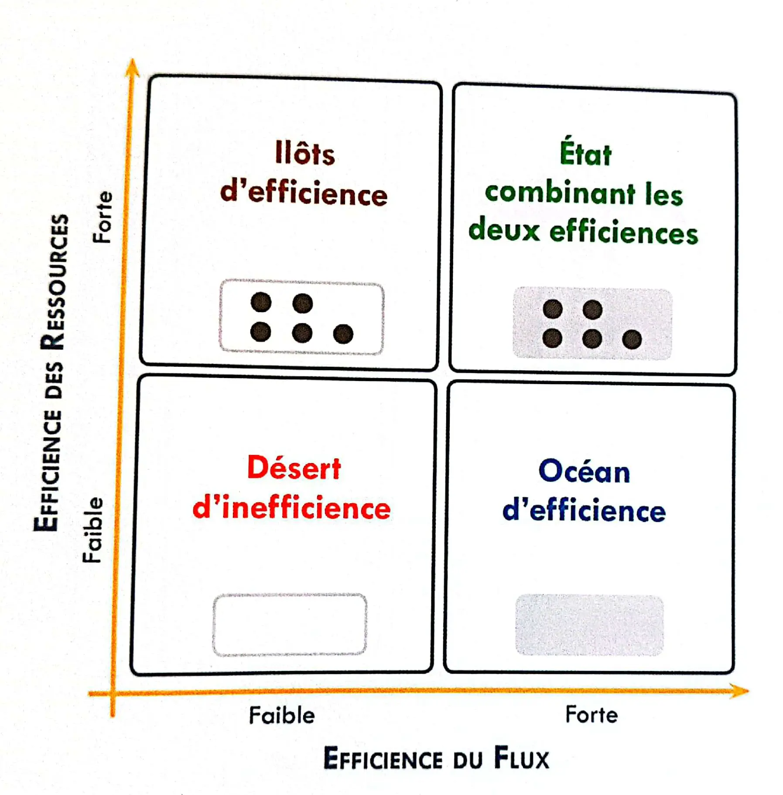

---

 
Prérequis : Aucun. 


## Sommaire

- [Introduction](#introduction)
- [PARTIE 1 : L'histoire du Lean Management](#partie1)
  - [A. Un concept qui naît d'une entreprise de machines à coudre](#partie1a)
  - [B. Un concept qui révolutionne le monde automobile](partie1b)
  - [C. Avant de révolutionner le monde industriel](#partie1c)
- [PARTIE 2 : Les fondements du Lean](#partie2)
  - [A. Le concept du "gaspillage" : l'essence du Lean](#partie2a)
  - [B. Le Lean et la recherche de l'efficacité](#partie2b)
  - [C. Les trois axes du Lean](#partie2c)
- [PARTIE 3 : Illustration du Lean au travers de la méthode 5S](#partie3)
  - [A. Une définition de la méthode](#partie3a)
  - [B. La théorie de son implémentation](#partie3b)

<h2 id=introduction> Introduction </h2>

L'amélioration continue est au cœur de la réussite de multiples organisations dans le monde. Dans un environnement commercial en constante évolution, les entreprises cherchent des moyens d'optimiser leurs opérations, d'éliminer le gaspillage et d'accroître leur efficacité pour rester compétitives. Le Lean Management, une philosophie de gestion d'origine japonaise qui a gagné en popularité au fil des décennies, offre une approche systématique pour atteindre ces objectifs. Nous découvrirons dans ce MON, les origines de cette façon de penser, ses piliers et nous essayerons de penser Lean au travers d'une illustration d'un de ses outils principaux : le 5S.

<h2 id=partie1> PARTIE 1 : L'histoire du Lean Management </h2>

<h3 id=partie1a> A. Un concept qui naît d'une entreprise de machines à coudre </h3>

Il faut savoir avant tout que l'entreprise **Toyota Motor Corporation** connue aujourd'hui dans le monde entier, a été fondée en 1826 au Japon par Sakichi Toyoda sous le nom de **Toyoda Automatic Loom Works**. Cette entreprise vendait à l'origine des machine à tisser dernier cri. Elles avaient la particularité de s’arrêter automatiquement dès qu'un fil se brisait. 

En 1933, avant la seconde guerre mondiale, la compagnie avait établi un département automobile dirigé par le fils de Toyoda, Kichiro. A son lancement en 1935, elle produisait des camions militaires et s’est ensuite tournée vers l’automobile. 
A la fin de la seconde guerre mondiale, l’économie Japonaise était dévastée. Et l’entreprise a dû faire face à plusieurs challenges dans l’autombolie : 

- Le marché domestique au Japon était trop faible pour rivaliser avec la production de masse des Etats-Unis
-	Un manque de capital pour investir dans de l’équipement et des machines de production

<h3 id=partie1b> B. Un concept qui révolutionne le monde automobile </h3>

C’est Eiji Toyoda qui a transformé la compagnie de son oncle, en grande entreprise. Il cherchait un modèle de production à adopter pour améliorer les installations dont il avait héritées.

A la fin des années 40, l’entreprise Toyota Motor Company produisait **200 voitures par an**. 
>Par comparaison, l'entreprise **Ford Motor Company** à Détroit réalisait **7 000 voitures par jour**. 

Le système duquel Eiji a été témoin durant sa visite à Détroit en 1950, l’a beaucoup inspiré : il voyait dans les défauts qu’il avait notés, des leviers d’améliorations possibles. Il a donc construit un nouveau système dans lequel il cherchait à éliminer le gaspillage dans la production tout en augmentant la valeur ajoutée. 
Le terme **« Lean Manufacturing »** désigne alors ce modèle de production, créé par Toyota qui a pour but de produire des marchandises de **bonne qualité**, en **bonne quantité** et à un **juste prix**, pour répondre au besoin du client. 

<h3 id=partie1c> C. Avant de révolutionner le monde industriel </h3>

Les objectifs du **TPS** (Toyota Production System) sont donc de maximiser la part des activités génératrices de valeur ajoutée, en éliminant les déchets. Pour cela, il faut s'efforcer de minimiser la taille des lots, idéalement en ayant un flux de pièces uniques dans la production, et faire en sorte de construire les processus de production sur les exigences des clients. Ces processus stables et standardisés, peuvent s’obtenir par l'organisation du lieu de travail, l'établissement de procédures opérationnelles normalisées et des processus à sécurité intégrée connus sous le nom de **jidoka** (comme les machines à coudre qui s’arrêtaient lorsqu’un fil se cassait)

C’est dans les années 1980 que des industriels et des chercheurs se sont penchés sur le cas Toyota, ont essayé d’en extraire l’essence. Ils ont ainsi identifier ses outils et ses concepts pour  en déduire un système de production.
En 1990, James Womack et Daniel Jones, chercheurs au MIT (USA), ont proposé le terme "Lean" ("mince" ou "sans superflu" ) dans leur livre "The Machine That Changed the World" qui retrace l'histoire de Toyota.


La différence entre les deux termes fait référence à leur déploiement:

- le *lean manufacturing* a pour but d'optimiser les méthodes de production. Il s’adresse aux opérationnels et aux ouvriers. 
- le *lean management* a pour but d'optimiser les méthodes de gestion de l’entreprisse et la stratégie commerciale. Il se positionne sur les zones managériales.
Mais il faut savoir qu'on parle aujourd'hui de Lean dans une multitude de domaines. "Lean Office", "Lean Services", ou encore même de "Lean Engineering" pour contrer le gaspillage qui consiste à ré-inventer à chaque fois sans capitaliser correctement sur la connaissance acquise.


---
 
- [Institut Lean France](https://www.institut-lean-france.fr/portfolio-item/ingenierie/)
*De nombreux articles gratuits traitant du Lean et de questionnements intéressants sur le sujet*
- [TUMx: Lean Production](https://www.edx.org/learn/manufacturing/technische-universitat-munchen-lean-production)
*MOOC en anglais intéressant pour découvrir le Lean, mais je ne l'ai pas fait en entier car trop long et certaines notions abordées ne concernaient pas ce que je voulais étudier dans ce MON (N.B. peut être intéressant d'aborder les autres notions dans un futur MON?)*
 

---

<h2 id=partie2> PARTIE 2 : Les fondements du Lean </h2>

<h3 id=partie2a> A. Le concept du "gaspillage" : l'essence du Lean </h3>

#### Les 3M (Mura, Muri, Muda) 

| Mura | Muri | Muda |
|---|---|---|
|*signifie "inconsistance" ou "irrégulier"*|*signifie "surcharge" ou "excès"*|*signifie "gaspillage", "inutile" ou "futile"|

Quand on parle d’élimination des déchets, on parle surtout du dernier M. Mais il est important de noter que **Muda** peut être la conséquences des autres M:

>*Les déchets ne sont que le symptôme de causes sous-jacentes plus profondes* 

Ainsi, dans le Lean, il est important de s’occuper également de **Mura** et **Muri**:

**De Mura** 
L’inconsistance peut être le résultat de plusieurs facteurs qui ne sont **pas contrôlables** (par exemple, une demande inégale de la part des clients ou de la répartition de la charge de travail, une qualité insuffisante des fournitures et des outils, ou une planification irrégulière du travail)
**A Muri** 
Dans ce cas, il semble logique de *travailler plus dur* et se *surcharger* pour surmonter ces *irrégularités* ou ces problèmes dans les flux de travail. Les personnes travaillent donc de longues heures pour rattraper le temps perdu pour répondre à la demande.Cela peut aussi signifier faire tourner les machines trop vite pour atteindre les objectifs de production ou les surcharger pour en tirer le meilleur parti, en omettant l'entretien afin de réduire les temps d'arrêt. Ainsi, lors d’une *surcharge* nous avons tendance à vouloir faire des économies en *commettant des erreurs*
**Jusqu'à Muda** 
L’environnement de travail devient alors *désorganisé* et *désordonné*. Nous *perdons du temps et des efforts* à résoudre les problèmes causés par la *surcharge*. 

Avant d'entreprendre toute action d’amélioration il est conseillé d'abord par éliminer le stress et les surcharges (*Muri*), puis de diminuer la variabilité et la fatigue (*Mura*). Car les éléments de gaspillage (*Muda*) sont plus faciles à détecter quand l'environnement de travail est plus serein.


Il est cependant important de se rappeler que les déchets ne sont pas simplement un sous produits des processus que l’on jette à la poubelle. Le gaspillage comprend toute activité qui ne produit pas de valeur pour le client. Muda est typiquement définie par *le principe des 7 déchets*


#### Les 7 types de déchets

|---|---|
|**La surproduction**| concerne tout ce qui est produit en surplux, ou trop tôt par rapport à la demande du client. *Il est souvent la source des autres gaspillages* |
| **Le stock**  | concerne l’entreposage de matières premières, en-cours ou produits finis en excès qui nécessite de la place ou des moyens techniques , humains et financiers de gestion|
| **Le transport**  | concernent le déplacement des marchandises plus qu'il n'est nécessaire : c'est un gaspillage d'efforts. *Le transport est nécessaire mais n’apporte aucune valeur ajoutée et doit donc être minimisé* |
| **Les attentes**  | concernent le personnel ou les équipements (ex: manque de pièces, décision retardée du client ou du management, etc...)|
| **Les mouvements**  | deviennent un gaspillages lorsqu'ils sont pénibles, superflus, non ergonomiques: ils génèrent alors des pertes de temps et peuvent dégrader les conditions de travail et compromettre la sécurité |
| **Le *overprocessing***  | concerne des tâches supplémentaires qui ne sont pas demandées par le client, donc à non-valeur ajoutée (ex: trop de contrôles dans le processus de fabrication)|
| **La non-qualité**  | peut être sous forme de rebuts, d'erreurs, de corrections, et il faut donc utiliser du temps et de l'agent à corriger le(s) problème(s)|


Depuis quelque temps, un 8e gaspillage est de plus en plus cité : la sous-utilisation des compétences, des idées, et des initiatives des salariés. C'est à dire le gaspillage du *potentiel humain* (ex: ne pas impliquer les acteurs du terrain, qui connaissent les détails des opérations et sont des experts dans l’exécution des tâches correspondantes, est un gaspillage d’opportunités et de ressources.)


<h3 id=partie2b> B. Le Lean et la recherche de l'efficacité  </h3>

La méthode "Lean" consiste donc, comme on vient de le voir, à *éliminer les gaspillages* d'un processus pour se concentrer sur *la création de valeur*. Cette méthode vise à améliorer *l’efficacité*, ce qui permet de libérer des ressources pour se concentrer sur *l'efficience*.

#### Efficace & efficient


**L'efficacité** mesure la capacité à produire un résultat souhaité, tandis que **l'efficience** mesure dans quelle mesure la plus petite quantité de ressources est utilisée pour produire la plus grande quantité de résultats.
_Ex : un boulanger est efficace si le gâteau qu'il fabrique est savoureux. Mais un boulanger n'est efficient que s'il peut faire le même gâteau avec deux fois moins de farine ou deux fois moins de temps que ses pairs._
**L’efficience c’est l’efficacité au moindre coût.**


Le client ne verra que **l’efficacité**. L’efficience du processus pour obtenir le résultat attendu n’est absolument pas son problème. L'entreprise, elle, ne verra que **l’efficience** du processus, pour obtenir le résultat attendu par le client.

##### L'efficacité

Pour être efficace, il faut donc savoir répondre aux besoins du client en **les hiérarchisant par ordre de priorité**, ou encore s'assurer également du **bien être et des besoins et des employés du projet**, et de s'assurer que la **vision** de l'organisation soit partagée et connue de tous. (*Par manque de temps je ne vais pas approfondie cette partie, mais on peut se référer à la première ressource citées dans les sources de la partie 2, qui explique plus en détails les enjeux et les outils derrières ces notions*)

> L'efficacité va consister à faire les bons choix de positionnement sur la matrice d'efficience. L'efficience va en être la résultante.

##### L'efficience

**Matrice d'efficience**

On construit la **matrice d'efficience** en trouvant le juste milieu entre **l'optimisation des ressources** et **l'optimisation des flux**.

> Source :"Lean à 540° : D’abord faire un virage de pensée à 180° puis explorer à 360°", Gaudichau, Matsumoto, Magnani (2019)

|Optimisation des ressources|Optimisation des flux|
|---|---|
|L'efficience s’obtient en faisant travailler chaque ressource le plus possible|L’efficience s’obtient avec l’execution la plus rapide possible du flux |
|**Caractéristiques** :   - Complexité et nombre d'unités (tâches dans un flux) additionnelles : *niveau de stress et charge mentale plus élevés*   - Nombres de redémarrages (passage d’une activité à une autre) plus important : *source de plus d'erreurs*|**Caractéristiques**:   - Peu d’unités traitées (on limite le nombre de taches effectuées en parallèle)   - Faible complexité des tâches et peu de redémarrage|
|*ex: on remplit au maximum l'agenda d'un médecin sans prendre en compte l'attente d'un patient*|*ex: on fait en sorte que toutes les unités des urgences puissent prendre en charge un patient urgent*|

La stratégie opérationnelle du Lean se focalise d’abord sur l’efficience du flux, et vient ensuite optimiser les ressources. C'est à ce moment là que devient accessible "l'état parfait", trouver le juste milieu entre les deux.

<h3 id=partie2c> C. Les trois axes du Lean  </h3>

L'objectif du Lean est donc de viser une efficience **opérationnelle**, comme vu juste au dessus.
Pour ce faire, il existe 3 grands aspects du Lean :

- [**rendre visible**](#rendre-visible)
- [**résoudre des problèmes**](#resoudre)
- [**capitaliser**](#capitaliser)


A côté de l'efficience opérationnelle, il existe également **l'efficience relationnelle** qui consiste à promouvoir la communication des informations et améliorer l'efficience des relations et des apprentissages. 
*(mais cette notion ne sera pas abordée dans ce MON)*


<h4 id=rendre-visible> Rendre visible </h4>

> L’homme enregistre 83% des informations qu’on lui transmet, grâce à la vue.

**Rendre visuel** permet donc de :
- mieux comprendre une situation et d'en apprendre par la suite
- mesurer et rendre plus tangibles des informations
- communiquer plus facilement aux autres
- résoudre un problème et trouver un moyen d’agir plus facilement en ayant un certain recul

>Rendre visuel et ainsi accéder à l’information avec un minimum d’effort et en un minimum de temps s’inscrit bien dans la démarche du lean de limiter le gaspillage.

<h4 id=resoudre> Résoudre les problèmes </h4>

Les problèmes sont au coeur de la culture lean et font partie du quotidien des sites de production. Une démarche de résolution de problème structurée et suivie sur le terrain permet d’améliorer durablement la performance. Cependant, en entreprise, un problème est souvent considéré comme **un objectif non atteint**, alors que le Lean le définit comme étant **un écart de performance**. C'est cette définition qui permet de définir précisément un problème et de mettre en place les bonnes étapes pour le traiter, car la résolution d’un problème est un processus à suivre.

<h4 id=capitaliser> Capitaliser </h4>

En Lean, une notion importante est celle de "capitalisation" des acquis. Celle ci passe également par la culture et l'entretient d'un état d'esprit *d'amélioration continue* en promouvant *les bonnes pratiques*. 
Elle s'illustre au travers des **standards**

Le **standard**, aussi appelé mode opératoire ou instruction, est considéré comme la base sur laquelle s'appuie tous les outils du Lean. Il est indispensable pour s’assurer qu'une activité est réalisée par toute une équipe donnée selon les meilleures pratiques du moment. Un standard est :
- **évolutif** : doit être mis à jour dès qu'il y a une évolution du meilleure savoir faire
- **ne doit pas être imposé par la hiérarchie** mais élaboré en mode participatif par les
opérationnels: *ils sont faits par et pour eux.*
- **évident** : il doit être *simple*, *accessible* et *visible* par tous les utilisateurs

on distingue 3 types de **standards**

|---|---|
|**Les standards de travail**| qui permettent de capitaliser les meilleures pratiques et indiquer aux opérationnels ce qu’ils ont à faire et comment bien le faire|
|**Les standards de management visuel**| qui permettent de voir ce qui se passe, de se repérer, de comprendre et dd'avoir un suivi des activités|
|**Les standards de réaction**|qui décrivent les modalités d'action associées à la détection d'un problème, (ie écart au standard) susceptible d'impacter de client |


En résumé, le standard est la formalisation et la capitalisation du meilleur savoir-faire existant et évolutif pour devenir une référence.


---

 
- Gaudichau, Olivier & Matsumoto, Eduardo & Magnani, Florian. (2019). Lean à 540° : D’abord faire un virage de pensée à 180° puis explorer à 360°. 
*Offre un autre angle d'approche du Lean de celui qu'on retrouve sur internet, illustre bien les notions d'efficience et efficace, se lit vite et est très accessible*
- Demetrescoux, Radu. “La boîte à outils du Lean Ed. 2.” (2019)
*Je conseille vivement pour approfondir le sujet. Traite d'une quantité très importante d'outils du Lean avec de nombreuses méthodologies d'application et des conseils. Est très accessible*
 

---

<h2 id=partie3> PARTIE 3 : Illustration du Lean au travers de la méthode 5S </h2>


*Au départ de ce MON, je voulais expliciter plusieurs outils du Lean. Mais en plus d'être trop nombreux et souvent interdépendants les uns des autres, ils remplissent tous un objectif précis et il ne me semblait pas très pertinent de n'en choisir que quelques uns.   J'ai choisi à la place de me focaliser sur une explication du concept et des idées qu'ils est important d'avoir en tête lorsque l'on parle de Lean, ou que l'on veut l'appliquer.   Pour rendre ce MON tout de même plus parlant, j'ai choisi de présenter la méthode 5S, qui selon moi, vient reprendre les [3 fondements du Lean](#partie2c) expliqués plus tôt, et offre une bonne démonstration de la logique Lean.*


<h3 id=partie3a> A. Une définition de la méthode </h3>

> Le 5S c'est sûrement l'outil du Lean le plus facile à comprendre mais le plus compliqué à appliquer,
> Florian Magnani

C'est Taïchi Ohno au sein de Toyota dans les années 50 qui créé le concept 4S. Ce dernier a été ensuite affiné en 5S au cours des années 60. 
Les 5S fixent les bases de l'ordre et de la **standardisation** : les salariés qui travaillent dans un environnement plus propre, sécurisé et ordonné, fournissent un travail de qualité supérieure. 

<h3 id=partie3b> B. La théorie de son implémentation </h3>

##### Seiri (*Débarasser*)
> Uniquement ce qui est utile

On trie le contenu de la zone :

- éliminer l'inutile
- stocker à l’écart ce qui est rarement utilisé
- faire réparer ce qui est cassé ou détériorer
- commencer à prévoir des idées pour le rangement de l'utile


Si on a un doute sur l'utilité de quelque chose, on place l’objet dans la « zone en attente de décision » (ZAD). On considère que tout ce qui n’a pas été utilisé sous un mois doit être considéré comme inutile.


##### Seiton (*Ranger*)
> Chaque chose a sa place, une place pour chaque chose

Allouer une place bien identifiée pour chaque objet de la zone et les ranger en fonction de la fréquence d’utilisation, dans des conditions ergonomiques. On peut également établir une carte de zones où chacune est nommée, pour localiser les objets.


Pour réaliser cette étape, on peut par exemple dessiner un diagramme spaghetti, qui représente les déplacement d’un opérateur autour d’un poste considéré.


##### Seiso (*Nettoyer*)
> Le meilleur nettoyage est de ne pas avoir besoin de nettoyer

Réaliser un programme de nettoyage à faire respecter.  Il faut d'abord effectuer un nettoyage initial puis faire en sorte de maintenir un nettoyage régulier. La propreté permettra d'améliorer la qualité de vie au travail et facilitera aussi la détection les défauts et les pannes.

##### Seiketsu (*Standardiser*)
> Pour voir et identifier ce qui doit être fait

Il faut identifier, étiqueter, adopter des codes couleurs, et définir des standards visuels en concertation avec les équipes (ex: choix des couleurs ou des formes).  On doit également inclure dans ces standards des zone de communications contenants des indicateurs des éléments de sécurité ou de nettoyage. 

##### Seiketsu (*Maintenir*)
> Moins il faut de discipline mieux c’est

Il faut assurer le respect des règles à travers un audit régulier.

On appelle ces audits **audit 5S** ou *audit anti-récurrence*. Ils sont conçus pour s'assurer de la correction des non-conformités, de la pérennisation des standards, et pour promouvoir un esprit d’amélioration continue.
Il est effectué par le management local chaque semaine. 
Une non-conformité vaut un point. En dessous de 20% de points de démérite, l'audit est dit réussi. Si une non conformité n'est pas corrigée la semaine suivante ses points sont doublés.


On parle de "5S environnement" par rapport à l’aménagement des espaces de travail (atelier, lignes et postes de travail, bureaux, magasins). Le "5S machine", quant à lui, se pratique lors de la première étape de la maintenance d'une machine.


<h3 id=partie3c> C. Cas d'application de l'outil </h3>

Je conseille vivement cette vidéo : [Lean 5S in MSICU](https://www.youtube.com/watch?v=aMkXICM1-98)
Le 5S tel que connu aujourd’hui est nés dans les ateliers industriels. Certains pensent alors que c’est plutôt un outil de la production. Il est intéressant de voir une application dans un hôpital.

 
- La boîte à outils du Lean, (2019) de RaduDemetrescoux.
- Hohmann, Christian. “Guide pratique des 5S et du management visuel : pour les managers et les encadrants.” (2010).
*Très bon ouvrage assez exhaustif sur le 5S, qui permet de bien comprendre la méthode et ses enjeux*
 

---

> **Horodateur** : 
> Jeudi 29/09 : 30 mins (Premières recherches de ressources et définition d’une structure pour le MON)
> Vendredi 30/09 : 1h30 (Réalisation des parties choisies du MON)
> Vendredi 6/10 : 2h (Recherches approfondies sur les concepts généraux du Lean)
> Dimanche 8/10 : 1h30 (Focus sur le fonctionnement de plusieurs outils du Lean)
> Jeudi 12/10 : 1h30 (Mise en forme des recherches selon le plan défini)
> Dimanche 15/10 : 3h (Lecture des ressources données par Florian Magnani, redéfinition du MON et du plan)
> Mardi 17/1° : 1h (Ajout de compléments aux notions manquantes de ce MOn par rapport au plan redéfini)
