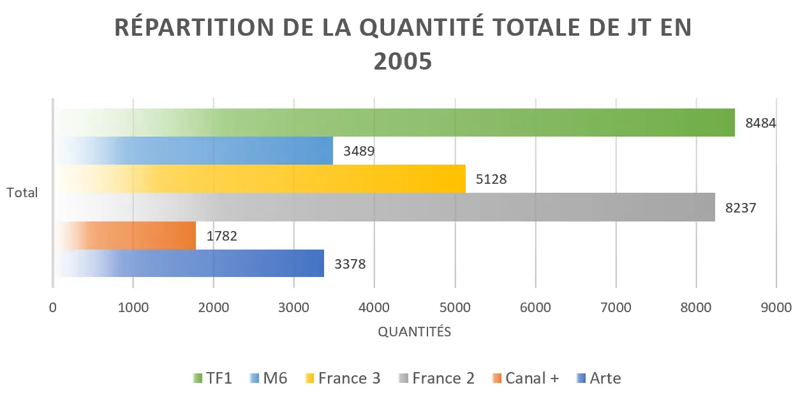

---

 
Prérequis : Avoir Excel, et avoir des bases dans l'utilisation du logiciel.


## Sommaire

- [Introduction](#introduction)
- [Sujet d'analyse](#sujet)
- [Préparation des données](#préparation)
- [Analyse des données](#analyse)
- [Présentation du tableau de bord](#tableau_bord)


<h2 id=introduction> Introduction </h2>

Pour ce MON, j'ai suivi dans les grandes lignes la formation ["Perfectionnez-vous sur Excel"](https://openclassrooms.com/fr/courses/7139456-perfectionnez-vous-sur-excel/7321389-enrichissez-votre-tableau-de-donnees) d'Open classroom. Elle est assez intéressante et plutôt bien construite. Pour la suite de ce MON, je me suis d'ailleurs basée sur le plan de la formation pour arriver à l'élaboration de mon tableau de bord.
*La formation va d'ailleurs au delà de la création de ce tableau de bord, puisqu'elle étudie même les outils d'analyse des données (valeurs cibles, solveur, scénarios de données) : même si ce n'était pas ce que je recherchais de prime abord, c'est aussi des notions intéressantes.* 
Cependant, pour ce qui est de la réelle construction d'un tableau de bord, je trouve que ce cours manquait un peu de contenu. Il n'évoquait même pas de notion de "segment". J'ai donc approfondi ces notions au travers de vidéos:

- [Aide sur les segments](https://www.youtube.com/watch?v=KkUoFjIRup8)
- [Construction d'un tableau de bord](https://www.youtube.com/watch?v=VK2Ndh3U9jg&t=1916s)

Par ailleurs, pour le traitement initial des données, comme on le verra plus tard, j'ai du utiliser Power Query. Comme ce cours sur Excel n'abordait pas cette notion avec cet outil, je me suis appuyée sur [cette aide de Microsoft](https://support.microsoft.com/fr-fr/office/%C3%A0-propos-de-power-query-dans-excel-7104fbee-9e62-4cb9-a02e-5bfb1a6c536a) pour utiliser Power Query à partir d'un tableau Excel et de [cet article](https://reportingsavvy.com/2021/03/11/power-query-depivoter-les-colonnes-pivoter-les-colonnes-et-transposer/) pour comprendre les transformations de pivotements des colonnes. 

<h2 id=sujet> Sujet d'analyse </h2>

Pour choisir la base de données que j'allais exploiter pour appliquer les connaissances et la démarche apprises, je suis allée sur le site [d'open data du gouvernement](https://www.data.gouv.fr/fr/). J'y ai trouvé une base de données sur le [classement thématique des sujets de journaux télévisés des chaînes de TF1 à M6 sur la période de janvier 2005 à septembre 2020](https://www.data.gouv.fr/fr/datasets/classement-thematique-des-sujets-de-journaux-televises-janvier-2005-septembre-2020/#/resources). Elle comprend 2 fichiers que vous pouvez télécharger [ici](Fichiers_excel_initiaux.zip). 
- l'un représente pour **chaque chaîne** la **quantité** de JT **d'un thème**
- l'autre représente pour **chaque chaîne** la **durée** des JT **d'un thème**
Je trouvais cette BDD très intéressante, d'une part pour son thème, sur lequel il y avait de nombreux angles d'analyse à adopter, et d'autre part pour sa structure qui nécessitait d'appliquer un peu de notions d'SQL en définissant une colonne clé pour pouvoir joindre les deux tables afin d'analyser la globalité des données.

<h2 id=préparation> Préparation des données </h2>

### ETAPE 1 : Formater les données

|Fichier de départ "quantités"| Fichier de départ "durées"|
|---|---|
|  ||

#### Verification des données 

Avant de manipuler les données d’un fichier source, il est important de le vérifier grâce à **l’inspecteur de document**. S’il y a des problèmes ils seront alors remontés.


On peut le retrouver en faisant:
*Fichier > Informations > « Vérifier l’absence de problèmes » > « Inspecter le document »*


Ensuite, il faut supprimer les données inutiles et alléger le poids du fichier en s’assurant qu’aucune donnée n’est enregistrée dans une zone non visible avec l’outil « Rechercher et sélectionner », ce qui permet de s’assurer que la dernière cellule est bien la bonne.

*Jusqu'ici pas de problème !*

#### Mise en forme des données


Dans une liste de données, on cherche à réduire le nombre de colonnes. La liste de données se présente donc en vertical plutôt qu’en horizontal. 


Ici, les deux tables initiales se trouvent sur trop de colonnes. Il faut donc chercher à réduire ce nombre en regroupant toutes les chaines selon une colonne. 


Pour ce faire, comme illustré dans l'image ci-dessus, j'ai utilisé Power Query pour "dépivoter" les colonnes correspondant aux chaînes télévisées, permettant ainsi de créer une ligne pour chaque chaîne.


Dans Excel, il est important de toujours mettre ses données en tableau. Cela a plusieurs avantages :

- ajouter automatiquement des filtres aux colonnes des données
- faciliter la lecture des données *(ne couleur de remplissage va être appliquée 1 ligne sur 2)*
- faciliter le remplissage des données *(si on ajoute un champ calculé, Excel va automatiquement appliquer la formule sur toute la hauteur du tableau)*


---


Dans Excel, il peut arriver que certaines colonnes ne soient pas exploitables (ex : "T1-2021_01). Dans ce cas là il convient d'ajouter des colonnes pour "séparer" les données.*On peut utiliser les fonctions GAUCHE(), DROITE(), NBCAR() ou TROUVE() (qui renvoie la position d’un caractère).*

Certaines données peuvent ne pas être enregistrées dans le bon format. On peut alors le modifier directement dans les options de "Format de cellules" ou en utilisant certaines fonctions Excel. Par exemple
- CNUM() pour convertir un texte en nombre
- VALEURNOMBRE() si le séparateur décimal est un point au lieu d’une virgule ou changer le format de cellule


Après réalisation de ces étapes, on obtient alors: 

|Tableau_quantités| Tableau_durées|
|---|---|
||| 

> Remarque : j'ai fait en sorte d'ajouter des colonnes pour obtenir les informations sur le mois et l'année de diffusion des JT, mais je me suis rendue compte, par la suite, que ça n'avait pas grand intérêt car les tableaux croisés dynamiques décomposaient déjà automatiquement la date selon ces critères.

### ETAPE 2 : Enrichir les données

Une fois le tableau mis en forme, on peut venir enrichir les données. Ici il nous fallait aller chercher pour chaque chaîne et selon la date, la durée des JT diffusés par thème. J'ai donc créé une nouvelle colonne dans chaque table appelée "CONCAT" avec cette formule 

```
=[@Date]&[@Thème]&[@Chaine]
```

On avait ainsi un identifiant unique pour chaque ligne qui devenait une clé entre les deux tables. Il m'a ensuite suffit d'ajouter une colonne dans le *"Tableau_quantités"* qui venait utiliser une méthode de recherche de CONCAT dans le *"Tableau_durees"*:


Dans Excel, existe 3 façons de rechercher une donnée :

- **RECHERCHEV()** (Mais nécessite de placer la colonne de correspondance à gauche de la colonne recherchée)
- **RECHERCHEX()** (Permet, à l'inverse de RECHERCHEV, de renvoyer un tableau avec plusieurs éléments)
- **INDEX()** puis **EQUIV()** (*INDEX()* permet de trouver la valeur d’une cellule à l’intérieur d’une plage de donnée et *EQUIV()* permet de trouver à quelle place se trouve une certaine valeur, dans une plage de cellules)


Dans ce cas, les 2 premières méthodes marchent tout aussi bien :
```
=RECHERCHEV([@CONCAT];Durees;7;FAUX) 
=RECHERCHEX([@CONCAT];Durees[CONCAT];Durees[Duree])
```

On obtient alors un tableau exploitable : 


<h2 id=analyse> Analyse des données </h2>

### ETAPE 1 : La saisie de formules avancées


Excel permet de créer des filtres élaborés avec la création d’une zone de critères. On peut alors additionner des critères **"ET"** ou définir une condition **"OU"** (je filtre sur l’un ou l’autre des critères)
*Clique droit sur une donnée du tableau > Onglet "Données" > "Avancé" (dans "Fitre")*


Par exemple ici :

|---|---|
||| 
|On filtre sur les JT diffusés en 2020 ET sur le thème Santé| On filtre sur les JT diffusés en Janvier OU qui durent plus d'1 heure|


On peut également faire avec Excel du calcul de statistiques avec des **fonctions de base de données**. Celles ci commencent par "BD" avec un nom de fonction derrière (ex : BDSOMME(), BDMIN(), BDNOMBRE(), etc...)
*Il est important de nommer les plages de cellules de travail pour pouvoir ensuite les exploiter comme base de données*


> REMARQUE : en cliquant sur fx on a accès à l’assistant d’Excel qui permet de rechercher des fonctions prédéfinies proposées par Excel en fonction de différents domaines d’activités (financier, comptables…) 

#### Exemple avec l'utilisation de BDSOMME()

J'ai voulu comparer la différence de quantités de JT sur le thème de la Santé diffusés en 2005 et en 2020.
J'ai renommé ma table de données "Global" puis j'ai appliqué la formule BDSOMME() pour les 2 années:

```
=BDSOMME(Global;"Quantité";K2:L3) (appliqué en L4)
=BDSOMME(Global;"Quantité";N2:O3) (appliqué en O4)
```


On retrouve alors des résultats assez cohérents avec l'explication de l'épidémie de COVID en 2020. 

### ETAPE 2 : La création de mon tableau de bord

> [Par définition](https://sos-excel.fr/tableau-de-bord-de-gestion-excel-a-telecharger-gratuitement/), un tableau de bord Excel est un outil qui fournit un aperçu des données essentielles concernant un sujet sur une seule page, et comprenant des éléments visuels (ex graphiques, figures, etc... )

Pour cette étape, il me fallait trouver des données intéressantes à mettre en valeurs dans mon tableau de bord. J'ai alors choisi 4 questions intéressantes sur cette base de données qui m'ont permis d'avoir des idées d'informations à mettre en valeurs dans mon tableau de bord : 

- [Existe-t-il des variations significatives dans la quantité de journaux télévisés entre les différentes chaînes ?](#question1)
- [Les chaînes TV offrent-elles toutes le même contenu ?](#question2)
- [Y'a t'il une corrélation entre quantité de JT et durée pour chaque thème des JT diffusés pour toutes les chaines ?](#question3)
- [Y'a t'il une tendance saisonnière à regarder plus la télé en hiver qu'en été ?](#question4)

<h4 id=question4> Existe-t-il des variations significatives dans la quantité de journaux télévisés entre les différentes chaînes ? </h4>

|2005|2015|2020|
|---|---|---|
||||

On peut voir que depuis 2005, il y a un monopole des chaines TF1 et France 2. Même si la diffusion de journaux télévisés a globalement beaucoup diminué depuis le début de l'étude, la chaine M6 quant à elle diffuse de plus en plus de JT.
On remarque également qu'aucun JT n'a été publié en 2020 par Canal +. Si on regarde plus précisément, on peut voir qu'un tournant a été observé entre 2015 et 2017 où la chaine est passée de **3 143 JT diffusés** à **491**. *Après recherche, ol s'avère que "le JT de Canal +" a arrêté d'être diffusé depuis le 3 juillet 2016*.

<h4 id=question2> Les chaînes TV offrent-elles toutes le même contenu? </h4>

|TF1|France 3|M6|
|---|---|---|
||||

Comme on l'imagine, si on compare sur la même année, on se rend compte que les chaines diffusent globalement le même contenu, qui se trouve surtout être en rapport avec les faits sociaux. *Mise à part Arte, dont le thème des JT diffusés est presque exclusivement "International".*

Cependant, les chaines adaptent le contenu de leurs journaux télévisés en fonction des évènements majeurs qui surviennent au cours du temps. Ces graphiques permettent de mettre en évidence ces faits marquants.

|TF1|M6|
|---|---|
|||
|||

On peut voir alors que 2017 a été marquée par l'élection de Macron et 2020 par la pandémie de COVID.

<h4 id=question3> Y'a t'il une corrélation entre quantité de JT et durée pour chaque thème des JT diffusés pour toutes les chaines ? </h4>

|Société|Justice|Environnement|
|---|---|---|
||||

On remarque que certaines chaines ont tendance a diffusé des JT plus longs par rapport aux autres chaines *(ex: M6)*. Pour d'autres, la durée des JT dépend du thème *(ex: Arte a fait des JT plus longs que les autres sur le thème "Société" et moins longs que les autres sr le thème "Environnement").

<h4 id=question4> Y'a t'il une tendance saisonnière à regarder plus la télé en hiver qu'en été ? </h4>

Les mois d'hiver présentent-ils une tendance à avoir une quantité de journaux télévisés supérieure à celle des mois d'été pour l'ensemble des chaînes ?

|2011|2014|2017|
|---|---|---|
||||

Contrairement à ce que je pensais au début, *(ie que les téléspectateurs auraient tendance à moins regarder la télé en été qu'en hiver, et que donc les chaines auraient tendance à moins diffuser de JT l'été que l'hiver)* en analysant ces graphiques, on ne remarque pas de tendance saisonnière particulière. Finalement, les journaux télévisés sont autant regardés en été qu'en hiver, et les pics de quantité de JT diffusés pour un mois particulier semblent plus s'expliquer par un évènement spécial survenu à ce moment là qu'à autre chose.

<h2 id=tableau_bord> Présentation du tableau de bord</h2>

Pour réaliser mon tableau de bord final, j'y ai inclus les graphiques obtenus avec les questions précédentes, et j'y ai rajouté d'autres graphiques pour mettre en valeurs d'autres données que je trouvais pertinentes. J'ai rajouté des segments pour contrôler chaque graphique en fonction des thèmes, des chaînes et des dates.

Vous pouvez télécharger le fichier excel contenant ce tableau [ici](MON2_Tableau_de_bord_Excel.zip)


### Le petit mot de la fin

Finalement, même si j'ai déjà utilisé souvent excel pendant mon alternance, je me rends compte qu'il y avait beaucoup de fonctionnalités dont j'ignorais l'existence. Cependant, même si la base de données sur laquelle je me suis appuyée était très intéressante, je ne suis pas sure que c'était la plus adaptée pour réaliser un tableau de bord pertinent. J'ai remarqué que c'était surtout au travers d'analyses de ventes, ou de suivi de KPI que les tableau de bord étaient surtout utilisés. Mais, cela reste, au final, un très bon entraînement !

> **Horodateur** : 
> Samedi 11/11 : 30 mins (Recherche de ressources d'apprentissage et d'une base de données sur laquelle m'appuyer)
> Jeudi 23/11 : 2h50 (Réalisation de la formation Open Classroom trouvée)
> Vendredi 24/11 : 40 mins (Visionnage de vidéos supplémentaires pour compléter la formation)
> Jeudi 30/11 : 1h30 (Mise en forme de la base de données obtenue suivant le plan énoncé dans ce MON)
> Samedi 09/12  : 1h (Recherche de questions pertinentes pour analyser les données graphiquement)
> Dimanche 10/12 : 2h (Mise en forme des graphiques)
> Mardi 12/12 : 1h30 (Ajout de graphiques et mise en forme finale du tableau de bord)

