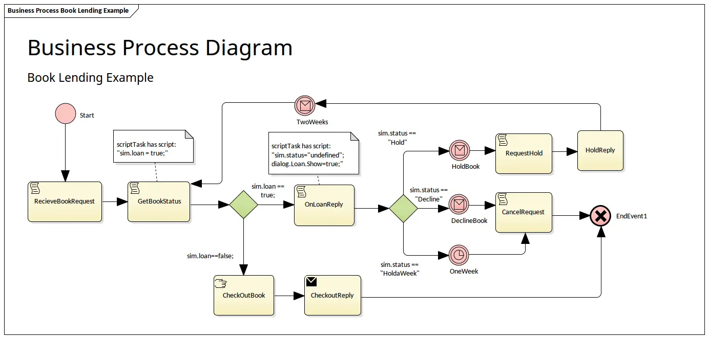
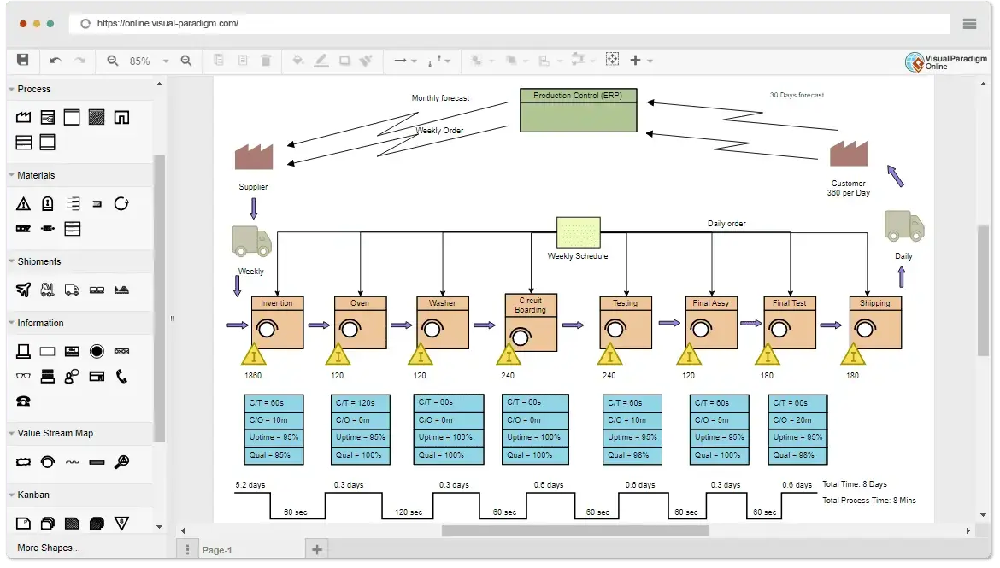
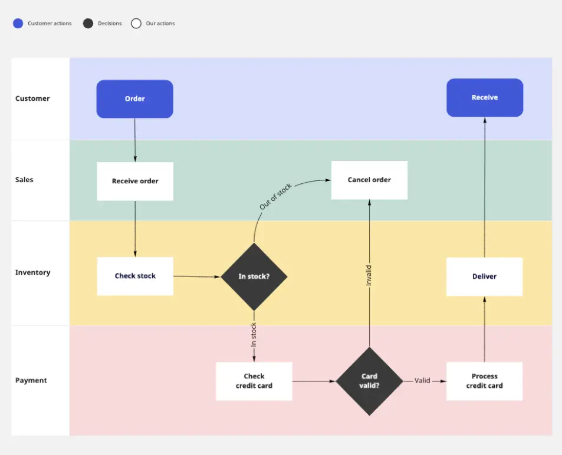
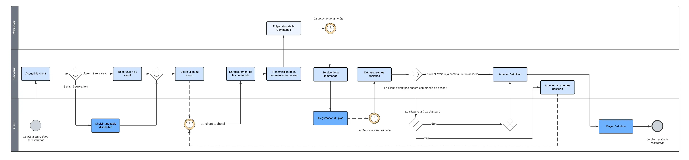

---

 
Prérequis : 
*J'évoque dans cette partie des concepts (ex: ERP, Lean Management, etc..) que j'ai déjà évoqués dans [ce MON](../temps-1.1) et dans [celui ci](../temps-1.2).*
*Ils ne sont pas indispensables à la compréhension de ce MON mais ils peuvent servir !*


## Sommaire

- [Introduction](#introduction)
- [La définition du processus](#definition)
- [L'histoire du processus](#histoire)
- [La modélisation du processus](#modélisation)
- [Comment améliorer un processus...](#améliorer)
- [...Jusqu'à le rendre autonome](#autonome)

<h2 id=introduction> Introduction </h2>

Quand on demande à ChatGPT *"quelle est la place des processus dans une entreprise aujourd'hui ?"*, il répond, sans hésitation,qu'ils *"occupent une place centrale et stratégique au sein des entreprises d'aujourd'hui"* et que leur importance *"découle de plusieurs facteurs clés qui contribuent à la réussite globale d'une organisation"*. Parmi les 10 aspects qu'ils citent pour mettre en évidence la place des processus dans une entreprise, on retrouve notamment **l'efficacité opérationnelle**, **la qualité des produits et services**, ou encore **la communication interne**.

<h2 id=histoire> 1. Le processus : son histoire </h2>

Jusqu’à l’aube des années 70, beaucoup d’entreprises sont organisées selon un modèle de type **Taylorien** (*organisation scientifique du travail*), adapté à un environnement où la demande est supérieure à l’offre. La concurrence n’est pas mondialisée et les ressources sont facilement accessibles. L'accent des stratégies des entreprises n'est pas mis la performance opérationnelle mais plus sur la **recherche du chiffre d'affaires**.

La charnière survient lors des années 70 et 80, avec l'avènement du **1er choc pétrolier** et la **crise économique** : s'en suit de nombreux changements économiques. Les cycles de développement deviennent de plus en plus courts et les produits de plus en plus complexes. Cela demande donc de mettre en œuvre une organisation transversale où les **interactions entre les différents services** (achats, productions, RH, etc...) sont définies de façon aussi précise et fiable que possible. Les entreprises sont donc dans l’obligation de repenser progressivement leur mode de gestion.

 
Caseau, Y. (2011). Processus et Entreprise 2.0: Innover par la collaboration et le lean management. Dunod
 

<h2 id=definition> 2. Le processus : sa définition </h2>

### a. Qu’est ce qu’un processuss ? 

Une entreprise est organisée pour la **production de valeur**, cette production se concrétisant par la fourniture d’un **output** (*produit, service, livrable*) en consommant certains **inputs** (*ressources*), la valeur produite étant alors la différence entre valeur des outputs et valeur des inputs. On calcule en considérant l’entreprise comme un tout, ou comme la subdivision de m**étiers divers produisent une valeur spécifique**, et ayant chacune des *outputs* et des *inputs*. On parle alors de **processus** comme un enchaînement des activités concourant à la production d’une valeur. 

 
Comme moi même je ne savais pas vraiment décrire la différence, je me permets de poser cette définition toute simple que j'ai trouvée [ici](https://optimiso-group.com/articles/comprendre-enfin-la-difference-entre-processus-et-procedure/)
*"C'est comme faire un gâteau au chocolat : le processus est l’action de réaliser le gâteau et la procédure est la recette de cuisine qui explique comment réaliser ce gâteau."*
 

### b. Et un processus métier alors ? 

On appelle **processus métier**, ou *processus d'affaires* l'ensemble des activités permettant à une entreprise d'atteindre ses objectifs stratégiques, notamment celui de l'amélioration. Il met en évidence les interactions sous forme d’échange d’informations entre les différents acteurs de l’entreprise. 

-	**Échanges entre acteurs** internes ou externes (*commercial, technicien, fournisseurs…*) 
-	**Échanges avec les applications ou services** (*email, gestion de facturation, gestion des clients, etc...*) 
-	**Échanges d’informations avec d’autres processus métiers**

On retrouve globalement 3 types de processus métiers dans une organisation:

- **processus de pilotage/management** : définissent la culture, les objectifs et la stratégie de l'entreprise et contribuent à leur déploiement (*ex: processus de planification et d’allocation des ressources*)
- **processus opérationnels** : contribuent directement à la mise en œuvre du produit ou du service proposé par l'entreprise de l'identification du besoin du client à sa satisfaction (*ex:processus de développement produit, de ventes, de livraison*)
- **processus de support** : assurent la disponibilité des ressources et moyens nécessaires au bon déroulement de tous les autres processus d'affaires (*ex: processus d'administration, de recrutement, de gestion du système d'information, etc...*)

>**L’ efficacité d’une organisation** dépend alors, de **l’efficacité de ses processus métiers**. Pour demeurer concurrentielles, les organisations doivent donc chercher à **optimiser** et **automatiser** leurs processus métiers (*c'est ce que nous étudierons dans la [partie 4](#améliorer)*)

 
- https://www.blogdumoderateur.com/processus-metier-entreprise-definition-usages-outils/ (*approche très accessible des concepts cités au dessus*)
- Caseau, Y. (2011). Processus et Entreprise 2.0: Innover par la collaboration et le lean management. Dunod (*permet d'approfondir ces concepts, très complet*)
- Morley, Chantal, et al. Processus métiers et S.I. : Gouvernance, management, modélisation Ed. 3. Dunod, 2011. (*ouvrage très complet, et transversal un peu à tout le MON*)
 

<h2 id=modélisation> 3. Le processus : sa modélisation </h2>

Nous allons voir dans cette partie les différents items suivants : 
- [a. Pourquoi modéliser un processus ? ](#a)
- [b. TOGAF ? ADM  ? APQC ? quésaco ? ](#b)
- [c. Y'a t'il un langage de modélisation ?](#c)
- [d. Quels sont les différents types d'outils de modélisation ?](#d)

<h3 id=a> a. Pourquoi modéliser un processus ?  </h3>

La **modélisation (ou cartographie) des processus métiers** est une activité qui consiste à créer un diagramme (*flux détaillé, déroulement du travail, cas d’utilisation, etc...*) qui montre les **intrants-extrants**, les tâches et les activités faisant partie du processus, dans une séquence structurée.

Modéliser un processus c'est offrir une représentation visuelle du fonctionnement de l’entreprise, qui permet de :
- porter sa description à un niveau de clarté et de simplicité qui puisse être accessible à tous les collaborateurs d'une entreprise (*même ceux qui sont externes à un processus*). 
- rendre cette description **transparente** en facilitant son partage et sa **communication** entre les acteurs concernés.
- mettre en valeur les différents **problèmes de fonctionnement**.

Cette modélisation **conceptualise l’entreprise et sa vision stratégique** : elle permet de mettre en évidence les **processus-clés**, qui se trouvent au cœur des activités primaires d’une chaîne de valeur. C'est eux qui sont directement liés aux facteurs-clés assurant le succès de l’entreprise.

#### Urbanisation des SI

En faisant mes recherches sur le sujet je suis tombée sur le concept d'**"urbanisation des SI"**. Ce concept n'est pas directement lié avec la modélisation des processus, mais permet de mieux comprendre les enjeux : *je trouvais pertinent d'évoquer cette notion ici*. 
Voici une définition de Wikipédia assez récapitulative et explicite : 

> **L'urbanisation du système d'information** d'une entité ou d'une organisation, qui peut être une entreprise ou une administration, est une discipline d’ingénierie informatique consistant à faire évoluer le système d'information (SI) de celle-ci afin qu'il soutienne et accompagne efficacement les missions de ladite organisation et anticipe ses transformations.

Ce besoin d'évolution peut provenir de différents facteurs stratégiques d'une entreprise (ex : regroupements et fusions, acquisitions, nouveaux modes ou canaux de distribution, réorganisation, etc...) qui impliquent donc des changements structurels importants.

Ainsi, **cartographier les processus** de l'entreprise, est un outil essentiel 
- *en amont* de l'urbanisation : elle va permettre lors de la refonte du SI, d'être au plus proche du fonctionnel
- *en aval*: elle va permettre de pouvoir **capitaliser** et **standardiser** (comme dans la méthode 5S) sur ces nouveaux outils, en redéfinissant une nouvelle manière de faire, *ie un nouveau processus*. 


On parle souvent de workflow au sens logiciel : c’est la représentation informatique d’une suite de tâches dans un processus.


<h3 id=b> b.TOGAF ? ADM  ? APQC ? quésaco ? </h3>


Je vais tenter d'introduire dans cette partie quelques concepts, qui sont liés de manière plus ou moins directe avec les processus métiers, mais que je trouve très intéressants d'évoquer. 
Ces concepts ont été assez compliqués à comprendre : j'espère en avoir fait un résumé accessible et compréhensible. 


#### TOGAF

**TOGAF** (*The Open Group Architecture Framework*) : c’est un cadre (*framework*) d'architecture d'entreprise largement utilisé dans le domaine de la gestion des SI.
L'objectif principal de TOGAF est de fournir une méthode et un ensemble d'outils (ie un cadre commun) pour élaborer une architecture d'entreprise qui répond aux besoins actuels et futurs de l'organisation, et faciliter la capitalisation des pratiques architecturales. 


On parle de *framework* (ou *cadre* en français) pour désigner une collection de moyens et procédés dédiés à un domaine d'activités particuliers. Il est utilisé comme référence et instrument de travail.


Comme on l'a vu plutôt avec le concept *d'urbanisation* : le développement et la maintenance d’une architecture d’entreprise est un processus complexe impliquant de nombreux acteurs et processus décisionnels. Donc le TOGAF aide en documentant les spécifications, les processus et les produits de travail de l’architecture d’entreprise.

 

- Le développement initial de TOGAF version 1 a été réalisé en **1995**, grâce aux représentants de certaines des principales entreprises et organisations mondiales : efforts combinés de plus de **300 membres**
- **programme de certification** mis en place depuis 2008 avec plus de 15 000 personnes certifiées à l'échelle internationale
- s'applique à **tout type d'architecture**, *y compris ERP* (ex: SAO fournit son propre cadre d’architecture EAF (*SAP Entreprise Architecture Framework*), une adaptation de TOGAF)
- est conçu pour être **adaptable** et **utilisable** dans divers contextes d'entreprise : fournit un cadre générique qui peut être adapté pour répondre aux besoins spécifiques d'une organisation.
Structure


##### Structure
TOGAF est structuré en *plusieurs parties*, chacune se concentrant sur des aspects spécifiques de l'architecture d'entreprise. On distingue 2 grandes parties : 

- **ADM** (Architecture Development Method / ou *cadre d'architecture*) : C'est le cœur de TOGAF, décrivant une méthode itérative en 10 phases pour développer et gérer une architecture d'entreprise. (*ex: planification, la création de l'architecture baseline, la conception cible, la mise en œuvre et la gestion du changement*)
- **Ressources de support** : incluent des directives, des techniques, des modèles, des référentiels, et d'autres ressources pour aider à appliquer l'ADM.

#### APQC

**L'APQC** (*American Productivity & Quality Center*) est une organisation à but non lucratif **fondée en 1977** qui se consacre à la recherche et à la promotion des **meilleures pratiques** en matière de productivité et de qualité au sein des entreprises : elle fournit des **ressources** et des conseils pour aider les organisations à **améliorer leurs performances**, **à innover** et à **atteindre l'excellence opérationnelle**.

Elle fournit une base de données importantes de processus clés *globaux* (ex: processus achats), sur lesquels les enterprises peuvent venir s'appuyer pour concevoir ou améliorer leur processus. 
(*Remarque : En tout cas, Madame Girard m'a dit que c'était une ressources qu'ils utilisaient beaucoup chez KPMG comme base de création ou d'amélioration d'un processus dans une entreprise cliente.*)

<h3 id=c> c. Y'a t'il un langage de modélisation ? </h3>

Le document TOGAF met l'accent sur les **modèles** et la **construction d'un référentiel**. Les **langages de modélisation** aident à mieux formaliser les connaissances, analyser les problèmes, et concevoir des solutions. 

C'est en 1990 qu'on entend pour la premières fois parler de **standards de modélisation** (UML puis BPMN) qui ont permis d'harmoniser les techniques de modélisation. TOGAF recommande alors l'usage de de ces standards. 

On peut prendre l'exemple du BPMN qui est le plus répandu en entreprise. Voici un exemple pour illustrer les symboles de bases. 

[Source image](https://www.processmaker.com/blog/what-is-the-bpmn-2-0-standard/)


Pour ceux que ça pourrait intéresser, on peut retrouver des explications très détaillées [ici](https://www.urbanisation-si.com/bpmn-norme-omg-synthese-des-elements-graphiques) et [là](https://www.urbanisation-si.com/bpmn-l-antiseche-pour-rester-incollable-en-modelisation-de-processus)


<h3 id=d> d. Quels sont les différents types d'outils de modélisation ?   </h3>

#### Types de diagrammes 

Aujourd'hui, il existe plusieurs types d'applications logicielles pour cartographier les processus d'entreprise. Mais avant de savoir quel logiciel utiliser, il faut savoir quel type de digramme on souhaite réaliser. Il en existe plusieurs sortes, en voici quelques uns :

|Diagramme BPMN|Diagramme VSM|Diagramme à couloirs |
|---|---|---|---|
|On parle en général de "diagramme de flux de travail" pour désigner la représentation d'un processus. Un diagramme BPM est spécifique  aux processus d'entreprise, mais reste le plus utilisé pour modéliser un processus, car est normalisé|Technique de cartographie des processus axée sur l'élimination du gaspillage dans des secteurs tels que la fabrication, la gestion de la chaîne d'approvisionnement et l'ingénierie logicielle|Aussi appelé "diagramme de Rummler-Brache" ou "diagramme transversal": permet de regrouper les étapes du processus par acteur dans des "couloirs" ou *"bandes fonctionnelles"*(montre également les interactions entre les différents acteurs).|
||||
|[Source](https://sparxsystems.fr/resources/gallery/diagrams/business/bus-bpmn_business_process-book_lending_example.html?ref=eaRes)|[Source](https://online.visual-paradigm.com/fr/diagrams/features/value-stream-mapping-software/)|[Source](https://miro.com/templates/swimlanes-diagram/)|


On parle de ce type de diagramme pour désigner un outil de conception/réflexion permettant à une équipe de construire une carte mentale en collaboration sur un processus. *L'accent ici est mis au brainstorming plutôt que sur un diagramme propre et structuré*.


#### Logiciels de modélisation 

Pour essayer de voir ce qui se faisait sur le marché, j'ai épluché plusieurs sites qui recensaient les logiciels de modélisations les plus utilisés. Voici ce qui est en ressorti : 

|Logiciel|Avantages|Inconvénients|
|---|---|---|
|LucidChart/Miro|- outils très visuels   - fonctionnent en mode cloud/ axés sur la collaboration   - faciles à utiliser   - gratuits|- manquent d’outils d’analyse et de visualisation   - pas de connecteurs natifs avec des applications tierces    - fonctionnements parfois trop basiques   - très vite limité dans l'utilisation gratuite (*nombre de formes dans un diagramme et nombre de tableaux modifiables restreints*) |
|Visio| - offre une connexion aux autres applications Microsoft   - flexibilité et diversité des modèles de diagrammes disponibles et personnalisables   - interface facile à prendre en main |- coûteux pour les utilisateurs individuels ou les petites entreprises   - pas aussi dynamique que ses concurrents |
|Agilium/ProcessMaker|- “approche low code” ⇒ construction d’applications métiers facile et intuitive   - tableaux de bord personnalisés   - collaboration à distance   - intégration d'outils de supervision des processus (*permet de suivre l’ensemble des processus en cours, suspendre, reprendre, rejouer des traitements*)   - grandes bibliothèques de modèles de flux de travail|- logiciels destinés aux moyennes et grandes entreprises (coût mensuel assez élevé, *ex:(environ 1 500 €/mois) pour ProcessMaker*)   - fonctionnalités du logiciel complexes à personnaliser   - lenteur du logiciel (*mentionné plusieurs fois pour Agilium*) |

On voit alors qu'il existe vraiment 2 types de logiciels. Ceux qui servent vraiment simplement à modéliser visuellement un processus, et ceux qui offrent le suivi de l'exécution du processus derrière. Avec des logiciels qui se destinent plus aux petites entreprises, voire particuliers *(LucidChart, Miro)*, qui sont des logiciels que je connaissais déjà et d'autres destinés plus aux moyennes et grandes entreprises *(Visio, Agilium, ProcessMaker)*.


Par curiosité, j'ai parlé à Madame Girard qui était une intervenante du cours de "Conception des SI" de ces logiciels. En tant que consultante chez KPMG dans les SI, elle n'avait jamais entendu parler des 2 derniers logiciels. Finalement, ce ne sont pas des solutions qu'ils recommandent d'adopter. Elle m'a dit que de nombreux ERP aujourd'hui incluaient déjà la possibilité d'intégrer et d'exécuter des workflow directement dans l'application.


### Entraînement à la modélisation d'un processus

Après tout ce que je venais de voir, je voulais essayer de m’entraîner à modéliser un processus en utilisant ce que je venais d'apprendre. Pour le choix du logiciel de modélisation, je voulais un logiciel gratuit: comme ce logiciel était apparu plusieurs fois dans les classements, j'ai voulu essayer *LucidChart*.

Pour ce faire, je me suis entraînée à réaliser le processus se service de client dans un restaurant. Voici ma proposition : 

*Bien sûr, ce processus est très simplifié, certaines étapes sont beaucoup plus complexes. Le processus nécessite également plus de passerelles pour être vraiment précis (ex: étapes différentes à effectuer en fonction du mode de paiement du client, etc...). Mais cela reste un bon entraînement pour comprendre le fonctionnement d'une modélisation.*


Après coup, lors du cours de "Conception de SI", nous avons été amené à modéliser un autre processus d'une entreprise fictive. Nous avions seulement les formes primaires du BPMN, et la vocation première de l'exercice n'était pas la réalisation du diagramme. Pour la modélisation, nous avions utilisé *Bizalgi Modeler*, qui est un logiciel gratuit. Avec le recul, ce logiciel semblait beaucoup plus adapter à de une simple modélisation visuelle d'un processus. 


En fin de compte le choix du bon logiciel de cartographie des processus dépend des besoins de l'organisation et des résultats escomptés par l'équipe.

 
**Partie a:**
- http://www.volle.com/ouvrages/econtic/processus.htm
- Baltzan, Paige, et al. Système D’information de Gestion. Chenelière Èducation, 2015.
**Partie b/c:**
- Quelques explications sur le TOGAF très accessibles [ici](https://www.urbanisation-si.com/le-processus-des-iterations-adm-architecture-development-method-le-moteur-de-la-transformation-dentreprise-togaf-the-open-group-architecture-framework) et [là](https://www.urbanisation-si.com/togaf-pour-les-nuls)
- Desfray, P. & Raymond, G. (2019). 12. Modélisation de l’architecture d’entreprise avec ArchiMate. Dans : , TOGAF, Archimate, UML et BPMN (pp. 209-248). Paris: Dunod.
- [Site de l'APQC](https://www.apqc.org/)  
**Partie d:**
- [Présentation divers types de diagramme](https://whatfix.com/blog/process-mapping-tools/)
- [Comparateur logiciels ]() (*peut être pas la meilleure source à utiliser mais permet de savoir sur quels logiciels porter la recherche*)
- [Site d'avis d'utilisateurs sur les différents logiciels](https://www.capterra.fr/reviews/201133/visio) (*permet d'avoir plusieurs avis sur les logiciels, moins biaisés que sur le site précédent*)
 

<h2 id=améliorer> Le processus : son optimisation </h2>

### Notion importante : le BPM

Lorsqu'on parle de *processus métiers*, on évoque toujours la **Gestion des Processus Métiers** (en anglais BPM pour *Business Process Management*), qui permet d’avoir une vue d’ensemble de processus métiers de l’entreprise. C'est un outil qui est tourné vers **l'optimisation** des processus pour gagner **en efficacité et en efficience**: on parle alors d'amélioration continue des performances des processus en les rendant plus fluides, plus rapides et plus fiables.


Pour en apprendre plus sur ces concepts : je vous conseille de lire ce [MON](../../../Sarah-Sebastien/MON/temps-1.2/index.md)


### Le cycle de vie du BPM :
On retrouve 6 étapes : 

[Source image](https://www.manager-go.com/organisation-entreprise/bpm.htm)

|Etape|Description|
|---|---|
|**Diagnostic de l'organisation**|Choix des processus à améliorer |
|**Analyse des processus**|Cartographier ces processus actuels|
|**Conception/Reconception**|Construction et modélisation d'un processus idéal et intégration dans SI (*souvent des ERP*)|
|**Exécution**|Mise en production de l'outil pour exécuter le processus|
|**Surveillance**|Pilotage et suivi des performances de l'outil en fonction des objectifs fixés|
|**Optimisation**|Recherche de possibilités d'amélioration pour réduire l'écart entre l'attendu et le constaté|


- Chourabi, O., Feki, M., Dudézert, A. & Boughzala, I. (2022). Des Robots et des Hommes: L’Allianz parfaite !. Recherche et Cas en Sciences de Gestion, 22, 91-104. https://doi.org/10.3917/rcsg.022.0091 (*article pas très long mais qui permet d'avoir une première approche des concepts de bases*)


<h2 id=autonome> Le processus : son automatisation </h2>

### le RPA

RPA (*Robotic Process Automation*) utilise des technologies logicielles pour automatiser des tâches routinières répétitives avec peu de valeur ajoutée. Il permet d'amélioration la **qualité** et la **productivité** des processus métiers. 

*Parmi les processus les plus automatisés, on trouve ceux de type gestion de documents, gestion des réclamations, réservations, factures et plus largement de la relation client, ou processus RH par ex...* 

Certains definissent le RPA comme "*un terme générique pour les outils qui opèrent sur l'interface utilisateur d'autres systèmes informatiques*".
Sauf qu'aujourd'hui les formes traditionnelles d'automatisation des processus (*comme l'enregistrement d'écran, le "scraping" et les
macros*) s'appuient également sur l'interface utilisateur de l'ordinateur. Mais la fonction principale de la RPA est **l'identification des éléments** et non les coordonnées de l'écran, comme pourrait le faire Excel. Cela permet une interaction plus intelligente avec l'interface utilisateur.

### RPA + IA = IPA 

L'avantage du RPA réside dans sa capacité à intégrer des éléments de l'IA pour améliorer ses fonctionnalités. 
On ne parle alors plus vraiment de *RPA* mais d'**IPA** (*Intelligent Process Automation*
) qui va permettre d'ajouter aux robots, des capacités cognitives et d'apprentissage, pour leur par ex : 
- **Prise de décision plus complexes** (*intégration d'algorithmes d'IA*)
- **utilisation des techniques du Machine Learning** (*en lien avec l'amélioration continue : permettre de constamment chercher à améliorer ses processus en fonction des défaust relevés*)
- **Reconnaître des images, des voix et des sons**
- **Analyse prédictive** (*permettant d'anticiper les résultats et d'ajuster automatiquement les processus en conséquence.*)
- **Augmenter la capacité d'intéractions** (*avec des personnes et même d’autres robots, ex: chatbots*)
 
 
[Une petite vidéo](https://www.youtube.com/watch?v=mmR6Thnr0pY) intéressante qui montre l'intégration d'un RPA dans un processus de souscription à une assurance maladie.
 

---


- Chourabi, O., Feki, M., Dudézert, A. & Boughzala, I. (2022). Des Robots et des Hommes: L’Allianz parfaite !. Recherche et Cas en Sciences de Gestion, 22, 91-104. https://doi.org/10.3917/rcsg.022.0091 
- Ribeiro, J., Lima, R., Eckhardt, T., & Paiva, S. (2021), “Robotic Process
Automation and Artificial Intelligence in Industry 4.0–A Literature re-
view”, Procedia Computer Science, 181, 51-58 (*article très long, et qui va bcp dans les détails mais assez intéressant*) 
- https://www.decideo.fr/Comment-le-RPA-et-l-IPA-rendent-les-processus-metiers-autonomes-et-intelligents_a10813.html (*article très intéressant qui traite également de comment mettre en place ces technologies en entreprise, sujet que je n'ai pas traité ici*)


> **Horodateur** : 
> Samedi 06/01 : 1h (Recherche de concepts, de ressources et tentative de définition d'un plan)
> Dimanche 07/01 : 2h (Definition des termes partie 1/2 + Analyse différents logiciels de modélisation)
> Lundi 08/01 : 2h30 (Recherche des différents types de diagrammes + Prise en main de LucidChart + réalisation du processus d'entraînement)
> Mardi 09/01 : 1h (Première recherches sur les concepts évoqués partie 3)
> Mercredi 10/01  : 2h (Reprise des recherches de la veille + ajouts de compléments (ex : concept urbanisation) + réorganisation du plan du MON initial + recherches sur le BPM)
> Lundi 15/01 : 1h (Recherches sur le RPA et l'automatisation des processus)
> Lundi 15/01 : 30mins (Relecture du MON et correction d'erreurs)
