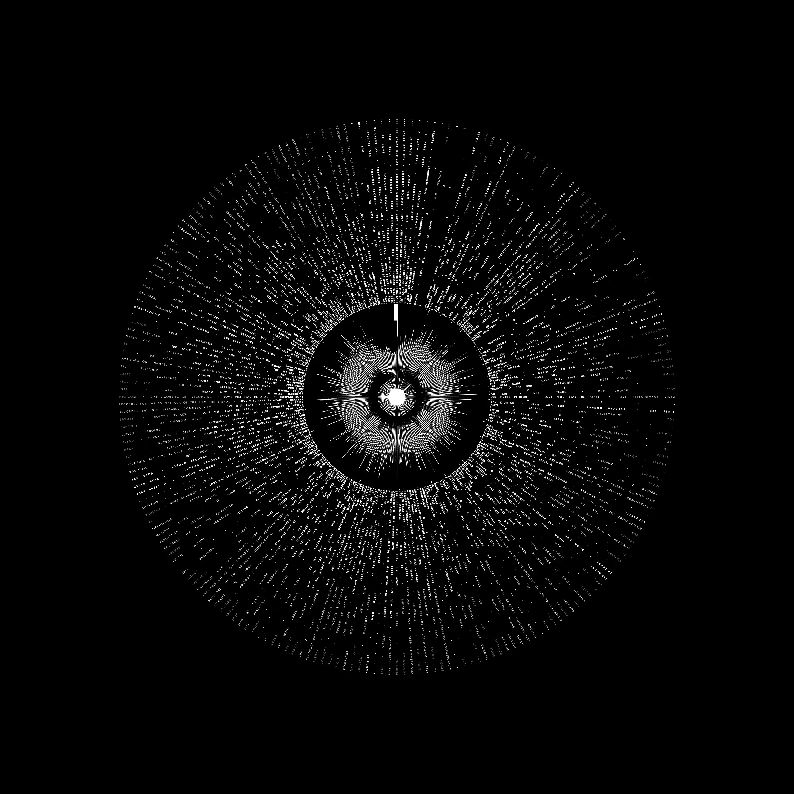
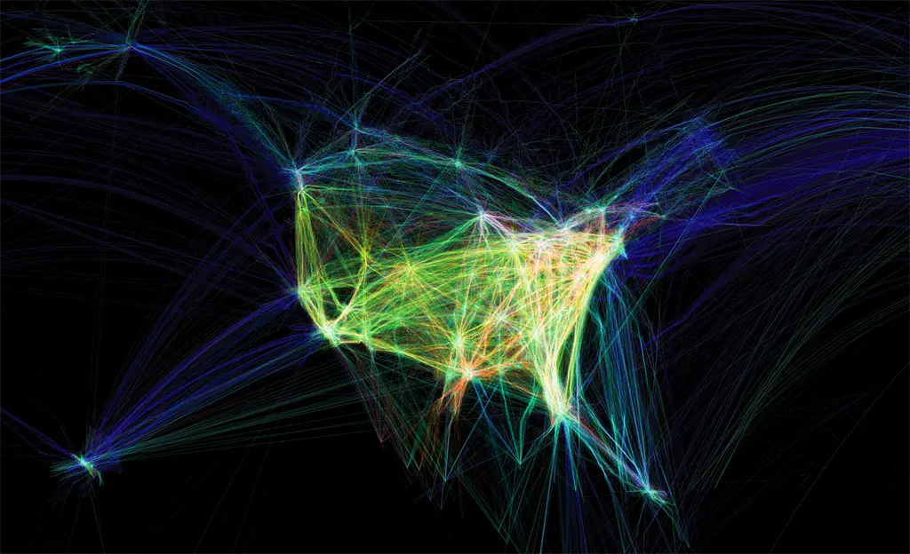
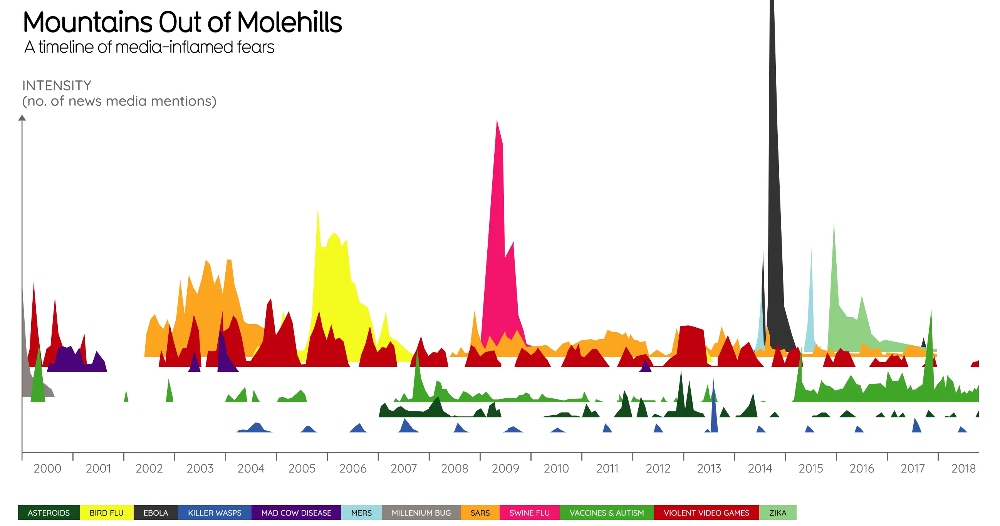
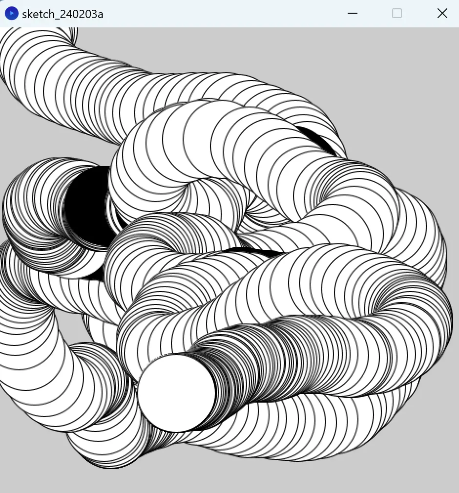
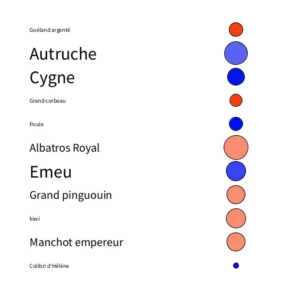
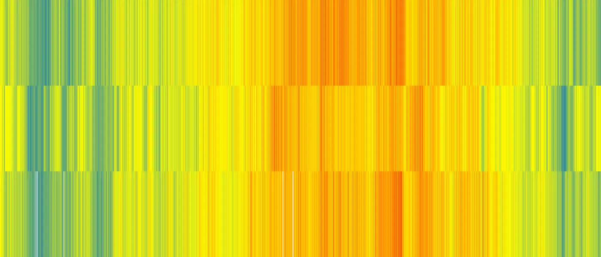
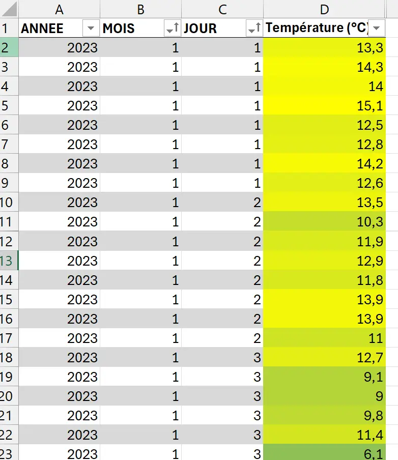
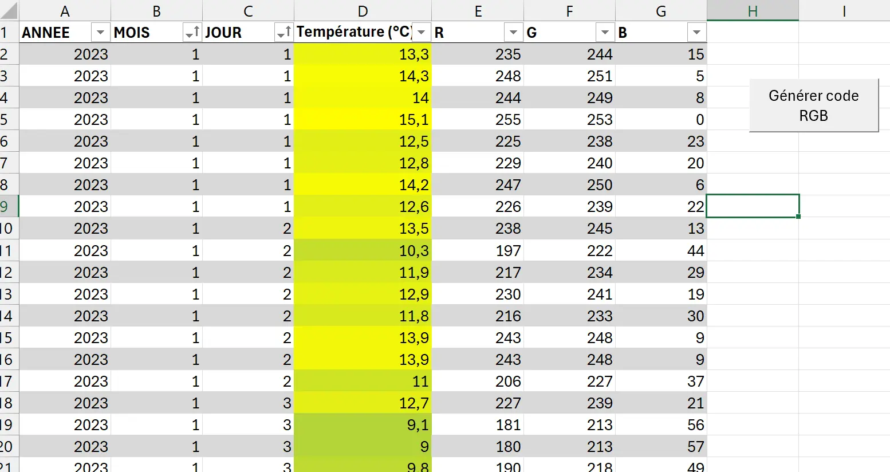

---

 
Prérequis : Avoir quelques bases en Java.
Télécharger le logiciel Processing *(gratuit)*


## Sommaire
- [Le data art : qu'est ce que c'est?](#definition)
- [Focus sur quelques exemples](#exemples)
- [Découverte du logiciel Processing](#processing)
- [Ma première oeuvre de data art?](#oeuvre)

<h2 id=idefinition> Le data art : qu'est ce que c'est? </h2>

### Une définition du concept 

> Quand d'autres peignent avec des pinceaux, moi je peins avec des données"

Voici ce qu'expliquait Kirelli Benzi, chercheur français en visualisation de données, et data artist,  lors d'[une conférence TedX](https://www.youtube.com/watch?v=OjPry9zKBRE) sur le sujet du **data art**.
Il définit ce concept comme un *"processus artistique qui repose sur l'usage d'un jeu de données pour créer de _**l'émotion**_ chez le spectateur."* Parce que le data art reste de l'art, son but est de *"transmettre un **message**: l’œuvre, basée sur des données, a une vérité plus objective derrière sa construction et ne provient pas uniquement de l’imagination de l’artiste "*. Finalement, le but final de l'histoire racontée par l'oeuvre est de développer la **cognition** du spectateur : le sens d'une oeuvre de data art n'est pas compréhensible directement sans contexte, c'est en s’interrogeant sur son sens, en lisant son explication, que le spectateur va pouvoir prendre conscience de son contenu, et de son histoire.

Donc en résumé, c’est l’idée de **visualiser des données de manière artistique**, de sorte à **donner de l’émotion** aux gens tout en faisant **comprendre** ce qu’il y a derrière ces données. Le Data Art permet de créer des œuvres captivantes tout en transmettant des informations complexes de manière esthétique.

### Data art ? Data visualisation ? Art génératif ? 

Selon Kirelli Benzi, le **data art** se trouve entre la **data visualisation**, et **l'art génératif**.

La **data visualization** ou la *dataviz* est une discipline de la data science. Cette dernière a pour objectif de collecter, de traiter et de modéliser des tendances, des motifs, des connexions et des corrélations dans de larges ensembles de données, que la *data visualization* permet d’identifier et de traduire sous la forme de *visuels compréhensibles*. Ces visuels peuvent prendre forme de cartes, de graphiques, de diagrammes ou de tableaux...Le but de la data visualisation  **est d’être le plus efficace pour échanger une information sans aucun but artistique**.

**L'art génératif**, quant à lui, c'est un mouvement artistique, qui s'est développé dans les années 80, basé sur une **création artistique grâce à l’informatique**, où c'est la machine *qui dessine*, vai des algorithmes. On peut citer l’artiste américain Mark Napier, qui a réalisé une œuvre intitulée *[Black and White](https://www.marknapier.com/portfolio/black-and-white/)*. Cette œuvre utilise le système de codage binaire pour ensuite lire la forme des textes afin de les déstructurer. La topographie changeante du code binaire permet de créer un mouvement avec des lignes noires et blanches qui deviennent visibles à l’écran.


https://www.forbes.com/sites/kalevleetaru/2019/02/24/why-data-visualization-is-equal-parts-data-art-and-data-science/?sh=6e1fea8c6dec
https://www.kirellbenzi.com/blog/data-art-definition
https://fr.linkedin.com/pulse/%C3%A0-la-d%C3%A9couverte-du-data-art-juliette-demain-?trk=articles_directory
https://www.data-bird.co/data-visualisation *(la data visualisation)*
https://www.unitec.fr/lart-generatif-algorithmes-au-service-de-la-creation/ *(pour l'art génératif)*


#### Mais d'où ca vient réellement ?

Depuis que Descartes a commencé à mesurer l'espace au XVIIe siècle, les représentations graphiques des fonctions sont devenues un *outil primordial des mathématiques*.

Mais récemment, avec la puissance des ordinateurs qui ne cesse de croître, nous sommes entrés dans une nouvelle ère : celle du **Big Data**. Il s'agit de quantités énormes de données, *qui concernent en grande partie **nos données personnelles***, collectées automatiquement par des machines.

Les **laboratoires IBM** ont établi le constat suivant :

> Nous créons chaque jour 2,5 trillions d’octets de données. Si vite que 90 % des données mondiales existantes ont été créés dans les deux dernières années seulement.


https://comarketing-news.fr/big-data-90-donnees-existantes-ont-ete-creees-deux-dernieres-annees/
https://www.ibm.com/fr-fr/analytics/big-data-analytics


<h2 id=exemples> Présentation de quelques oeuvres de Data Art </h2>

### Love Will Tear Us Apart Again - Peter Crnokrak - 2007 



[Source](https://www.petercrnokrak.com/love-will-tear-us-apart-again/)

Cette oeuvre représente toutes les reprises connues de la chanson de Joy Division. Le graphique montre les 168 reprises ultérieures à la sortie de l'album dans le sens chronologique des aiguilles d'une montre. Au centre, on peut voir un anneau extérieur et un anneau intérieur. Ce sont des comparaisons des formes d'ondes : pour le premier, de 3 versions studio enregistrées par le groupe original, et pour le second des 2 remix postmortem de 1995.
*On peut souligner cette façon de représenter ces données met en evidence la variation propre de la structure de la chanson, qui est identique d'un enregistrement à un autre, et montre ainsi l'émotion et le son que voulaient transmettre le groupe lors de l'enregistrement de la chanson.*

### Flight patterns - Aaron Koblin - 2005



[Source](https://www.aaronkoblin.com/work/flightpatterns/)

Dans cette oeuvre, l'artiste propose de visualiser, le trafic aérien américain, pour mieux rendre compte des mobilités des individus au XXIème siècle.

### Mountains out of Molehills - David McCandless - 2007



[Source](https://informationisbeautiful.net/visualizations/mountains-out-of-molehills/)

David McCandless explique dans [ce TEDx Talks](https://www.youtube.com/watch?v=5Zg-C8AAIGg) très intéressant le data art, et se penche plus particulièrement sur cette oeuvre.
C'est une chronologie des plus grandes peurs du monde, telles qu'elles sont attisées par les médias *(où l'ordonnée représente l'intensité de la couverture médiatique (nombre de mentions))*

Il y explique d'ailleurs des constats très intéressant : 
Si on regarde la "montagne" des peurs des jeux vidéos violents, on observe 2 pics:

- novembre : sortie des jeux vidéos de Noël, on observe alors une peur chez les parents de la violence de certains jeux
- avril : avril 1999, fusillade de Colombine, qui est commémorée par les médias, et attisent cette peur des jeux vidéos violents.


Si certains sont intéressés d'ailleurs, [ce site](https://weartdata.fr/boutique/page/3/?orderby=popularity) vend des oeuvres de data art, en offrant même la possibilité aux consommateurs de créer leur oeuvre de Data Art sur-mesure. 


<h2 id=processing> Découverte du logiciel Processing </h2>

### Qu'est ce que Processing ? 

**Processing** est un **langage de programmation** et un **environnement de développement intégré**(IDE), **gratuit** et **open source**, mis au point par 2 artistes (Casey Reas et Benjamin Fry). Processing est principalement utilisé par les artistes, les designers, les chercheurs et les éducateurs. Il permet de créer des **œuvres artistiques numériques visuelles et interactives**

Processing est basé sur **Java**, et proche du **langage C**, mais avec une syntaxe simplifiée (*réclame moins d'efforts que Java pour effectuer des tâches simples telles que la modification d'une animation à intervalle régulier (qui permet des créations animées)*) et une bibliothèque graphique très large et accessible facilement.

Processing a avant tout une vocation pédagogique : il a été conçu dès son origine pour servir à enseigner les bases de la programmation informatique dans un contexte visuel.
C'est donc un excellent outil **d'apprentissage de la programmation** pour les non-programmeurs ou débutants. 

De nombreux enseignants l'utilisent pour initier leurs élèves et leurs étudiants aux concepts et aux bonnes pratiques de la programmation *(ex: [ce cours de processing donné à des lycéens STI2D](http://sti.ac-orleans-tours.fr/spip2/IMG/pdf/10_Processing_Initiation_Ver1_ABr.pdf))*

 

- Processing est souvent utilisé avec Arduino pour créer des projets impliquant des interactions physiques avec des capteurs, des moteurs et d'autres dispositifs matériels.
- Ses fonctionnalités sont limitées aux besoins des créateurs d'images 2D et 3D générées par programmation mais peuvent être étendues, avec des modules externes, à d'autres fonctionnalités plus poussées *(ex: comme la capture d'un flux vidéo, à la génération et à la manipulation de son, à l'interfaçage des ports d'entrées-sorties, etc)*
- On peut désormais utiliser plusieurs langages avec l'environnement Processing : Javascript, avec Processing.js, et p5.js2, exécutables dans un environnement HTML 5 ou via node.js., REPL, Python ou encore R. 
 

[Lien pour télécharger le logiciel](https://processing.org/download)

 
- [*Processing, Flossmanuals*](https://www.flossmanualsfr.net/media/files/processing/processing.web.pdf) : très bon ouvrage qui montre même des exemples d'oeuvres créées avec Processing, assez impressionantes.
 

### Pourquoi ce choix ?

En cherchant quel outil utiliser pour faire du data art, je suis tombée sur [cette vidéo](https://www.youtube.com/watch?v=x3KJf4EpnXo) du grand Kirell Benzi qui présentait les _**outils les plus populaires pour faire du data art**_. Je me suis dit que c'était une source fiable. Parmi tous les outils qu'il proposait, certains étaient payants, d'autres étaient vraiment tournés vers la *visualisation scientifique* des données (ex: JupyterLab). Puis il a parlé de l'un des *"logiciels les plus répandus dans le monde pour faire du data art"* : un logiciel créé par des artistes, facile à prendre en main, et se basant sur du Java (tient, tient, pile le sujet de mon [POK 2](../../pok/temps-2/index.md))
Le choix du logiciel à utiliser m'a alors paru évident. 

### Prise en main du logiciel 

#### Les bases 

Si j'ai retenu une chose c'est que les méthodes **setup()** et **draw()** sont les 2 plus importantes dans Processing:
- **setup()**, est exécutée une seule fois au lancement du programme (*elle permet notamment de définir les dimensions de la fenêtre de visualisation de dessin*) 
- **draw()** est lancée à intervalle régulier (*par défaut 60 fois par seconde*)

Voici un exemple présenté par Processing lors du lancement de l'application, qui permet de voir ce que l'on peut réaliser facilement :



```java
void setup() {
  size(480, 480);
}

void draw() {
  if (mousePressed) {
    fill(0);
  } else {
    fill(255);
  }
  ellipse(mouseX, mouseY, 80, 80);
}
```

[Source](https://processing.org/tutorials/)

#### Quelques tutos pour bien commencer

Pour aller un peu plus loin, j'ai voulu commencer mon apprentissage par suivre quelques tutos. Parmi ceux que j'ai trouvés, je conseille vivement ceux-ci : 
- [Cette vidéo de Mr Park](https://www.youtube.com/watch?v=pJthD0t6k1U) : très très bien expliquée pas à pas. L'application dont je parlerai juste en dessous se base sur ses explications.
- [Ce tutoriel écrit par un designer graphique](https://geojournalism.org/2013/08/portugues-as-cidades-mais-populosas-do-mundo/) : pour ceux qui préfèrent lire plutôt que visionner, ce tuto reprend les mêmes points que la vidéo précédente. 
- [Cette vidéo d'une "artiste numérique"](https://www.youtube.com/watch?v=Aqwpxl5LUFI): permet d'aborder d'autres aspects plus poussés que la 1ère vidéo. Mais elle va très vite. *A regarder plutôt en complément que en première approche.*

##### Cas d'application

Dans sa vidéo Youtube, John park explique comment visualiser des données importées depuis Excel, sur Processing. Avec un cas d'application, il explique ses paroles. Sa BDD représentait des noms de personnes qu'il associait avec différentes caractéristiques, dont leur âge. Il essayait de représenter ensuite de manière plus parlante cette donnée au travers de cercles de tailles proportionnelles à la donnée. 

De mon côté, j'ai construit une BDD qui répertoriait 11 espèces d'oiseaux, la taille de l'oiseau, la taille de leurs oeufs, et la fréquence de ponte. *(informations trouvées principalement [ici](https://www.mnhn.fr/fr/actualites/tout-savoir-sur-les-oeufs) [là](https://www.oiseaux.net/oiseaux/goeland.argente.html) et [un petit peu là](https://fr.wikipedia.org/wiki/Wikip%C3%A9dia:Accueil_principal))*.

Voici ce que représente l'application de son exercice à ma base de données :



- La taille de la police d'écriture de l'espèce d'oiseau est proportionnelle à la taille de l'oiseau : *plus l'oiseau est grand, plus la police est épaisse*.
- La taille de l'ellipse est proportionnelle, quant à elle, a la taille de l'oeuf pondu par l'oiseau. 
- La couleur et la transparence de l'ellipse dépend de la fréquence de ponte de l'oiseau. *pour une fréquence de ponte inférieure ou égale à 1 portée /an, l'ellipse est coloriée en rouge, sinon, elle est coloriée en bleu, et l'opacité de l'ellipse dépend du nombre d'oeufs pondus sur l'année*.



- il n'existe aucune corrélation entre la taille de l'oiseau et la taille de son oeuf. *Ce constat est particulièrement vrai pour le kiwi.*
- La poule et le cygne pondent beaucoup, alors que d'autres espèces comme le grand pingouin, le kiwi ou le goéland, pondent peu. *Ce constat m'a beaucoup intrigué: sur [ce site](https://mffp.gouv.qc.ca/jeunesse/oeufs-taille-ponte-oiseaux/) du gouvernement du Québec, on peut lire plusieurs facteurs qui déterminent ces chiffres : comme la répartition géographique, la disponibilité de la nourriture, ou encore la prédation par exemple.*   
 

---


```java
Table table;

void setup(){
  //on définie les parametres d'affichage de la fenetre de dessin
  size (500,500);
  //on charge le fichier csv
  table = loadTable("fiche_oiseaux.csv", "header");
  textAlign(LEFT, CENTER);
}

void draw (){
  background(255); //blanc
  fill(0);//noir
  for(int i=0; i< table.getRowCount(); i++){
    //couleur de police noire
    fill(0);
    //1 correspond à la colonne contenant la taille de l'oiseau (en cm)
    if (table.getFloat(i,1)<80){
      textSize(10);  
    }else if (table.getFloat(i,1)<140){
      textSize(20);
    }else{
      textSize(30);
    }
    //0 correspond au nom de l'espèce d'oiseau
    text(table.getString(i,0), 50, 50+i*40);
    //2 correspond à la fréquence de ponte de l'oiseau (se calcule par rapport au nombre d'oeufs pondus sur 1 an)
    if (table.getFloat(i,5)<0.020){
      fill (243,62,14,table.getFloat(i,5)*50000);
     }
    else {
      fill (0,14,234,table.getFloat(i,5)*500);
    }
    //2 correspond à la colonne contenant la taille de l'oeuf de l'oiseau (en cm)
    ellipse(400, 50+ i*40, sqrt(table.getFloat(i,2))*9, sqrt(table.getFloat(i,2))*9);
  }
  save("birds.webp");
}
```


<h2 id=oeuvre> Ma première oeuvre de data art? </h2>

Après tout cet apprentissage, il était temps pour moi de mettre à profit tout ce que j'avais vu pour créer ma première oeuvre.

Je vous présente donc le premier chef d'oeuvre de Sarah Sebastien, intitulé 
**"Une année toute en couleur"**




Cette oeuvre représente l'évolution de la température sur l'année 2023 dans les villes respectives de Marseille, Lille et Toulouse. 
*Pour faire concorder les couleurs, j'ai pris comme référentiels d'extremas le maximum de température observé à Toulouse (43°) et le minimum observé à Lille (-5°).*


### Démarche 
#### Etape 1: Recherche du sujet

L'inspiration m'est venue en cherchant des bdd qui pourraient être intéressantes à exploiter. Je suis tombée sur [ce site](https://public.opendatasoft.com/explore/dataset/donnees-synop-essentielles-omm/export/?flg=fr-fr), qui recensait un tas d'informations météorologiques sur un large panel de villes de France et un large panel de périodes. 

Je me suis dit qu'il y avait alors quelque chose à faire sur la représentation de l'évolution de la température sur une année qui n'était pas trop compliqué. 

**SPOILER ALERT:** Cela s'est avéré un tout petit plus compliqué que prévu...

#### Etape 2 : Exploitation des données

Une fois les données recueillies, il a fallu les exploiter:

- J'ai d'abord trié les données pour les classer par ordre chronologique.
- Ensuite, je savais que je voulais un dégradé de couleurs qui serait proportionnel au degré de température. Pour ça, j'ai utilisé une *"mise en forme conditionnelle"*, avec un dégradé à 3 couleurs (bleu - pour les températures les plus froides - jaune, et rouge - pour les températures les plus chaudes) en indiquant le min et le max selon les valeurs déterminées plus haut. 



Pour renseigner une couleur de remplissage dans *Processing*, il faut utiliser la méthode *fill* qui prend en argument le code RGB d'une couleur. Il me fallait donc récupérer ce code pour chaque couleur générée par la mise en forme conditionnelle. Seule solution (trouvée) : *utiliser une macro.*


```
Sub getColor()
    Dim NoLigDebut As Integer
    NoLigDebut = 2
    Dim NoLigFin As Integer
    NoLigFin = Range("A" & Rows.Count).End(xlUp).Row

    Dim i As Integer
    Dim couleur As Long
    Dim R As Long, G As Long, B As Long

    For i = NoLigDebut To NoLigFin
        couleur = Cells(i, 4).DisplayFormat.Interior.Color
        
        R = Int(couleur Mod 256)
        G = Int((couleur Mod 65536) / 256)
        B = Int(couleur / 65536)
        
        Cells(i, 5).Value = R
        Cells(i, 6).Value = G
        Cells(i, 7).Value = B
        
    Next
End Sub
```


- On vient récupérer le code couleur de la cellule avec la méthode **DisplayFormat** *(cela a d'ailleurs été le point bloquant dans la création de la macro : comme la couleur de la cellule a été générée avec une mfc, et pas remplie à la main, la méthode traditionnelle seule du **Interior.Color** ne fonctionnait pas ici. Et ça j'ai mis du temps à le comprendre...)*
- Puis on vient utiliser ce code couleur que l'on divise selon les formules expliquées [ici](https://excel-downloads.com/threads/resolu-obtenir-code-couleur-rgb-ou-hexadecimal.20022616/) pour obtenir le **code RGB** de la couleur de la ligne. 
- On inscrit ces 3 composantes dans **3 colonnes distinctes** et le tour est joué.



### Etape 3 : Mise en forme des données 

Le fichier CSV enregistré ne consiste alors plus qu'en 365 lignes, correspondant aux jours de l'année, et 3 colonnes,correspondant au composantes RGB de la température du jour en question.

Le codage de la mise en forme sur processing devenait alors très simple : 

- on créer une fenêtre de la taille des 3 bandes
- on initialise les tables
- on parcourt les tables une par une, et on définit la couleur de remplissage en fonction des composantes RGB de chaque ligne
- on dessine des rectangles sur toute la longueur de la bande


```java
Table table1;
Table table2;
Table table3;

void setup(){
  size (1400,600);
  table1 = loadTable("liste_temp_marseille.csv", "header");
  table2 = loadTable("liste_temp_lille.csv", "header");
  table3 = loadTable("liste_temp_toulouse.csv", "header");
}

void draw() {
  // pas de contour aux rectangles
  noStroke();
  for(int i=0; i< table1.getRowCount(); i++){
    fill(table1.getInt(i,0),table1.getInt(i,1),table1.getInt(i,2));
    rect(i/2,0,0.5,200);
  }
  for(int i=0; i< table2.getRowCount(); i++){
    fill(table2.getInt(i,0),table2.getInt(i,1),table2.getInt(i,2));
    rect(i/2,200,0.5,400);
  }
  for(int i=0; i< table2.getRowCount(); i++){
    fill(table3.getInt(i,0),table3.getInt(i,1),table3.getInt(i,2));
    rect(i/2,400,0.5,600);
  }
  save("une_annee_toute_en_couleurs.webp");
}
```


## Conclusion et retour d'expérience 

Finalement, je trouve ça assez incroyable ce qu'on peut produire avec quelques lignes de codes. Et seulement quelques fonctions basiques et quelques structures de contrôle simples. J'avais dédié mon POK 2 sur l'apprentissage du Java en grande partie pour réaliser ce MON. Mais finalement, les créateurs de Processing ne mentent pas quand ils disent que le logiciel est un très bon outil pour les débutants. Finalement, il n'y a pas forcément besoin de savoir dessiner pour faire de l'art ! 

> **Horodateur** : 
> Vendredi 26/01 : 30 mins (Recherche de ressources et définition d'un plan)
> Samedi 27/01 : 1h (Definition des termes, visionnages de TedTalks, recherches d'oeuvres)
> Dimanche 28/01 : 1h45 (Installation de Processing, prise en main, et visionnage de tutoriels sur le logiciels)
> Jeudi 15/02 : 3h30 (Visionnage de tutos plus poussés énoncés plus haut, et création d'une BDD sur les oiseaux pour réaliser un des tutos)
> Vendredi 16/012 : 2h (Création des fichiers CSV pour la dernière partie de mon MON)
> Samedi 17/02 : 1h15 (Réalisation du code sur Processing et tests)
