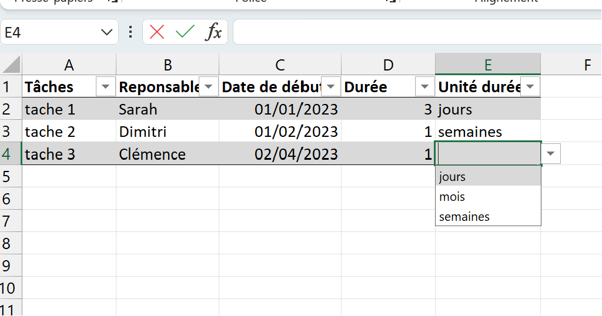
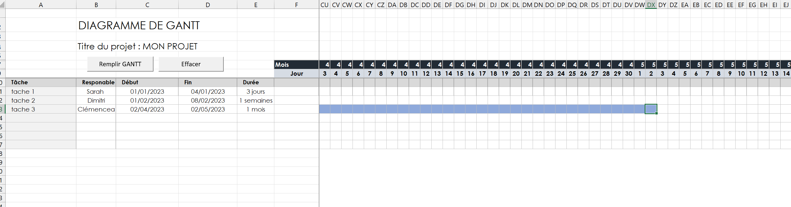
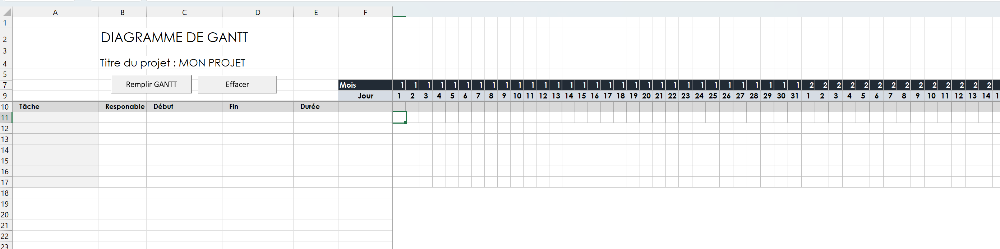

## Objectif de ce POK
L'objectif de ce POK est de créer un GANTT automatisé. Cette tâche est déjà réalisable sans utiliser VBA mais je trouvais intéressant d'en apprendre plus sur ce langage en automatisant le diagramme avec une macro.

## Présentation de l'outil

L'utilisateur viendrait rentrer dans une feuille des données :
- nom du projet 
- nom de la tâche 
- type de tâche (tâche ou sous tâche)
- le responsable
- la date de début de la tâche
- la durée de la tache

Il viendrait ensuite choisir le projet pour lequel il aimerait visualiser le GANTT et cliquerait simplement sur un bouton pour afficher le GANTT du projet sélectionné.

## Fonctionnalités souhaitées
L'outil aura 2 onglets (1 pour remplir les données et l'autre pour visualiser le GANTT)
- onglet "données" avec un tableau contenant les informations sur les projets citées plus haut et un bouton "mettre à jour les données"
- onglet "GANTT" :
  -  tableau GANTT sur lequel sont affichés tous les jours de l'année
  - des colonnes "tâche", "responsable", "date de début", "date de fin", "durée", "avancement"
  - les cases du GANTT seront coloriées de couleurs différentes en fonction du responsable
  - un affichage lisible de la date 
  - l'affichage du début du tableau au premier jour de la première tâche
  - une case "Nom de projet:" avec un menu déroulant grâce auquel l'utilisateur peut choisir le projet dont il veut visualiser le gantt

## Point d'avancement au 1er sprint : Première version de la macro

### Onglet "Données"

On peut voir qu'il manque la notion de "nom projet" et de type de "tâche".
*J'ai de plus remarquer qu'il fallait un bouton pour remettre à zéro le tableau de données (comme la macro va jusqu'à la dernière ligne remplie, "effacer le contenu" l'empêche de fonctionner si des lignes du tableau sont vides)*

### Onglet Gantt 

#### **Après appui sur "Remplir GANTT"**

Le remplissage du GANTT fonctionne mais manque encore de lisibilité au niveau des dates. 
La macro ne lit pas les cases fusionnées, il faut donc qu'elles aient toutes du contenu pour pouvoir venir effectuer des tests dessus.

#### **Après appui sur "Effacer"**

### Les objectifs révisés pour le sprint 2

Voici donc ma liste de fonctionnalités revisitées (en barré les fonctionnalités abandonnées et en italique les nouvelles fonctionnalités souhaitées)
- [x] onglet "données" :
  - [x] un tableau contenant les informations sur les projets citées plus haut 
  - [ ] *ajout au tableau des informations manquantes*
  - [ ] bouton "mettre à jour les données"
  - [ ] *bouton "effacer le contenu"*
- onglet "GANTT" :
  - [x] un tableau GANTT sur lequel sont affichés tous les jours de l'année
  - [-] des colonnes "tâche", "responsable", "date de début", "date de fin", "durée", "avancement"
  - [ ] ~~les cases du GANTT seront coloriées de couleurs différentes en fonction du responsable~~
  - [ ] *les cases du GANTT seront coloriées en fonction de leur typologie (tâche ou sous-tâche)*
  - [ ] un affichage lisible de la date 
  - [x] l'affichage du début du tableau au premier jour de la première tâche
  - [ ] une case "Nom de projet:" avec un menu déroulant grâce auquel l'utilisateur peut choisir le projet dont il veut visualiser le gantt