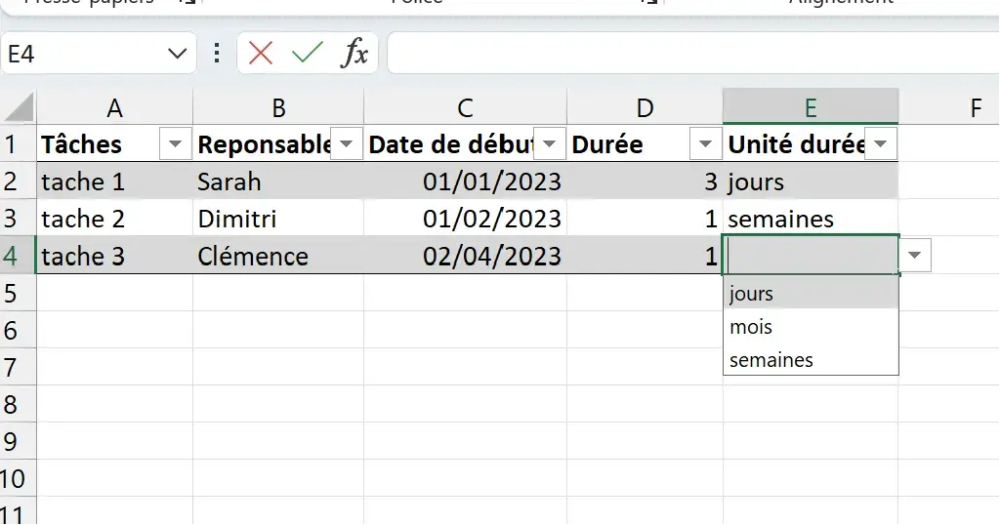
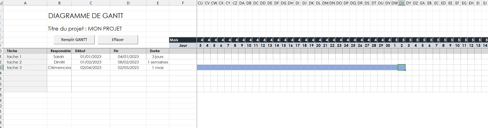
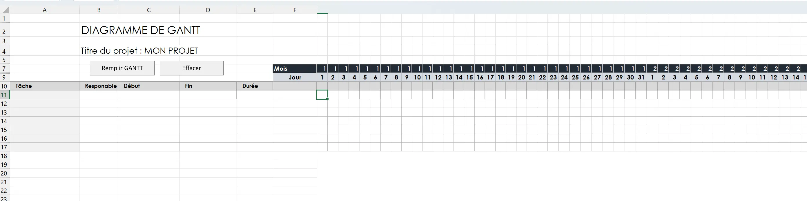
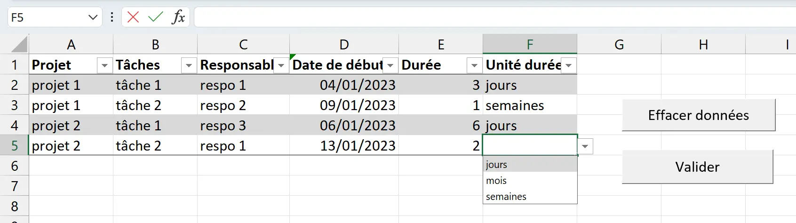
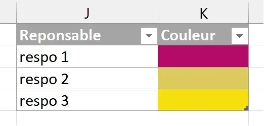
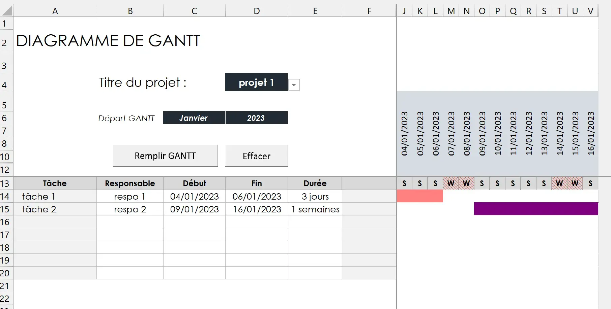

---

 
Prérequis : Avoir quelques bases en VBA 
*Pour ceux qui veulent débuter en VBA, je conseille de suivre [ce guide](https://www.excel-pratique.com/fr/vba)*  


Télécharger le [fichier Excel](POKfinal_GANTT_sous_VBA.zip)

## Objectif de ce POK
L'objectif de ce POK est de créer un GANTT automatisé. Cette tâche est déjà réalisable sans utiliser VBA mais je trouvais intéressant d'en apprendre plus sur ce langage en automatisant le diagramme avec une macro.

## Sommaire 

- [Présentation de l'outil](#presentation)
- [Résultat du Sprint 1](#sprint1)
- [L'outil final](#final)
- [Analyse des écarts et réflexion](#ecarts)

<h2 id="presentation"> Présentation de l'outil </h2>

L'utilisateur viendra rentrer dans une feuille de données :

- nom du projet 
- nom de la tâche 
- type de tâche (tâche ou sous tâche)
- le responsable
- la date de début de la tâche
- la durée de la tache

Il viendra ensuite choisir le projet pour lequel il aimerait visualiser le GANTT et cliquera simplement sur un bouton pour afficher le GANTT du projet sélectionné.

### Fonctionnalités souhaitées
L'outil aura 2 onglets (1 pour remplir les données et l'autre pour visualiser le GANTT)

- onglet "données" avec un tableau contenant les informations sur les projets citées plus haut et un bouton "mettre à jour les données"
- onglet "GANTT" :
  -  tableau GANTT sur lequel sont affichés tous les jours de l'année
  - des colonnes "tâche", "responsable", "date de début", "date de fin", "durée"
  - les cases du GANTT seront coloriées de couleurs différentes en fonction du responsable
  - un affichage lisible de la date 
  - l'affichage du début du tableau au premier jour de la première tâche et la fin du tableau à la fin de la dernière tâche
  - une case "Nom de projet:" avec un menu déroulant grâce auquel l'utilisateur peut choisir le projet dont il veut visualiser le gantt

<h2 id="sprint1"> Point d'avancement au 1er sprint : Première version de la macro </h2>

### Onglet "Données"



On peut voir qu'il manque la notion de "nom projet" et de type de "tâche".
*J'ai de plus remarquer qu'il fallait un bouton pour remettre à zéro le tableau de données (comme la macro va jusqu'à la dernière ligne remplie, "effacer le contenu" l'empêche de fonctionner si des lignes du tableau sont vides)*

### Onglet Gantt 

#### **Après appui sur "Remplir GANTT"**



Le remplissage du GANTT fonctionne mais manque encore de lisibilité au niveau des dates. 
La macro ne lit pas les cases fusionnées, il faut donc qu'elles aient toutes du contenu pour pouvoir venir effectuer des tests dessus.

#### **Après appui sur "Effacer"**



### Les objectifs révisés pour le sprint 2

Voici donc ma liste de fonctionnalités revisitées (en italique les nouvelles fonctionnalités souhaitées)
- onglet "données" :
  - [x] un tableau contenant les informations sur les projets citées plus haut 
  - [ ] *ajout au tableau des informations manquantes*
  - [ ] bouton "mettre à jour les données"
  - [ ] *bouton "effacer le contenu"*
- onglet "GANTT" :
  - [x] un tableau GANTT sur lequel sont affichés tous les jours de l'année
  - [x] des colonnes "tâche", "responsable", "date de début", "date de fin", "durée"
  - [ ] les cases du GANTT seront coloriées de couleurs différentes en fonction du responsable
  - [ ] un affichage lisible de la date 
  - [ ] l'affichage du début du tableau au premier jour de la première tâche et la fin du tableau à la fin de la dernière tâche
  - [ ] une case "Nom de projet:" avec un menu déroulant grâce auquel l'utilisateur peut choisir le projet dont il veut visualiser le gantt

---

<h2 id="final"> Présentation de l'outil final</h2>

### La gestion des données

Dans cette première partie, l'utilisateur vient renseigner les données du ou des projets qu'il a planifiés. 

> Vue de la feuille "Données" avec un bouton [Valider](#valider) et un bouton [effacer les données](#effacer-les-données)

<h4 id="valider"> Valider </h4>

Lorsqu'il a rempli son tableau, il clique alors sur ***Valider***. La procédure suivante s'exécute:

```
Sub Valider()

  Call recuperer_noms_projets
  Call recuperer_nom_respo

End Sub
```

Elle s'effectue en deux temmps:
Elle vient d'abord récupérer les noms des projets et les ajoute dans un tableau à part, dans une autre feuille appelée "BackData", en supprimant les doublons.


```
'On se place sur la feuille "Données"
Sheets("Données").Select
'Fixe le N° de première ligne de la plage à lire
Dim NoLigDeb As Integer
NoLigDeb = 2
'Fixe le N° de la dernière ligne de la plage à lire
Dim NoLigFin As Integer
NoLigFin = Range("A" & Rows.Count).End(xlUp).row
   
'On définit une variable pour le nom du projet
Dim nom_projet As String
    
'On définit un compteur
Dim rowIdx As Integer
For rowIdx = NoLigDeb To NoLigFin
        
    'On affecte à nom_projet la valeur de la première ligne renseignée
    nom_projet = Cells(rowIdx, 1).Value
        
    'On se place sur la feuille Back Data, que l'on rend visible
    Sheets("BackData").Visible = True
    Sheets("BackData").Select
        
    'On crée une variable tableau qu'on affecte au tableau nommé "tableau_nom_projets"
    Dim tableau As ListObject
    Set tableau = ActiveSheet.ListObjects("Tableau_nom_projets")
    'On créé la variable J qui compte le nombre de lignes de ce tableau
    J = tableau.ListRows.Count + 1
        
    'Nouveau compteur
    Dim i As Integer
    i = 2
     
    'On parcourt les lignes du tableau pour voir si le nom du projet n'apparait pas déjà
    Do While i <> J + 1
        If Cells(i, 1).Value = nom_projet Then
            Exit Do
        End If
        i = i + 1
    Loop
            
    'S'il n'est pas apparu et qu'on se trouve à la fin du tableau
    If i = J + 1 Then
        'On ajoute une ligne...
        tableau.ListRows.Add
        '...Et on ajoute le nom du projet au tableau
        J = tableau.ListRows.Count
        tableau.DataBodyRange(J, 1).Value = nom_projet
    End If
        
    'On cache "BackData", on se replace sur la feuille "Données et on réitère
    Sheets("BackData").Visible = False
    Sheets("Données").Select
    Next
    
End Sub
```


Puis elle vient récupérer le noms des responsables, cités dans les projets, dans un tableau à part en supprimant les doublons. *Le principe de la procédure est le même que pour celle qui récupère le nom des projets.*



> Tableau : Nom_respo


```

'Fixe le N° de première ligne de la plage à lire
Dim NoLigDeb As Integer
NoLigDeb = 2
'Fixe le N° de la dernière ligne du tableau des tâches
Dim NoLigFin As Integer
NoLigFin = Range("Tableau_taches").Rows.Count + 1
    
Dim nom_respo As String
    
Dim rowIdx As Integer
For rowIdx = NoLigDeb To NoLigFin
        
    nom_respo = Cells(rowIdx, 3).Value
        
    Dim tableau As ListObject
    Set tableau = ActiveSheet.ListObjects("Nom_respo")
    J = tableau.ListRows.Count + 1
        
    Dim i As Integer
    i = 2
        
    Do While i <> J + 1
        If tableau.DataBodyRange(i - 1, 1).Value = nom_respo Then
            Exit Do
        End If
        i = i + 1
    Loop
            
    If i = J + 1 Then
        tableau.ListRows.Add
        J = tableau.ListRows.Count
        tableau.DataBodyRange(J, 1).Value = nom_respo
        tableau.DataBodyRange(J, 2).Interior.Color = RGB(Int(256 * Rnd), Int(256 * Rnd), Int(256 * Rnd))
    End If
        
Next

End Sub
```



*Lors de cette procédure, une autre sous-procédure est appelée qui permet de ***générer une couleur aléatoirement*** pour chaque responsable, qui sera ensuite utilisée pour colorier les cases du Gantt.*


```

'Fixe le N° de la première ligne de la plage à lire
Dim NoLigDeb As Integer
NoLigDeb = 2
'Fixe le N° de la dernière ligne de la plage à lire
Dim NoLigFin As Integer
NoLigFin = Range("L" & Rows.Count).End(xlUp).row

Dim i As Integer

For i = NoLigDeb To NoLigFin
    Cells(i, 12).Interior.Color = RGB(Int(256 * Rnd), Int(256 * Rnd), Int(256 * Rnd))
Next i

End Sub
```


<h4 id="effacer-les-données"> Effacer les données </h4>

un clique sur le bouton permet d'appeler directement la procédure suivante qui efface les données des 3 tableaux mentionnés plus haut.


```
Sheets("Données").Select

'effacer la liste des taches
    Range("A2:F2").Select
    Range(Selection, Selection.End(xlDown)).Select
    Do While IsEmpty(Cells(2, 1)) = False
        Selection.ListObject.ListRows(1).Delete
    Loop
    
'effacer la liste des responsables
    Range("Nom_respo").Select
    Do While IsEmpty(Cells(2, 10)) = False
        Selection.ListObject.ListRows(1).Delete
    Loop

'On rend visible le feuille BackData pour pouvoir la sélectionner
Sheets("BackData").Visible = True
Sheets("BackData").Select

'effacer la liste des noms de projets
    Range("Tableau_nom_projets[[Nom projet ]]").Select
    Do While IsEmpty(Cells(2, 1)) = False
        Selection.ListObject.ListRows(1).Delete
    Loop

'On revient sur la page des données et on cache BackData
Sheets("BackData").Visible = False
Sheets("Données").Select

End Sub
```


### Affichage du GANTT


> Visuel du tableau de Gantt avec les options de [choix du projet et de la date d'affichage](#choix-titre-date), les boutons qui permettent [l'affichage du Gantt](#affichage-gantt) et [d'effacer le contenu du tableau](#effacer-gantt)

<h4 id="choix-titre-date"> Choix du projet et de la date </h4>

L'utilisateur peut venir choisir le projet dont il veut afficher le gantt à l'aide du menu déroulant de la cellule D4, qui contient le nom de tous les projets renseignés plus tôt.
Il peut également paramétrer les caractéristiques du Gantt en choisissant la date de début d'affichage. 

Pour réaliser ces actions j'ai programmé ici directement sur la feuille (*"Worksheet"*) qui contient le tableau plutôt que sur des *modules*. Car ici, on va venir effectuer une procédure à chaque fois qu'il y a un changement sur la feuille, c'est à dire, une action de l'utilisateur.


*Prend en entrée les données de la cellule modifiée par l'utilisateur*

```    
    'Si la cellule modifiée est celle qui contient le titre du projet ou celle qui gère la date de début d'affichage du gantt...
    If Target.Column = 4 And Target.row = 4 Or Target.row = 6 Then
        '...Alors on appelle la procédure de remplissage du Gantt
        Call Remplissage_gantt
    End If

End Sub
```    


---


*Il faut noter que le gantt ne s'affiche que sur 1 an*
Par ailleurs, pour le changement des dates pour l'affichage du GANTT, cela s'effectue grâce à des formules excel qui viennent générer une liste de date sur une année en fonction des données rentrées par l'utilisateur. La procédure "Remplissage du Gantt" permet de gérer la partie relative aux cases coloriées dans le gantt qui vont changer si on change la date de départ.



<h4 id="affichage-gantt"> Affichage du Gantt </h4>

*Procédure qui s'execute lorsque l'utilisateur appuie sur le bouton _Remplir le Gantt_ ou vient changer le titre du projet ou la date du départ du tableau.*


```    
'On efface d'abord le contenu du tableau
Call effacer_gantt

'On se place sur la feuille de données
Sheets("Données").Select

    'Fixe le N° de première ligne de la plage à lire
    Dim NoLigDeb As Integer
    NoLigDeb = 2
    'Fixe le N° de la dernière ligne de la plage à lire
    Dim NoLigFin As Integer
    NoLigFin = Range("A" & Rows.Count).End(xlUp).row
    
    'On définit la liste des variables locales que l'on va utiliser
    Dim nom_projet As String
    Dim etape As String
    Dim tache As String
    Dim date_debut As Date
    Dim date_fin As Date
    Dim duree As Integer
    Dim unit_duree As String
    Dim responsable As String
    Dim couleur As Variant
    
    'On initialise les dimensions du Gantt sur la feuille
    Dim DepartGanttRow As Integer
    DepartGanttRow = 14
    Dim DepartGanttColumn As Integer
    DepartGanttColumn = 1
    
    Dim FinGanttColumn As Integer
    FinGanttColumn = fGantt.Cells(1, 1).End(xlToRight).Column - DepartGanttColumn
    
    Dim DepartGanttColumn_color As Integer
    DepartGanttColumn_color = 7
    Dim DateRows As Integer
    DateRows = 12
    
    'On initialise le compteur de lignes à remplir dans le Gantt
    Dim GanttRow As Integer
    GanttRow = 0
    
    'On parcourt ensuite les lignes remplies par l'utilisateur
    Dim rowIdx As Integer
    For rowIdx = NoLigDeb To NoLigFin
    
    'On se place sur la feuille "Données"
    Sheets("Données").Select
    
        'On récupère les données d'une ligne rentrée par l'utilisateur
        nom_projet = Cells(rowIdx, 1).Value
        tache = Cells(rowIdx, 2).Value
        responsable = Cells(rowIdx, 3).Value
        date_debut = Cells(rowIdx, 4).Value
        duree = Cells(rowIdx, 5).Value
        unit_duree = Cells(rowIdx, 6).Value
        couleur = TrouverCouleur(responsable)
        
        'On trouve alors la date de fin
        date_fin = DateFin(date_debut, duree, unit_duree)
        Dim nombre_taches As Integer
        
        'On récupère le nom du projet sélectionné par l'utilisateur sur la feuille Gantt
        Dim projet_choisi As String
        projet_choisi = fGantt.Cells(4, 4).Value
        
        'Avec cette information, on compte le nombre de tâches dans le projet choisi
        nombre_taches = 0
        For i = NoLigDeb To NoLigFin
            If Cells(i, 1).Value = projet_choisi Then
                nombre_taches = nombre_taches + 1
            End If
        Next
        
        'On se place sur la feuille du tableau de Gantt
        Sheets("GANTT").Select
        
        If projet_choisi = nom_projet Then
            'On appelle la procédure pour remplir la partie texte du diagramme
            Call Remplissage_gantt_text(DepartGanttRow, GanttRow, DepartGanttColumn, nom_projet, etape, tache, date_debut, date_fin, duree, unit_duree, responsable)
        
            'On colorie le tableau de GANTT
            Call Remplissage_gantt_couleurs(FinGanttColumn, DateRows, DepartGanttColumn_color, DepartGanttRow, GanttRow, date_debut, date_fin, rowIdx, nombre_taches, couleur)
        
            'On passe à la ligne suivante
            GanttRow = GanttRow + 1
            
        End If
    Next
    
'on se place sur la première case de la première tache
Cells(13, 7).Select

End Sub
```    


Cette procédure fait appel à **deux fonctions** pour trouver la date de fin de la tâche et venir récupérer la couleur de la case correspondante au nom du responsable:


La principale différence entre **Sub** et **Function** est qu'une fonction retourne une valeur.

***

*Fonction qui prend en entrée la date de début d'une tâche, sa durée et l'unité de sa durée et renvoie la date de fin de la tâche*
```   
    'Si l'unité est en jours
    If unit_duree = "jours" Then
        If duree = 1 Then
            DateFin = DateAdd("d", duree, date_debut)
        Else
            DateFin = DateAdd(interval_date, duree - 1, date_debut)
        End If
    'Si l'unité est en semaines
    ElseIf unit_duree = "semaines" Then
        DateFin = DateAdd("ww", duree, date_debut)
    'Si l'unité est en mois
    ElseIf unit_duree = "mois" Then
        DateFin = DateAdd("m", duree, date_debut)
    End If
    
End Function
```    

***

*Prend en entrée le nom du responsable et renvoie la couleur qui lui est associée*
```   
  Dim i As Integer
  Range("Nom_respo[[Responsable]]").Select
  'On parcourt toutes lignes jusqu'à trouver le nom du responsable
  Do While i <> Range("Tableau_taches").Rows.Count + 1
      If ActiveSheet.ListObjects("Nom_respo").DataBodyRange(i, 1).Value = nom_respo Then
          TrouverCouleur = ActiveSheet.ListObjects("Nom_respo").DataBodyRange(i, 2).Interior.ColorIndex
          Exit Do
      End If
      i = i + 1
  Loop
End Function
```    


On fait également appelle à **trois procédures** :
- une pour [effacer le gantt](#effacer-gantt)
- une pour [remplir le texte](#remplir-texte) du Gantt
- une pour [colorier les cases](#colorier-cases) du Gantt

<h5 id="effacer-gantt"> Effacer le contenu du Gantt</h5>


``` 
    'On efface le contenu "texte"
    Range("A14").Select
    Range(Selection, Selection.End(xlToRight)).Select
    Range(Selection, Selection.End(xlDown)).Select
    Selection.ClearContents
    
    'On enlève la couleur des cases du GANTT
    Range("G14").Select
    Range(Selection, Selection.End(xlToRight)).Select
    Range(Selection, Selection.End(xlDown)).Select
    With Selection.Interior
        .PatternColorIndex = xlAutomatic
        .ThemeColor = xlThemeColorDark1
        .TintAndShade = 0
        .PatternTintAndShade = 0
    End With
    
    'On affiche toutes les colonnes cachées
    Range("G14").Select
    Columns("F:XFD").Select
    Selection.EntireColumn.Hidden = False
    Cells(13, 7).Select
    
End Sub
```    


<h5 id="remplir-texte"> Remplissage du texte </h5>


*Prend en entrée la position du départ du diagramme de Gantt et les informations de la ligne du tableau à remplir. Remplit la partie texte de la ligne du tableau*
```  
  'On initialise le compteur qui va parcourir les colonnes du diagramme
    Dim GanttColumn As Integer
    GanttColumn = 0

  'Remplissage de la colonne correspondant à la tache
    Cells(DepartGanttRow + GanttRow, DepartGanttColumn + GanttColumn).Value = tache
    GanttColumn = GanttColumn + 1

  'Remplissage de la colonne correspondant au responsable
    Cells(DepartGanttRow + GanttRow, DepartGanttColumn + GanttColumn).Value = responsable
    GanttColumn = GanttColumn + 1

  'Remplissage de la colonne correspondant à la date de début
    Cells(DepartGanttRow + GanttRow, DepartGanttColumn + GanttColumn).Value = date_debut
    GanttColumn = GanttColumn + 1

  'Remplissage de la colonne correspondant à la date de fin
    Cells(DepartGanttRow + GanttRow, DepartGanttColumn + GanttColumn).Value = date_fin
    GanttColumn = GanttColumn + 1

  'Remplissage de la colonne correspondant à la duree
    Cells(DepartGanttRow + GanttRow, DepartGanttColumn + GanttColumn).Value = CStr(duree) & " " & unit_duree

End Sub
```    


<h5 id="colorier-cases"> Coloriage du Gantt </h5>


*Prend en entrée la position du départ du diagramme de Gantt et les informations de la ligne du tableau à remplir. Colorie la ligne du tableau*
```         
  Dim J As Integer
  J = 0
        
    'On parcourt l'ensemble du tableau
    Do While J < FinGanttColumn
      'On cherche la case correspondant à la date de début de la tache
      If Cells(DateRows, DepartGanttColumn_color + J).Value = date_debut Then
          Exit Do
      End If
      J = J + 1
    Loop
        
    'Une fois cette case trouvée on la colorie en bleu
      Cells(DepartGanttRow + GanttRow, DepartGanttColumn_color + J).Interior.ColorIndex = couleur
        
    'et on cache les colonnes de gauche si c'est la première tache du gantt
    If Cells(DepartGanttRow + GanttRow, DepartGanttColumn_color + J).row = 14 Then
      Call Cacher_colonnes(DepartGanttColumn_color + J, "début")
    End If
        
    'On colorie ensuite toutes les cases jusqu'à trouver la case correspondant à la date de fin sur le même principe
      J = J + 1
    Do While J < FinGanttColumn
      If Cells(DateRows, DepartGanttColumn_color + J).Value = date_fin Then
        'On colorie la case en bleu et on sort de la boucle
        Cells(DepartGanttRow + GanttRow, DepartGanttColumn_color + J).Interior.ColorIndex = couleur
               
        'Et on masque toutes les colonnes à droite si c'est la dernière tâche du gantt
        If Cells(DepartGanttRow + GanttRow, DepartGanttColumn_color + J).row = (14 + nombre_taches - 1) Then
          Call Cacher_colonnes(DepartGanttColumn_color + J, "fin")
        End If
        Exit Do
      End If

      'Sinon on colorie la case sélectionnée en bleu et on passe à la suivante
      Cells(DepartGanttRow + GanttRow, DepartGanttColumn_color + J).Interior.ColorIndex = couleur

      'case suivante       
      J = J + 1
    Loop
        
End Sub
```    


*Appelle de la sous-procédure pour cacher les colonnes à la fin au début du Gantt*

*En fonction d'un état donné "fin" ou "début", permet de cacher les colonnes à droite ou à gauche de la colonne donnée en entrée*
``` 
If situation = "début" Then
    If dColumn <> 7 Then
        Range(Cells(1, 7), Cells(1, dColumn - 1)).Select
        Selection.EntireColumn.Hidden = True
    End If
        
End If

If situation = "fin" Then
    Range(Cells(1, dColumn + 1), Cells(1, Cells(1, dColumn + 1).End(xlToRight).Column)).Select
    Selection.EntireColumn.Hidden = True
End If
    
End Sub
```    


<h2 id="ecarts"> Analyse des ecarts et conclusion</h2>

Voici la liste de fonctionnalités revisitées de la fin du sprint 1 *(en barré les fonctionnalités abandonnées et en italique les nouvelles fonctionnalités souhaitées)*, à laquelle j'ai 
- onglet "données" :
  - [x] un tableau contenant les informations sur les projets citées plus haut 
  - [-] *ajout au tableau des informations manquantes* **manque la notion de sous-taches ou tache**
  - [x] bouton "mettre à jour les données"
  - [x] *bouton "effacer le contenu"*
- onglet "GANTT" :
  - [x] un tableau GANTT sur lequel sont affichés tous les jours de l'année
  - [-] des colonnes "tâche", "responsable", "date de début", "date de fin", "durée"
  - [x] les cases du GANTT seront coloriées en fonction du responsable
  - [~] un affichage lisible de la date 
  - [~] l'affichage du début du tableau au premier jour de la première tâche et la fin du tableau à la fin de la dernière tâche
  - [x] une case "Nom de projet:" avec un menu déroulant grâce auquel l'utilisateur peut choisir le projet dont il veut visualiser le gantt

J'ai réussi à programme presque toutes les fonctionnalités que j'avais souhaitées. Cependant, l'affichage manque encore de lisibilité : j'aurais aimé créer une catégorie "Gantt semaine" et "Gantt jours" à choisir en fonction du projet et de la durée des tâches. De plus, un affichage différent en fonction d'une sous tache ou d'une sous tâche aurait été intéressant, mais ce n'était pas un besoin de premier plan.
De plus la fonctionnalité d'affichage du début et de fin de gantt en fonction des dates de début et de fin des premières et dernières tâches ne fonctionne pas tout à fait. *Si l'utilisateur ne renseigne pas les tâches dans l'ordre la macro ne fonctionne plus*



- Maintenant que nous avons suivi le cours sur la *méthode agile*, je pense que c'est ce qui aurait été le plus pertinent à appliquer pour ce POK, comme méthode projet, avec notamment la notion de *User Stories* : une hiérarchisation des besoins/fonctionnalités en fonction de leur pertinence et de leur difficulté m'aurait permis de moins m'éparpiller. 
- Les procédures que j'ai réalisées sont loooooooin d'être optimisées en terme de lignes de code. Ce n'était pas du tout le but recherché. Mais j'aurais été curieuse de voir comment les rendre plus efficace.
- il aurait été intéressant de réaliser des *interfaces utilisateurs* sur ce projet. C'est une notion que je n'ai jamais eu l'occasion d'appliquer alors qu'elle aurait été très adaptée à ce sujet


