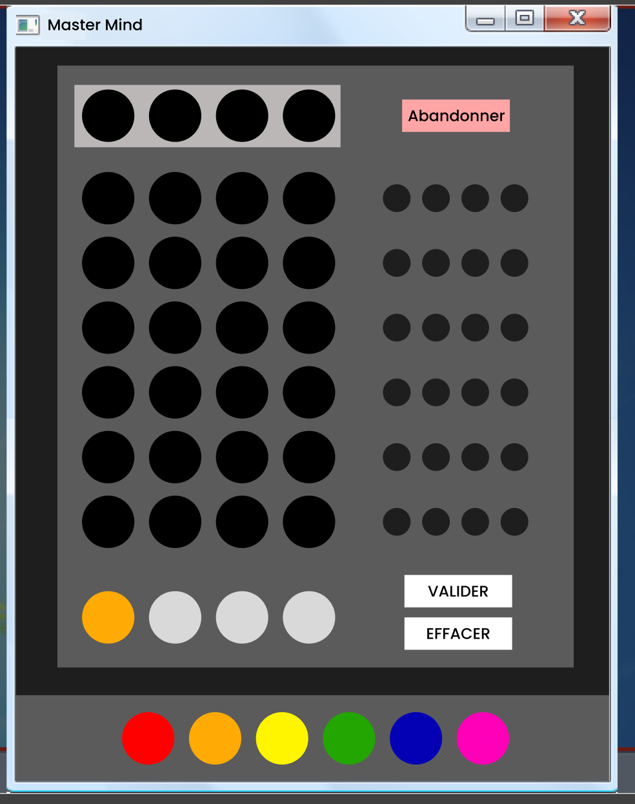

---

 
Prérequis : Aucune base en JAVA 


---

## Sommaire

- [Backlog du projet](#backlog)
- [Acquérir bases en Java](#bases)
- [S'entrainer en Java](#exercice)
- [Choix de l'interface graphique](#choix)
- [Apprendre à réaliser une interface graphique](#swing)
- [Réalisation de la maquette Figma](#maquette)
- [Les fonctionnalités et le backlog du Mastermind](#fonctionnalités)

<h2 id=backlog> Le backlog du projet</h2>

### Sprint 1

|Intitulé|Temps estimé|
|---|---|---|
|- Suivre une formation d'apprentissage du Java <br> - Appliquer ces connaissances en exercices <br> - Apprendre les connaissances théoriques pour réaliser une interface graphique en Java <br> - Définir les fonctionnalités et le back log du Mastermind <br> - Réaliser une maquette sur Figma du projet| 7h <br> 1h45 <br> 15 mins <br> 30 mins <br> 30 mins |

### Sprint 2

|Intitulé|Temps estimé|
|---|---|---|
| - Réaliser le backlog Java <br> - Recherche de méthodes de résolution d'un mastermind <br> - Implémentation de ces méthodes <br> - Comparaison des méthodes |7h <br> 30 mins <br> 2h <br> 30 mins |

<h2 id=bases> Acquérir bases en Java</h2>

*Avant toute chose, comme je ne suis pas encore très à l'aise avec VSCode, une étape cruciale (et compliquée) était l'installation de Java sur l'éditeur. Heureusement, [cette vidéo](https://www.youtube.com/watch?v=fbyobdxDQno) d'un indien fort sympatique m'a sauvée. Je pose le lien là pour toute personne qui rencontrerait le même problème que j'ai eu*

Pour cette étape, je me suis aidée du [MON de Nicolas](../../../Ouzoulias-Nicolas/MON/temps-1.1/index.md) qui traitait exactement du même sujet. J'ai donc suivi la même formation d'Open Classroom que lui. Ce cours qui est censé durer 10h (mais que je n'ai pas suivi en entier) aborde quelques notions assez intéressantes pour commencer. On y retrouve notamment :

**La manipulation de variable**, avec : 
- Les conventions d'appellations *(ex: Camel case)*
- les différents types de variables *(les principaux étant String, int, double, boolean)*
- La déclaration d'une variable *(composée de trois éléments : type, nom, et valeur)*
- leur portée *(private, public)*
  
**La structure d'un code en Java**, avec :
- les notions de packages, classes et méthodes
- les différents types de classes 
  - *modèles*, utilisées comme modèles pour l'instanciation des objets.
  - *utilitaires*, contenant des méthodes statiques qui peuvent être appelées directement sur la classe.
  
> Une classe est un ensemble de variables (nommées attributs) et de comportements (nommés méthodes).

**La construction de fonctions**, avec :
- les différentes boucles qui existent et comment elles sont utilisées *(for, while, do..while)*
- les opérateurs *(et, ou, etc...)*
- les conditions *(avec l'utilisation de "switch" pour les chaines de conditions)*
- l'utilisation de son terminal pour renseigner des arguments *(que je n'ai jamais réussi à faire fonctionner)*
- les paramètres et les valeurs de retour

**La création de classe**, avec : 
- la notion de **constructeur** *(ie une fonction spéciale du même nom que la classe avec les arguments passés en paramètres)*
- la notion **d'instance** *(les classes sont vues comme des "modèles", et pour les utiliser il faut créer un objet à partir de ce modèle, en utilisant le processus d'instanciation : signifie déclarer une variable avec la classe comme type, puis utiliser l'expression de création d'objet)*

> Un objet est donc **une instance** de classe.

**La spécialisation de classes**, avec :

- la notion d'héritage (qui permet à ces classes filles de reprendre les mêmes attributs et méthodes que leur classe mère, et d’ajouter en plus leur particularité en les spécialisant par des attributs et/ou méthodes qui leur sont propres)
- la notion de polymorphisme (qui permet de "surcharger" les méthodes de la classe mère pour redéfinir leurs comportements sans changer leur signature)

**L'utilisation de collections**, avec :
- les différences entre les listes et les tableaux (ie le listes ont une taille fixe et on ne peut modifier que les valeurs existantes)


Et d'autres notions que je n'ai pas étudiées (ex: récursivité, code "Lambda, manipulation des fichiers)


*Je trouve que ce qui est dommage avec cette formation, c'est qu'il y a certains points que je touve importante qu'elle n'aborde pas. Comme less notions de  différents attributs d'une méthode, par exemple (ex : quand écrire "void", "static", etc...). Et donc finalement, en finissant la formation je me suis rendue compte que j'avais appris beaucoup de choses mais que je ne savais rien faire...*


Alors je me suis tournée vers un autre type de contenu plus didactique et plus parlant: **les vidéos**. J'en ai regardées plusieurs de [cette chaine](https://www.youtube.com/@formation-video) qui étaient vraiment instructives et assez complètes. Je conseille notamment les vidéos sur [la construction de classe](https://www.youtube.com/watch?v=IZ8wKErw0_Y), [l'encapsulation des données](https://www.youtube.com/watch?v=zM_Qf07fEyc), [les attributs](https://www.youtube.com/watch?v=48wGbUfFtfM) et [les méthodes](https://www.youtube.com/watch?v=FkB7N0w81Dk). 


<h2 id=exercice> S'entrainer en Java </h2>

Avant de me lancer dans mon projet de jeu, je voulais d'abord m'assurer d'avoir bien compris le langage (ou du moins ses bases). Pour ce faire j'ai trouvé plusieurs sites intéressants pour s'entrainer :
- [w3schools](https://www.w3schools.com/java/default.asp) : *sur les conseils d'Arthur. Permet de balayer un grand nombre de notions et de fonctions et de les retouver facilement. Il y a aussi tout une partie sur les méthodes où l'on peut "Essayer soit même" de manière simple sans avoir d'éditeur de code installé.*
- [cours-gratuit](https://www.cours-gratuit.com/java) : *recommandé par Nicolas dans son MON. Offre une nombre d'exercice très variés et très complets. Certains exercices sont très guidés, d'autres un peu moins. Mais je les ai plus parcourus que réellement appliqués par manque de temps.*
- [site de Télécom Paris](https://perso.telecom-paristech.fr/hudry/coursJava/exercices/) : *en cherchant sur internet je suis tombée par hasard sur ce site. Les exercices sont vraiment bien guidés et reprennent une bonne partie des connaissances théoriques qui sont vues dans l'Open Classroom. C'est finalement sur ces exercices que je me suis le plus entraînée. Je conseille fortement l'exercice ["Premier contact : modéliser un étudiant](https://perso.telecom-paristech.fr/hudry/coursJava/exercices/etudiant.html) pour débuter.*

Voici un extrait de l'énoncer de l'exercice [Modéliser un élève](https://perso.telecom-paristech.fr/hudry/coursJava/exercices/etudiant.html)


Un élève sera ici modélisé par la classe Eleve d'un paquetage nommé gestionEleves, de la façon suivante.
La classe Eleve posséde trois attributs privés :
- son nom, nommé nom, de type String,
- un ensemble de notes, nommé listeNotes, qui sont des entiers rangés dans un ArrayList<Integer>
- une moyenne de type double, nommée moyenne, qui doit toujours être égale à la moyenne des notes contenues dans l'attribut listeNotes. Un élève sans aucune note sera considéré comme ayant une moyenne nulle. 

La classe Eleve possède un constructeur permettant uniquement d'inialiser le nom de l'élève.
La classe Eleve possède aussi cinq méthodes publiques :
 - Un getter pour la moyenne de l'élève c'est-à-dire une méthode d'en-tête : ***public double getMoyenne()*** qui renvoie la valeur de l'attribut moyenne ;
- Un getter pour le nom de l'élève c'est-à-dire une méthode d'en-tête : ***public String getNom()*** qui renvoie le nom de l'élève ;
- Un getter pour la liste des notes de l'élève c'est-à-dire une méthode d'en-tête : ***public ArrayList<Integer> getListeNotes()*** qui renvoie la liste des notes de l'élève ;
- La méthode d'en-tête : ***public void ajouterNote(int note)*** ajoute la note reçue en paramètre à listeNotes ; si la note reçue en paramètre est négative, la note introduite est 0 ; si la note reçue en paramètre est supérieure à 20, la note introduite est 20 ; la méthode actualise en conséquence l'attribut moyenne ; l'actualisation est faite à temps constant, et non pas en un temps proportionnel au nombre de notes déjà enregistrées.
- La méthode d'en-tête : ***public String toString()*** retourne une description de l'élève considéré (par exemple : "Sophie (12.25)").

Après avoir terminé la classe Eleve, écrire un programme qui teste cette classe.


Et voici un extrait de ma solution :


```
package gestionEleves;

import java.util.ArrayList;

public class Eleve {
    private String nom;
    private ArrayList<Integer> listeNotes = new ArrayList<Integer>();
    private double moyenne;

    public Eleve(String nom,ArrayList<Integer> listeNotes, double moyenne){
        this.nom = nom;
        this.listeNotes= listeNotes;
        this.moyenne = moyenne;
    }

    public double getMoyenne() {
        boolean IsEmpty = listeNotes.isEmpty(); 
        if (IsEmpty == true) 
            return 0;
        else 
            return moyenne;
    }
    public String getNom() {
        return nom;
    }
    public ArrayList<Integer> getListeNotes()  {
        return listeNotes;
    }

    public void ajouterNote(int note){
        listeNotes.add(note);
        int nbNotes = listeNotes.size();
        if (note < 0) note = 0;
	    else if (note > 20) note = 20;
        moyenne = (moyenne*(nbNotes-1) + note) / nbNotes;
    }
    public String toString(){
        return nom + " a une moyenne de " + moyenne;

    }
}
```



```
package gestionEleves;

import java.util.ArrayList;
import java.util.Arrays;

public class TestEleve {
    public static void main(String[] args) {
        ArrayList<Integer> notes = new ArrayList<Integer>(Arrays.asList(14, 16));
        Eleve eleve = new Eleve("Sarah",notes,15);
            eleve.ajouterNote(12);
            System.out.println(eleve);
    }
}
```
Résultat :
```
PS C:\Users\X3400\Documents\GitHub\project_java>  c:; cd 'c:\Users\X3400\Documents\GitHub\project_java'; & 'C:\Program Files\Eclipse Adoptium\jdk-21.0.1.12-hotspot\bin\java.exe' '--enable-preview' '-XX:+ShowCodeDetailsInExceptionMessages' '-cp' 'C:\Users\X3400\Documents\GitHub\project_java\bin' 'gestionEleves.TestEleve' 
Sarah a une moyenne de 14.0
```



<h2 id=choix> Choix de l'interface graphique du projet</h2>

Après recherches, j'ai trouvé qu'il existait trois API de mise en oeuvre d'interfaces graphiques proposées par l'environnement Java : 

- **AWT (Abstract Window Toolkit)**
- **Swing**
- **JavaFX**

Laquelle choisir ?

Voici un petit tableau qui retrace les avantages et inconvénients de chaque système que j'ai pu trouvés: 

|API|Inconvénients|Avantages|
|---|---|---|
|**AWT** *(historiquement la première API de JAVA qui a vu le jour sur ce sujet)*| - Java fait appel au système d'exploitation sous-jacent pour afficher les composants graphiques. Ainsi, l'interface graphique peut s'afficher différemment selon le système d'exploitation dans lequel on se trouve <br> - Comme les composants graphiques doivent exister sur tous les OS, la librairie graphique est relativement pauvre. | - Rapidité d'affichage, car c'est l'OS qui affiche l'interface graphique|
|**Swing**| - Beaucoup plus de ressources consommées par l'application (mémoire notamment), *mais de nombreuses augmentations de la puissance de calcul ces dernières années permettent de minimiser le problème* <br> - Problème de compatibilité avec les besoins des application mobiles |- Richesse des composants proposés *(à l'inverse de AWT, c'est l'API qui pixeliser les différents éléments graphiques et non l'OS)* <br> - Plusieurs "looks" graphiques possibles avec la mise à jour régulièrement de nouvelles implémentations de looks|
|**JavaFX** *(parue en 2014 et désormais l'API d'interface graphique principale du Java)* | - permet de produire des interfaces graphiques pouvant facilement être utilisées sur différents types d'écrans <br> - permet d'inclure des éléments de 2D et de 3D <br> - Ressemblances avec des API de développement Web et leur formalisme <br> - Moins lourd au niveau conception| - Bibliothèque non intégrée à Java <br> - Manque de documentation sur la bibliothèque et reste globalement moins utilisé que Swing|

Ainsi, même si JavaFx semble présenter de très forts avantages, comme je débute encore en Java, je pense qu'il est plus judicieux de faire la suite de ce POK avec Swing. Comme c'est une API plus "mature", il me sera plus facile de trouver des ressources (tuto, exemples que lesquels s'appuyer et autres..) pour réaliser mon projet.

 
- [Interface Graphique en Java®](https://www.youtube.com/watch?v=K8OXvWJlVmU)
- https://www.developpez.net/forums/d1597238/java/interfaces-graphiques-java/lequel-choisir-poa-poo/
- [Comparatif AWT/Swing/SWT/JavaFX](https://koor.fr/Java/TutorialSwing/comparatif.wp)
- [JavaFX mérite-t-il son statut de remplaçant de Swing ?](https://java.developpez.com/actu/121250/JavaFX-merite-t-il-son-statut-de-remplacant-de-Swing-Son-utilisation-semble-peiner-a-se-democratiser/)
 

<h2 id=swing> Apprendre à utiliser l'API Swing</h2>

Je n'ai malheureusement pas eu le temps d'apprendre à me servir de ce système. J'ai cependant trouvé quelques ressources qui devraient me servir pour le prochain sprint :

- [un recueil d'une grande partie des composants que l'on peut retrouver avec Swing](http://icps.u-strasbg.fr/people/bastoul/public_html/teaching/java/docs/Swing.pdf)
- [une page web avec le même sujet mais qui offre des exemples en plus pour chaque composant](https://www.jmdoudoux.fr/java/dej/chap-swing.htm)
- [une vidéo qui qui réalise une interface avec Swing en utilisant VSCode](https://www.youtube.com/watch?v=5G2XM1nlX5Q)


<h2 id=fonctionnalités> Les fonctionnalités et le backlog du Mastermind</h2>

|Intitulé|Complexité|Valeur métier(MoSCoW)|
|---|---|---|
|Sélectionner une combinaison de 4 couleurs|3|Must|
|Valider une fois qu'une combinaison a été choisie|3|Must|
|Effacer une combinaison qui n'a pas encore été validée|3|Must|
|Choisir d'effacer seulement la dernière couleur qui a été sélectionnée|8|Won't|
|Pouvoir abandonner la partie à tout moment|5|Must|
|Pouvoir accéder aux règles du jeu à tout moment|5|Could|
|Avoir à indicateur du nombre de couleurs justes et bien placées et juste et mal placées à chaque combinaison validée|5|Must|
|Avoir le code secret recherché qui s'affiche à la fin d'une partie|3|Won't|

***Remarque :***
*Comme je ne maitrise pas encore le langage avec lequel je vais travailler, il m'est assez compliqué de donner une complexité aux fonctionnalités que j'ai listées*

<h2 id=maquette> Réalisation de la maquette Figma</h2>

Pour mon premier POK, je me suis rendue compte que j'avais perdu beaucoup de temps sur la partie visuelle de mon tableau de Gantt. Comme je n'avais défini clairement à quoi je voulais qu'il ressemble, j'ai passé longtemps à tester et retester des dispositions, des couleurs et des polices. Finalement, j'aurais été beaucoup plus efficace si j'avais défini dès le départ ma charte graphique.

Alors cette fois, j'ai décidé de ne pas faire la même erreur. J'ai donc regardé sur internet à quoi ressemblait les jeux qui avaient déjà pu être faits par d'autres dans le passé, pour avoir une idée de ce qui était réellement faisable. Et j'ai réalisé une maquette sur Figma, en essayant d'appliquer les conseils qu'on avait pu avoir pendant les cours d'UI/UX. 

|---|---|
|||

Vous pouvez retrouver la maquette [ici](https://www.figma.com/file/nxQbQ6gxDwGkSqBTP9AhlS/Maquette-MasterMind-en-Java?type=design&node-id=0%3A1&mode=design&t=v7Qm5wzCocXpxts0-1) et le prototype [là](https://www.figma.com/proto/nxQbQ6gxDwGkSqBTP9AhlS/Maquette-MasterMind-en-Java?type=design&node-id=2-4&t=1MvNUXGn23z5K0zS-0&scaling=scale-down&page-id=0%3A1)

<h2 id=sprint2>  Vers le sprint 2...</h2>

Si on reprend le backlog du sprint 1 que je m'étais fixé : 

|Intitulé|Temps estimé|Temps réalisé|
|---|---|---|---|
|- Suivre la formation open classroom d'apprentissage du Java <br> *- Suppléments de formations sur le langage (vidéos, articles)* <br> - Appliquer ces connaissances en exercices (cités plus tôt) <br> - Apprendre les connaissances théoriques pour réaliser une interface graphique en Java <br> - Définir les fonctionnalités et le backlog du Mastermind <br> - Réaliser une maquette sur Figma du projet| 7h <br> / <br> 1h45 <br> 15 mins <br> 30 mins <br> 30 mins | **7h** <br> **1h** <br> **1h30** <br> **10 mins** <br> **5 mins** <br> **45 mins**|

Au final, j'ai passé sur ce sprint 1 **plus de 10h...**. J'ai rencontré beaucoup de difficultés que je n'avais pas envisagées et qui, au final m'ont pris beaucoup de temps à surmonter. *Surtout concernant l'application des codes sur VSCodes*(ex: l'installation de Java, réaliser un packetage et déclarer les classes, configurer des arguments pour une classe, etc..).

On peut alors redéfinir le backlog pour le sprint 2 :

|Intitulé|Temps estimé|
|---|---|---|
| *- Apprendre les connaissances théoriques pour réaliser une interface graphique en Java* <br> - Réaliser le backlog défini plus haut sur Java <br> - Recherche de méthodes de résolution d'un mastermind <br> - Implémentation de ces méthodes <br> - Comparaison des méthodes |*1h* <br> 6h <br> 45mins <br> 1h <br> 30 mins |

