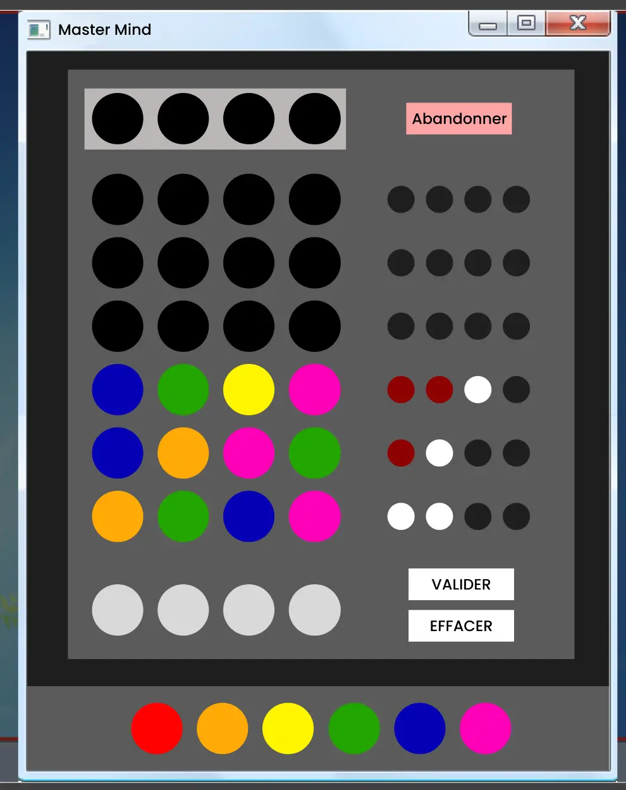
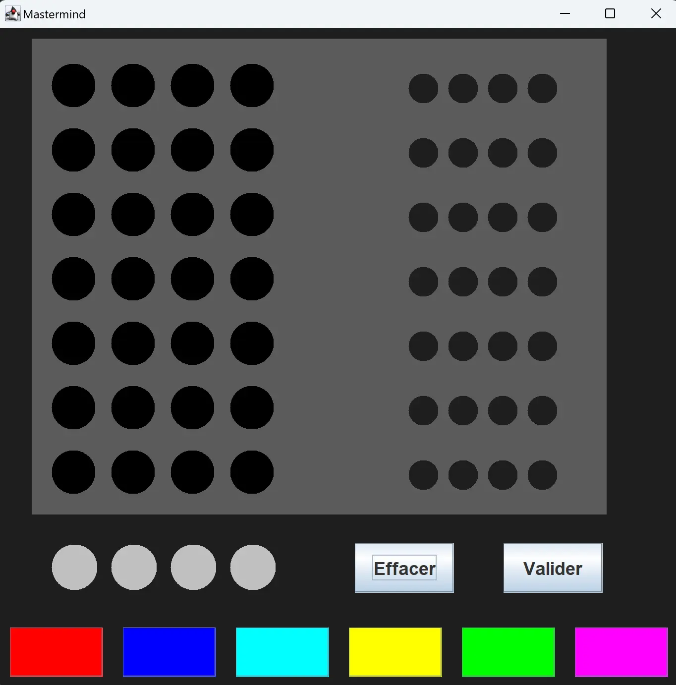
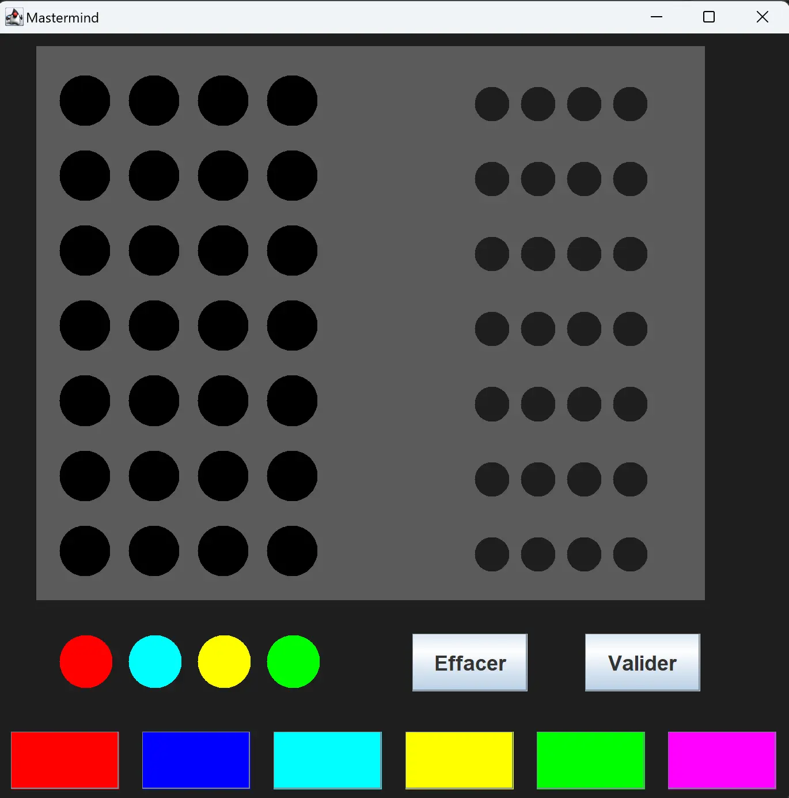
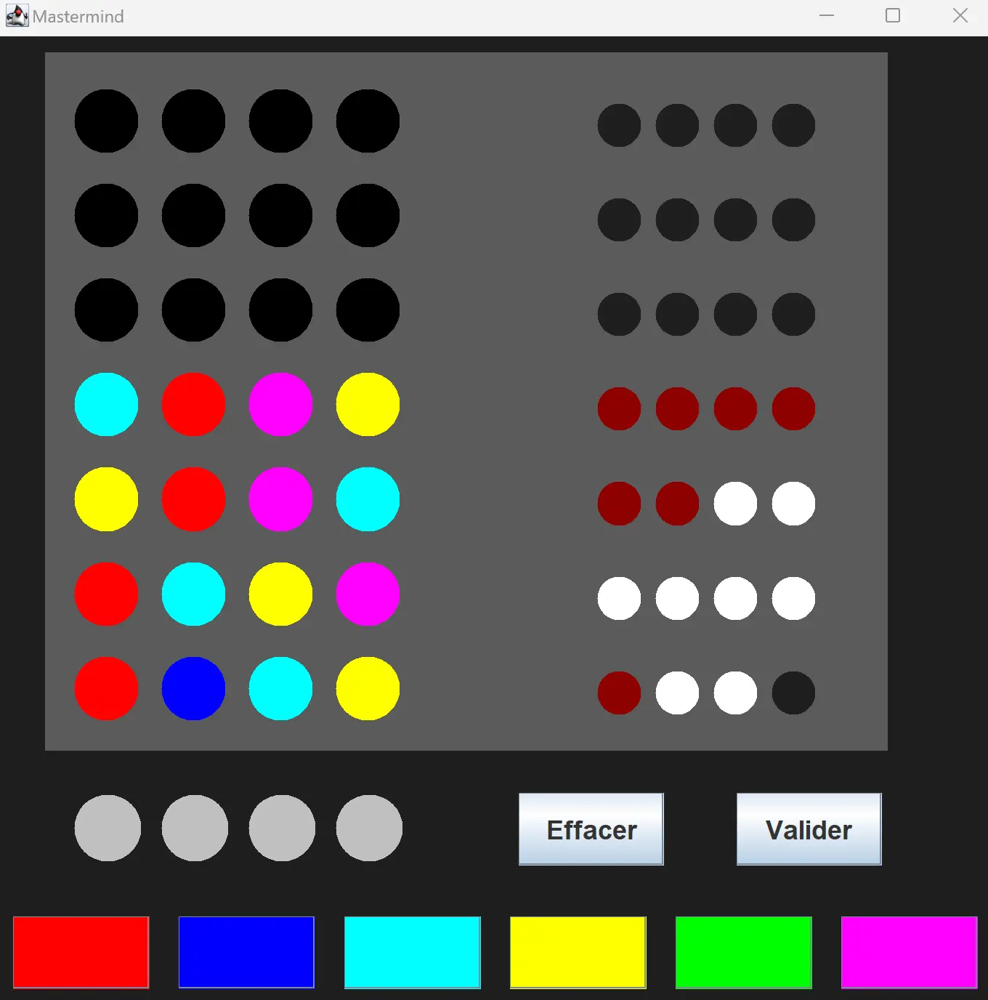
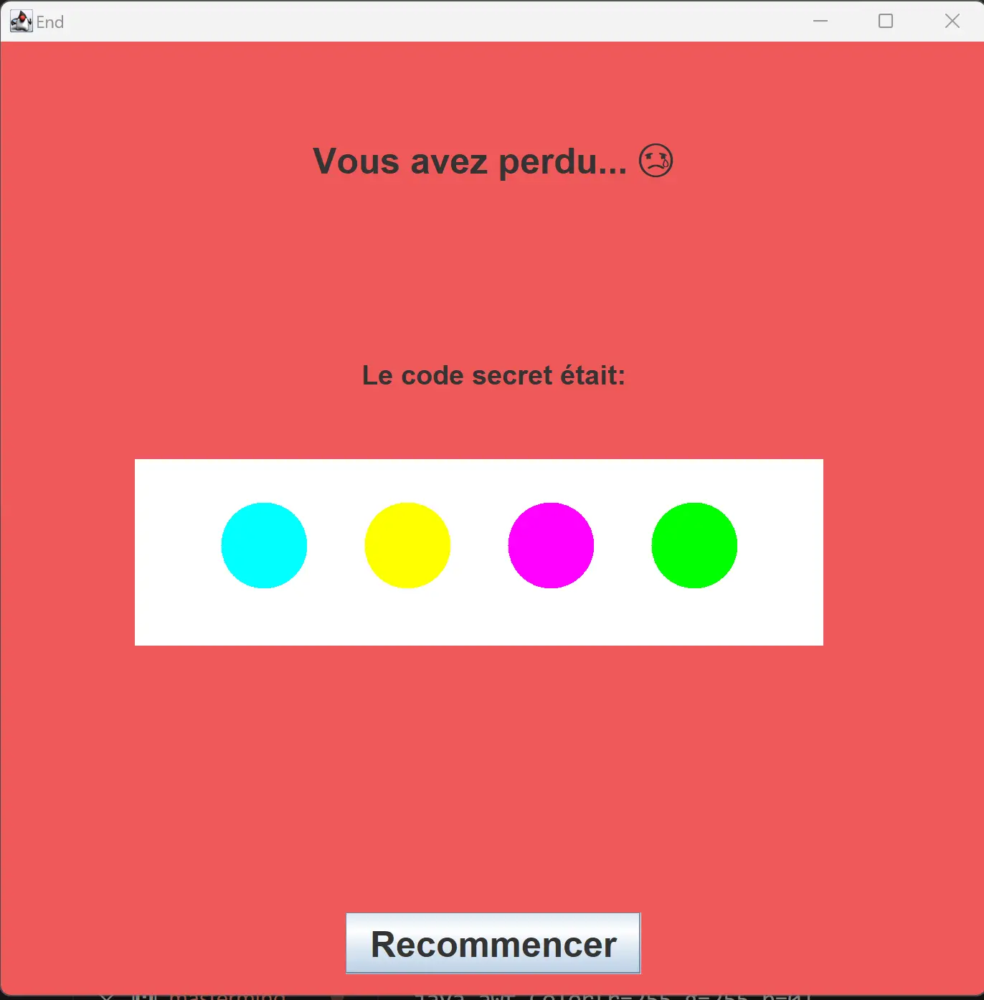
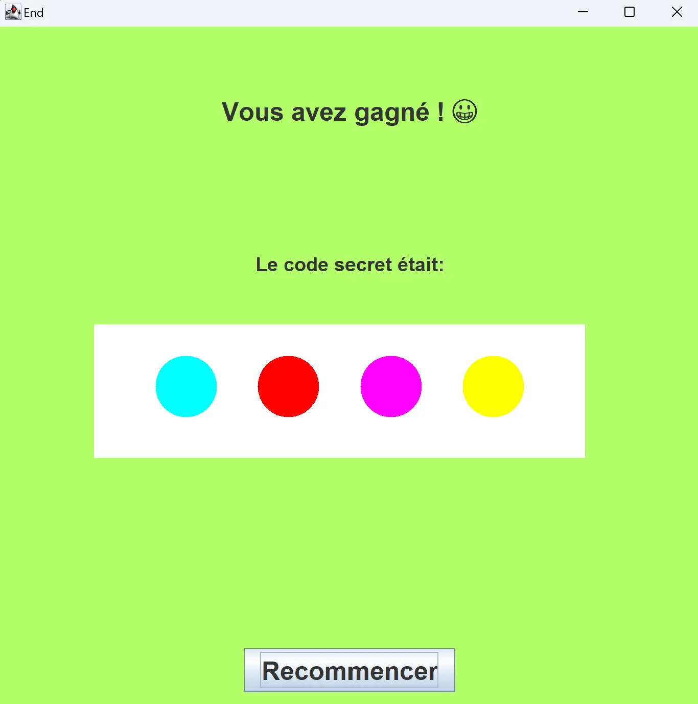

---

 
Prérequis : Aucune base en JAVA 


## Sommaire

- [Le backlog du projet](#backlog)
- [Acquérir bases en Java](#bases)
- [s’entraîner en Java](#exercice)
- [Choix de l'interface graphique du projet](#choix)
- [Apprendre à utiliser l'API Swing](#swing)
- [Réalisation de la maquette Figma](#maquette)
- [Vers le sprint 2](#sprint2)
- [Réalisation du jeu](#interface)
- [Retour sur les objectifs](#objectifs)
- [Retour d'expérience](#experience)

<h2 id=backlog> Le backlog du projet</h2>

### Sprint 1

|Intitulé|Temps estimé|
|---|---|---|
|- Suivre une formation d'apprentissage du Java <br> - Appliquer ces connaissances en exercices <br> - Apprendre les connaissances théoriques pour réaliser une interface graphique en Java <br> - Définir les fonctionnalités et le back log du Mastermind <br> - Réaliser une maquette sur Figma du projet| 7h <br> 1h45 <br> 15 mins <br> 30 mins <br> 30 mins |

### Sprint 2

|Intitulé|Temps estimé|
|---|---|---|
| - Réaliser le backlog Java <br> - Recherche de méthodes de résolution d'un mastermind <br> - Implémentation de ces méthodes <br> - Comparaison des méthodes |7h <br> 30 mins <br> 2h <br> 30 mins |

<h2 id=bases> Acquérir bases en Java</h2>

*Avant toute chose, comme je ne suis pas encore très à l'aise avec VSCode, une étape cruciale (et compliquée) était l'installation de Java sur l'éditeur. Heureusement, [cette vidéo](https://www.youtube.com/watch?v=fbyobdxDQno) d'un indien fort sympatique m'a sauvée. Je pose le lien là pour toute personne qui rencontrerait le même problème que j'ai eu*

Pour cette étape, je me suis aidée du [MON de Nicolas](../../../Ouzoulias-Nicolas/MON/temps-1.1/index.md) qui traitait exactement du même sujet. J'ai donc suivi la même formation d'Open Classroom que lui. Ce cours qui est censé durer 10h (mais que je n'ai pas suivi en entier) aborde quelques notions assez intéressantes pour commencer. On y retrouve notamment :

**La manipulation de variable**, avec : 
- Les conventions d'appellations *(ex: Camel case)*
- les différents types de variables *(les principaux étant String, int, double, boolean)*
- La déclaration d'une variable *(composée de trois éléments : type, nom, et valeur)*
- leur portée *(private, public)*
  
**La structure d'un code en Java**, avec :
- les notions de packages, classes et méthodes
- les différents types de classes 
  - *modèles*, utilisées comme modèles pour l'instanciation des objets.
  - *utilitaires*, contenant des méthodes statiques qui peuvent être appelées directement sur la classe.
  
> Une classe est un ensemble de variables (nommées attributs) et de comportements (nommés méthodes).

**La construction de fonctions**, avec :
- les différentes boucles qui existent et comment elles sont utilisées *(for, while, do..while)*
- les opérateurs *(et, ou, etc...)*
- les conditions *(avec l'utilisation de "switch" pour les chaines de conditions)*
- l'utilisation de son terminal pour renseigner des arguments *(que je n'ai jamais réussi à faire fonctionner)*
- les paramètres et les valeurs de retour

**La création de classe**, avec : 
- la notion de **constructeur** *(ie une fonction spéciale du même nom que la classe avec les arguments passés en paramètres)*
- la notion **d'instance** *(les classes sont vues comme des "modèles", et pour les utiliser il faut créer un objet à partir de ce modèle, en utilisant le processus d'instanciation : signifie déclarer une variable avec la classe comme type, puis utiliser l'expression de création d'objet)*

> Un objet est donc **une instance** de classe.

**La spécialisation de classes**, avec :

- la notion d'héritage (qui permet à ces classes filles de reprendre les mêmes attributs et méthodes que leur classe mère, et d’ajouter en plus leur particularité en les spécialisant par des attributs et/ou méthodes qui leur sont propres)
- la notion de polymorphisme (qui permet de "surcharger" les méthodes de la classe mère pour redéfinir leurs comportements sans changer leur signature)

**L'utilisation de collections**, avec :
- les différences entre les listes et les tableaux (ie le listes ont une taille fixe et on ne peut modifier que les valeurs existantes)


Et d'autres notions que je n'ai pas étudiées (ex: récursivité, code "Lambda, manipulation des fichiers)


*Je trouve que ce qui est dommage avec cette formation, c'est qu'il y a certains points que je touve importante qu'elle n'aborde pas. Comme less notions de  différents attributs d'une méthode, par exemple (ex : quand écrire "void", "static", etc...). Et donc finalement, en finissant la formation je me suis rendue compte que j'avais appris beaucoup de choses mais que je ne savais rien faire...*


Alors je me suis tournée vers un autre type de contenu plus didactique et plus parlant: **les vidéos**. J'en ai regardées plusieurs de [cette chaine](https://www.youtube.com/@formation-video) qui étaient vraiment instructives et assez complètes. Je conseille notamment les vidéos sur [la construction de classe](https://www.youtube.com/watch?v=IZ8wKErw0_Y), [l'encapsulation des données](https://www.youtube.com/watch?v=zM_Qf07fEyc), [les attributs](https://www.youtube.com/watch?v=48wGbUfFtfM) et [les méthodes](https://www.youtube.com/watch?v=FkB7N0w81Dk). 


<h2 id=exercice> S'entrainer en Java </h2>

Avant de me lancer dans mon projet de jeu, je voulais d'abord m'assurer d'avoir bien compris le langage (ou du moins ses bases). Pour ce faire j'ai trouvé plusieurs sites intéressants pour s'entrainer :
- [w3schools](https://www.w3schools.com/java/default.asp) : *sur les conseils d'Arthur. Permet de balayer un grand nombre de notions et de fonctions et de les retouver facilement. Il y a aussi tout une partie sur les méthodes où l'on peut "Essayer soit même" de manière simple sans avoir d'éditeur de code installé.*
- [cours-gratuit](https://www.cours-gratuit.com/java) : *recommandé par Nicolas dans son MON. Offre une nombre d'exercice très variés et très complets. Certains exercices sont très guidés, d'autres un peu moins. Mais je les ai plus parcourus que réellement appliqués par manque de temps.*
- [site de Télécom Paris](https://perso.telecom-paristech.fr/hudry/coursJava/exercices/) : *en cherchant sur internet je suis tombée par hasard sur ce site. Les exercices sont vraiment bien guidés et reprennent une bonne partie des connaissances théoriques qui sont vues dans l'Open Classroom. C'est finalement sur ces exercices que je me suis le plus entraînée. Je conseille fortement l'exercice ["Premier contact : modéliser un étudiant](https://perso.telecom-paristech.fr/hudry/coursJava/exercices/etudiant.html) pour débuter.*

Voici un extrait de l'énoncer de l'exercice [Modéliser un élève](https://perso.telecom-paristech.fr/hudry/coursJava/exercices/etudiant.html)


Un élève sera ici modélisé par la classe Eleve d'un paquetage nommé gestionEleves, de la façon suivante.
La classe Eleve posséde trois attributs privés :
- son nom, nommé nom, de type String,
- un ensemble de notes, nommé listeNotes, qui sont des entiers rangés dans un ArrayList<Integer>
- une moyenne de type double, nommée moyenne, qui doit toujours être égale à la moyenne des notes contenues dans l'attribut listeNotes. Un élève sans aucune note sera considéré comme ayant une moyenne nulle. 

La classe Eleve possède un constructeur permettant uniquement d'inialiser le nom de l'élève.
La classe Eleve possède aussi cinq méthodes publiques :
 - Un getter pour la moyenne de l'élève c'est-à-dire une méthode d'en-tête : ***public double getMoyenne()*** qui renvoie la valeur de l'attribut moyenne ;
- Un getter pour le nom de l'élève c'est-à-dire une méthode d'en-tête : ***public String getNom()*** qui renvoie le nom de l'élève ;
- Un getter pour la liste des notes de l'élève c'est-à-dire une méthode d'en-tête : ***public ArrayList<Integer> getListeNotes()*** qui renvoie la liste des notes de l'élève ;
- La méthode d'en-tête : ***public void ajouterNote(int note)*** ajoute la note reçue en paramètre à listeNotes ; si la note reçue en paramètre est négative, la note introduite est 0 ; si la note reçue en paramètre est supérieure à 20, la note introduite est 20 ; la méthode actualise en conséquence l'attribut moyenne ; l'actualisation est faite à temps constant, et non pas en un temps proportionnel au nombre de notes déjà enregistrées.
- La méthode d'en-tête : ***public String toString()*** retourne une description de l'élève considéré (par exemple : "Sophie (12.25)").

Après avoir terminé la classe Eleve, écrire un programme qui teste cette classe.


Et voici un extrait de ma solution :


```
package gestionEleves;

import java.util.ArrayList;

public class Eleve {
    private String nom;
    private ArrayList<Integer> listeNotes = new ArrayList<Integer>();
    private double moyenne;

    public Eleve(String nom,ArrayList<Integer> listeNotes, double moyenne){
        this.nom = nom;
        this.listeNotes= listeNotes;
        this.moyenne = moyenne;
    }

    public double getMoyenne() {
        boolean IsEmpty = listeNotes.isEmpty(); 
        if (IsEmpty == true) 
            return 0;
        else 
            return moyenne;
    }
    public String getNom() {
        return nom;
    }
    public ArrayList<Integer> getListeNotes()  {
        return listeNotes;
    }

    public void ajouterNote(int note){
        listeNotes.add(note);
        int nbNotes = listeNotes.size();
        if (note < 0) note = 0;
	    else if (note > 20) note = 20;
        moyenne = (moyenne*(nbNotes-1) + note) / nbNotes;
    }
    public String toString(){
        return nom + " a une moyenne de " + moyenne;

    }
}
```



```
package gestionEleves;

import java.util.ArrayList;
import java.util.Arrays;

public class TestEleve {
    public static void main(String[] args) {
        ArrayList<Integer> notes = new ArrayList<Integer>(Arrays.asList(14, 16));
        Eleve eleve = new Eleve("Sarah",notes,15);
            eleve.ajouterNote(12);
            System.out.println(eleve);
    }
}
```
Résultat :
```
PS C:\Users\X3400\Documents\GitHub\project_java>  c:; cd 'c:\Users\X3400\Documents\GitHub\project_java'; & 'C:\Program Files\Eclipse Adoptium\jdk-21.0.1.12-hotspot\bin\java.exe' '--enable-preview' '-XX:+ShowCodeDetailsInExceptionMessages' '-cp' 'C:\Users\X3400\Documents\GitHub\project_java\bin' 'gestionEleves.TestEleve' 
Sarah a une moyenne de 14.0
```



<h2 id=choix> Choix de l'interface graphique du projet</h2>

Après recherches, j'ai trouvé qu'il existait trois API de mise en oeuvre d'interfaces graphiques proposées par l'environnement Java : 

- **AWT (Abstract Window Toolkit)**
- **Swing**
- **JavaFX**

Laquelle choisir ?

Voici un petit tableau qui retrace les avantages et inconvénients de chaque système que j'ai pu trouvés: 

|API|Inconvénients|Avantages|
|---|---|---|
|**AWT** *(historiquement la première API de JAVA qui a vu le jour sur ce sujet)*| - Java fait appel au système d'exploitation sous-jacent pour afficher les composants graphiques. Ainsi, l'interface graphique peut s'afficher différemment selon le système d'exploitation dans lequel on se trouve <br> - Comme les composants graphiques doivent exister sur tous les OS, la librairie graphique est relativement pauvre. | - Rapidité d'affichage, car c'est l'OS qui affiche l'interface graphique|
|**Swing**| - Beaucoup plus de ressources consommées par l'application (mémoire notamment), *mais de nombreuses augmentations de la puissance de calcul ces dernières années permettent de minimiser le problème* <br> - Problème de compatibilité avec les besoins des application mobiles |- Richesse des composants proposés *(à l'inverse de AWT, c'est l'API qui pixeliser les différents éléments graphiques et non l'OS)* <br> - Plusieurs "looks" graphiques possibles avec la mise à jour régulièrement de nouvelles implémentations de looks|
|**JavaFX** *(parue en 2014 et désormais l'API d'interface graphique principale du Java)* | - permet de produire des interfaces graphiques pouvant facilement être utilisées sur différents types d'écrans <br> - permet d'inclure des éléments de 2D et de 3D <br> - Ressemblances avec des API de développement Web et leur formalisme <br> - Moins lourd au niveau conception| - Bibliothèque non intégrée à Java <br> - Manque de documentation sur la bibliothèque et reste globalement moins utilisé que Swing|

Ainsi, même si JavaFx semble présenter de très forts avantages, comme je débute encore en Java, je pense qu'il est plus judicieux de faire la suite de ce POK avec Swing. Comme c'est une API plus "mature", il me sera plus facile de trouver des ressources (tuto, exemples que lesquels s'appuyer et autres..) pour réaliser mon projet.

 
- [Interface Graphique en Java®](https://www.youtube.com/watch?v=K8OXvWJlVmU)
- https://www.developpez.net/forums/d1597238/java/interfaces-graphiques-java/lequel-choisir-poa-poo/
- [Comparatif AWT/Swing/SWT/JavaFX](https://koor.fr/Java/TutorialSwing/comparatif.wp)
- [JavaFX mérite-t-il son statut de remplaçant de Swing ?](https://java.developpez.com/actu/121250/JavaFX-merite-t-il-son-statut-de-remplacant-de-Swing-Son-utilisation-semble-peiner-a-se-democratiser/)
 

<h2 id=swing> Apprendre à utiliser l'API Swing</h2>

Je n'ai malheureusement pas eu le temps d'apprendre à me servir de ce système. J'ai cependant trouvé quelques ressources qui devraient me servir pour le prochain sprint :

- [un recueil d'une grande partie des composants que l'on peut retrouver avec Swing](http://icps.u-strasbg.fr/people/bastoul/public_html/teaching/java/docs/Swing.pdf)
- [une page web avec le même sujet mais qui offre des exemples en plus pour chaque composant](https://www.jmdoudoux.fr/java/dej/chap-swing.htm)
- [une vidéo qui qui réalise une interface avec Swing en utilisant VSCode](https://www.youtube.com/watch?v=5G2XM1nlX5Q)


<h2 id=fonctionnalités> Les fonctionnalités et le backlog du Mastermind</h2>

|Intitulé|Complexité|Valeur métier(MoSCoW)|
|---|---|---|
|Sélectionner une combinaison de 4 couleurs|3|Must|
|Valider une fois qu'une combinaison a été choisie|3|Must|
|Effacer une combinaison qui n'a pas encore été validée|3|Must|
|Choisir d'effacer seulement la dernière couleur qui a été sélectionnée|8|Won't|
|Pouvoir abandonner la partie à tout moment|5|Could |
|Pouvoir accéder aux règles du jeu à tout moment|5|Won't|
|Avoir à indicateur du nombre de couleurs justes et bien placées et juste et mal placées à chaque combinaison validée|5|Must|
|Avoir le code secret recherché qui s'affiche à la fin d'une partie|3|Won't|

***Remarque :***
*Comme je ne maitrise pas encore le langage avec lequel je vais travailler, il m'est assez compliqué de donner une complexité aux fonctionnalités que j'ai listées*

<h2 id=maquette> Réalisation de la maquette Figma</h2>

Pour mon premier POK, je me suis rendue compte que j'avais perdu beaucoup de temps sur la partie visuelle de mon tableau de Gantt. Comme je n'avais défini clairement à quoi je voulais qu'il ressemble, j'ai passé longtemps à tester et retester des dispositions, des couleurs et des polices. Finalement, j'aurais été beaucoup plus efficace si j'avais défini dès le départ ma charte graphique.

Alors cette fois, j'ai décidé de ne pas faire la même erreur. J'ai donc regardé sur internet à quoi ressemblait les jeux qui avaient déjà pu être faits par d'autres dans le passé, pour avoir une idée de ce qui était réellement faisable. Et j'ai réalisé une maquette sur Figma, en essayant d'appliquer les conseils qu'on avait pu avoir pendant les cours d'UI/UX. 

|---|---|
|||

Vous pouvez retrouver la maquette [ici](https://www.figma.com/file/nxQbQ6gxDwGkSqBTP9AhlS/Maquette-MasterMind-en-Java?type=design&node-id=0%3A1&mode=design&t=v7Qm5wzCocXpxts0-1) et le prototype [là](https://www.figma.com/proto/nxQbQ6gxDwGkSqBTP9AhlS/Maquette-MasterMind-en-Java?type=design&node-id=2-4&t=1MvNUXGn23z5K0zS-0&scaling=scale-down&page-id=0%3A1)

<h2 id=sprint2>  Vers le sprint 2...</h2>

Si on reprend le backlog du sprint 1 que je m'étais fixé : 

|Intitulé|Temps estimé|Temps réalisé|
|---|---|---|---|
|- Suivre la formation open classroom d'apprentissage du Java <br> *- Suppléments de formations sur le langage (vidéos, articles)* <br> - Appliquer ces connaissances en exercices (cités plus tôt) <br> - Apprendre les connaissances théoriques pour réaliser une interface graphique en Java <br> - Définir les fonctionnalités et le backlog du Mastermind <br> - Réaliser une maquette sur Figma du projet| 7h <br> / <br> 1h45 <br> 15 mins <br> 30 mins <br> 30 mins | **7h** <br> **1h** <br> **1h30** <br> **10 mins** <br> **5 mins** <br> **45 mins**|

Au final, j'ai passé sur ce sprint 1 **plus de 10h...**. J'ai rencontré beaucoup de difficultés que je n'avais pas envisagées et qui, au final m'ont pris beaucoup de temps à surmonter. *Surtout concernant l'application des codes sur VSCodes*(ex: l'installation de Java, réaliser un packetage et déclarer les classes, configurer des arguments pour une classe, etc..).

On peut alors redéfinir le backlog pour le sprint 2 :

|Intitulé|Temps estimé|
|---|---|---|
| *- Apprendre les connaissances théoriques pour réaliser une interface graphique en Java* <br> - Réaliser le backlog défini plus haut sur Java <br> - Recherche de méthodes de résolution d'un mastermind <br> - Implémentation de ces méthodes <br> - Comparaison des méthodes |*1h* <br> 6h <br> 45mins <br> 1h <br> 30 mins |

<h2 id=interface> Réalisation du jeu </h2>

### Apprentissage du codage d'une interface avec Swing

J'avais repérer une vidéo sur l'utilisation de Swing pour réaliser une interface graphique durant le sprint 1 que j'avais notée [ici](#swing), mais que je n'avais pas eu le temps de suivre.

J'ai d'abord commencé mon sprint 2 par son visionnage. Je la conseille vivement à toute personne voulant débuter ! Elle permet d'acquérir les bases et de comprendre la logique et elle est très bien expliquée. 

<h3 id=visuel> Le jeu final </h3>

*Le dossier du jeu est téléchargeable [ici](jeu_mastermind.zip)*

#### Interface initiale 



#### Partie en cours

Le joueur vient écrire sa proposition:



Une fois sa tentative validée, les indications de la justesse de sa proposition s'affichent sur la droite :
- **Blanc** : la couleur est bonne mais mal placée
- **Rouge** : la couleur est bonne et bien placée
  


#### Fin de la partie

|L'utilisateur n'a pas réussi à trouver le code avant la fin des 7 tentatives|L'utilisateur a réussi à trouver le code avant la fin des 7 tentatives|
|---|---|
|||

<h2 id=code> Construction du code </h2>


J'avais repérer une vidéo sur l'utilisation de Swing pour réaliser une interface graphique durant le sprint 1 que j'avais notée [ici](#swing), mais que je n'avais pas eu le temps de suivre.

J'ai d'abord commencé mon sprint 2 par son visionnage. Je la conseille vivement à toute personne voulant débuter ! Elle permet d'acquérir les bases et de comprendre la logique et elle est très bien expliquée. 


Pour mon projet, j'ai créé un package *Interface* dans lequel j'ai créé 2 classes : **_MainFrame_** (qui gère l'affichage de l'écran de jeu) et **_MessageFrame_** (qui gère l'affichage de l'écran final de fin de partie), qui héritent de **JFrame**.


Classes importantes du package Java Swing,
- **JPanel** :  est un conteneur capable de stocker, et d'organiser ainsi,un ensemble de composants.
- **Jframe** : utilisée pour créer des fenêtres graphiques dans une application 



[Source image](https://waytolearnx.com/2020/05/jpanel-java-swing.html)


### Construction de la partie 

- [Main Frame](#mainframe)
  - [Implémentation des méthodes](#a)
  - [Gestion des graphismes](#b)
  - [Création des Panels](#c)
- [Message Frame](#messageframe)


<h3 id=mainframe> Main Frame</h3>

On définit d'abord quelques variables qui vont nous servir tout au long du codage *(ex : liste des couleurs disponibles, nombre d'essai maximum, etc...)*

<h4 id=a> Implémentation des méthodes</h4>

On créé ensuite une méthode qui va venir générer un code secret...


```java
private List<Color> generateCode(){
        Random random = new Random();
        List<Color> secretCode = new ArrayList<>();

        // Génération de 4 nombres aléatoires entre 1 et 6 (inclus)
        for (int i = 0; i < 4; i++) {
            int randomNumber = random.nextInt(6);
            if (secretCode.contains(colorAvailable.get(randomNumber))){
                do {
                randomNumber = random.nextInt(6);
                } while (secretCode.contains(colorAvailable.get(randomNumber)));
                }

            secretCode.add(colorAvailable.get(randomNumber));
        }
        System.out.println(secretCode);
        return secretCode;
    }
```


... Puis une autre qui va initialiser une grille vide de taille 7x4 de couleur noire qui servira pour l'affichage du jeu de l'utilisateur. 


```java
public Color[][] initializeGrid (int rows, int columns, Color color){
    Color[][] tableau = new Color[rows][columns];
    for(int i = 0; i < tableau.length; i++){
        for(int j = 0; j < tableau[i].length; j++){
            tableau[i][j] = color;
    }}
    return tableau;
}
```


> Ces méthodes sont appelées lors de l'ouverture du jeu.

D'autres méthodes seront aussi utiles plus tard, comme par exemple:

- une méthode qui sera appelée lorsque l'utilisateur appuiera sur une couleur pour changer la couleur de la case de sa proposition
- une méthode qui met à jour la grille de jeu de l'utilisateur lorsqu'il appuie sur "valider"
- une méthode qui met à jour la grille d'indices lorsque l'utilisateur appuie sur "valider"
- une méthode qui va appelé la classe *"MessageFrame"* pour afficher le message final en fonction de la réussite de l'utilisateur


```java
private void updateChoice(Color color) {
        //méthode permettant de mettre à jour les couleurs choisies par l'utilisateur 
        for (int i = 0; i <= Choices.size(); i++) {
            if (Choices.get(i)==Color.LIGHT_GRAY) {
            // Changer la valeur de l'élément vide à la valeur du bouton appuyé
                Choices.set(i, color);
                changeColor();
                break;
    }}}

    private void validateChoices (int index) {

        if (isCompleted(Choices)){
            for(int j = 0; j < choicesGrid[index-1].length; j ++ ){
                choicesGrid[index-1][j] = Choices.get(j);
                }
        //on actualise la grid
        changeColor();
        //on indique les indices de la tentative jouée
        indicateClues(index);
        //on initialise le zone de choix de couleurs de l'utilisateur
        emptyChoicesList(Choices);
        maxTries--;
        //test si la partie est finie
        MessageBox(maxTries, isGameFinished);
        }}

    private void indicateClues(int index){
        //si une couleur est bien placée : goodPlace+1
        //si une couleur est bonne et bien placée : goodColor+1
        int goodColor=0;
        int goodPlace=0;
        for(int j = 0; j < choicesGrid[index-1].length; j ++ ){
            if (choicesGrid[index-1][j] == secretCode.get(j)){
                goodPlace+=1;}
            else if (secretCode.contains(choicesGrid[index-1][j])){
                goodColor+=1;
            }}

        for (int k = 0; k < goodPlace; k++){
            clueGrid[index-1][k]=(new Color (141, 1, 1));}
        for (int l = goodPlace; l<goodColor+goodPlace; l++){
            clueGrid[index-1][l]=Color.WHITE;}

        //si toutes les couleurs sont bonnes et bien placées le jeu est terminé
        if (goodPlace == 4){
            isGameFinished=true;
        }
    }

    private void MessageBox (int ESSAI, boolean IsGameFinished){
        //méthode qui permet d'affiche le message de fin de partie en fonction de la réussite de l'utilisateur
        if (ESSAI == 0 & IsGameFinished != true){
           MessageFrame.go(false,secretCode);
        }
        if (IsGameFinished == true){
            MessageFrame.go(true,secretCode);
        }
    }

```


<h4 id=b> Gestion des graphismes</h4>

Toute la création des formes graphiques (cercles, rectangles) se fait au moyen de la méthode **paint** pour laquelle j'ai créé une **classe fille**. 


*La position se chaque forme se fait relativement à la dimension initiale de la fenêtre de jeu : quand on augmente ou diminue la taille de la fenêtre lors de la partie, la taille des graphismes n'est pas adaptée (ce qui fait que le jeu n'est pas du tout Responsive...)*


---


```java
public void paint(Graphics g) {
     super.paint(g);
        //creation du rectangle de fond
        g.setColor (new Color(91, 91, 91));
        g.fillRect(40,40,580,480);
  
        //grilles de colonnes 
        for (int i = 0; i < (choicesGrid.length); i += 1) {
            for (int j = 0; j < (choicesGrid[i].length); j += 1) {
               g.setColor(choicesGrid[i][j]);
               g.fillOval((j+1)*posXCercleL, (i+1)*posYCercleL,44,44);
        }}

        //lignes choix en cours
        for (int i = 1; i <= 4; i += 1) {
            g.setColor(Choices.get(i-1));
            g.fillOval(i*posXCercleL,550,46,46);
        }

        //creation des icones d'indications des des réponses
        for (int i = 0; i < (clueGrid.length); i += 1) {
            for (int j = 0; j < (clueGrid[i].length); j += 1) {
                g.setColor(clueGrid[i][j]);
                g.fillOval(380 + (j+1)*posXCercleR, 10 + (i+1)*posYCercleR,30,30);
        }}}

        public void changeColor() {
            //permet d'appeler à nouveau la méthode paint pour redessiner les formes
            repaint();
        }
```


<h4 id=c> Création des Panels</h4>

On va ensuite s'occuper de la méthode *initialize* qui va permettre de créer les *panels*, les *boutons* et les *actions associées*. 

##### 1 : Button Panel

*Ce panel va gérer l'affichage des boutons "valider" et "effacer"*


```java
    //Panel boutons "valider" et "effacer"
        JPanel ButtonPanel = new JPanel ();
        ButtonPanel.setLayout(null);

        JButton btnValider = new JButton ("Valider");
        btnValider.setFont(mainFont);
        btnValider.setBounds(500,510,100,50);
        btnValider.addActionListener(e -> validateChoices(maxTries));

        JButton btnEffacer = new JButton ("Effacer");
        btnEffacer.setFont(mainFont);
        btnEffacer.setBounds(350,510,100,50);
        btnEffacer.addActionListener (new ActionListener() {

            @Override
            public void actionPerformed(ActionEvent e) {
                //fait à une 1ere méthode qui remet à "zéro" (en gris) le contenu de la liste du choix de l'utilisateur et une autre qui vient actualiser l'action en redessinant le graphique
                emptyChoicesList(Choices);
                changeColor();
            }
        });

        ButtonPanel.add(btnValider);
        ButtonPanel.add(btnEffacer);
        ButtonPanel.setOpaque(false);
```


---


Pour m’entraîner, j'ai utilisé à la fois des classes anonymes (*new ActionListener*) et des expressions lambda (*e -> validateChoices(maxTries)*). Après coup, je pense qu'ill aurait été plus cohérent d'utiliser que des expressions lambda, pour harmoniser les codes, et comme je les trouve plus facile à créer.


##### 2 : Color Panel

*Ce panel va gérer l'affichage des boutons en bas de l'écran permettant à l'utilisateur de choisir ses couleurs*


```java
// Panneau choix couleurs
        JPanel colorPanel = new JPanel ();
        colorPanel.setLayout (new GridLayout (1, 6, 20, 10));
        colorPanel.setSize(700,100);
        colorPanel.setOpaque(false);

        //Ajout des boutons des couleurs
        JButton btnRed = new JButton();
        btnRed.setBackground(Color.RED); 
        btnRed.addActionListener(e -> updateChoice(Color.RED));
        btnRed.setPreferredSize(new Dimension(this.WIDTH, 50));

        JButton btnBlue = new JButton();
        btnBlue.setBackground(Color.BLUE);
        btnBlue.addActionListener(e -> updateChoice(Color.BLUE));

        JButton btnCyan = new JButton();
        btnCyan.setBackground(Color.CYAN);
        btnCyan.addActionListener(e -> updateChoice(Color.CYAN));

        JButton btnYellow = new JButton();
        btnYellow.setBackground(Color.YELLOW); 
        btnYellow.addActionListener(e -> updateChoice(Color.YELLOW));

        JButton btnGreen = new JButton();
        btnGreen.setBackground(Color.GREEN); 
        btnGreen.addActionListener(e -> updateChoice(Color.GREEN));


        JButton btnPink = new JButton();
        btnPink.setBackground(Color.MAGENTA);
        btnPink.addActionListener(e -> updateChoice(Color.MAGENTA));
        
        colorPanel.add(btnRed);
        colorPanel.add(btnBlue);
        colorPanel.add(btnCyan);
        colorPanel.add(btnYellow);
        colorPanel.add(btnGreen);
        colorPanel.add(btnPink);
```


##### 3 : Main Panel

*On va venir ensuite créer le main panel qui va stocker les panels précédents en les disposant sur la page (haut, bas, centre, ...)*



```java
       JPanel mainPanel = new JPanel();
        mainPanel.setLayout(new BorderLayout());
        mainPanel.setBackground(new Color(30, 30, 30));
        //On ajoute le form panel au main Panel dans la partie "sud"
        mainPanel.add(colorPanel, BorderLayout.SOUTH);
        //On ajoute des marges
        mainPanel.setBorder(BorderFactory.createEmptyBorder(10,10,10,10));
        mainPanel.add(ButtonPanel,BorderLayout.CENTER);

        add(mainPanel);

        setTitle("Mastermind");
        setSize(700,700);
        setDefaultCloseOperation(WindowConstants.EXIT_ON_CLOSE);
        setVisible(true);
```


Enfin, on créé la méthode principale pour executer le panneau principal :
```java
    public static void main (String[] args){
        MainFrame myFrame = new MainFrame();
        myFrame.initialize();
        }
``` 

<h3 id=messageframe> Message Frame</h3>

On réitère la même démarche que pour le Main Panel. Le besoin des méthodes et des boutons ne sera pas le même:
- méthode pour récupérer le code secret transmis lors de l'appel de l'appel de la méthode dans le MainPanel (**_MessageFrame_**)
- de la méthode paint pour venir dessiner les cercles de couleurs du code secret (**_paint_**)
- du texte dont le contenu s'adaptera en fonction de la réussite (ou pas) du joueur (**_displayMessage_**)
- une méthode pour exécuter le frame (**_go_**)


```java
public class MessageFrame extends JFrame{
    final private Font mainFont = new Font ("Poppins", Font.BOLD, 25);
    final private Font secondFont = new Font ("Poppins",Font.CENTER_BASELINE, 19);
    private List<Color> secretCode;

    public MessageFrame (List<Color> secretCode){
        //permet de récupérer le code secret du MainFrame
        this.secretCode=secretCode;
    }

    public void paint(Graphics g) {
        super.paint(g);

        //creation du rectangle de fond
        g.setColor (Color.WHITE);
        g.fillRect(100,320,480,130);
        
        //creation des icones du code secret
        for (int i = 1; i <= 4; i += 1) {
            g.setColor(secretCode.get(i-1));
            g.fillOval(60+100*i,350,60,60);
        }}

    public void displayMessage(boolean IsWin, List<Color> secretCode){
        //initialisation des text
        JLabel messageLabel = new JLabel ("");
        messageLabel.setFont(mainFont);
        messageLabel.setHorizontalAlignment(JLabel.CENTER);
        JLabel codeLabel = new JLabel ("Le code secret était:");
        codeLabel.setFont(secondFont);
        codeLabel.setHorizontalAlignment(JLabel.CENTER);

        //création des panels
        JPanel textPanel= new JPanel ();
        textPanel.setLayout (new GridLayout (4, 1, 5, 5));
        textPanel.add(messageLabel);
        textPanel.add(codeLabel);
        textPanel.setOpaque(false);

        JButton btnRecommencer = new JButton ("Recommencer");
        btnRecommencer.setFont(mainFont);
        btnRecommencer.addActionListener (new ActionListener() {

            @Override
            public void actionPerformed(ActionEvent e) {
                // TODO Auto-generated method stub
                MainFrame.main(null);
            }
        });

        JPanel buttonPanel = new JPanel ();
        buttonPanel.setOpaque(false);
        buttonPanel.add(btnRecommencer);

        //creation Panel principal
        JPanel messagePanel= new JPanel ();
        messagePanel.setLayout(new BorderLayout());
        messagePanel.setBorder(BorderFactory.createEmptyBorder(10,10,10,10));
        messagePanel.add(textPanel,BorderLayout.CENTER);
        messagePanel.add(buttonPanel,BorderLayout.SOUTH);


        if (IsWin == true){
            messagePanel.setBackground(new Color(178, 255, 106));
            messageLabel.setText("Vous avez gagné ! 😀");
        }
        else {
            messagePanel.setBackground(new Color(240, 89, 89));
            messageLabel.setText("Vous avez perdu... 😢");
        }
        add(messagePanel);

        setTitle("End");
        setSize(700,700);
        setDefaultCloseOperation(WindowConstants.EXIT_ON_CLOSE);
        setVisible(true);
    }

    public static void go (boolean IsWin,List<Color> secretCode){
        MessageFrame my2Frame = new MessageFrame(secretCode);
        my2Frame.displayMessage(IsWin,secretCode);
        }
}
```


<h2 id=objectifs> Retour sur les objectifs </h2>

### Reetour sur le backlog du jeu

|Intitulé|Complexité|Valeur métier(MoSCoW)|Réalisé|
|---|---|---|---|
|Sélectionner une combinaison de 4 couleurs|3|Must|✅|
|Valider une fois qu'une combinaison a été choisie|3|Must|✅|
|Effacer une combinaison qui n'a pas encore été validée|3|Must|✅|
|Choisir d'effacer seulement la dernière couleur qui a été sélectionnée|8|Won't|❌|
|Pouvoir abandonner la partie à tout moment|5|Could|❌|
|Pouvoir accéder aux règles du jeu à tout moment|5|Won't|❌|
|Avoir à indicateur du nombre de couleurs justes et bien placées et juste et mal placées à chaque combinaison validée|5|Must|✅|
|Avoir le code secret recherché qui s'affiche à la fin d'une partie|3|Won't|✅|

Finalement, je n'ai pas réussi à implémenter toutes les fonctionnalités que j'avais espérées pour mon jeu, surtout par manque de temps : 
- *accéder aux règles du jeu* et n'*effacer que la dernière couleur sélectionnée* n'étaient pas forcément compliqué à mettre en place (rajouter un bouton avec un autre JFrame avec la même méthode que le MessageFrame) mais pas primordial
- le bouton *Abandonner* était plus compliqué à mettre en place. Je n'ai pas réussi à combiner les graphismes créés avec la méthode paint avec les JButton. J'aurais pu revoir toute la disposition de l'écran, mais cela signifiait changer toutes les proportions, et je manquais de temps...

### Retour sur le backlog du Sprint 2

|Intitulé|Temps estimé|Temps réalisé|
|---|---|---|
| - Apprendre les connaissances théoriques pour réaliser une interface graphique en Java <br> - Réaliser le backlog défini plus haut sur Java (*) <br> - Recherche de méthodes de résolution d'un mastermind <br> - Implémentation de ces méthodes <br> - Comparaison des méthodes |1h <br> 6h <br> 45mins <br> 1h <br> 30 mins | **1h15** <br> **9h** <br> **/** <br> **/** <br> **/**

> **(*) Plus en détails**
> 1h30 : Recherches et réalisations des boutons de choix de couleurs
> 1h30 : Recherches sur la méthode paint et réalisation des graphismes 
> 1h : Tentatives de création des boutons du jeu ("Abandonner", "Effacer", "Valider") 
> 45 mins : Gestion de la ligne de choix de l'utilisateur
> 1h : Gestion de la grille du jeu complet de l’utilisateur et création des méthodes
> 1h : Gestion de l'affiche et de la mise à jour des indices et méthodes
> 1h30 : Création du MessagePanel
> 45 mins : Tests du jeu pour s'assurer de son fonctionnement au fur et à mesure

Bon...
J'ai finalement assez sous estimé le temps que prendrait le jeu à implémenter. 


<h2 id=experience> Retour d'expérience </h2>

### Points de retard notés

|Problème|Raison|
|---|---|
|Manque de ressources et de culture sur le sujet | - Ce qui fait que pour certains problèmes (ex: réaliser des formes graphiques dont la couleur se met à jour en fonction des choix de l'utilisateur) je ne savais pas au début comment orienter mes recherches pour résoudre mon problème <br> - Je suis d'ailleurs souvent partie dans une direction pour me rendre compte que ce n'était pas la bonne|
|Trop grande volonté de coller au figma| - Difficulté de réaliser des boutons ronds sur Java (j'ai passé beaucoup de temps sur des forums à essayer de comprendre comment on pouvait contourner le problème pour finalement me rendre compte que je ne comprenais rien et qu'il valait mieux que je fasse des boutons rectangulaires) <br> - Pendant un long moment, je n'arrivais pas à créer les boutons "effacer" et "valider", comme je les avais positionnés sur la maquette (problème de combinaisons entre les graphismes créés avec la méthode paint et les JButton)|

### Axes d'amélioration

Si c'était à refaire, je ferais en sorte de définir mon backlog pour le sprint 2 après avoir eu un aperçu de comment utiliser Swing et de ses possibilités. Et de même, avant la réalisation de la maquette Figma. Cela m'aurait permis de vraiment savoir ce qui était possible de faire, de dessiner la maquette en conséquence, et d'estimer correctement le temps qu'il me faudra pour réaliser les tâches du backlog.