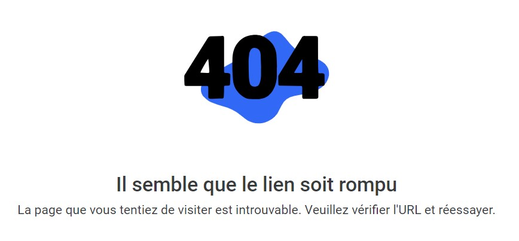
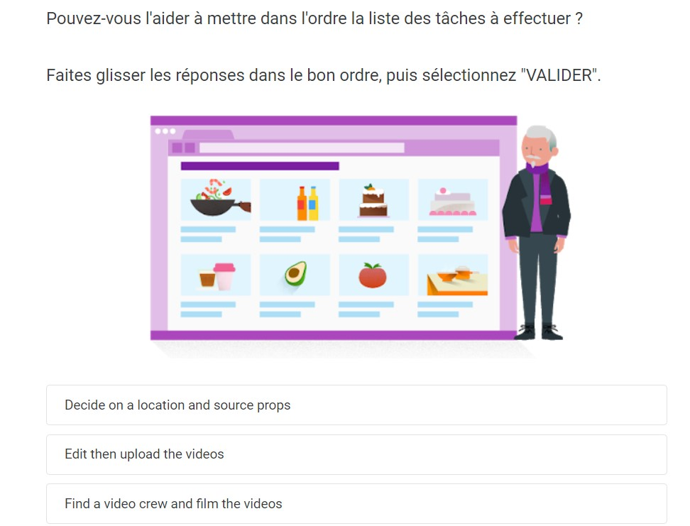
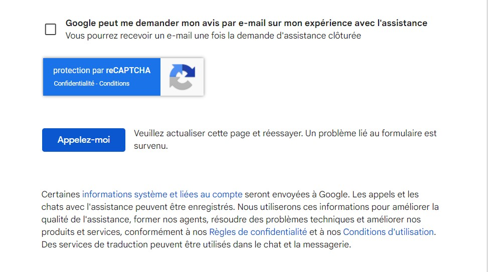
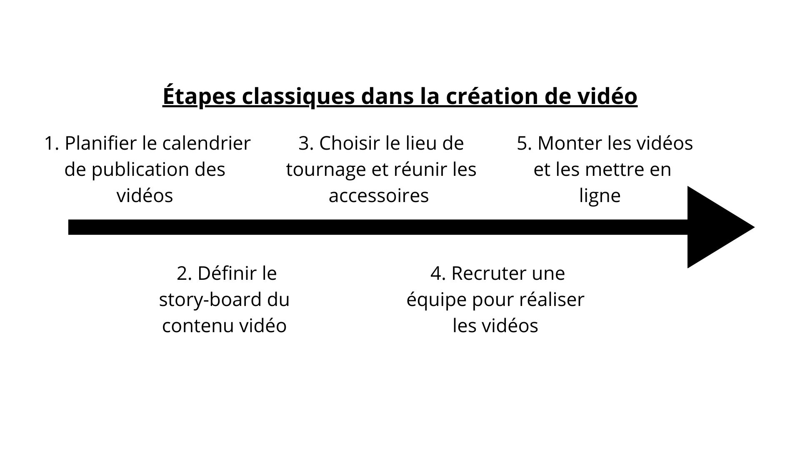
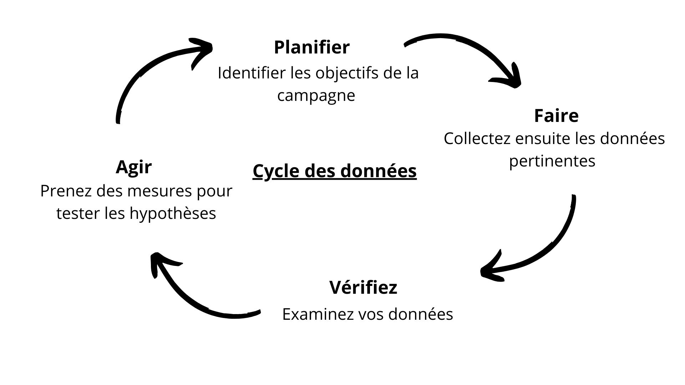


Avoir un cerveau à moitié allumé et encore...


---

## Table des matières

1. [Introduction](#section-1)
2. [Le marketing à notre ère](#section-2)
   - [Le téléphone](#subsection-1)
   - [Les emails](#subsection-1)
   - [Publicité display contre les liens sponsorisés (SEM)](#subsection-3)
3. [La vidéo](#section-3)
   - [D'abord, planifier](#subsection-4)
   - [Des mesures utiles](#subsection-5)
   - [Exploiter les données](#subsection-6)
4. [Créer une boutique en ligne et viser l'international](#subsection-5)
5. [Conclusion et remarques](#section-5)

## 1. Introduction 

Ici, vous trouverez la suite du MON 1-1, sur "Les principes fondamentaux du marketing digital". Suivant la conclusion écrite au MON 1-1, les répétitions sont toujours présentes. Je vais essayer de les éviter le plus possible et de simplement compléter ce qu'il manquait dans le MON 1-1. De plus, autre chose que je n'ai pas mentionné, les exemples ne sont pas forcément toujours pertinents. Je pensais en apprendre plus sur les réseaux sociaux, finalement, nous sommes restés à la surface, ou peut-être est-ce parce qu'il n'y a pas de fond...

Pour une raison qui me dépasse, j'ai rencontré plein de problèmes sur cette moitié de la formation, des erreurs 404 à la pelle et des fautes (?) de traduction.
:-------------------------:|:-------------------------:
 | 

J'ai essayé de reporter le problème à Google, mais même le formulaire n'a pas voulu s'envoyer.
.

Enfin, j'ai réussi à finir la formation tant bien que mal, sans bien saisir le pourquoi du comment.

## 2. Le marketing à notre ère 

### Le téléphone 

Pour améliorer leur présence sur mobiles, la première étape consiste à modifier son site existant afin de le rendre réactif ou **"responsive"**. Ainsi, il s'affiche de façon optimale pour un maximum d'utilisateurs, sur tous les types d'appareils. Pour cela, il est préférable de faire appel à un développeur d'applications professionnel ou d'utiliser un outil en libre-service.
La deuxième étape est d'dentifier son audience, puis la segmenter sous la forme de groupes avant de créer des contenus ciblant ces utilisateurs.
La troisième est de produire des contenus de qualité. Pour ce faire, un moyen simple consiste à élaborer une déclaration de mission en matière de contenu.
Rédigez-la selon le modèle suivant :
Notre [*décrivez l'entreprise ou la marque, par exemple "magasin local d'articles pour animaux"*] propose [*indiquez un service, par exemple "des équipements et des jeux d'excellente qualité pour le dressage canin"*]. Nous nous démarquons [*insérez votre particularité, par exemple "par notre expertise unique"*] et nous avons pour objectif [*indiquez le résultat souhaité pour vos clients, par exemple "de gagner la confiance des nouveaux propriétaires d'animaux domestiques"*]. Votre déclaration de mission en matière de contenu devrait donc se présenter comme suit : "Notre magasin local d'articles pour animaux vous propose des conseils d'expert et des équipements de qualité en matière de dressage canin. Nous sommes là pour vous aider à devenir le meilleur maître possible."
Enfin, on publie le contenu et en faire la promotion auprès des segments d'audience qu'il a définis. On doit toujours privilégier la qualité plutôt que la quantité, et s'efforcer de débuter chaque article par une accroche attrayante.

Ces contenus passent par des canaux qui peuvent être publics ou privés.
Les canaux publics désignent le relais des informations par un tiers, par exemple le partage du contenu par un autre blogger .Ils optimisent la portée et la crédibilité du contenu.
Et, les canaux payants désignent tous les éléments de promotion qui vous sont facturés. Ces canaux peuvent vous permettre de cibler une audience spécifique, en fonction des objectifs et du budget de votre campagne.

### Les emails 

Le **marketing par e-mail** est particulièrement efficace pour entrer et rester en contact avec ses clients. L'objet de vos e-mails doivent donner une bonne première impression, le contenu doit être concis avec de fortes incitations à l'action, et inclure des liens utiles pour les clients.

Grâce aux outils d'analyse, on peut savoir combien de ses e-mails sont ouverts par les utilisateurs (**taux d'ouverture**) et combien de personnes cliquent sur les liens inclus dans les messages (**taux de clic**), et bounce rate (**taux de rebond**) qui est le pourcentage de visiteurs n'ayant pas ouvert une seule page ou cliqué sur un seul lien. On peut également connaître le nombre de ventes générées par ses e-mails. En revanche, l'analyse n'indique pas à quelle fréquence ses e-mails sont directement envoyés à la corbeille par ses clients potentiels. En plus des données décrites ci-dessus, on peut aussi utiliser l'analyse d'audience pour savoir comment les visiteurs interagissent avec son site.

On a parlé de segmentation plus tôt, dans le marketing par e-mail, il est important de faire un "test A/B" qui consiste à segmenter votre audience et à envoyer à chaque groupe une variante distincte de votre e-mail pour rendre les choses plus personnelles et plus attractives.

### Publicité display contre les liens sponsorisés (SEM) 

Les liens sponsorisés et la publicité display peuvent tous deux vous aider à trouver des clients et à accroître votre activité, mais ils fonctionnent différemment.

Les **liens sponsorisés** (ou SEM) apparaissent quand les internautes saisissent des mots-clés spécifiques dans un moteur de recherche et fonctionnent sur un système d'enchères où l'enchérisseur ne paie que s'il y a clic. Les annonces du Réseau de Recherche sont textuelles. Par conséquent, elles sont idéales pour présenter un contenu à des personnes qui s'intéressent déjà à un sujet spécifique. Lorsqu'un utilisateur quitte un moteur de recherche, l'annonceur ne peut plus le cibler avec des annonces textuelles.
On peut alors opter pour des **annonces display**, qui sont diffusées sur n'importe quel site Web où un espace publicitaire payant est disponible. Une annonce display peut contenir des images, ainsi que des éléments audio et vidéo, ce qui la rend souvent plus attrayante et plus créative qu'une annonce textuelle. Ceci peut attirer des personnes qui n'auraient pas spontanément recherché notre site Web.

En plus de ces deux choses, pour faire revenir les clients potentiels sur le site, ceux qui ont débuté la procédure d'inscription par exemple, on peut faire du **reciblage** (ou remarketing). Ceci consiste à placer un cookie sur l'ordinateur ou le navigateur d'un utilisateur qui a visité votre site Web. Ce cookie permet de suivre le comportement de l'utilisateur et de lui présenter ensuite des annonces ciblées lorsqu'il navigue sur d'autres sites Web ou plateformes en ligne. Cela permet de rappeler à l'utilisateur votre produit ou service, ce qui peut augmenter les chances de conversion ou de réengagement.

## 3. La vidéo 

### D'abord, planifier 

La vidéo constitue un élément populaire et attrayant de l'expérience en ligne. Les utilisateurs du monde entier apprécient l'énergie et les messages qu'on peut inclure, de façon extrêmement concise, dans une vidéo. Selon les spécialistes, une minute de vidéo équivaut à 1,8 million de mots !
La publication de vidéos sur des chaînes YouTube pertinentes constitue un moyen efficace pour partager du contenu, car l'audience recherche déjà des vidéos en rapport avec la cuisine. Si on n'est pas prêt à mettre en ligne ses propres vidéos, il peut diffuser des annonces sur les chaînes et les sites d'autres personnes. On peut aussi publier une vidéo sur les réseaux sociaux, mais il doit utiliser sa page professionnelle et non personnelle. Une autre façon d'utiliser la vidéo est d'intégrer cet aspect à ses e-mails, par exemple, pour augmenter le taux d'interaction avec le contenu.

.

En planifiant votre action en amont, vous pouvez tourner plusieurs vidéos en même temps. Cela nécessitera moins d'efforts et de ressources, et donc un budget moins élevé. Afin de limiter les frais, vous pouvez utiliser des téléphones mobiles pour tourner vos vidéos, et le logiciel fourni avec le système d'exploitation de votre ordinateur pour effectuer le montage. N'oubliez pas que l'élaboration du story-board de votre contenu vidéo est une étape essentielle. Elle vous permet de vérifier que tous les paramètres sont définis avant de commencer (dialogues, illustrations, mouvements et angles de la caméra).

### Des mesures utiles 

Grâce à l'analyse d'audience, vous pouvez obtenir de nombreuses informations qui vous permettront de comprendre les visiteurs de votre site Web. Une fois que vous avez clairement défini vos objectifs commerciaux, vous pouvez utiliser les données d'analyse pour affiner et améliorer votre site Web, et atteindre ces objectifs.

Les **statistiques** sont des données numériques mesurables, telles que le temps passé sur le site ou le nombre de pages vues.
Les **conversions** permettent de savoir combien d'utilisateurs ont effectué un objectif souhaité sur votre site (par exemple, l'achat d'un produit ou l'inscription à une newsletter).
Les **dimensions** sont des groupes de données qui permettent de générer un rapport (par exemple, le type d'appareil ou la zone géographique).

Un des principaux avantages qu'offre le numérique pour votre entreprise est de pouvoir évaluer et mesurer votre stratégie de marketing numérique. D'un bout à l'autre du parcours client, l'analyse d'audience vous indique d'où viennent vos visiteurs, ce qu'ils font et comment vous pouvez en inciter davantage à réaliser des « conversions » sur votre site.

### Exploiter les données 

Si vous savez comment transformer vos données numériques en **connaissances exploitables**, vous pourrez améliorer les résultats de vos campagnes en ligne et atteindre plus facilement vos objectifs.

.

Grâce aux outils d'analyse, vous pouvez collecter et examiner des données en temps réel. Les feuilles de calcul sont idéales pour stocker et gérer vos données en matière de marketing numérique.
Réfléchissez aux données relatives à vos actions sur les médias sociaux et essayez de créer une feuille de calcul qui vous permettra d'étudier chaque jour toutes vos statistiques en la matière :

1. Créez une ligne pour chaque média social.
2. Dans les colonnes, saisissez les données suivantes dans la première ligne : nombre d'abonnés, nombre total de J'aime (ou autres statistiques provenant de chaque média social), engagement (par exemple, les retweets/réponses pour Twitter ou les partages/commentaires pour Facebook) et toute autre statistique pertinente par rapport à vos objectifs spécifiques (utilisation des hashtags ou taux de conversion, par exemple).
3. Calculez les totaux et moyennes à l'aide de formules. Veillez à mettre à jour le tableau régulièrement avec les données les plus récentes de façon à pouvoir examiner les performances des médias sociaux au fil du temps.

À l'aide de ce tableau, vous pouvez utiliser des représentations pour faciliter l'interprétation des données et donc les transformer en quelque chose d'exploitable et pertinent. Par exemple, les graphiques à secteurs sont plus efficaces pour illustrer des pourcentages plutôt que des variations ou des tendances. La carte thermique peut représenter des données de localisation. Plus qu'à choisir ce qui pourrait intéresser ou être utile aux investisseurs.

### 4. Créer une boutique en ligne 

Une boutique en ligne simplifie les achats directs sur le site en offrant une plateforme centralisée pour gérer efficacement les commandes des clients, ce qui peut améliorer l'efficacité opérationnelle et la gestion des stocks. Cela permet au propriétaire ou au gérant de suivre facilement les ventes, de gérer les niveaux de stock, de traiter les commandes et de s'assurer que les produits sont expédiés rapidement et de manière efficace.

Avant de se lancer à l'international, vous devez connaître la différence entre "traduction" et "localisation", et vérifier que vous possédez l'infrastructure technique nécessaire pour gérer cette démarche globale. Une fois que vous disposez d'une base solide, vous pouvez diffuser vos annonces dans le monde entier afin de présenter vos messages marketing auprès des bonnes personnes, où qu'elles se trouvent.

La **traduction** consiste à retranscrire le contenu dans une autre langue. Quant à la **localisation**, elle vise à adapter le contenu à une autre culture. Il s'agit, par exemple, de supprimer ou de réécrire les expressions courantes, les tournures idiomatiques ou le contenu humoristique. Plus généralement, le but est d'adapter le site aux besoins du nouveau marché. La localisation peut également consister à modifier des éléments comme la devise, les adresses et les références culturelles afin de rendre le contenu conforme au marché local.

Avant de déterminer si on parviendrait à atteindre nos objectifs de croissance en développant nos activités dans un autre pays, on doit vérifier plusieurs points :

- Les droits de douane
- Les taxes du pays qui nous intéresse
- Les taux de change
- Les exigences en matière de sécurité relatives aux produits
- La nécessité ou non de contracter une assurance Pour obtenir ces informations, il peut commencer par consulter le site Web du gouvernement portugais.

Enfin, on doit également vérifier la procédure d'expédition, ainsi que les délais et les coûts de livraison avant de proposer nos produits à des clients étrangers. L'expédition de produits à l'étranger peut être compliquée et onéreuse. Les transporteurs n'exportent pas tous à l'international, et ils exigent généralement des étiquettes d'expédition spécifiques. Enfin, on doit s'assurer que ses clients auront la possibilité de le contacter depuis l'étranger en cas de problème.

## 5. Conclusion et remarques 

En conclusion, je pense que la formation a fonctionné dans le sens où j'ai bien l'impression d'avoir acquis les bases du marketing digital. Finalement, le plus gros défi n'a pas été de passer la certification, mais de faire cet exercice de rédaction et de synthèse de tous les éléments mentionnés.  
Plus qu'à appliquer ça dans le cadre de la commercialisation d'un futur produit (?) !

Un commentaire sur la formation :
5/10, j'ai appris des choses, mais la forme laisse à désirer et le fond n'est pas profond, sans compter les problèmes techniques. Je pense que prendre le temps d'appliquer toute cette théorie apprise me ferait augmenter la note, mais, au pire, je reviendrai dessus plus tard. Il n'est jamais trop tard pour changer d'avis après tout.

### Sources

[Fondamentaux en marketing digital](https://skillshop.exceedlms.com/student/collection/651479) par Google
