
Avoir un cerveau à moitié allumé pour la partie Google Sheets, par contre, pour Apps Scripts, si vous n'avez aucune connaissance en programmation, il sera facile de prendre peur, mais encore une fois, comme en amour, il faut savoir prendre son temps...


---

## Table des matières

1. [Introduction](#section-1)
2. [Mes deux bases de données pour appliquer ce que j'ai appris](#section-2)
3. [Quelques images](#section-3)
4. [Apps Scripts à la rescousse](#section-4)
5. [Une étude de cas pour la recherche de données avec INDEX et MATCH](#section-5)
6. [Conclusion](#section-6)
7. [Sources](#section-7)

## 1. Introduction <a id="section-1"></a>

Pendant le premier cours d'éco-système digital, on nous a demandé de faire un tableau de données sur Excel/Google Sheets, quelques calculs et donner une représentation pertinente. N'ayant pas Excel, j'ai utilisé Google Sheets.
Et je fus incapable de créer un beau graphique. Quelle ne fut pas ma tristesse.
Il est donc temps de devenir moins idiot. Pour ça, j'ai décidé de faire comme **[Lola BOURDON dans son MON 1.2](../../../Lola-Bourdon/mon/temps-1.2/)** en suivant le cours sur [excel-pratique.com](excel-pratique.com).

Dans ce MON, vous trouverez ce que j'ai trouvé intéressant à souligner et ce que j'ai fait.

Au début, j'ai été ralenti par le fait que le tutoriel soit sur Excel et non sur Google Sheets, car je devais toujours trouver l'équivalent sur Google Sheets, et la syntaxe changeait parfois.
**Puis, quelques jours plus tard**, quand je suis arrivé aux graphiques Sparkline - graphes miniatures qu'on peut mettre dans les cellules - et que je bloquais, car je ne trouvais pas la bonne syntaxe pour la fonction **SPARKLINE**, **j'ai découvert qu'il existait la même formation pour Google Sheets** ([sheets-pratique.com](https://www.sheets-pratique.com))... Comme quoi, je ne suis pas le couteau le plus affûté du tiroir.

A partir de ce moment-là, tout s'est accéléré.
Je me suis appuyé sur une base de données que j'ai moi-même faite à l'époque pour rire où avec des amis nous avions mis des notes sur l'apparence des Miss pour Miss France 2022 et des acteurs (égalité des sexes). C'est très superficiel, j'entends. Je m'en excuse.

## 2. Mes deux bases de données sur lesquelles je me suis amusé <a id="section-2"></a>

**Base de données 1 sur les Miss**
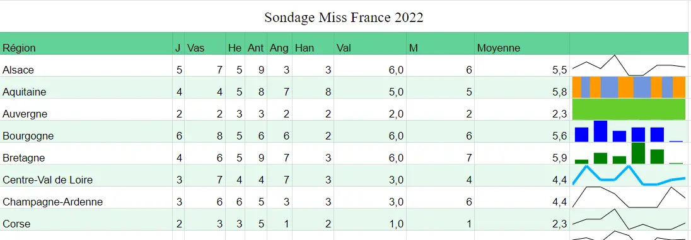

**Base de données 2 sur des acteurs/célébrités**
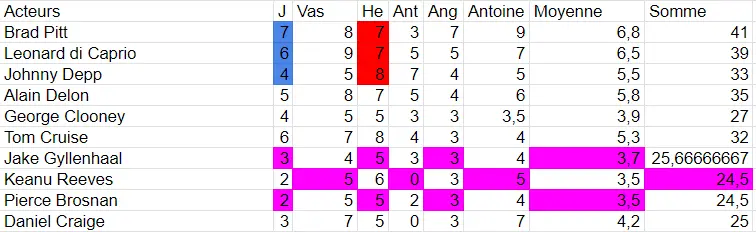

## 3. Quelques images <a id="section-3"></a>

**Utilisation de filtres**
:-------------------------:|:-------------------------:
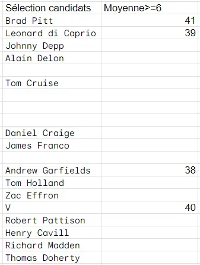 | 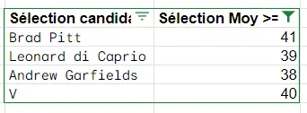
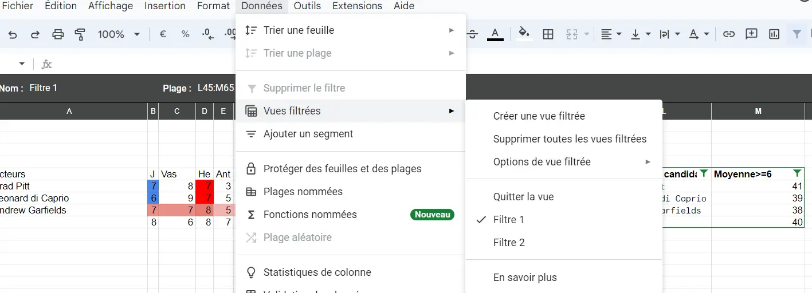

**Mise en forme conditionnelle avec dégradé de couleurs**
:-------------------------:|:-------------------------:
 | 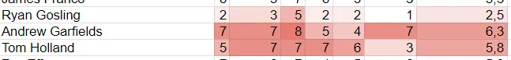

**Graphes**
:-------------------------:|:-------------------------:
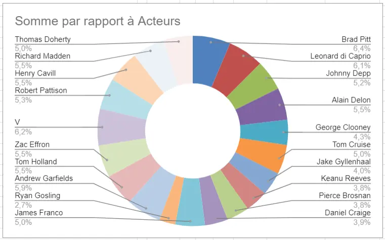 | 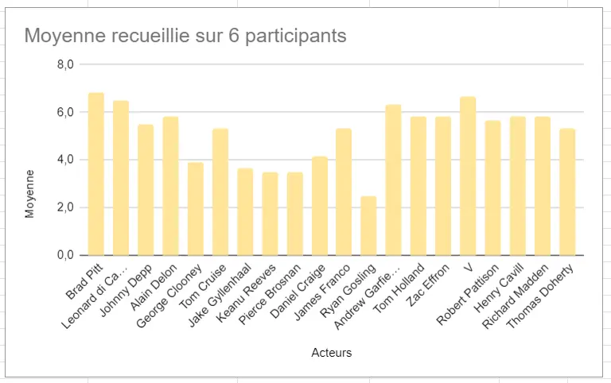

**Tableau croisé dynamique à partir du classement des Miss- FAIL**
:-------------------------:|:-------------------------:
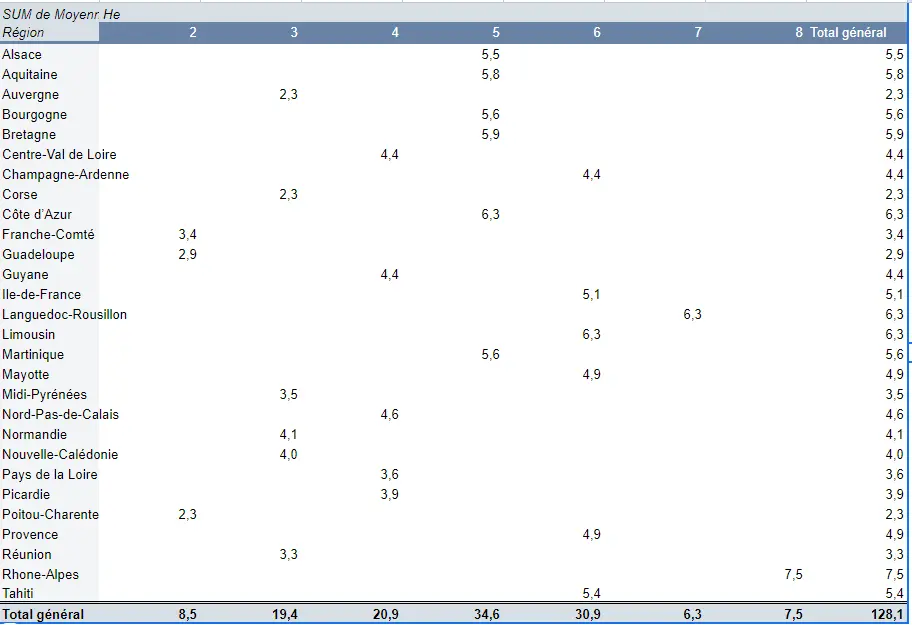 | 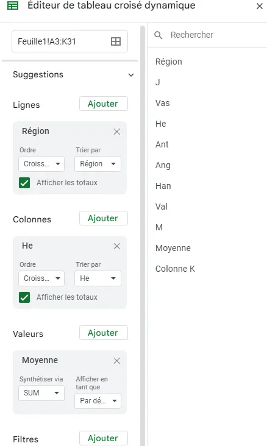

Première chose, je suis déçu. Je pensais que la création d'un tableau croisé dynamique était un truc de malade, mais il s'agit simplement de cliquer sur deux boutons...
Deuxième chose, je me suis rendu compte que la façon avec laquelle j'ai rempli ma base de données ne convenait pas à une analyse par tableaux croisés dynamiques. Doublement déçu.

Que faire ? Refaire une base de données à la main ? Pfff. Bande de fous. QUE NENNI !

Il est temps de voir ce qu'est App Scripts, l'équivalent du VBA sur Excel :o.

## 4. App Scripts à la rescousse <a id="section-4"></a>

Eh bien, en fait. App Scripts, c'est un langage de programmation. Pourquoi personne ne me l'a jamais dit ?! J'avais toujours cette image obscure de la chose et pis en fait, c'est juste du code. (-.-)
En plus, c'est un langage qui est plutôt facile à prendre en main pour l'usage que je prévois d'en faire (#J'ai menti, j'ai souffert).

M'appuyant sur mon B2 en Python et mon A1 en C#, Java, j'ai donc suivi le tutoriel sur ([sheets-pratique.com/fr/apps-script](https://www.sheets-pratique.com/fr/apps-script)) avec des étoiles dans les yeux.
Il est divisé en 12 parties que j'ai survolées (peut-être un peu trop vite parfois).
Après avoir lu et noté ce dont j'aurai besoin pour ma tâche qui était de réécrire mon tableau sous une forme plus appropriée, je suis parti comme une flèche (ou plutôt une tortue asthmatique et amnnésique).



```
function copy(list, count) {
  var L = [];
  for (var i = 0; i < count; i++) {
    for (var j = 0; j < list.length; j++){
      L.push([list[j]]);
    }

    }

  return L;
}


function main(){

const feuille = SpreadsheetApp.getActive();
const f = feuille.getSheetByName('training');

const nom = ['J', 'Vas', 'He', 'Ant', 'Ang', 'Han', 'Val', 'M']
const regions = [
    "Alsace", "Aquitaine", "Auvergne", "Bourgogne", "Bretagne", "Centre-Val de Loire",
    "Champagne-Ardenne", "Corse", "Côte d’Azur", "Franche-Comté", "Guadeloupe", "Guyane",
    "Ile-de-France", "Languedoc-Rousillon", "Limousin", "Martinique", "Mayotte",
    "Midi-Pyrénées", "Nord-Pas-de-Calais", "Normandie", "Nouvelle-Calédonie", "Pays de la Loire",
    "Picardie", "Poitou-Charentes", "Provence", "Réunion", "Rhone-Alpes", "Tahiti"
  ];
var L =[]
for (var i = 0; i < regions.length; i++) {
  var x = regions[i];
  for (var j = 0; j < 8; j++) {
    L.push([x]);
  }
}

const plage = f.getRange('A2:A225')
plage.setValues(L)

const plage2 = f.getRange('B2:B225')
var L2 = copy(nom, 28)
plage2.setValues(L2)
}

```



Deuxième et finale charge, let's gooooooooooooo !



```
//Pour avoir les noms des participants à côté des régions
function copy(list, count) {
  var L = [];
  for (var i = 0; i < count; i++) {
    for (var j = 0; j < list.length; j++){
      L.push([list[j]]);
      }

    }
  return L;
}

//fonction main pour éxécuter tout ça
function main(){

  const feuille = SpreadsheetApp.getActive();
  const f1 = feuille.getSheetByName('Feuille1')
  const f2 = feuille.getSheetByName('training');

  var regions = f1.getRange("A4:A31").getValues(); //Retourne une liste de liste des régions
  var noms = f1.getRange("B3:I3").getValues(); //Retourne une liste de liste de noms
  var notes = f1.getRange("B4:I31").getValues(); //Retourne une matrice de notes

  //Création d'une liste avec les régions*nombre de participants au sondage = 1ère colonne
  var L1 =[]
  for (var i = 0; i < regions.length; i++) {
    var x = regions[i];
    for (var j = 0; j < 8; j++) {
      L1.push(x);
    }
  }
  const plage = f2.getRange('A2:A225')
  plage.setValues(L1)

  //Création de la liste avec les différents noms = 2ème colonne
  const plage2 = f2.getRange('B2:B225')
  var L2 = copy(noms[0], 28)
  plage2.setValues(L2)

  //Création de la liste des notes = 3ème colonne, j'ai eu de la chance que getRange me donne les notes dans une forme qui m'arrange
  const plage3 = f2.getRange('C2:C225')
  var L3 = []
  for (var k = 0; k < notes.length; k++){
    for (var l = 0; l < notes[0].length; l++){
      L3.push([notes[k][l]])
    }
  }
  plage3.setValues(L3)
}
```



Voilà le résultat magnifique :
**Avant**


**Après**
:-------------------------:|:-------------------------:
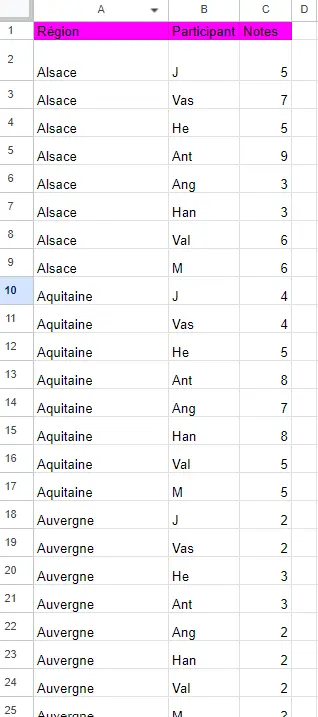 | 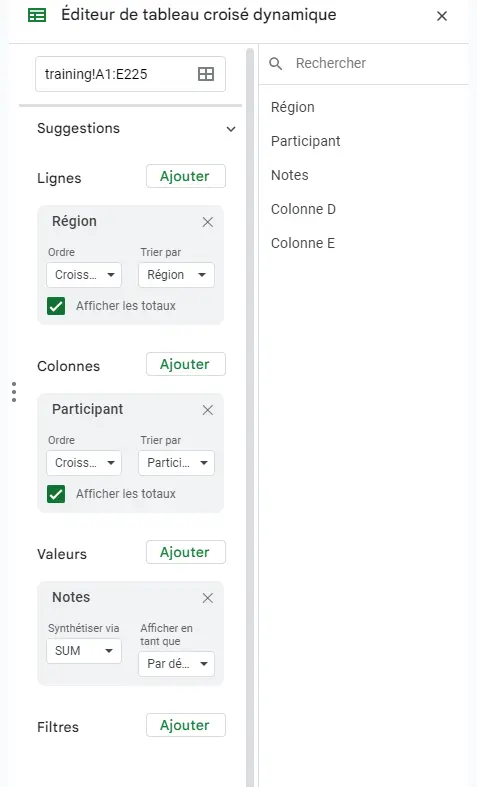
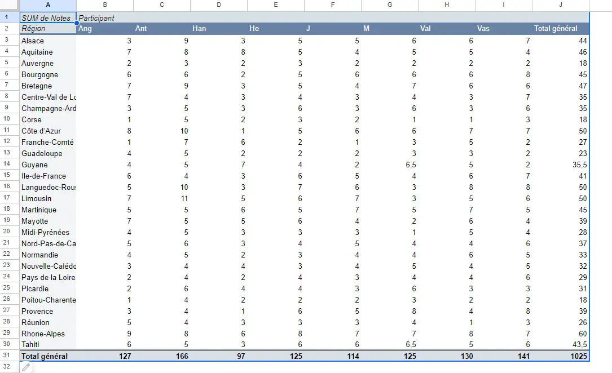

## 5. Une étude de cas pour la recherche de données avec INDEX et MATCH <a id="section-5"></a>

Le but est de créer une facture qui est complétée automatiquement avec seulement le nom du client, le code et la quantité des articles achetés.

Voici le document qui est séparée en quatre feuilles.
:-------------------------:|:-------------------------:
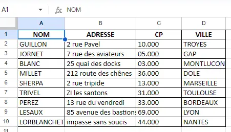 | 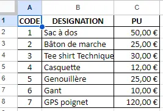

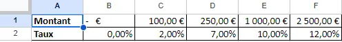 | 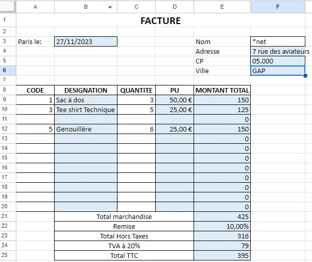

Pour ça, j'ai utilisé les fonctions INDEX et MATCH qui sont finalement analogues à VLOOKUP et plusieurs fonctions IF.

```
=INDEX(A2:D11; 4; 3)
INDEX(table; ligne; colonne) retourne la valeur qui se trouve à la ligne 4, colonne 3 dans le tableau qui couvre A2:D11.

=MATCH("drôle"; A2:A11; 0)
MATCH(valeur; table; 0 pour avoir la valeur exacte et 1 pour approximation) retourne la position de "drôle" dans la colonne A2:A11, qui est donc ici une ligne.
```

MATCH peut faire la même recherche dans une ligne et retourner une colonne.
Et c'est ce qu'on va utiliser pour combiner MATCH et INDEX.
Adresse! qui est devant la table choisie signifie qu'on extrait les données de la feuille Adresse.

```
=INDEX(Adresse!A$1:D$10;MATCH(F$3;Adresse!A$1:A$10;0);MATCH(E4;Adresse!A$1:D$1;0))
```

Puis j'ai utilisé des IF pour pouvoir mettre en place la remise automatique/dynamique.

```
=IF(E21>=Remise!C1;IF(E21>=Remise!D1;IF(E21>=Remise!E1;IF(E21>=Remise!F1;Remise!F2;Remise!E2);Remise!E2);Remise!D2);Remise!B2)
```

## 6. Conclusion <a id="section-6"></a>

J'ai l'impression à peu près fait le tour de Google Sheets en terme de fonctionnalités. Par contre, quant à Apps Scripts, je n'ai qu'effleuré la surface de son potentiel. A voir si j'en ai besoin dans ma vie.

Le MON s'est plutôt bien passé, j'ai bien aimé (et beaucoup souffert psychologiquement pendant la partie Apps Scripts, moi qui ne suis pas un fan de programmation).

## 7. Sources <a id="section-7"></a>

[Formation en Excel](excel-pratique.com) par excel-pratique.com
[Formation en Google Sheets](https://www.sheets-pratique.com/) par sheets-pratique.com
[Formation en Apps Scripts](https://www.sheets-pratique.com/fr/apps-script) par sheets-pratique.com
