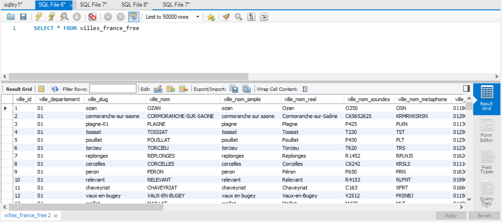
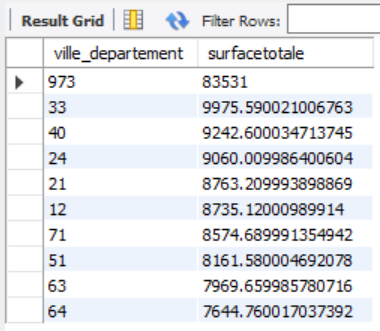
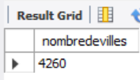
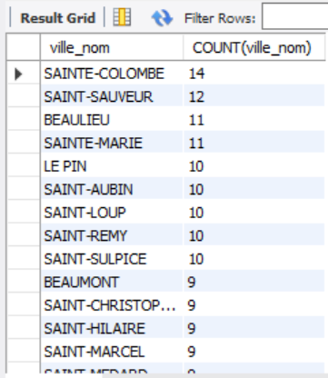
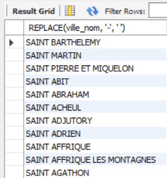
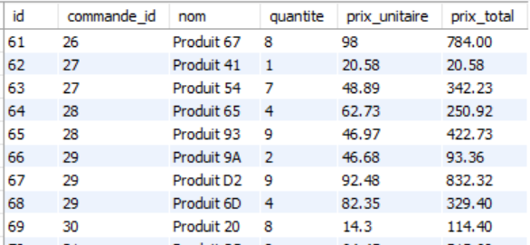
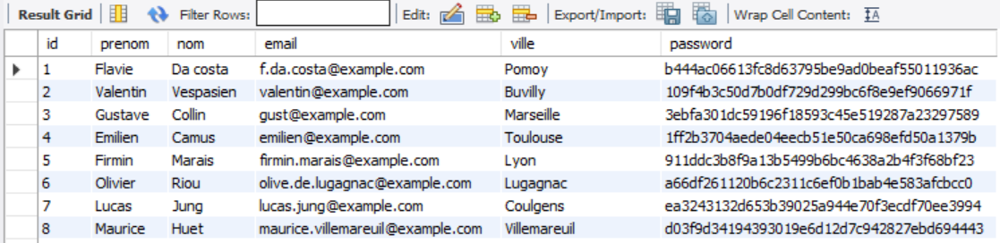
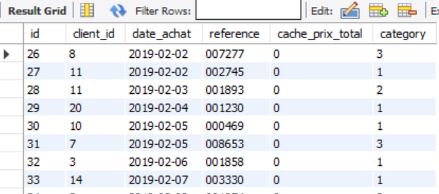
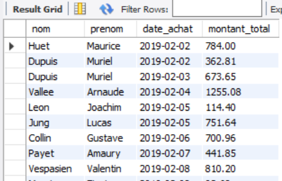
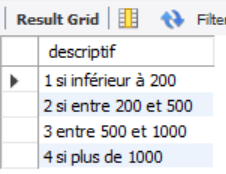

<!-- ---
layout: layout/mon.njk

title: "Dépoussiérer ses connaissances en SQL et Python pour l'analyse de données"
authors:
  - TAING Henri

date: 2023-10-15

tags:
  - "temps 2"
  - SQL
  - Python

résumé: "Un vieux qui reprend ce qu'il a appris dans l'espoir de faire des jolis graphes"
---


Avoir un cerveau à moitié allumé


---

## Table des matières

1. [Introduction](#section-1)
2. [SQL débutant](#section-2)
3. [SQL intermédiaire](#section-3)
4. [Rappels sur Python et ses librairies pour l'analyse de données](#section-4)
5. [Quelques résultats et représentations à partir d'une base de données sur le Speed Dating](#section-5)
6. [Conclusion](#section-6)
7. [Sources](#section-7)

## 1. Introduction <a id="section-1"></a>

En finissant mon MON 2-1, je me suis dit "Quand même, pas de jointure sur Google Sheets, c'est audacieux, en SQL, on en faisait à l'époque. Attends. Comment on fait déjà ?!"
Puis étant dans ma phase "J'adore jouer avec des données", SQL s'est imposé comme une nécessité.

Il est donc temps de dépoussiérer tout ça. Pour ça, j'ai décidé de réapprendre SQL en essayant directement de résoudre les exercices faciles et intermédiaires proposés par [sql.sh](https://sql.sh/exercices-sql).

## 2. SQL débutant <a id="section-2"></a>

J'ai appris le SQL à la va-vite en classes préparatoires. Ça doit être comme le vélo, non ? Ça ne s'oublie pas.
Eh bien, je me suis souvenu que j'étais nul au vélo. Heureusement, le site est bien documenté et les explications super bien ficelés. Dès que j'avais un trou de mémoire, je m'y référais.
J'ai utilisé MySQL, car c'était ce que j'utilisais en classes préparatoires.

Voici à quoi ressemble la base de données qu'on extrait à l'aide de la commande SELECT.
**Base de données sur les villes françaises**


Ci-dessous, la syntaxe classique :

```
SELECT *
FROM table
WHERE condition
GROUP BY nom_colonne
HAVING condition avec une fonction
{UNION | INTERSECT | EXCEPT}
ORDER BY DESC/ASC
LIMIT nombre
OFFSET début

```

Je vous fais part des questions que j'ai trouvé intéressantes dans le sens où elles me serviront comme fiches pour réapprendre quand je réoublierai, car je sais que ça arrivera très vite.



```
SELECT ville_departement, SUM(ville_surface) as surfacetotale FROM villes_france_free
GROUP BY ville_departement
ORDER BY surfacetotale DESC
```



**Résultat sur la table**




```
SELECT COUNT(ville_nom) as nombredevilles FROM villes_france_free
WHERE LEFT(ville_nom, 5) = "Saint";

LEFT(valeur, nombre de lettres en partant de la gauche) = "Ce qu'on cherche" - Sert de condition pour WHERE
```


**Résultat sur la table**




```
SELECT ville_nom, COUNT(ville_nom) FROM villes_france_free
GROUP BY ville_nom
HAVING COUNT(ville_nom) > 1
ORDER BY COUNT(ville_nom) DESC
```



**Résultat sur la table**




```
SELECT REPLACE(ville_nom, '-', ' ') FROM villes_france_free
WHERE LEFT(ville_nom, 5) = 'Saint';

REPLACE(valeur, 'ce qu'on veut remplacer', 'par quoi on veut le remplacer') - Après SELECT
```


**Résultat sur la table**


## 3. SQL intermédiaire <a id="section-3"></a>

Les questions niveau intermédiaire étaient moins claires, dans le sens où je n'avais pas l'impression de comprendre parfaitement ce qu'ils attendaient.
J'ai fait ce que je pensais qu'il fallait faire.

Voici les trois tables à ma disposition qui ont été modifiées au fur et à mesure :
:-------------------------:|:-------------------------:
 | 



Une remarque, il m'a fallu désactiver le "Safe mode" pour pouvoir changer les lignes de mon tableau à la question 4 par exemple, il est conseillé de le réactiver après pour éviter des bêtises.

```
SET SQL_SAFE_UPDATES = 0;
Désactivation du safe mode

SET SQL_SAFE_UPDATES = 1;
Activation du safe mode
```



```
ALTER TABLE commande_ligne   // Sélectionne la table à modifier
MODIFY prix_total DECIMAL(10, 2);   // Pour changer le type
SET SQL_SAFE_UPDATES = 0; // A remettre à 1 plus tard, permet d’éviter de modifier des tables
UPDATE commande_ligne    // Sélectionne la table qu'on veut mettre à jour
SET prix_total = prix_unitaire * quantite;     // Change la valeur de la colonne pour celle que l'on désire

```


La question 5 résume bien comment joindre plusieurs tables.


```
SELECT client.nom, client.prenom, commande.date_achat, SUM(commande_ligne.prix_total) AS montant_total
FROM client
JOIN commande ON client.id = commande.client_id  (Première jointure sur une clé commune)
JOIN commande_ligne ON commande.id = commande_ligne.commande_id
GROUP BY client.nom, client.prenom, commande.date_achat (Pour résoudre les problèmes d’aggrégation)
```


**Résultat**


La question 10 nous apprend à ajouter et modifier une colonne.



```
ALTER TABLE commande
ADD category VARCHAR(255)    // Ajoute une colonne de type VARCHAR(255)
```


La question 11 nous apprend à utiliser IF.


```
UPDATE commande
JOIN commande_ligne ON commande.id = commande_ligne.commande_id
SET category =
  IF(commande_ligne.prix_total <= 200, "1",
     IF(commande_ligne.prix_total <= 500, "2",
        IF(commande_ligne.prix_total <= 1000, "3", "4")
     )
  );
```



```
UPDATE commande
JOIN commande_ligne ON commande.id = commande_ligne.commande_id
SET category =
  CASE
    WHEN commande_ligne.prix_total <= 200 THEN "1"
    WHEN commande_ligne.prix_total > 200 AND commande_ligne.prix_total <= 500 THEN "2"
    WHEN commande_ligne.prix_total > 500 AND commande_ligne.prix_total <= 1000 THEN "3"
    ELSE "4"
  END;
```


Les questions 12 et 13 nous apprend à créer une nouvelle table et y insérer des valeurs.

```
CREATE TABLE commande_category (descriptif VARCHAR(255))

INSERT INTO commande_category (descriptif)
 VALUES
 ('1 si inférieur à 200'),
 ('2 si entre 200 et 500'),
 ('3 entre 500 et 1000'),
 ('4 si plus de 1000');

```


**Notre quatrième table**


## 4. Rappels sur Python et ses librairies pour l'analyse de données <a id="section-4"></a>

**Utilisation de filtres**
:-------------------------:|:-------------------------:
 | 


**Mise en forme conditionnelle avec dégradé de couleurs**
:-------------------------:|:-------------------------:
 | 

**Graphes**
:-------------------------:|:-------------------------:
 | 

**Tableau croisé dynamique à partir du classement des Miss- FAIL**
:-------------------------:|:-------------------------:
 | 

Première chose, je suis déçu. Je pensais que la création d'un tableau croisé dynamique était un truc de malade, mais il s'agit simplement de cliquer sur deux boutons...
Deuxième chose, je me suis rendu compte que la façon avec laquelle j'ai rempli ma base de données ne convenait pas à une analyse par tableaux croisés dynamiques. Doublement déçu.

Que faire ? Refaire une base de données à la main ? Pfff. Bande de fous. QUE NENNI ! (Je regrette ce choix...)

Avec les 5 heures qu'il me reste, il est temps de voir ce qu'est App Scripts, l'équivalent du VBA :o. Va-t-il m'apporter une solution ou sera-t-il un trou sans fond de connaissances ?

## 5. Quelques résultats et représentations à partir d'une base de données sur le Speed Dating <a id="section-5"></a>

Eh bien, en fait. App Scripts, c'est un langage de programmation. Pourquoi personne ne me l'a jamais dit ?! J'avais toujours cette image obscure de la chose et pis en fait, c'est juste du code. (-.-)
En plus, c'est un langage qui est plutôt facile à prendre en main pour l'usage que je prévois d'en faire (#J'ai menti, j'ai souffert).

M'appuyant sur mon B2 en Python et mon A1 en C#, Java, j'ai donc suivi le tutoriel sur ([sheets-pratique.com/fr/apps-script](https://www.sheets-pratique.com/fr/apps-script)) avec des étoiles dans les yeux.
Il est divisé en 12 parties que j'ai survolées (peut-être un peu trop vite parfois) :

1. Introduction [X]
2. Variables et tableaux [X]
3. Feuilles et cellules [X]
4. Conditions [X]
5. Boucles [X]
6. Fonctions [X]
7. Tableaux avancés [X]
8. Déclencheurs [X]
9. Menus [X]
10. Boîtes de dialogue [X]
11. Fenêtres personnalisées [X]
12. Compléments [X]

C'était intéressant de voir la liberté qu'on avait avec App Scripts, mais comme le bon Centralien que je suis, je suis allé vers l'essentiel.
Après avoir lu et noté ce dont j'aurai besoin pour ma tâche qui était de réécrire mon tableau sous une forme plus appropriée, je suis parti comme une flèche (ou plutôt une tortue asthmatique et amnnésique).

## 6. Conclusion <a id="section-6"></a>

J'ai l'impression à peu près fait le tour de Google Sheets en terme de fonctionnalités. Par contre, quant à Apps Scripts, je n'ai qu'effleuré la surface de son potentiel. A voir si j'en ai besoin dans ma vie.

Le MON s'est plutôt bien passé, j'ai bien aimé (et beaucoup souffert psychologiquement pendant la partie Apps Scripts, moi qui ne suis pas un fan de programmation). Je dirai que j'ai passé un poil plus que 10h, mais on va dire que ça valait le coup.

## 7. Sources <a id="section-7"></a>

[Formation en Excel](excel-pratique.com) par excel-pratique.com
[Formation en Google Sheets](https://www.sheets-pratique.com/) par sheets-pratique.com
[Formation en Apps Scripts](https://www.sheets-pratique.com/fr/apps-script) par sheets-pratique.com
 -->
