
Avoir un cerveau à moitié allumé et quelques connaissances en Python


---

## Table des matières

1. [Introduction](#section-1)
2. [SQL débutant](#section-2)
3. [SQL intermédiaire](#section-3)
4. [Quelques résultats et représentations à partir d'une base de données sur le Speed Dating](#section-4)
5. [Conclusion](#section-5)
6. [Sources](#section-6) 

## 1. Introduction <a id="section-1"></a>

En finissant mon MON 2-1, je me suis dit "Quand même, pas de jointure sur Google Sheets, c'est audacieux, en SQL, on en faisait à l'époque. Attends. Comment on fait déjà ?!"
Puis étant dans ma phase "J'adore jouer avec des données", SQL s'est imposé comme une nécessité, ne serait-ce que pour réapparendre la logique. Puis, je suis passé sur Python avec ses bibliothèques Pandas, Numpy, Matplotlib et Plotly. 

Ce MON sera donc une fiche mémo vers laquelle je me tournerai à chaque fois que j'aurai un trou de mémoire.

Il est donc temps de dépoussiérer tout ça. 

## 2. SQL débutant <a id="section-2"></a>

Pour ça, j'ai décidé de réapprendre SQL en essayant directement de résoudre les exercices faciles et intermédiaires proposés par [sql.sh](https://sql.sh/exercices-sql).

J'ai appris le SQL à la va-vite en classes préparatoires. Ça doit être comme le vélo, non ? Ça ne s'oublie pas.
Eh bien, je me suis souvenu que j'étais nul au vélo. Heureusement, le site est bien documenté et les explications super bien ficelés. Dès que j'avais un trou de mémoire, je m'y référais.
J'ai utilisé MySQL, car c'était ce que j'utilisais en classes préparatoires.

Voici à quoi ressemble la base de données qu'on extrait à l'aide de la commande SELECT.
**Base de données sur les villes françaises**
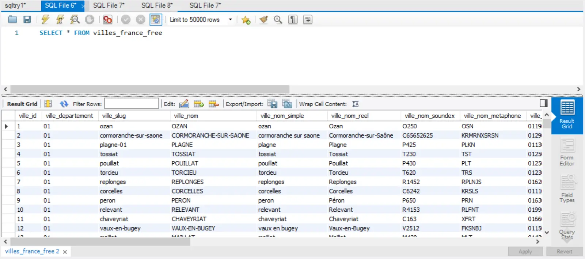

Ci-dessous, la syntaxe classique :

```
SELECT *
FROM table
WHERE condition
GROUP BY nom_colonne
HAVING condition avec une fonction
{UNION | INTERSECT | EXCEPT}
ORDER BY DESC/ASC
LIMIT nombre
OFFSET début
```

Je vous fais part des questions que j'ai trouvé intéressantes dans le sens où elles me serviront comme fiches pour réapprendre quand je réoublierai, car je sais que ça arrivera très vite.



```
SELECT ville_departement, SUM(ville_surface) as surfacetotale FROM villes_france_free
GROUP BY ville_departement
ORDER BY surfacetotale DESC
```



**Résultat sur la table**
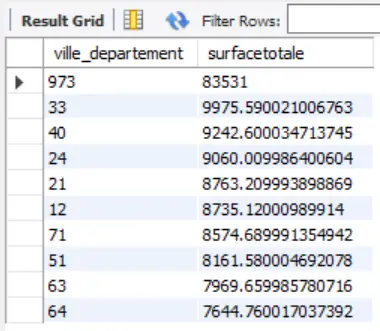



```
SELECT COUNT(ville_nom) as nombredevilles FROM villes_france_free
WHERE LEFT(ville_nom, 5) = "Saint";
LEFT(valeur, nombre de lettres en partant de la gauche) = "Ce qu'on cherche" - Sert de condition pour WHERE
```


**Résultat sur la table**
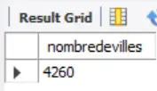



```
SELECT ville_nom, COUNT(ville_nom) FROM villes_france_free
GROUP BY ville_nom
HAVING COUNT(ville_nom) > 1
ORDER BY COUNT(ville_nom) DESC
```



**Résultat sur la table**
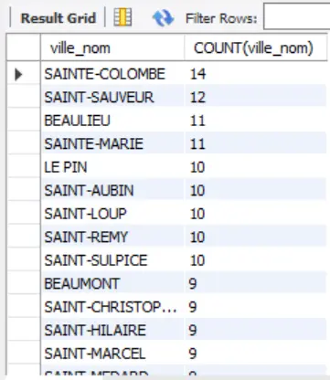



```
SELECT REPLACE(ville_nom, '-', ' ') FROM villes_france_free
WHERE LEFT(ville_nom, 5) = 'Saint';
REPLACE(valeur, 'ce qu'on veut remplacer', 'par quoi on veut le remplacer') - Après SELECT
```


**Résultat sur la table**
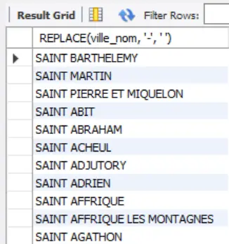

## 3. SQL intermédiaire <a id="section-3"></a>

Les questions niveau intermédiaire étaient moins claires, dans le sens où je n'avais pas l'impression de comprendre parfaitement ce qu'ils attendaient.
J'ai fait ce que je pensais qu'il fallait faire.

Voici les trois tables à ma disposition qui ont été modifiées au fur et à mesure :
:-------------------------:|:-------------------------:
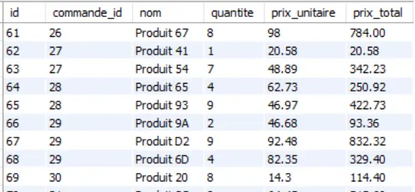 | 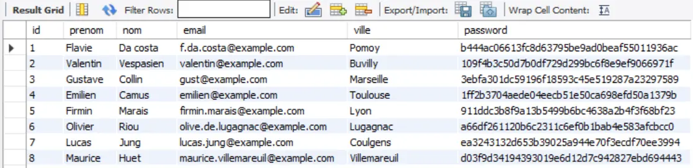

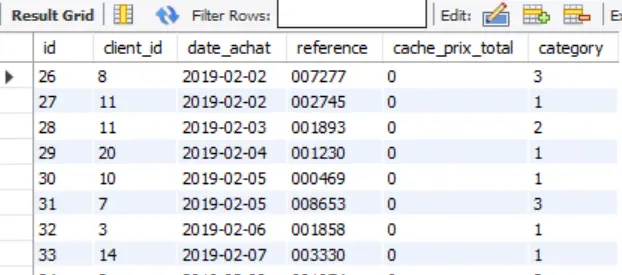

Une remarque, il m'a fallu désactiver le "Safe mode" pour pouvoir changer les lignes de mon tableau à la question 4 par exemple, il est conseillé de le réactiver après pour éviter des bêtises.

```
SET SQL_SAFE_UPDATES = 0;
Désactivation du safe mode
SET SQL_SAFE_UPDATES = 1;
Activation du safe mode
```



```
ALTER TABLE commande_ligne   // Sélectionne la table à modifier
MODIFY prix_total DECIMAL(10, 2);   // Pour changer le type
SET SQL_SAFE_UPDATES = 0; // A remettre à 1 plus tard, permet d’éviter de modifier des tables
UPDATE commande_ligne    // Sélectionne la table qu'on veut mettre à jour
SET prix_total = prix_unitaire * quantite;     // Change la valeur de la colonne pour celle que l'on désire
```


La question 5 résume bien comment joindre plusieurs tables.


```
SELECT client.nom, client.prenom, commande.date_achat, SUM(commande_ligne.prix_total) AS montant_total
FROM client
JOIN commande ON client.id = commande.client_id  (Première jointure sur une clé commune)
JOIN commande_ligne ON commande.id = commande_ligne.commande_id
GROUP BY client.nom, client.prenom, commande.date_achat (Pour résoudre les problèmes d’aggrégation)
```


**Résultat**
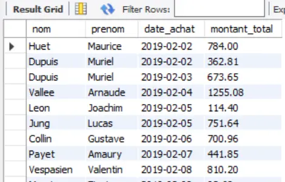

La question 10 nous apprend à ajouter et modifier une colonne.



```
ALTER TABLE commande
ADD category VARCHAR(255)    // Ajoute une colonne de type VARCHAR(255)
```



La question 11 nous apprend à utiliser IF, on peut également utiliser CASE WHEN.



```
UPDATE commande
JOIN commande_ligne ON commande.id = commande_ligne.commande_id
SET category =
  IF(commande_ligne.prix_total <= 200, "1",
     IF(commande_ligne.prix_total <= 500, "2",
        IF(commande_ligne.prix_total <= 1000, "3", "4")
     )
  );
```


Les questions 12 et 13 nous apprennent à créer une table et à y insérer des données.


```
CREATE TABLE commande_category
(descriptif VARCHAR(255))  //nom de la colonne obligatoire

INSERT INTO commande_category (descriptif)
 VALUES
 ('1 si inférieur à 200'),
 ('2 si entre 200 et 500'),
 ('3 entre 500 et 1000'),
 ('4 si plus de 1000');
```


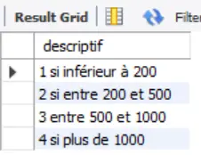

## 4. Un cas pour reprendre l'analyse de données avec Python <a id="section-4"></a>

Pour reprendre mes connaissances en analyse de données avec Python, j'ai fait le choix de reprendre à zéro un début d'étude de cas que j'avais fait l'an dernier. Le but étant de réapprendre, explorer et améliorer. 

La base de données provient de Kaggle et s'appelle [Speed Dating Experiment](https://www.kaggle.com/datasets/annavictoria/speed-dating-experiment) et a été faite à partir d'une expérience conduite par Columbia Business School entre 2002 et 2004. Durant ces événements de "Speed Dating", chaque participant a quatre minutes avec chaque personne du sexe opposé, les participants étant tous soit un homme soit une femme, et hétérosexuels. 
L'idée de cette base de données est de comprendre quels facteurs influencent l'amour au premier regard.

De mon côté, j'ai décidé d'utiliser cette base de données pour répondre aux questions qui m'intéressaient. 
Je vous laisse les images, le code étant organisé et détaillé dans le jupyter notebook ! Il ne faut pas cependant oublier qu'une analyse de données est toujours biaisée, que ce soit par la qualité des données et par la façon de l'analyser et de la faire visualiser.

### Qui a participé à l'événement ? 

**Genre des participants**
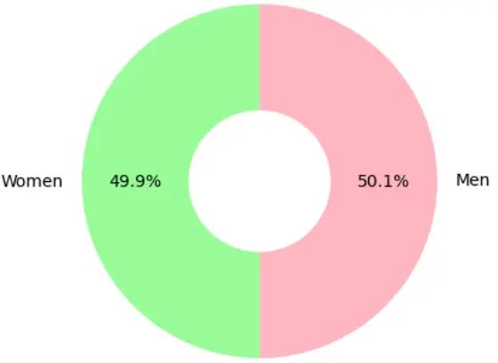

**Origine des participants, car aux Etats-Unis, ça a de l'importance...**
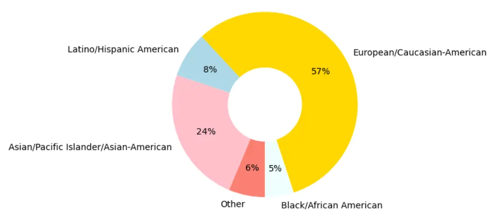

**Domaine d'étude/de travail des participants**
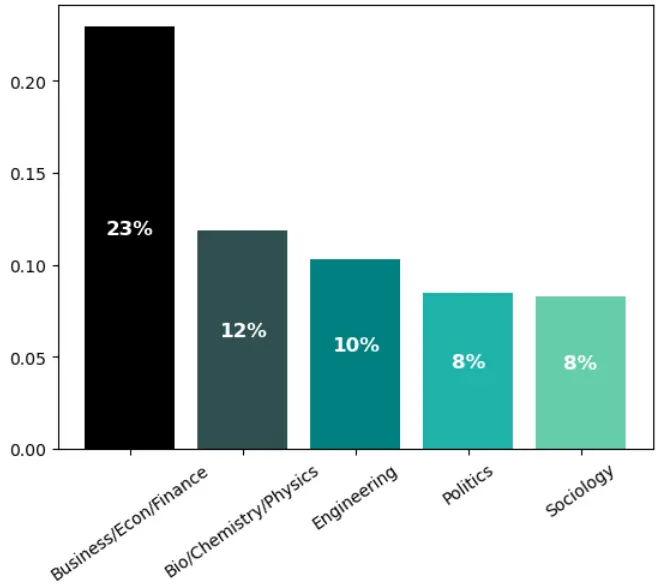

### Avant l'événement

On a posé des questions aux participants avant l'événement. 

**1ère question : Que cherchent les hommes et les femmes chez leurs partenaires ?**
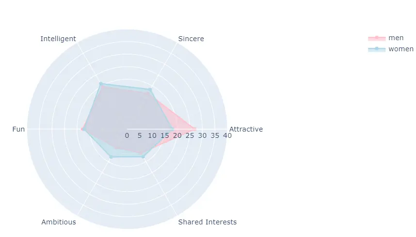

**Superposition de 3 questions, que cherchent les hommes chez leurs partenaires ? Que cherchent les autres hommes chez leurs partenaires d'après eux ? Que cherchent les femmes chez leurs partenaires d'après eux ? Dans l'ordre.**
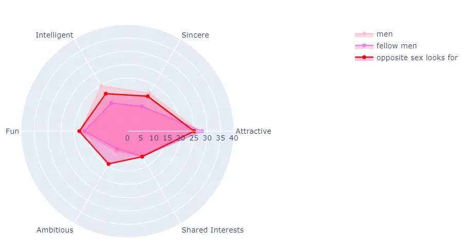

**Superposition de 3 questions, que cherchent les femmes chez leurs partenaires ? Que cherchent les autres femmes chez leurs partenaires d'après eux ? Que cherchent les hommes chez leurs partenaires d'après eux ? Dans l'ordre.**
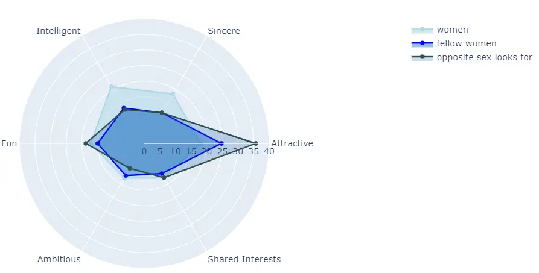

### Au milieu de, et après l'événement

D'autres questions ont été posées au milieu et après l'événement.

**Superposition de 3 questions, que cherchent les hommes chez leurs partenaires (posée avant l'événement) ? Quel est l'importance des différents critères en réalité dans leurs décisions (posée au milieu de l'événement) ? De même, importance des critères en réalité (posée à la fin de l'événement) ? Dans l'ordre.**
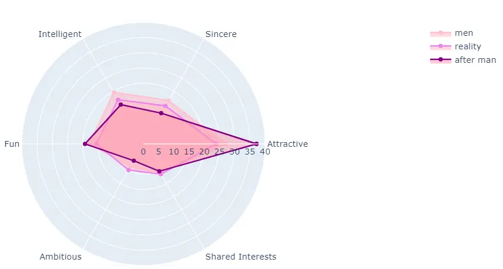

**Superposition de 3 questions, que cherchent les femmes chez leurs partenaires (posée avant l'événement) ? Quel est l'importance des différents critères en réalité dans leurs décisions (posée au milieu de l'événement) ? De même, importance des critères en réalité (posée à la fin de l'événement) ? Dans l'ordre.**
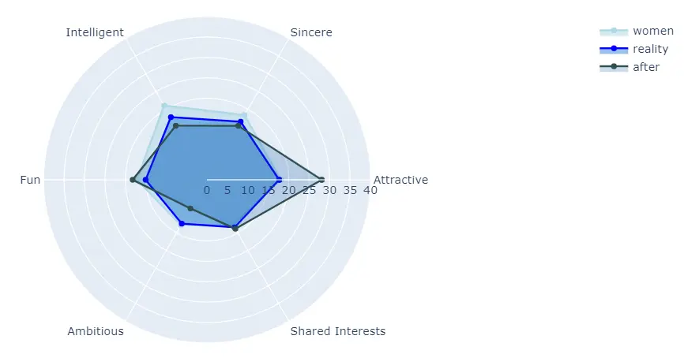

**Superposition de 2 questions, importance des différents critères en réalité dans leurs décisions (posée à la fin de l'événement) chez les hommes et chez les femmes ?**
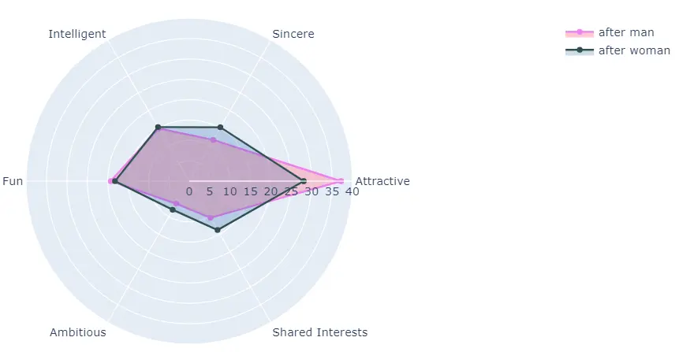

**Comparaison attentes/réalité - Ce que cherchent les femmes chez leurs partenaires d'après les hommes (posée au début de l'événement) et l'importance des critères dans les décisions des femmes (posée à la fin de l'événement)**

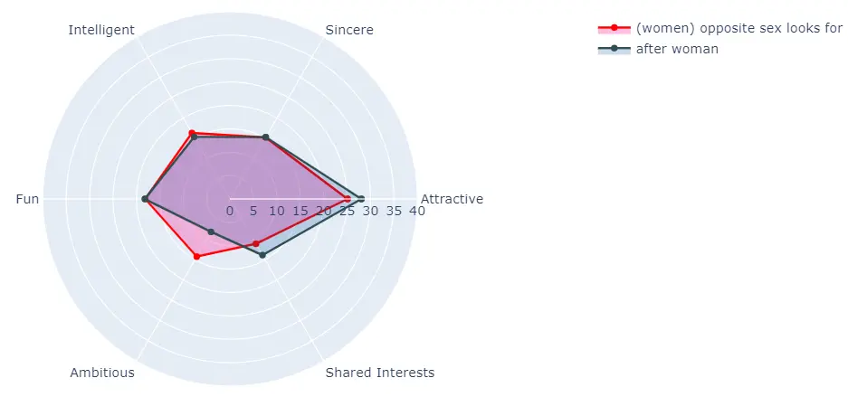

**Comparaison attentes/réalité - Ce que cherchent les hommes chez leurs partenaires d'après les femmes (posée au début de l'événement) et l'importance des critères dans les décisions des hommes (posée à la fin de l'événement)**

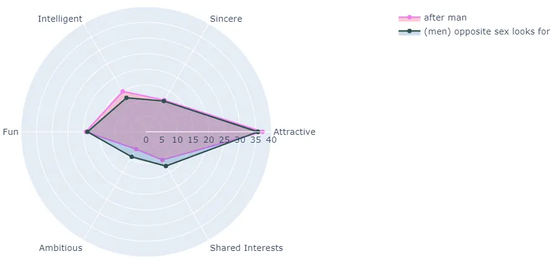

## 5. Conclusion <a id="section-5"></a>

J'ai passé un peu plus que 10h sur le MON, mais c'était un pur plaisir. Les graphes parlent d'eux-mêmes. Ce n'est pas tous les jours qu'on a une démonstration empirique de la superficialité de notre espèce en quelques graphes super jolis. 

## 6. Sources <a id="section-6"></a>

[Exercices SQL](https://sql.sh/exercices-sql)
[Speed Dating Experiment](https://www.kaggle.com/datasets/annavictoria/speed-dating-experiment)
