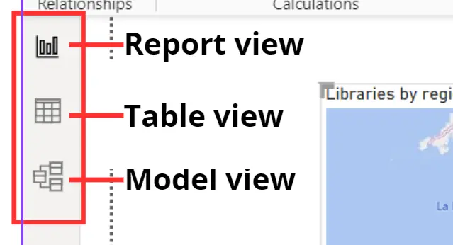
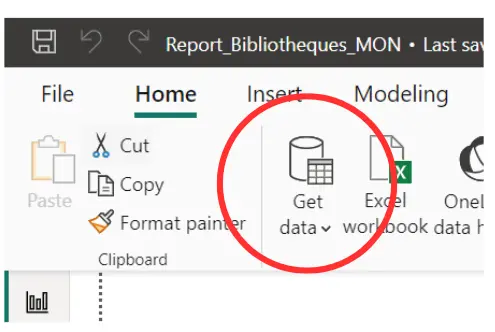
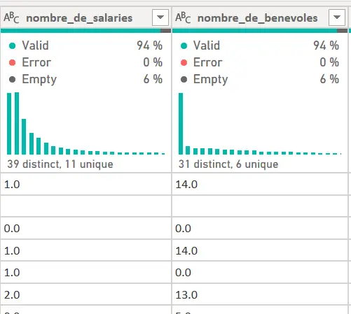
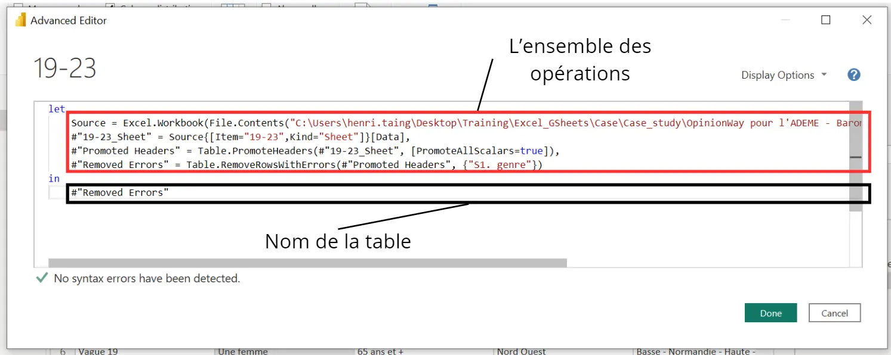
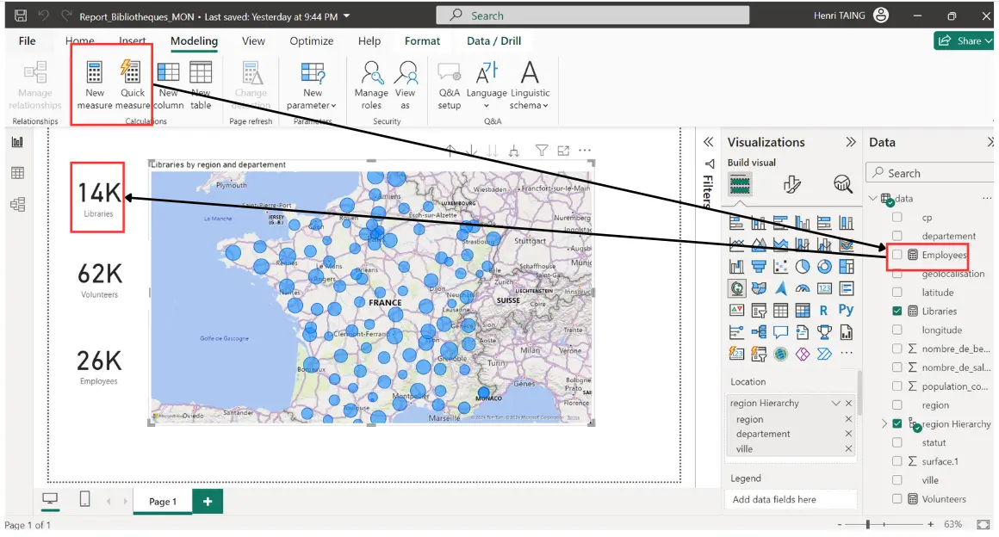
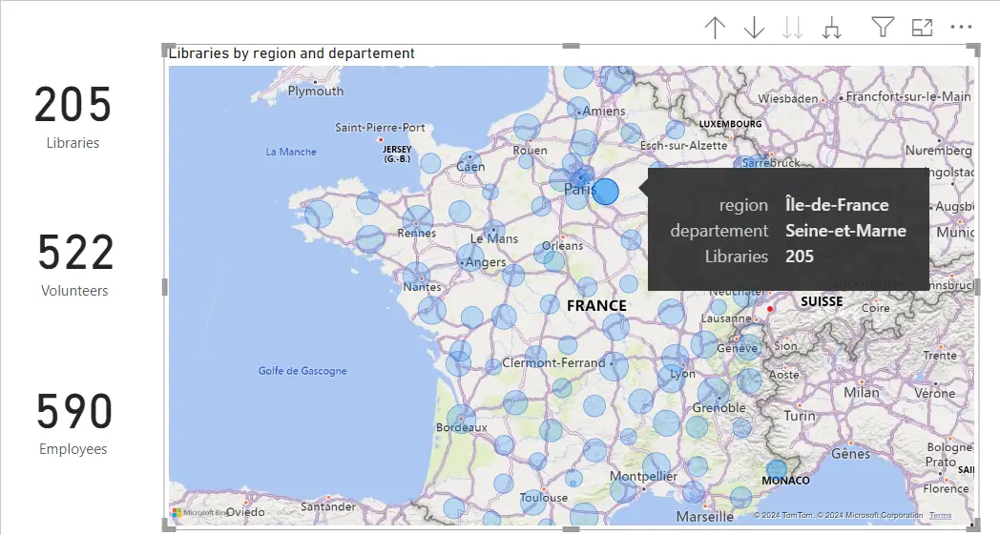
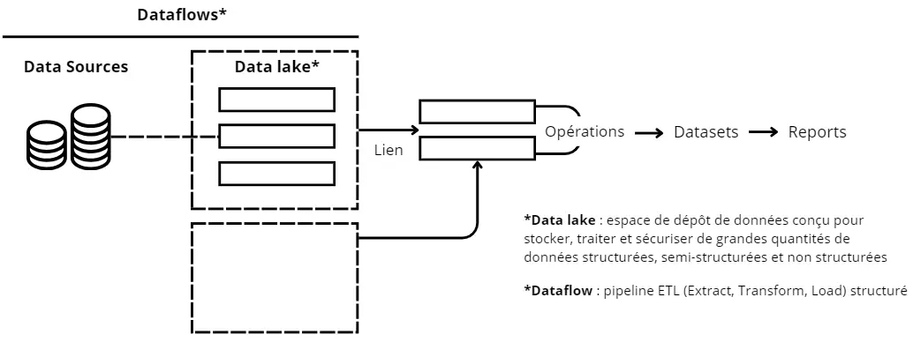


Ne pas avoir peur de tout casser à chaque fois


---

## Table des matières

1. [Introduction](#section-1)
2. [Power BI Desktop](#section-2)
3. [Power BI Service](#section-3)
4. [Conclusion](#section-4)
5. [Sources et horodateur](#section-5) 

## 1. Introduction <a id="section-1"></a>

J'ai mis sur mon CV que je savais utiliser Power BI alors que je n'avais pas fait que joujou rapidement avec. Donc, il est temps de faire de mon bullshit une réalité. 

Je me suis appuyé sur le cours proposé par Skillsoft et mis à disposition par mon entreprise :
[Mastering Power BI](https://www.skillsoft.com/journey/mastering-power-bi-00f66d92-1f14-41d1-9835-249e5ada7126)

Je n'ai comptabilisé que les heures passées sur le premier cours (environ 8h) et le temps de mettre en forme toutes mes notes que j'ai prises durant ces 24 heures de formation (environ 2h).

## 2. Power BI Desktop <a id="section-2"></a>

Il faut savoir premièrement que dans la plupart des cas, vous n'aurez pas à mettre les mains dans le code. Sauf si la base de données utilisée est exécrable. 

**Organisation de Power BI**
Il faut d'abord faire la différence entre Power BI Desktop et Power BI Service :
- Power BI Desktop, application en local,
- Power BI Service, sur le cloud et permet de partager ses rapports en live.

Les deux permettent quasiment les mêmes opérations, mais Power BI Desktop est plus maniable et plus rapide.
On va s'intéresser plus à Power BI Desktop en premier lieu.

**Pour commencer**
Vous avez 3 fenêtres sur la colonne de gauche qui correspondent de haut en bas à votre page de rapport (Report View), votre base de données (Table View) et les liens entre les différentes tables et colonnes (Model View).


Pour **extraire** une base de données qu'on va étudier, analyser puis visualiser, il suffit d'aller dans "Get Data", puis de choisir ce qui vous intéresse.


- Il faut avoir les autorisations nécessaires et ses identifiants si on veut utiliser les données d'un sharepoint de son entreprise par exemple
- Faire attention à bien avoir la même version installée pour SQL Connector et MySQL/SQLServer 
- Utiliser un compte avec le moins de privilèges possible pour des raisons de sécurité, ce genre de comptes peut être créé par exemple quand on utilise Google Cloud ou AWS. 


Une fois votre base de données extraite, il est temps de la transformer.

### Table View
**Transformer avec Power Query Editor**
On peut d'abord consulter les profils des colonnes en faisant un clic droit sur les colonnes et en sélectionnant Column Quality (Valid - Error- Empty) et Column Distribution (Répartition des données entrées dans la colone) ou en allant dans View > Cocher ces mêmes cases. 



Puis changer la première ligne en titre si ce n'est pas fait avec "Use First Row as Headers". 
En faisant ça, une ligne apparaît avec **Promoted Headers** sur la droite dans Query Settings (Si vous ne voyez pas cette fenêtre, il suffit d'aller dans View > Cliquer sur Query Settings). Cette fenêtre fournit un suivi des opérations effectuées sur la table.
Si vous cliquez sur une opération par exemple, vous pouvez voir la formule utilisée écrite en M (langage de PBI) que vous pouvez modifier.
```
= Table.PromoteHeaders(#"Nom_initial_de_la_table", [PromoteAllScalars=true])
```
Si vous appliquez une autre transformation, par exemple, clic droit une colonne et "Remove Errors", on a :
```
= Table.RemoveRowsWithErrors(#"Promoted Headers", {"nom_colonne"})
```
On vient donc d'appliquer Table.RemoveRowsWithErrors à la table précédente nommée "Promoted Headers" à cause de notre transformation (on peut la renommer dans la fenêtre Querry Settings). 

Pour aller plus loin, vous pouvez utiliser l'éditeur avancé : View > Advanced Editor


Pour créer d'autres colonnes, vous pouvez utiliser Add Column :
- Merge Columns pour concaténer des colonnes de la table ou d'autres tables
- Custom Column avec une formule DAX (Data Expressing Formula) avec des IFs, des opérations mathématiques, etc. 
- dans le cas de plusieurs tables, vous pouvez utiliser les colonnes d'autres tables, mais il faut bien vérifier leurs liens logiques dans la partie "Model View". 


- Il existe une fonctionnalité GROUP BY comme en SQL.
- Astuce, si notre base de données contient des erreurs. On peut les filtrer à l'aide de Combine > Merge Queries > Left Anti-join avec table 1 = notre table, table 2 = table d'erreurs et comme clé, la colonne commune. 
- Il est possible de faire des tablés croisés dynamiques et inverser la tranformation (pivot tables et pivot columns)
- Il est possible de combiner deux tables (Queries) avec une similarité plus ou moins élevée avec le fuzzy matching dans Combine > Merge Queries.


### Report View

Au-delà de tous les visuels qu'on peut créer que ce soit grâce aux visuels déjà intégrés dans Power BI ou aux visuels qu'on peut télécharger, une chose que je trouve importante à relever est la "mesure". 
Cette fonctionnalité permet de faire des opérations (en DAX) avec des colonnes sans changer la base de données et avoir d'autres attributs intéressants à exploiter comme par exemple la somme du nombre d'employés. 


Ce qui est aussi intéressant dans Power BI est l'interactivité, on peut soit utiliser un "slicer" qui est en fait un filtre intelligent ou par exemple ici cliquer sur un département et les "cards" vont s'adapter. 


### Model View

C'est ici qu'on va définir les relations entre les différentes tables (ou queries) qu'on a. L'idée est de pouvoir après utiliser les liens entre ses tables pour créer des filtres ou des mesures intéressantes, etc. Il faut évidemment qu'elles aient une clé (attribut) en commun. 

Dans cette partie, on peut aussi explorer la notion de cardinalité et de directionnalité, c'est-à-dire qu'une table va avoir un élément qui va avoir plusieurs liens avec les éléments de l'autre table par exemple, donc une relation "one-to-many" de gauche à droite. Cas concret, un client a plusieurs commandes attribuées à son nom. Ceci doit normalement vous rappeler les notions d'injection, surjection et bijection. 

## 3. Power BI Service <a id="section-3"></a>

Il s'agit de la plateforme en ligne pour pouvoir partager et concevoir vos dashboards.

Avant de s'attaquer à tout ça, récapitulons à quoi ressemble le flux de données (schéma inspiré par le cours Skillsoft) :


Power BI Service va donc nous accompagner pendant tout ce processus. On peut y créer des visuels (qu'on créera plutôt sur Power BI Desktop d'habitude, car plus pratique, pas besoin de connexion), créer des rapports, des métriques et surtout des dashboards (et les alertes, informations intéressantes à exploiter associées) à partir de datasets.
De plus, il y a aussi des fonctions BI IA (qui sont aussi sur Power BI Desktop d'une façon ou d'une autre) super intéressantes, comme la "QA" sur les visuels, les "Get Insights", etc. 


- On peut programmer des actualisations
- On peut aussi utiliser des 'real time datasets' :
  - Push dataset : base de données classique en temps réel
  - Streaming dataset : stockée comme du cache temporaire, donc ne peut être utilisé que pour créer des tuiles (éléments sur un dashboard) et ne peut donc pas être utilisé pour les rapports
  - PubNub : même chose, ne peut être utilisé que pour créer des tuiles et il faut vérifier si le pare-feu de l'ordinateur autorise le lien API
  Dans ces trois cas, il faudra penser à créer une porte d'entrée pour les données (gateway) afin que les données se réactualisent en local et sur le cloud. 


Tous ces objets que vous créerez peuvent après être mis dans une application qui sera déployé. Ce déploiement est pris en charge par Power BI également, au travers de 3 étapes, le développement, les tests et le déploiement. 

Pour gérer tout ça et la sécurité des privilèges, il existe un rôle, celui de Fabric Admin qui va gérer l'accès des équipes BI. 

## 4. Conclusion <a id="section-4"></a>

C'est un outil utile, intelligent et efficace. J'essaierai de l'utiliser plus dans le futur si j'en ai l'occasion. 

## 5. Sources et horodateur <a id="section-5"></a>

Le cours est mis à disposition par mon entreprise CGI. Il s'agit d'une formation proposée par Skillsoft Aspire Journeys. 
[Mastering Power BI](https://www.skillsoft.com/journey/mastering-power-bi-00f66d92-1f14-41d1-9835-249e5ada7126)

Bases de données utilisés pour les exemples : 
[Baromètre des représentations sociales du changement climatique de l'ADEME](https://www.data.gouv.fr/fr/datasets/barometre-representations-sociales-du-changement-climatique/)
[Base de données sur les bibliothèques](https://www.data.gouv.fr/fr/datasets/adresses-des-bibliotheques-publiques-2/#/resources)
**Horodateur** : 
- Vendredi 01/03/2024 : 2h (Début du premier cours)
- Mercredi 06/03/2024 : 3h (Première partie du premier cours)
- Jeudi 07/03/2024 : 3h (Fin du premier cours)
- Vendredi, Samedi, Dimanche : Suite du cours de mon côté
- Lundi 18/03/2024 : 2h (Notes)
- Mardi 19/03/2024 : 2h (Fin des notes)
