
Avoir un cerveau à moitié allumé et avoir fait la formation no/low code (et encore)


## Table des matières

1. [Ce que j'ai prévu au 1er sprint](#section-1)
2. [Ce que j'ai fait au 1er sprint](#section-2)
   - [Qu'est-ce que la RSE ?](#subsection-1)
   - [Axe choisi et entreprises choisies et lecture de rapports](#subsection-2)
   - [Début de la mise en place d'une plateforme en ligne](#subsection-3)
3. [Ce que je prévoyais pour le 2ème sprint](#section-3)
4. [Ce que j'ai fait au 2ème sprint](#section-4)
   - [Ce que j'ai finalement prévu de faire pour le 2ème sprint](#subsection-4)
   - [La RSE et le RGPD ?](#subsection-5)
   - [Analyse RSE](#subsection-6)
5. [Conclusion](#section-5)
6. [Sources](#section-6)

## Ce que j'ai prévu pour le 1er point POK (6h) : limiter la portée 

- Qu'est-ce que la RSE ? [Bien effectué]
- Choisir un axe de la RSE [En cours]
- Choisir 3 entreprises [En réflexion]
- Lire leurs rapports RSE [En cours]
- Mettre en place une plateforme avec un log in/sign in pour entreprises et employés à la manière de Glassdoor [Presque fini]

## Ce que j'ai fait au premier sprint 

### Qu'est-ce que la RSE 

La responsabilité sociétale des entreprises (RSE) également appelée responsabilité sociale des entreprises est définie par la commission européenne comme l'intégration volontaire par les entreprises de préoccupations sociales et environnementales à leurs activités commerciales et leurs relations avec les parties prenantes.

En d'autres termes, la RSE c'est la contribution des entreprises aux enjeux du développement durable.
Une entreprise qui pratique la RSE va donc chercher à avoir un impact positif sur la société tout en étant économiquement viable.

La norme ISO 26000 — ce sont des lignes directrices pour tous ceux qui ont conscience qu’un comportement socialement responsable et respectueux de l’environnement est un facteur clé de la réussite. Non seulement ISO 26000 donne la bonne ligne de conduite à suivre mais, de plus en plus, cette norme est appliquée pour évaluer l’engagement des organisations en faveur du développement durable ainsi que leur performance globale — standard international, définit le périmètre de la RSE autour de sept thématiques centrales :

- la gouvernance de l’organisation
- les droits de l’homme
- les relations et conditions de travail
- l’environnement
- la loyauté des pratiques
- les questions relatives aux consommateurs
- les communautés et le développement local.

Depuis l'entrée en vigueur de la loi PACTE du 22 mai 2019, de nouvelles dispositions sont entrées en vigueur pour renforcer la RSE :

- l'article 1833 du Code civil a été modifié afin que l'objet social de toutes les sociétés intègre la considération des enjeux sociaux et environnementaux
  > Modifié par LOI n°2019-486 du 22 mai 2019 - art. 169, "Toute société doit avoir un objet licite et être constituée dans l'intérêt commun des associés."
- l'article 1835 du Code civil a été modifié pour reconnaître la possibilité aux sociétés qui le souhaitent de se doter d'une raison d'être dans leurs statuts
  > Modifié par LOI n°2019-486 du 22 mai 2019 - art. 169, "Les statuts doivent être établis par écrit. Ils déterminent, outre les apports de chaque associé, la forme, l'objet, l'appellation, le siège social, le capital social, la durée de la société et les modalités de son fonctionnement. Les statuts peuvent préciser une raison d'être, constituée des principes dont la société se dote et pour le respect desquels elle entend affecter des moyens dans la réalisation de son activité."
- le statut d'entreprise à mission a été créé.

### Axe choisi et entreprises choisies et lecture de rapports 

Le choix est difficile à faire, car il dépend des données que je rassemblerais. Au vu des rapports RSE que j'ai lus, beaucoup se focalisent sur l'axe social (sûrement, car le reste n'est pas flatteur), tandis que d'autres essaient tant bien que mal de cacher la misère environnementale produite par leur entreprise.
Si je veux pouvoir comparer plusieurs entreprises, il me faudra des critères qui pourraient s'appliquer à toutes les entreprises choisis.

Dans l'idéal, j'aimerais pouvoir faire un choix définitif sur les entreprises que j'étudierais, mais je ne crois pas avoir assez de recul pour l'instant. Le textile pourrait être une bonne voie, avec Patagonia, Inditex Group (ZARA), Levi's, etc.

### Début de la mise en place d'une plateforme en ligne 

J'ai fait le choix d'utiliser Bubble.io pour construire ma plateforme. Après l'avoir utilisé pendant le cours "No/Low code", cette solution me semblait appropriée, surtout dans l'optique de faire une maquette fonctionnelle.

Après avoir choisi le logo, le nom et la charte graphique, j'ai commencé à créer les pages de base, l'accueil et la connexion/l'inscription, et la page contacts. Elles sont plus ou moins achevées. Il va falloir prendre en vitesse sur le deuxième sprint.

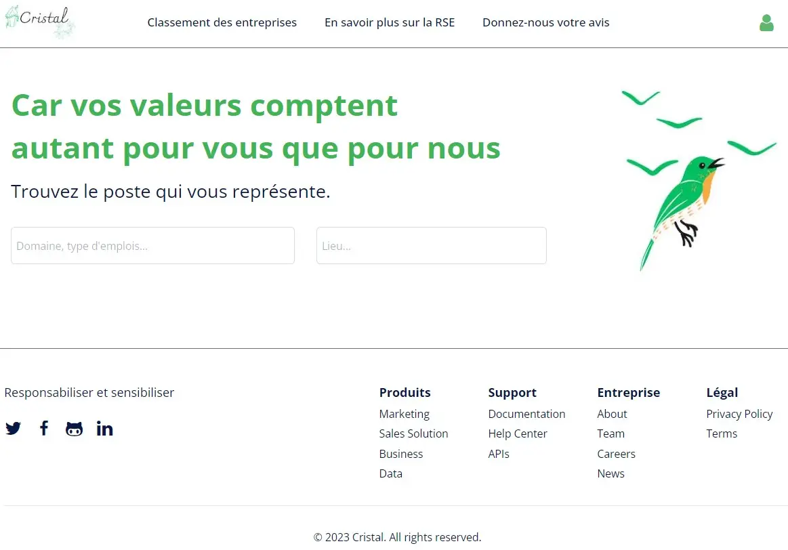
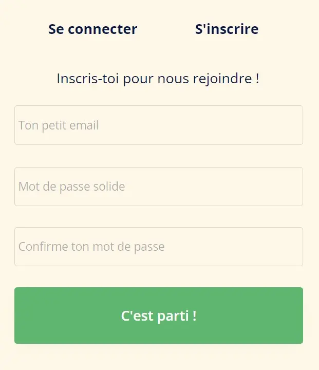{ width=50% }

## Ce que j'ai prévu pour le second point POK (14h) 

- Analyser la politique RSE des trois entreprises et les classer => Fournir une démarche pour analyser la politique RSE d'une entreprise sur un axe bien précis, puis l'appliquer à une entreprise. Ceci implique le choix de critères d'intérêts.
- Vérifier qu'on ne s'expose pas à des poursuites judiciaires
- Enregistrer 3 étudiants de Centrale Marseille et 3 employés pour qu'ils donnent leurs avis sur les 3 entreprises dans lesquelles ils ont travaillé (choisir 3 boîtes dont tu connais les employés)
- Rendre le site visuellement attractif à l'aide d'une charge graphique bien définie
- Ajouter la possibilité de rajouter une entreprise dans la base de données en tant qu'entreprise
- Créer une page fiche contact et services remise à niveau

## Ce que j'ai fait à la fin du temps 2 

### Ce que j'ai finalement prévu de faire pour le 2ème sprint 

Après la formation sur l'agilité d'Oresys, je me suis rendu compte que je n'avais pas été assez précis dans ma planification et que Do_It était en fait véritablement calqué sur la gestion de projet agile.
Pour le prochain POK, je ferai donc l'effort que je fais maintenant de définition, de cadrage dès le début du premier sprint et ça, de manière sérieuse et détaillée.

Après m'être posé pendant une bonne heure, j'ai établi plus clairement mes objectifs de cette deuxième partie du POK :

- En apprendre plus sur ce qu'était la RSE,
- Apprendre à créer un site plus que fonctionnel à l'aide d'un outil no/low code, ici Bubble.io,
- Comment établir une analyse de la politique RSE d'une entreprise pour pouvoir donner un avis construit et éduqué.

Le **backlog produit** écrit, avec un niveau de difficulté à côté, suivant la suite de Fibonacci qui ira de 1 à 55. Pour ce qui a été fait au **sprint 1, nous mettrons un V** et, pour le **sprint 2, un X**. Le total de points de complexité est 47 -> 39 et j'ai effectué au sprint 1, 11 points en 6h, il va falloir mettre le turbo pour les 13 prochaines heures. Les choses que je n'ai pas faites consitueront le backlog de mon sprint 2 :

- S'initier à la RSE [V] = 2
- Créer un site opérationnel sur Bubble.io [] = 31
  Logo [V] = 1
  Une page index et les autres pages qui vont avec [] = 17 -> 22

  - Log-in, sign-in qui s'affichera avec un pop-up [V] = 5
  - Barre de navigation [V] = 3 -> 2
  - Page de profil/paramètres [X] = 3 -> 2
  - Réfléchir à un endroit approprié pour un bouton déconnexion et le créer [X] = 2 -> 1
  - Page de contact [X] = 2 -> 1
  - Formulaire pour donner son avis [X] = 3 -> 2
  - Page pour présenter la RSE [V] = 1
  - Présenter le classement/résultat de l'analyse [] = 1 -> 8 (Utilisation de groupes répétitifs, tri des données, extraction des données, lien entre deux types de données)

  Gérer la base de données de base [X] = 15 -> 8

  - Gérer l'inscription des Users, leur connexion et leur déconnexion [X] = 5
  - Gérer les formulaires pour donner son avis [X] = 5 -> 2
  - Gérer les demandes de prises de contact [X] = 5 -> 1

- Analyse RSE [X] = 8 -> 6
  S'imprégner d'une méthode d'analyse [X] = 2
  Choisir une méthode et établir des critères d'évaluations [X] = 2
  Analyse d'une politique RSE, on prendra **Patagonia** [X] = 3 -> 1 (Finalement très subjectif, un peu déçu sur ce point)

### La RSE et le RGPD ? 

Après avoir approfondi mes recherches, je peux sereinement dire qu'effectivement, mon projet de vouloir évaluer numériquement la politique RSE d'une entreprise était bien trop ambitieux.
Les rapports étaient forcément biaisés, certains montraient qu'une partie de leurs données, tandis que d'autres mettaient en avant un axe qu'ils développaient particulièrement, sûrement pour cacher le cadavre qu'ils cachaient dans leur placard. En bref, la transparence n'était pas au goût du jour.

Je me suis aussi rendu compte que la responsabilité sociale était plus large que je ne l'imaginais.
Par exemple, la protection et le respect de la confidentialité des données de ses clients font partie intégrante de la RSE, surtout depuis le RGPD.

Le sigle RGPD signifie « Règlement Général sur la Protection des Données » (en anglais « General Data Protection Regulation » ou GDPR). Le RGPD encadre le traitement des données personnelles sur le territoire de l’Union européenne.

> Une donnée personnelle est définie comme toute information se rapportant à une personne physique identifiée ou identifiable. Mais, parce qu’elles concernent des personnes, celles-ci doivent en conserver la maîtrise.

> Un « traitement de données personnelles » est une opération, ou ensemble d'opérations, portant sur des données personnelles, quel que soit le procédé utilisé (collecte, enregistrement, organisation, conservation, adaptation, modification, extraction, consultation, utilisation, communication par transmission diffusion ou toute autre forme de mise à disposition, rapprochement). Un traitement de données doit avoir un objectif, une finalité, c’est-à-dire que vous ne pouvez pas collecter ou traiter des données personnelles simplement au cas où cela vous serait utile un jour. A chaque traitement de données doit être assigné un but, qui doit bien évidemment être légal et légitime au regard de votre activité professionnelle.

Il harmonise les règles en Europe en offrant un cadre juridique unique aux professionnels. Il permet de développer leurs activités numériques au sein de l’UE en se fondant sur la confiance des utilisateurs.
En effet, le RGPD s’applique à toute organisation, publique et privée, qui traite des données personnelles pour son compte ou non, dès lors qu'elle est établie sur le territoire de l’Union européenne, ou que son activité cible directement des résidents européens.

Quelques points importants du RGPD :

- Consentement : Les entreprises doivent obtenir un consentement explicite des individus avant de collecter et de traiter leurs données personnelles. Les individus ont le droit de retirer leur consentement à tout moment.
- Droits des individus : Le RGPD confère aux individus plusieurs droits, notamment le droit d'accès à leurs données personnelles, le droit de les rectifier, le droit à l'effacement (ou droit à l'oubli), le droit à la portabilité des données, et le droit de s'opposer au traitement de leurs données.
- Responsabilité et transparence : Les entreprises sont tenues d'informer les individus sur la manière dont elles collectent, stockent et traitent leurs données personnelles. Elles doivent mettre en place des mesures de sécurité appropriées pour protéger ces données.

Avec un champ d'action aussi large, je comprends mieux pourquoi la RSE est un travail qui doit être intégrée à tous les niveaux de l’activité de l’entreprise, de la production au consommateur final, et qui doit être envisagé et suivi à long terme.

### Analyse RSE 

Pour choisir les critères pour analyser la politique RSE d'une entreprise, je me suis reposé sur "GRI Universal Standards" (GRI 101, GRI 102 et GRI 103) qui représentent les pratiques à suivre en terme de développement durable et responsable d'une entreprise.

Parmi les principes choisis pour guider une organisation dans leur politique d'expansion, j'ai décider d'en relever trois qui me permettront de "juger" la politique RSE de Patagonia : la clarté, la régularité et leur vision durable.

> La clarté : L'organisation doit présenter l'information de manière à ce qu'elle soit accessible, compréhensible et utilisable. Ceci peut passer par une table de matières précise, des liens ou des graphiques.

> La régularité : l'organisme doit communiquer les informations à intervalles réguliers et les mettre à la disposition des utilisateurs en temps utile pour qu'ils puissent prendre des décisions.

> la vision durable : L'organisation doit fournir des informations sur ses impacts et ses objectifs dans le contexte plus large du développement durable, en s'appuyant par exemple sur des informations objectives et des mesures du développement durable faisant autorité, lorsqu'elles sont disponibles.

Malheureusement, ce jugement reste très subjectif. Pour pouvoir être objectif, il aurait fallu comparer avec d'autres entreprises qui auraient une quantité d'informations équivalente et de même qualité, ce que je n'ai pas eu le temps de faire.

### Bubble.io et les fonctionnalités que j'ai réussi à implémenter

- La base de données
  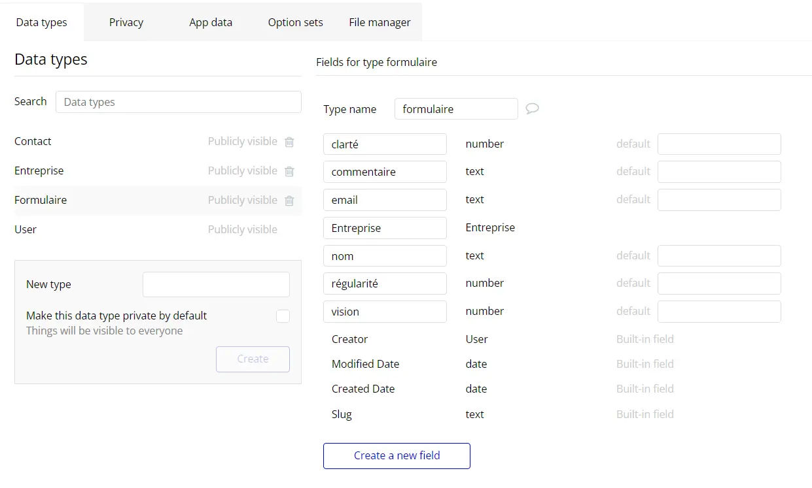

- Inscription/Connexion
  :-------------------------:|:-------------------------:
  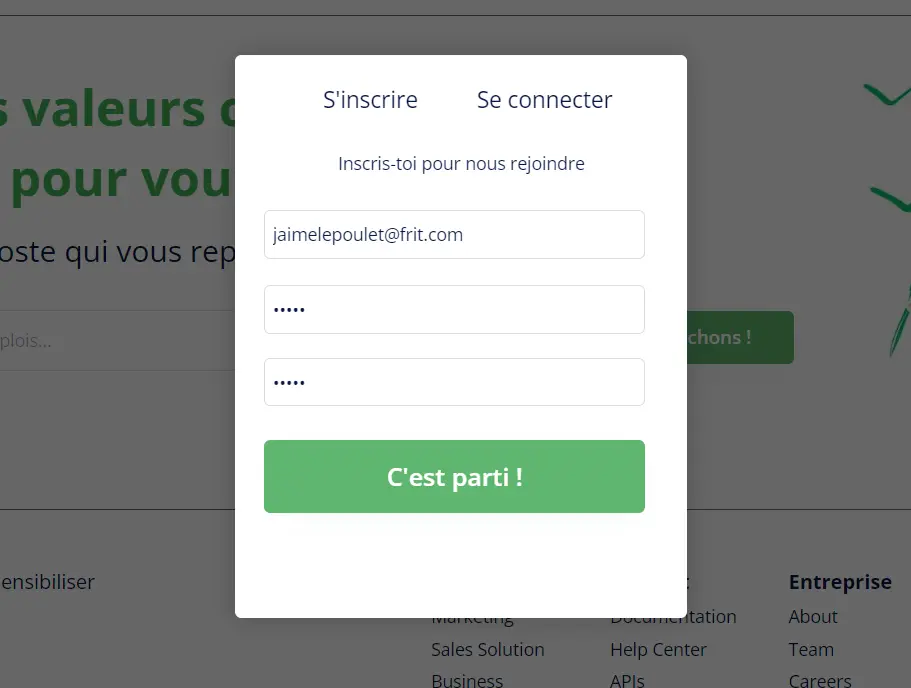 | 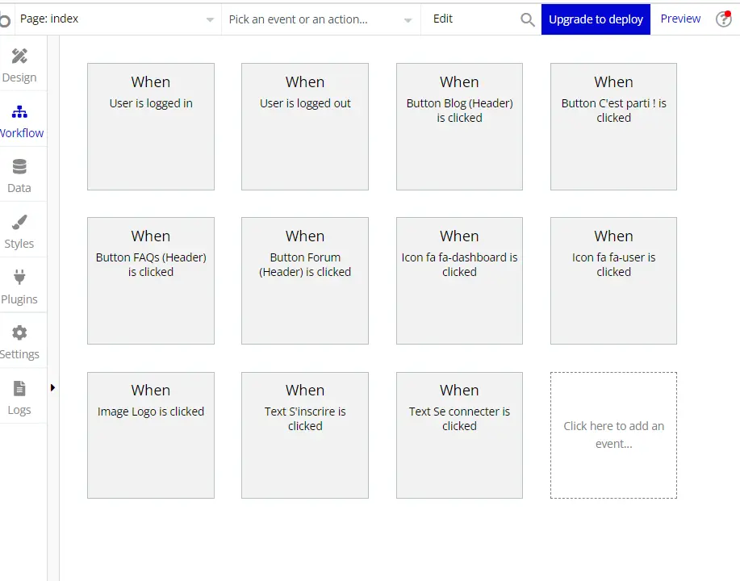

  Dans la base de données, on obtient alors :
  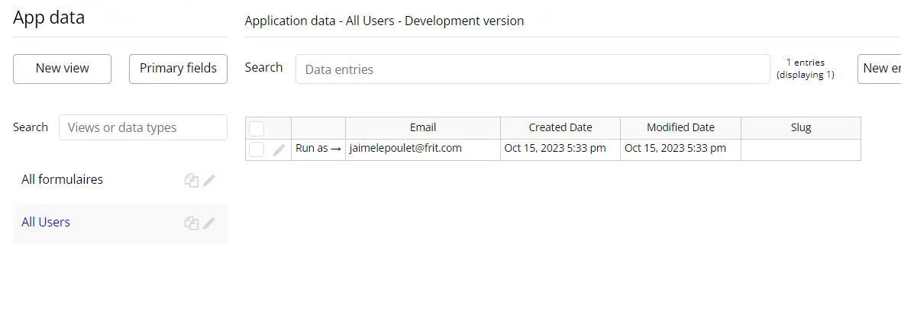

- Dashboard/Déconnexion
  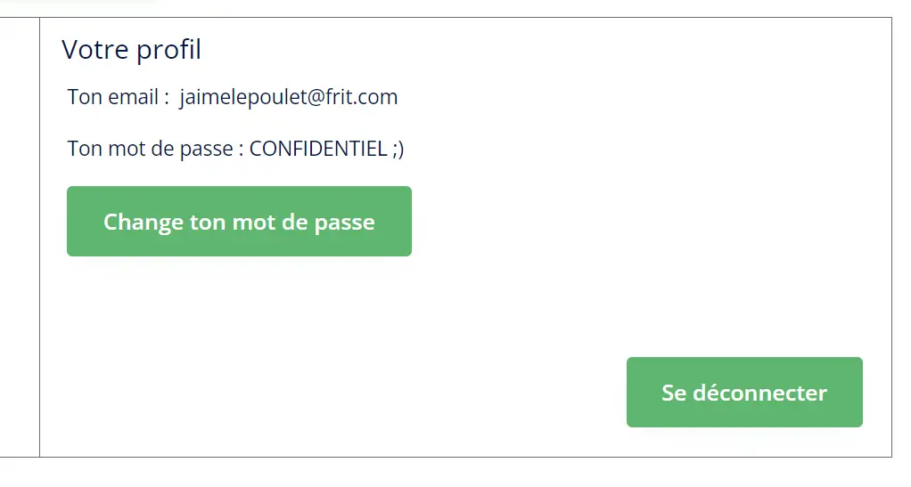

- Contact
  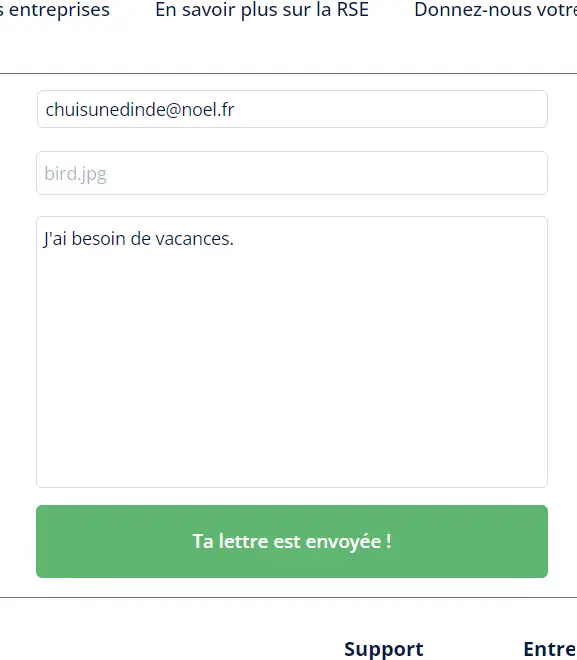

  Dans la base de données, on a :
  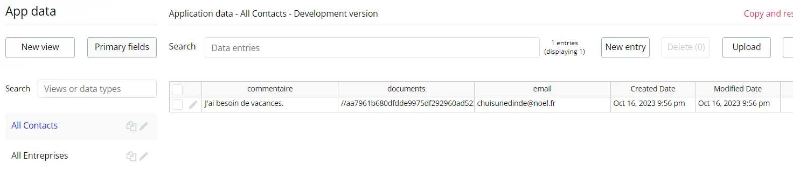{width = 120%}

- Formulaire pour donner son avis
  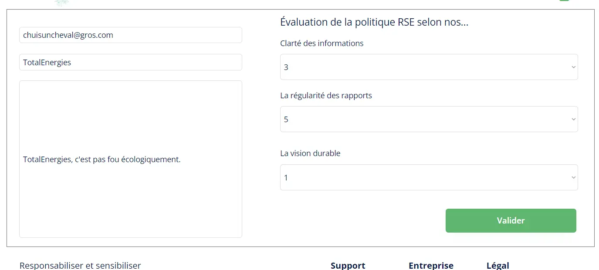

  Dans la base de données, on a alors :
  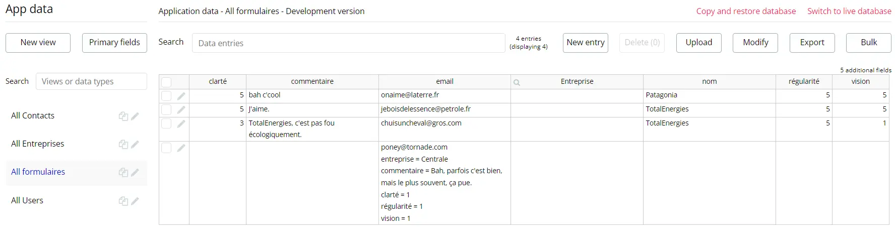{width = 120%}

- Pour présenter les résultats sous la forme d'un classement, je voulais utiliser la fonctionnalité "Repeating groups".
  Les étapes à effectuer auraient été :

1. Récupérer les données des formulaires > "Search for"
2. Faire la moyenne des notes attribuées > "Calculate formula" ou faire directement le calcul dans "Value"
3. Vérifier si l'entreprise existe déjà dans la base de données, si oui, il suffit de mettre à jour sa note moyenne > Condition sur le nom de l'entreprise avec "Only when", puis ???
4. Classer les entreprises par leurs notes > "Sort by" dans "Repeating groups"
5. Les afficher dans "Repeating groups".
   Je suis donc resté bloqué ici...
   :-------------------------:|:-------------------------:
   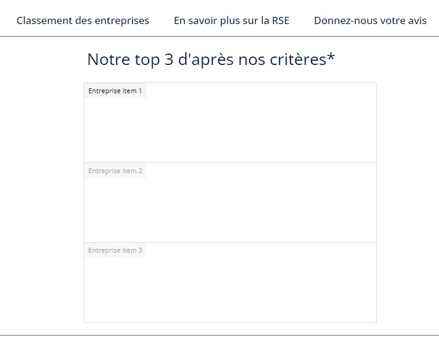 | 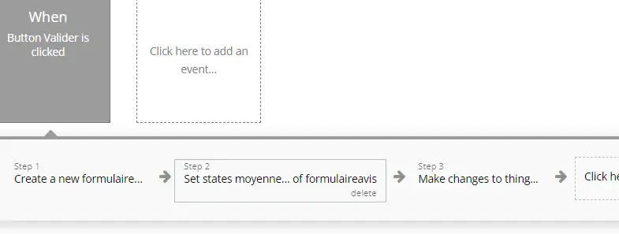

## Conclusion 

Nombre de points effectués pendant le sprint 1 : **11**.
Nombre de points effectués pendant le sprint 2 : **21**.
J'ai dû adapter la complexité des tâches au fur et à mesure, car certaines me prenaient plus de temps que prévu.

Je suis plutôt déçu du résultat. Je ne m'attendais pas forcément à avoir quelque chose de bien concluant vu l'ambition du projet, mais je pensais avoir le temps de faire plus, surtout du côté de Bubble.
Ne pas avoir réussi à lier les deux types de données et présenter ma base de données proprement me laisse un mauvais arrière-goût sur la langue.
De même pour le système d'avis, j'avais pour idée d'imiter le concept de glassdoor où chacun laisse son avis sur sa boîte. Mais quand il s'agit de la politique RSE, qui peut dire assurément qu'il est capable de donner un avis éduqué sur la question ?

Ce que je retiens de ce POK :

- La RSE est un domaine très large, beaucoup trop large,
- Bubble est une bonne option de créer une maquette/prototype, mais je ne l'utiliserais pas pour créer un produit fini pour un client
- Le back/gestion des serveurs/base de donnnées n'est vraiment pas pour moi...

## Sources 

[Qu'est-ce que la RSE ? - CCI](https://www.cci.fr/ressources/developpement-durable/responsabilite-sociale-rse)
[Complément à la compréhension de la RSE - QABIS](https://qabis.eu/implementer-une-politique-rse-dans-son-entreprise-en-5-etapes/)
[Qu'est-ce que le RGPD ? - CNIL](https://www.cnil.fr/fr/rgpd-de-quoi-parle-t-on)
[Règlement européen sur la protection des données - CNIL](https://www.cnil.fr/fr/reglement-europeen-protection-donnees)
[Une façon de mesurer une politique RSE - Globalreporting](https://www.globalreporting.org/standards/standards-development/universal-standards/)
