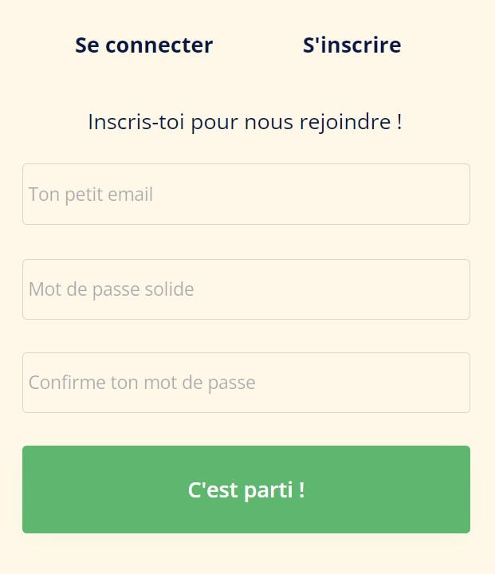


Avoir un cerveau à moitié allumé


## Ce que j'ai prévu pour le 1er point POK (6h) : limiter la portée

- Qu'est-ce que la RSE ? [Bien effectué]
- Choisir un axe de la RSE [En cours]
- Choisir 3 entreprises [En réflexion]
- Lire leurs rapports RSE [En cours]
- Mettre en place une plateforme avec un log in/sign in pour entreprises et employés à la manière de Glassdoor [Presque fini]

## Ce que j'ai fait

### Qu'est-ce que la RSE

La responsabilité sociétale des entreprises (RSE) également appelée responsabilité sociale des entreprises est définie par la commission européenne comme l'intégration volontaire par les entreprises de préoccupations sociales et environnementales à leurs activités commerciales et leurs relations avec les parties prenantes.

En d'autres termes, la RSE c'est la contribution des entreprises aux enjeux du développement durable.
Une entreprise qui pratique la RSE va donc chercher à avoir un impact positif sur la société tout en étant économiquement viable.

La norme ISO 26000 — ce sont des lignes directrices pour tous ceux qui ont conscience qu’un comportement socialement responsable et respectueux de l’environnement est un facteur clé de la réussite. Non seulement ISO 26000 donne la bonne ligne de conduite à suivre mais, de plus en plus, cette norme est appliquée pour évaluer l’engagement des organisations en faveur du développement durable ainsi que leur performance globale — standard international, définit le périmètre de la RSE autour de sept thématiques centrales :

- la gouvernance de l’organisation
- les droits de l’homme
- les relations et conditions de travail
- l’environnement
- la loyauté des pratiques
- les questions relatives aux consommateurs
- les communautés et le développement local.

Depuis l'entrée en vigueur de la loi PACTE du 22 mai 2019, de nouvelles dispositions sont entrées en vigueur pour renforcer la RSE :

- l'article 1833 du Code civil a été modifié afin que l'objet social de toutes les sociétés intègre la considération des enjeux sociaux et environnementaux
  > Modifié par LOI n°2019-486 du 22 mai 2019 - art. 169, "Toute société doit avoir un objet licite et être constituée dans l'intérêt commun des associés."
- l'article 1835 du Code civil a été modifié pour reconnaître la possibilité aux sociétés qui le souhaitent de se doter d'une raison d'être dans leurs statuts
  > Modifié par LOI n°2019-486 du 22 mai 2019 - art. 169, "Les statuts doivent être établis par écrit. Ils déterminent, outre les apports de chaque associé, la forme, l'objet, l'appellation, le siège social, le capital social, la durée de la société et les modalités de son fonctionnement. Les statuts peuvent préciser une raison d'être, constituée des principes dont la société se dote et pour le respect desquels elle entend affecter des moyens dans la réalisation de son activité."
- le statut d'entreprise à mission a été créé.

### Axe choisi et entreprises choisies et lecture de rapports

Le choix est difficile à faire, car il dépend des données que je rassemblerais. Au vu des rapports RSE que j'ai lus, beaucoup se focalisent sur l'axe social (sûrement, car le reste n'est pas flatteur), tandis que d'autres essaient tant bien que mal de cacher la misère environnementale produite par leur entreprise.
Si je veux pouvoir comparer plusieurs entreprises, il me faudra des critères qui pourraient s'appliquer à toutes les entreprises choisis.

Dans l'idéal, j'aimerais pouvoir faire un choix définitif sur les entreprises que j'étudierais, mais je ne crois pas avoir assez de recul pour l'instant. Le textile pourrait être une bonne voie, avec Patagonia, Inditex Group (ZARA), Levi's, etc.

### Début de la mise en place d'une plateforme en ligne

J'ai fait le choix d'utiliser Bubble.io pour construire ma plateforme. Après l'avoir utilisé pendant le cours "No/Low code", cette solution me semblait appropriée, surtout dans l'optique de faire une maquette fonctionnelle.

Après avoir choisi le logo, le nom et la charte graphique, j'ai commencé à créer les pages de base, l'accueil et la connexion/l'inscription, et la page contacts. Elles sont plus ou moins achevées. Il va falloir prendre en vitesse sur le deuxième sprint.

 

## Ce que j'ai prévu pour le second point POK (14h) :

- Analyser la politique RSE des trois entreprises et les classer => Fournir une démarche pour analyser la politique RSE d'une entreprise sur un axe bien précis, puis l'appliquer à une entreprise. Ceci implique le choix de critères d'intérêts.
- Vérifier qu'on ne s'expose pas à des poursuites judiciaires
- Enregistrer 3 étudiants de Centrale Marseille et 3 employés pour qu'ils donnent leurs avis sur les 3 entreprises dans lesquelles ils ont travaillé (choisir 3 boîtes dont tu connais les employés)
- Rendre le site visuellement attractif à l'aide d'une charge graphique bien définie
- Ajouter la possibilité de rajouter une entreprise dans la base de données en tant qu'entreprise
- Créer une page fiche contact et services remise à niveau

## Ce que j'ai fait à la fin du temps 2
