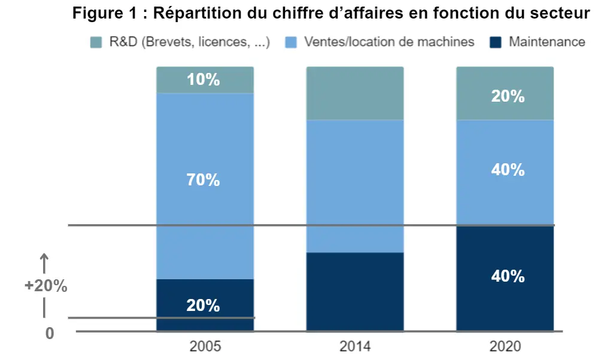
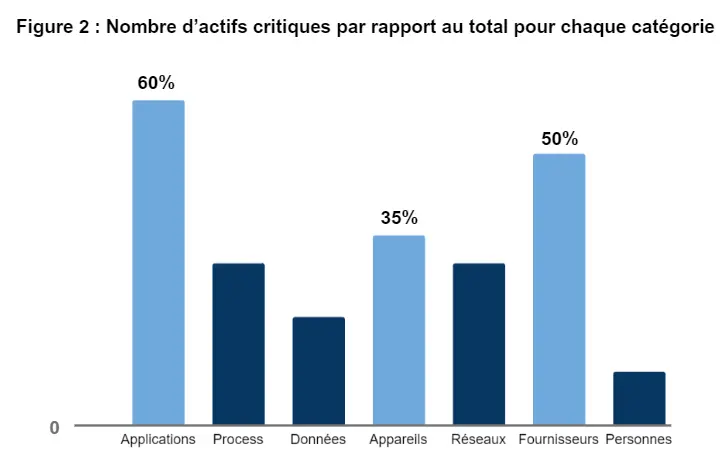
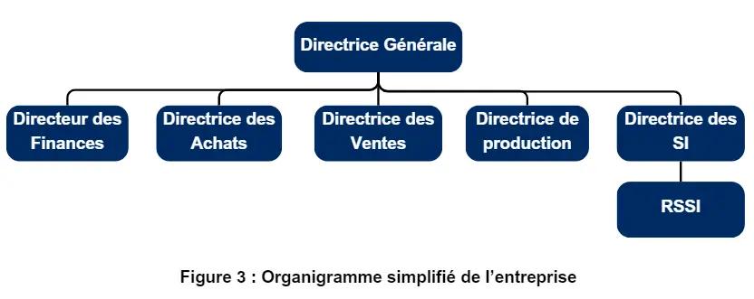
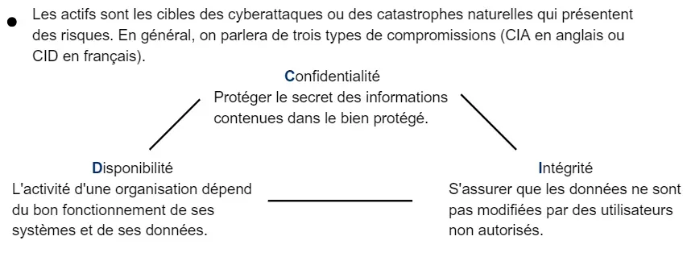
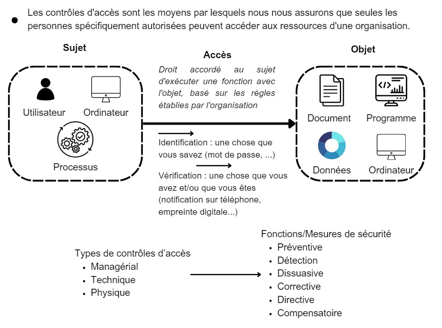
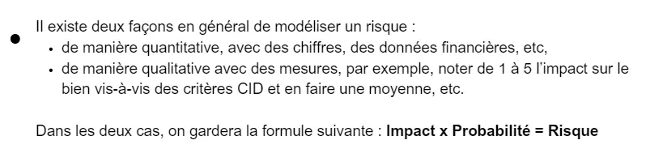
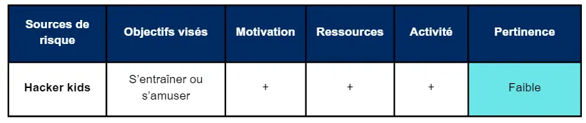


Un cerveau et vaguement quelques connaissances en tech


## Table des matières

- [Objectifs et backlog produit ](#section-1)
- [Ce que j'ai prévu au 1er sprint et ce qui a été fait finalement ](#section-2)
- [Sprint 1 Review ](#section-3)
- [Ce que j'ai prévu au 2ème sprint et ce qui a été fait finalement ](#section-4)
- [Sprint 2 Review ](#section-5)
- [Conclusion](#section-6)
- [Cas pédagogique en cybersécurité - Les risques cyber d’un projet de digitalisation](#section-7)
- [Sources et horodateur ](#section-1)

## Objectifs et backlog produit 

**Les objectifs**

- Savoir écrire une étude de cas
- Intégrer et développer le savoir que j'ai acquis durant la première partie de mon alternance
- Partager ce savoir 

**Backlog produit**

- <u>Faire un backlog précis et le mettre à jour</u> [X] = 1 (1h)

- <u>Consolider mes connaissances</u> [] = 5 (7h)
  - Guides de l'ANSSI [] = 3 (5h)
  - Formalisation/traduction de mes connaissances [] = 2 (2h)

- <u>Lire et intégrer la documentation prêtée par Laetitia PIET sur la méthodologie pour créer une étude de cas</u> [X] = 1 (1h)

- <u>Rédiger l'étude de cas</u> [] = 13 (10h)

  - Choix du scénario et sa formalisation/Présentation du cas [] = 2 (2h)
  - Corps du cas, l'exercice [] = 5 (3h)
    - Extraits des interviews [] = 2 (2h)
    - Questions [] = 1 (1h)
  - Note pédagogique [] = 2 (2h) 
  - Rédaction des annexes [] = 3 (3h)

- <u>Documenter le POK</u> [] = 1 (1h)

## Ce que j'ai prévu au 1er sprint et ce qui a été fait finalement 

**Backlog Sprint 1**
On prendra comme user-stories à faire :

- <u>Faire un backlog précis et le mettre à jour</u> [X] = 1 (1h)
  
- <u>Consolider mes connaissances</u> [X] = 5 (7h) 
  - Guides recommendés par l'ANSSI [X] = 3 (5h)
    - Guide sur la continuité d'activité [X] = 1 (1h30)
    - EBIOS, management des risques [X] (3h30)
  - Formalisation/Traduction de mon expérience et de mes acquis [X] = 2 (2h)

- <u>Lire et intégrer la documentation prêtée par Laetitia PIET sur la méthodologie pour créer une étude de cas</u> [X] = 1 (1h)

- <u>Rédiger l'étude de cas</u>
  - Choix du scénario et sa formalisation/présentation [X] = 2 (2h)
  + Extraits des interviews [X] = 2 (2h)

## Sprint 1 Review 
 
Ayant suivi le MOOC de l'ANSSI, j'avais une idée de la qualité de la documentation qu'elle pouvait produire, mais à nouveau, j'ai été bluffé. J'aurais voulu passer plus de temps sur EBIOS, une méthode de management de risques, mais il faudra passer pour cette fois. J'ai pris en note ce dont j'aurais besoin pour le sprint 2. De même, j'aurais voulu passer plus de temps sur mes notes (ce que je ferais finalement plus tard), car j'ai redécouvert des passages que j'ai envie d'approfondir. 
J'ai pu définir la problématique de l'étude de cas qui sera le management des risques dans le cadre d'un projet de renforcement IT. 

## Ce que j'ai prévu au 2ème sprint et ce qui a été fait finalement 

**Backlog Sprint 2**
On prendra comme user-stories à faire :

- <u>Rédiger l'étude de cas</u> [X] = 13 (10h)
  - Corps du cas, l'exercice [X] = 5 (3h)
    - Extraits des interviews [X] = 2 (2h)
    - Questions [X] = 1 (1h)
  - ~~Note pédagogique [] = 2 (2h) ~~
  - Rédaction des annexes [X] = 3 (3h -> 5h)

- <u>Documenter le POK</u> [X] = 1 (1h -> 2h)

## Sprint 2 Review 

Au cours de la rédaction de l'étude de cas, je me suis rendu compte de la quantité de choses intéressantes que je voulais partager et du peu de temps que j'avais. Car, finalement, une dizaine d'heures, c'est très peu pour arriver à compacter, densifier et fluidifier la connaissance. 

## Conclusion 

En conclusion, je suis un peu déçu du résultat. J'aurais voulu traiter plus en profondeur quelques points comme les différents types de contrôles d'accès ou encore la partie réseaux. De plus, l'étude de cas aurait pu être plus polie en terme de chiffres, car en voulant de m'éloigner de la réalité, les graphes sont devenus un poil confus.
Enfin, j'aurais aimé pouvoir le tester et me relire encore quelques fois de plus pour travailler sur la cohérence et la pédagogie du contenu.

## Cas pédagogique en cybersécurité - Les risques cyber d’un projet de digitalisation 

Ce cas est fictif et s’appuie sur une situation réelle ayant été anonymisée, scénarisée et modifiée pour en faciliter l’exploitation pédagogique et respecter la confidentialité.

Il a été grandement inspiré par l’étude de cas MSF Log animé par Laetitia PIET, professeure en sciences sociales, ma mission à CGI Business Consulting, les guides de l’ANSSI, la formation CC de (ISC)², du cours de cybersécurité donné par Guillaume SEIGNEURET, RSSI à 360Learning et les échanges que j’ai eus avec Wavestone Brussels.

### Sommaire

- [Les Promeneurs de Tracteurs](#section-8)
- [Une gestion de risques cyber pour un outil digital](#section-9)
  - [Origine du projet](#section-10)
  - [Extraits des interviews](#section-11)
  - [Documents existants](#section-12)
- [Votre approche en tant que consultant en cybersécurité](#section-13)
- [Annexes](#section-14)

### Les Promeneurs de Tracteurs

Les Promeneurs de Tracteurs est un grand constructeur de tracteurs en Europe. L’entreprise fut créée sous le nom de Geailetrakt en 2002 à partir de la fusion de deux compétiteurs sur le marché, l'entreprise française Geai et de l'entreprise allemande  Deutsche Letrakt. 
Le siège de la société est installé dans l’Ouest de la France à Pessac, près de Bordeaux, où elle possède son principal site de production en France. La société est également installée en Allemagne, à Fribourg-en-Brisgau (Bade-Wurtemberg).
Le 1er janvier 2013, en pleine crise, Angeline Walker prend la tête de l'entreprise, succédant ainsi à Roberta Foiré (qui avait été nommé le 1er juillet 2011). Une semaine après, elle annonce la restructuration et la réorganisation plus large du groupe en commençant d’abord par un changement de nom : Geailetrakt devenait Tractors Walkers ou “Promeneurs de Tracteurs” en français. 
L’entreprise avant focalisée sur la construction des tracteurs agricoles diversifie son offre en proposant maintenant de la machinerie pour la construction, le militaire, etc. Elle place aussi beaucoup d’efforts sur sa partie maintenance. 

### Une gestion de risques cyber pour un outil digital

#### Origine du projet

2024 apporte une nouvelle vague de problématiques. 
Au milieu des critiques sur l’impact écologique de l’activité de l’entreprise, Angeline Walker entreprend un virage stratégique en implémentant une politique de production à la demande et en impulsant la création d’un outil pour suivre les services et maintenances effectués.
Cependant, cet outil, traitant de données sensibles, doit être absolument être sécurisé pour le bien des clients et de l’entreprise. 
Pour ça, elle fait appel à vous, cabinet de conseil connu pour son sérieux et son expertise dans la cybersécurité.

#### Extraits des interviews

**Extrait de l’interview réalisée par votre manageuse avec la Directrice Générale, Angeline Walker (DG)**

**M :** Quel est selon vous le métier de Tractors Walkers ?
**DG :** C’est simple. On produit des machines. On les vend. On les livre. On les entretient.
**M :** Quels sont vos enjeux stratégiques de cette année ? 
**DG :** Nous avons deux objectifs. Le premier, changer notre façon de penser la production. Le deuxième, créer un outil sécurisé pour suivre et optimiser nos processus.
**M :** Sur ces deux aspects, quels sont les défis que vous rencontrez ? 
**DG :** Sur la production, réorganiser la chaîne et l’optimiser. Pour l’outil, le sécuriser.
**M :** Avez-vous déjà un plan pour ça ?
**DG :** Une démarche de gestion des risques a été commencée. Vous y aurez accès en même temps qu’à notre organigramme simplifié. Nous attendons de vous à ce que vous puissiez l’utiliser pour nous éclairer sur la suite. 
**M :** Que pensez-vous de votre politique de sécurité actuelle ? Avez-vous des problèmes pour l’implémenter ? 
**DG :** Il y a du travail à faire effectivement en termes de responsabilité et en termes de prise de conscience autour du sujet de la cybersécurité. Les campagnes de phishing ne sont pas toujours suffisantes. Il faut dire que nous avons du retard.

**Extrait de l’interview réalisée par votre manageuse avec la Responsable de la Sécurité des Systèmes d’Information (RSSI)**

**M :** Quel est votre travail ? 
**RSSI :** C’est une question très large. Je surveille la définition et la mise en œuvre des politiques de sécurité de l'information. Je suis en quelque sorte le chef d’orchestre de la cybersécurité dans l’entreprise. Sauf que je n’ai pas d’orchestre. Donc, je mets aussi la main à la pâte.
**M :** C’est-à-dire ? 
**RSSI :** Le budget qu’on nous attribue est ridicule. Il a fallu que la directrice générale insiste pour que le comité exécutif et le directeur des finances comprennent que la sécurité est un vrai enjeu. J’ai enfin pu recruter un cinquième ingénieur en sécurité informatique pour m’épauler. 
**M :** Vous êtes donc six en tout pour toute l’entreprise ? 
**RSSI :** C’est ça, on forme un petit SOC (Security Operations Center) et un petit CERT (Computer Emergency Response Team) et un petit CSIRT (Computer Security Incident Response Team), tout en fait. Six personnes pour une entreprise de plus de 3000 personnes. Et je ne parle pas même pas du parc informatique à maintenir. On a vu mieux comme conditions de travail.
**M :** Pour implémenter la politique de sécurité informatique, je suppose que... 
**RSSI :** Un enfer. On arrive à peine à maintenir les services en vie. Mais, j’ai espoir que votre arrivée annonce que la direction va commencer à prendre le sujet au sérieux et que j’aurai plus de monde prochainement dans l’équipe, car nous avons du pain sur la planche. 
**M :** Qu’avez-vous en tête ? 
**RSSI :** Au-delà de la sécurisation du nouvel outil développé, on voudrait organiser plus d’exercices de sensibilisation. J’ai entendu dire que vous avez interviewé la directrice des ventes et le directeur des finances avant de finir par le directeur de la production. Ils vous ont parlé de l’outil n’est-ce pas ?
**M :** Ils nous ont partagé les processus importants qui existeraient dans l’outil. 
**RSSI :** Parfait, je vous partagerai ce que nous avons commencé à faire. Je dois vous laisser. J’ai mon équipe qui m’attend. 

#### Documents existants

Les documents existants liés à la sécurité sont :
- la Politique de Sécurité des Systèmes d’Information (PSSI) qui suit neuf axes :
  - la sensibilisation 
  - la responsabilité
  - la réaction face à la crise 
  - le code éthique 
  - la gouvernance
  - l’évaluation des risques 
  - la conception et la mise en œuvre de la sécurité  
  - la gestion de la sécurité 
  - évolution de la politique de sécurité 
- la liste des actifs de l’entreprises (applications, outils, infrastructures, process, serveurs, matériel, personnes, réseaux, fournisseurs) qui sont séparés en Non-Critiques et en Critiques à partir des critères CIA ou CID en français, 
- un organigramme simplifié.

 

### Votre approche en tant que consultant en cybersécurité

Bien que votre manageuse soit excellente opérationnellement, deux autres missions lui ont été assignées en parallèle, vous laissant avec le travail qu’elle a commencé et le projet en main. 

Le développement de l’outil avance rapidement et il faut vite préparer un plan pour le sécuriser.

**Q1.** Pour mieux comprendre l’outil, faites un schéma du système d’information de l’outil et en déduire les biens clés à sécuriser.
**Q2.** Identifier les risques potentiels, les évaluer et les hiérarchiser. 
**Q3.** En déduire une matrice de risques avec deux axes pertinents.
**Q4.** Dresser un tableau des potentiels sources de risques.
**Q5.** Imaginer un scénario d’attaque pour la source de risque la plus susceptible de poser problème.
**Q6.** Proposer des mesures pour traiter le risque autour de l’outil.

### Annexes

#### Annexe 1 - Extrait de la synthèse des interviews avec la directrice de production et de la directrice des SI sur les process que couvrira l’outil

En résumé, l’outil s’adresse à quatre parties prenantes :
- les clients qui auront accès à l’outil via une plateforme web,
- les employés effectuant les maintenances via une application mobile quand il est en déplacement,
- les manageurs via une API qui relie l’ERP et l’application.
De plus, les employés pourront consulter l’application sur les ordinateurs du bureau.

L’outil sert à suivre les machines durant leurs ventes, leurs locations, leurs maintenances.

Les clients pourront par exemple consulter l’état de la machine qu’ils ont loué ou acheté.
Les employés “maintenance” utiliseront l’application pour suivre les services qui doivent être rendus chez un client et un historique des services déjà rendues. Et, ils auront accès aux détails de la machine qu’ils doivent prendre en main. Ils pourront aussi utiliser l'application pour vérifier l'identité du client grâce à un QR Code.
Les managers pourront suivre le travail des employés concernés sur leurs ordinateurs.

#### Annexe 2 - Vos notes sur la formation de cybersécurité (CC de (ISC)²) que vous avez suivie

#### Annexe 3 - Exemple d'application de la méthode de gestion des risques EBIOS pour qualifier une source de risques

#### Annexe 4 - Top 10 vulnérabilités de l’OWASP (Open Web Application Security Project - organisation internationale à but non lucratif qui se consacre à la sécurité des applications web) et quelques explications à propos d’elles

1. **Contrôle d'Accès défaillant**, les restrictions d'accès aux données ou aux fonctionnalités ne sont pas correctement appliquées, exposant ainsi les données sensibles à des individus non autorisés
2. Échec des mécanismes de **chiffrement** ou leur mauvaise implémentation
3. **Injection**, l’application permet à des données non fiables d'être interprétées comme des commandes ou des requêtes, ce qui peut entraîner l'exécution de code malveillant
4. **Défauts de conception** rendant difficile la mise en œuvre de mesures de sécurité
5. Appareils ou infrastructures **mal configurés**, laissant ainsi des failles ouvertes exploitables
6. **Composants Vulnérables et Obsolètes**
7. **Mécanismes d'Identification et d'Authentification mal implémentés ou contournés**
8. **Échecs de l'Intégrité Logicielle et des Données**, des hypothèses incorrectes sont faites concernant l'intégrité des mises à jour logicielles, des données critiques ou des pipelines CI/CD, ce qui peut entraîner des altérations ou des compromissions des données
9. **Échecs de la Surveillance de la Sécurité et des Logs (enregistrements créés à chaque action)**
10. **Fausse Requête Côté Serveur**

On peut aussi rajouter à ces vulnérabilités techniques **l'ingénierie sociale**, qui rassemble toutes les pratiques passant par une erreur humaine, arnaque au président, phishing, etc. 
Parce qu'il ne faut pas oublier que derrière chaque écran, il y a un être humain, du moins pour l'instant. 

#### Annexe 5 - Conversation que vous avez eu avec le RSSI

**RSSI :** Une façon d'évaluer l'impact d'un risque ? Vous avez les critères CIA ou CID en français. Ici, on donne une note de 1 à 5 pour chaque critère et on fait la moyenne des 3 notes. En fonction de ça, on place l'actif soit dans la catégorie Non-Critiques, soit dans la catégorie Critiques.
Dans mon ancienne entreprise, on utilisait trois autres critères, Réputation pour l'impact sur l'image de l'entreprise, Humain pour le risque humain qui existait, Technique pour les dégâts qui pourraient être causés sur les machines. Et on avait 3 catégories. C'était plus simple pour nos SLAs. 
**Vous :** Si j'ai bien compris, un Service Level Agreement est l'accord que vous signez avec les fournisseurs qui garantit un certain niveau de services ? 
**RSSI :** Exactement, et plus la catégorie est importante, plus le SLA sera important à négocier, car ça coûte cher. On appelait nos 3 types de SLA, Silver, Gold, Platinium pour Non-Critiques, Critiques et Super-Critiques. 
**Vous :** Et comment avez-vous fait votre matrice de risques ?
**RSSI :** Classique. Impact en abcisse et Probabilité en ordonnée, puis plus qu'à placer les vulnérabilités existantes de nos process. J'ai entendu parler d'autres façons de calculer le risque la semaine dernière d'ailleurs, si tu veux, je peux te partager ça demain.

## Sources et horodateur 

[MOOC de l'ANSSI](https://secnumacademie.gouv.fr/) 
[Méthode EBIOS](https://cyber.gouv.fr/la-methode-ebios-risk-manager)
[Formation en cybersécurité pour s'initier - parfait pour faire du management en cybersécurité, Certified in Cybersecurity by ISC2](https://www.isc2.org/certifications/cc)

Autres sources : CCI - Formations de formateurs "Acquérir les compétences clés pour bien écrire un cas" et "Maîtriser les étapes et les enjeux d'une animation de cas" animés respectivement par Jean-Marc RAGGI et Emmanuelle LE NAGARD-ASSAYAG, les supports m'étant été prêtés par Laetitia PIET. 

**Horodateur** : 
- Vendredi 09/02 : 1h (Backlog)
- Jeudi 15/02 : 1h (Lecture des la méthodologie pour créer une étude de cas)
- Mercredi 20/02 : 5h (Guides recommandés par l'ANSSI)
- Vendredi 23/02 : 2h (Fin de la lecture de la méthode EBIOS et début de la rédaction du cas)
- Dimanche 25/02 : 2h (Formalisation de mes notes)
- Mardi 27/02 : 2h (Extraits d'interview) 
- Mercredi 13/03 : 2h (Questions de l'étude de cas et changements mineurs)
- Mercredi 20/03 : 2h (Rédaction des annexes à partir de mes notes et d'EBIOS)
- Lundi 25/03 : 4h (Fin de la rédaction des annexes et transcription sur le site + relecture)