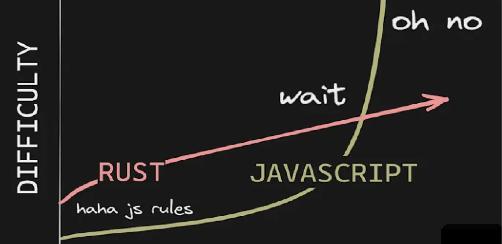



- Niveau novice
- Pré-requis de C++ ( que je n'ai pas trop)





- [Rust By Example](https://doc.rust-lang.org/rust-by-example/)
- [Documentation Rust](https://doc.rust-lang.org/stable/book/title-page.html)
- [Rust by Practise](https://practice.rs/why-exercise.html)
- [GitHub Exercice](https://github.com/rust-lang/rustlings)
- [Livre "From Javascript to Rust"](https://github.com/wasmflow/node-to-rust/raw/HEAD/from-javascript-to-rust.pdf)
- [MON de Assane](../../../Diouf-Asssane/mon/Rust/)
- [POK de Assane](../../../Diouf-Asssane/pok/temps-1/)



## Objectifs

Voici les objectifs que je me suis fixé :

- Finir le livre [Rust Documentation](https://doc.rust-lang.org/stable/book/title-page.html) (★★★☆☆)
- Finir les exercices de [GitHub Exercice](https://github.com/rust-lang/rustlings)(★★★★☆)
- Tester mes connaissances sur le projet du Chapitre 12 de la [Documentation Rust](https://doc.rust-lang.org/stable/book/title-page.html)(★★★★☆)
- Réaliser un outil en commande Line pour écouter de la musique Spotify (★★★★★★★)

★★★☆☆ = Diffculté

# Prévision pour le point 1 : 

- Apprendre les concepts de base de Rust :
  - Variables;
  - Iterators;
  - Smart Pointers;
  - Ownership / Borrowship;
  - ...

## Première étape

Mon premier objectif est d'acquérir, notamment à l'aide de la [Documentation Rust](https://doc.rust-lang.org/stable/book/title-page.html), une compréhension solide des concepts de base de Rust :

- Les variables
- Les itérateurs
- Les pointeurs intelligents
- La gestion de la propriété et des emprunts (ownership/borrowship)

Je vais suivre mon progrès en accomplissant les 96 exercices progressivement plus complexes du référentiel [Rustlings](https://github.com/rust-lang/rustlings), qui couvrent ces concepts essentiels. Actuellement, j'en suis à la première étape de progression : 

[>-----------------------------------------------------------] 1/96 (1.0 %), mais j'ai pour objectif d'atteindre 100 %.

Une fois cette étape terminée, j'ai l'intention de m'attaquer au projet proposé dans la documentation Rust, à savoir [Projet : Gestionnaire de lignes de commande](https://doc.rust-lang.org/book/ch12-00-an-io-project.html).

##Réalité du parcours

### [Rust Documentation](https://doc.rust-lang.org/stable/book/title-page.html) 

* Fondamentale, complète, accessible et claire =  nécessaire mais pas suffisant *

J'ai réussi à lire le [livre Rust](https://doc.rust-lang.org/stable/book/title-page.html) jusqu'au 15ème chapitre, où les concepts clés ont été expliqués et on commence à aller ne profondeur. Toutefois, pour consolider ces connaissances, j'ai dû réaliser des exercices supplémentaires proposés par [Rust By Practice](https://practice.rs/why-exercise.html). Mon défi personnel a été d'autant plus grand car mes bases en C++ sont limitées, étant donné que ma formation initiale dans ce domaine remonte à un certain temps.

### [GitHub Exercice](https://github.com/rust-lang/rustlings)

* Bon complément au [livre Rust](https://doc.rust-lang.org/stable/book/title-page.html) *

Cela se concrétise notamment avec la complétion du projet [GitHub Exercice](https://github.com/rust-lang/rustlings) à hauteur de 78/96 à cause de concept avancé que je n'ai pas encore vu comme le multi thread programming.

[>>>>>>>>>>>>>>>>>>>>>>>>>>>>>>>>>>>>>>>>>>---------] 78/96 (81.25 %), mais j'ai pour objectif d'atteindre 100 %.

## Conclusion de ces travaux théoriques

Les concepts les plus complexes à assimiler ont été les cycles de vie et la manipulation des chaînes de caractères car totalement nouveaux pour moment. En conséquence, je n'ai pas pu progresser aussi rapidement que prévu pendant mes 20 heures d'apprentissage. Néanmoins, j'ai tenu à créer quelque chose de concret, c'est pourquoi j'ai renoncé à l'idée de développer un outil en ligne de commande pour écouter Spotify car encore trop dur pour moi. J'ai opté pour un outil en ligne de commande qui recherche un chaîne de caractère au sein d'un texte.

## La pratique

* Facile avec les guides toutefois quand on navigue à vue, cela devient bien plus dure, un bon entraînement. Ça force à penser à TOUT ce qu'on a appris *

Mon travail est accessible dans ce [repo](https://github.com/Hagarde/CmdLineProject).
Ce projet repose sur le [tutoriel](https://doc.rust-lang.org/book/ch12-00-an-io-project.html) proposé par le livre, toutefois j'ai souhaité commencer avec puis ajouter de la complexité sans suivre le tutoriel pour réellement confronter mes connaissances à la réalité.

## Mes apprentissages : 

La courbe d'apprentissage du Rust ressemble plutôt à : 

### Les pointeurs et les cycles de vie :

Les pointeurs dans Rust représentent un élément essentiel de l'allocation de mémoire en programmation. Ils offrent un contrôle précis sur les ressources, éliminant les problèmes de fuites de mémoire. Le système de propriété et les règles strictes de durée de vie renforcent la sécurité du code, ce qui est essentiel. Grâce à ces concepts, il est possible de créer des structures de données complexes en maintenant la stabilité du programme. En somme, les pointeurs en Rust simplifient efficacement la gestion de la mémoire et renforcent la fiabilité des projets.

Cela se retrouve aussi dans la notion importante de cycle de vie des variables, qui simplifie la fonction de libérer cette espace mais la logique doit être comprise pour que cela fonctionne.

### Gestion des structure de données :

La gestion des structures de données est intrinsèquement plus rigoureuse dans le langage Rust. Il se distingue par sa variété de structures de données adaptées à une multitude de scénarios. Par exemple, lorsque l'on considère le stockage de données dans une collection, Rust propose des vecteurs pour gérer des tailles variables, tandis que les tableaux (ou "Array" en anglais) exigent une longueur prédéterminée, connue au moment de la compilation.

Cette distinction fondamentale réside dans la flexibilité offerte par ces structures. Les vecteurs permettent d'ajouter ou de supprimer des éléments de manière dynamique, ce qui se révèle particulièrement utile lorsque la taille exacte des données est inconnue à l'avance. Cela les rend adaptés à des situations où les besoins évoluent. À l'inverse, les tableaux en Rust sont statiques, obligeant à spécifier leur taille à la déclaration, avec une impossibilité de modification ultérieure. Cette contrainte peut sembler restrictive, mais elle apporte des avantages en matière de sécurité et d'efficacité, permettant au compilateur de détecter les erreurs potentielles à un stade précoce du développement.

## Bilan

J'ai pas été très efficace pour cette tâche en raison de ma confiance en mes capacités en C++ après seulement le cours de 2A. Les concepts ont été dures à appréhender et ont consommé la plupart de mon temps et je me suis éparpillé entre les différentes sources pour essayer d'avoir des points de vue différents sur les concepts que je ne comprenais pas. Cela explique aussi le fait que j'ai passé beaucoup de temps sur les exercices dures du [GitHub](https://github.com/rust-lang/rustlings).

Cela aurait été mieux d'en faire un MON avant pour éviter le temps perdu sur l'apprentissage et non la pratique.

Source explorées à ré explorer plus tard :
- [Rust to javascript](https://annas-archive.org/md5/77a5209a50709593652c64d097088439) ( parce que j'ai pas mal d'expérience en javascript )
- [Zero To Production in Rust - An introduction to backend development](https://annas-archive.org/md5/819c53acaf3bff8c145179d26aa8cd0a) ( bases = pré-requis )
- [Vidéo Youtube](https://www.youtube.com/watch?v=BpPEoZW5IiY) ( lent mais représentatif de ma progression )