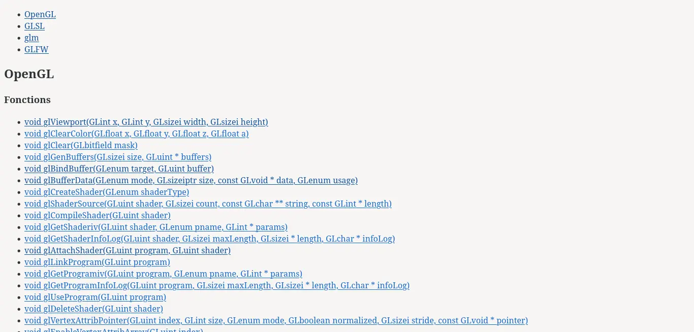
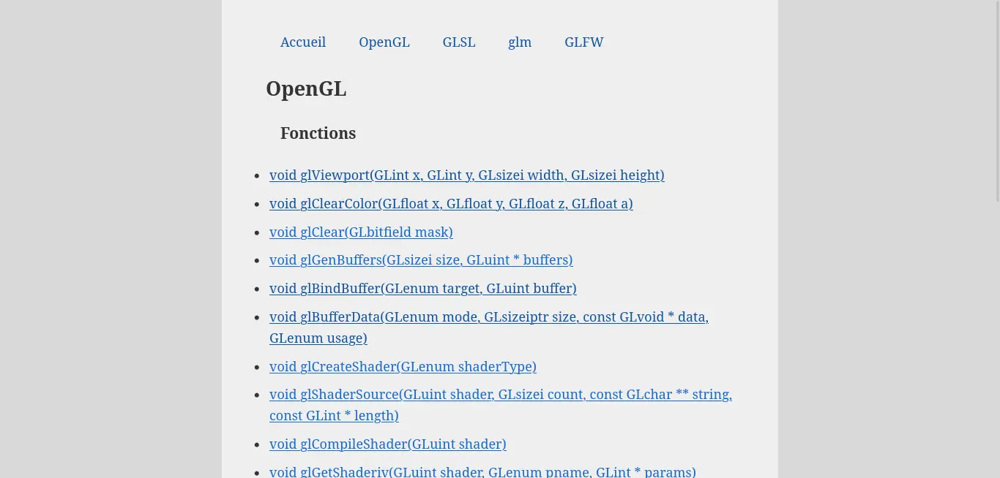

---
layout: layout/mon.njk

title: "Mon site web avec 11ty"
authors:
  - Paul Vietor

date: 2023-09-25

tags: 
  - "temps 1"

résumé: "Un site web statique me servant de mini-documentation d'OpenGL, GLSL et autres bibliothèques, utilisant eleventy pour générer ses pages."
---

Pour ce MON, j'ai décidé de faire un site web avec eleventy, et ai décidé d'y mettre un sorte de mini-documentation de ce que j'ai appris en OpenGL, GLSL et quelques bibliothèques en faisant mon premier POK.

## 1 Création et configuration du projet

Pour l'initialisation du projet, j'ai suivi le tutoriel qu'avait fait Nicolas Bert l'année dernière pour [son propre premier MON](/promos/2022-2023/Bert-Nicolas/mon/statique-eleventy/).

## 2 Création des templates

Pour ce site, il m'a semblé pertinent de créer une page pour chaque fonction, documentant sa signature et son utilité, et pour chaque type, documentant ses attributs.

Pour cela, j'ai créé, pour chaque catégorie, une page dans laquelle je liste les fonctions et les types de cette catégorie.

Pour les fonctions, j'ai créé un template qui me permet d'écrire les arguments, leur type et le type renvoyé de chaque fonction dans le *front matter* de eleventy de la page qui lui et dédiée (ce bout de texte entre --- en haut des fichiers .md) et de les récupérer au moment de créer le lien afin de les afficher directement sans avoir à aller sur la page :  

Par exemple, dans `glAttachShader.md` :
```yaml
signature:
  return_type: void
  arguments:
    - type: GLuint
      name: program
    - type: GLuint
      name: shader
```

Dans mon `index.njk` :

```twig


<a href="fonctions/{{ fonct.data.title }}">
    {{ fonct.data.signature.return_type }} {{ fonct.data.title}}(
        {{ comma() }}{{ arg.type }} {{ arg.name }}
    )</a>

```


J'utilise ici `comma`, défini avec ``, qui va placer un `, ` à chaque appel sauf le premier, ce qui a pour effet de séparer chacun des arguments par une virgule.

Pour les types, je me contente de les lister :


```
<ul>

<li><a href="types/{{type.data.title}}">{{ fonct.data.title}}</a></li>

</ul>
```


## 3 Le style

Pour l'instant, nous avons ceci :



C'est... pas très beau. Il faut ajouter un peu de CSS ! Je vais me contenter d'écrire un unique fichier assez simple, et je m'intéresserai à du style plus avancé dans mon deuxième MON :

Dans mon `.eleventy.js`, j'ajoute `eleventyConfig.addPassthroughCopy("bundle.css");` sur la deuxième ligne, et je crée un fichier `bundle.css` à la racine de mon projet. Il sera copié à la racine de mon site.



C'est déjà un peu mieux, mais rendez-vous dans 3 semaines pour un site encore un peu plus joli !
