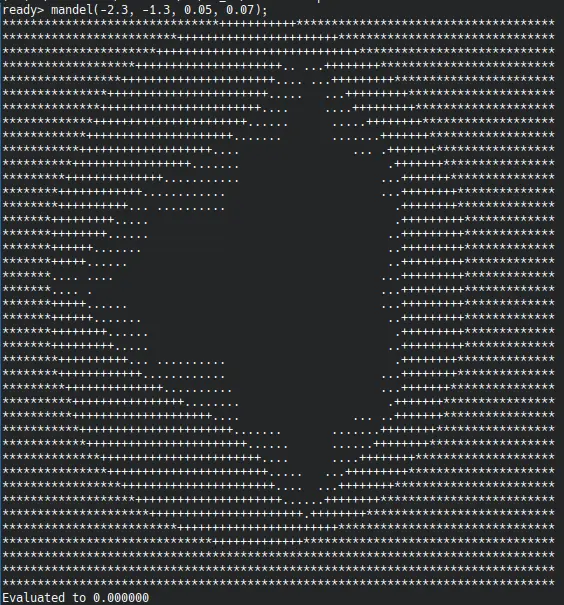

Pour ce MON, je vais suivre le tutoriel de [LLVM](https://llvm.org/docs/tutorial/) afin d'implémenter un langage de programmation.

Je n'ai pas fini le tutoriel dans ces 10 premières heures, je vais donc profiter de mon deuxième MON pour le finir et personnaliser un peu plus le langage.

## Introduction

Ce tutoriel nous guide dans les différentes étapes nécessaires pour réaliser un compilateur : le *lexer*, le *parser* puis la génération de langage machine.

Le *lexer* nous permet de décomposer le code source en un ensemble de "jetons" (*tokens* en anglais) : c'est lui qui sépare les mots, les nombres, les mots-clefs...  
Le *parser* quant à lui va prendre le flux de *tokens* généré par le *lexer* et le transformer en ce que l'on appelle un arbre de la syntaxe abstraite (ou *abstract syntax tree*, AST, en anglais). C'est lui qui fait l'analyse syntaxique du langage, et détermine à quoi correspond chaque mot, s'il s'agit d'une variable, d'une fonction, ou encore d'une expression binaire (par exemple "a+b").
Enfin, la génération de langage machine traduit cet arbre en quelque chose que le processeur peut comprendre et exécuter.

L'année dernière, Jean-Baptiste Durand s'est également attelé à la création d'un compilateur dans deux de ses MON ([1](../../../../2022-2023/Durand-Jean-Baptiste/mon/yaccLex/) et [2](../../../../2022-2023/Durand-Jean-Baptiste/mon/compiler/)), mais là où il a utilisé des bibliothèques qui s'occupaient des deux premières étapes (yacc et lex), le tutoriel de LLVM nous accompagne dans l'écriture du *lexer* ainsi que du *parser*, avant de nous montrer comment utiliser LLVM pour la génération de langage machine.

Le langage crée lors de ce tutoriel est assez simple, notamment parce qu'il ne permet de manipuler que des nombres (flottants à double précision, pour les intéressés), mais pas par exemple de listes ni de chaînes de caractères, mais on verra que c'est déjà suffisant pour une introduction.

## Le *lexer*

Le lexer est somme tout assez simple : il se contente de lire les caractères en entrée en séparant les mots, les signes de ponctuation et les nombres, et s'il rencontre ce que l'on appelle un mot-clef, une chaîne de caractère spéciale dans le langage, il renvoie une valeur spéciale, sinon il renvoie le mot/signe de ponctuation/nombre directement. 

## Le *parser*

C'est à ce moment-là que les choses deviennent réellement intéressantes : nous avons des *tokens*, mais nous devons encore leur donner un sens.  
Nous allons donc créer un *AST*, qui va stocker sous la forme d'un arbre les différentes expressions du langage : calculs, définitions et appels de fonctions, structures de contrôle du flot...

Je ne vais pas rentrer dans les détails de l'analyse syntaxique, puisqu'elle est déjà détaillée dans le tutoriel et n'est pas très intéressante dans certains cas, tels que les nombres, les déclarations de variables et les appels de fonctions.

Cependant, pour les calculs, il est important de bien prendre en compte la priorité des opérations : on s'attend à ce que les calculs entre parenthèses soient faits avant les multiplications, qui sont elles-mêmes faites avant les additions. On utilise pour cela ce que l'on appelle un analyseur syntaxique ascendant : une suite de calculs est décomposé en sa première expression puis une suite de paires (opérateur, expression). Par exemple, le calcul `1 + 2 * (3+4) - 5` sera décomposé en 1, (+, 2), (*, (3+4)), (-, 5). On peut voir que `(3+4)` est gardé tel quel : c'est parce que les parenthèses font que cela est traité comme une unique expression à ce stade, mais l'addition à l'intérieure sera analysée récursivement.  
On définit également pour chaque opérateur une priorité, qui va servir à déterminer comment grouper les opérations.  
Enfin, on va parcourir la liste des paires (opérateur, expression), et tant que l'on rencontre des opérateurs d'une priorité inférieure ou égale à celle de l'opérateur précédent, on sait qu'il faut prendre en compte l'opérateur précédent d'abord, et donc insérer le noeud d'AST correspondant. Si l'on rencontre un opérateur d'un priorité plus grande, cependant, c'est qu'il faut traiter cet opérateur en priorité. On fait alors un appel récursif afin de faire l'analyse de l'expression qui suit avant de créer le noeud d'AST.

En ce qui concerne les fonctions, il est important également de les définir avant des les utiliser. Cela est annoncé dans le langage avec le mot-clef `def` ou le mot-clef `extern`. Ce dernier permet de donner un nom de fonction, ainsi que sa liste d'arguments, et indique que cette fonction est définie à l'extérieur du langage : ce n'est pas particulièrement intéressant à ce stade, on fait essentiellement la même chose que pour un appel de fonction. Par contre, quand on définit une fonction avec `def`, il faut également stocker ce que l'on appelle le corps de la fonction, les instructions à exécuter pour calculer sa valeur, que l'on va simplement analyser récursivement.

Il nous enfin également à analyser les structures de contrôle du flot : les `if ... then ... else ...` ainsi que les boucles `for ... in ...`. Là encore, rien de bien particulier à ce stade, le noeud dans l'AST va simplement contenir chacune des expressions contenues entre les mot-clefs, analysées récursivement.

## La génération de langage machine

À vrai dire, je ne suis pas réellement arrivé à cette étape dans le tutoriel... parce que, quand l'on utilise LLVM, on va en fait passer par une étape supplémentaire : la génération d'une représentation intermédiaire pour notre code. C'est un langage qui ressemble au langage d'assembleur présenté par Jean-Baptiste dans son MON, et que LLVM va ensuite transformer pour nous en langage machine proprement dit ! Cette représentation intermédiaire est cependant plus "haut niveau" que le langage d'assembleur, puisque l'on y retrouve des notions qui ressemblent à des variables et des fonctions.

Là encore, c'est généralement assez simple : les opérations classiques sur les nombres telles que les multiplications, les additions, etc. ont une représentation directe, et les fonctions on un équivalent direct. Cependant, cela se corse quand on utilise des structures de contrôle de flot.

En effet, la représentation utilisée par LLVM est en ce que l'on appelle [forme statique à affectation unique](https://fr.wikipedia.org/wiki/Static_single_assignment_form) ou forme SSA en anglais (pour Static Single Assignment), qui a la paticularité que chaque variable ne peut avoir qu'un seul assignement. Cette forme est pratique car elle permet de réaliser certaines optimisations, mais à la sortie d'une branche telle que celle d'un `if`, on ne sait pas quelle valeur utiliser : celle de la branche "vraie" ou celle de la branche "fausse", ce qui demanderait alors d'avoir deux assignement pour certaines variables : une par branche. On va alors faire appel à ce que l'on appelle une fonction phi, qui va décider entre les deux valeurs à la sortie de la branche, afin de garder un unique assignement dans la représentation intermédiaire.

## L'optimisation & les compilateurs JIT

Le tutoriel expliquait également le fonctionnement de l'optimisation avec LLVM et nous montre comment utiliser un compilateur "à la volée" (*just in time* ou JIT en anglais). Le compilateur JIT n'a cependant pas été expliqué dans le tutoriel.

En ce qui concerne les optimisations, l'optimisation avec LLVM se fait par "passes" : tout d'abord on analyse le code, ce qui permet de trouver certains motifs dans le code qui peuvent être remplacés de façon équivalente pas des motifs plus rapides ou plus courts, puis on applique ces remplacements dans un second ensemble de passes. C'est finalement très facile à mettre en place, et on comprend bien pourquoi LLVM est devenu si populaire.

## Opérateurs définis par l'utilisateur et premier "vrai" programme

L'étape suivante consistait à ajouter la possibilité à l'utilisateur de définir des nouveaux opérateurs (unaires et binaires). Cela demande d'être capable de les reconnaître au moment de *parser* le code, et en particulier de gérer les précédences, mais finalement l'architecture assez simpliste de notre compilateur rend ça très facile.

Ensuite, le tutoriel nous guide dans l'implémention d'un programme permettant de visualiser la fractale de Mandelbrot (même si on ne peut afficher que de l'ASCII, donc ce n'est pas exactement de la HD) ! Voici le résultat :

## Variables mutables

Enfin, des variables... et bien, variables. Nous avons parlé un peu plus tôt de la forme SSA, qui peut à priori rendre la création de variables mutables (dont on peut modifier la valeur) difficile. Mais il y a une simple "astuce" que l'on peut utiliser : dans notre programme, chaque valeur est stockée dans ce que l'on appelle la pile, qui est une façon de stocker des données qui nous permet d'accéder uniquement à la donnée "du dessus", et d'y rajouter des données par le dessus, mais nulle part ailleurs. Cela nous permet de contourner la difficulté que poserait la forme SSA : quand on a besoin d'utiliser une variable, on récupère sa valeur sur la pile, et cela compte comme l'unique assignement de la forme SSA, peu importe ce qui a conduit à mettre cette valeur spécifique dans la pile.

Cependant, cela veut dire que les données sont envoyées dans la mémoire de l'ordinateur, ce qui est lent. Pour éviter les problèmes de performances, il faudrait faire comme avec les structures de contrôle et insérer des fonctions phi. Mais là encore, LLVM nous sauve ! Il y a en effet une passe d'optimisation qui reconnaît ce motif, et se charge d'insérer les fonctions phi pour nous.

Ainsi l'implémentation est là encore assez facile : on rajoute un opérateur, pour assigner une valeur, un mot-clef pour déclarer une variable, et on ajoute la capacité au compilateur d'émettre des alllocations sur la pile.

## Compilation en code objet

Le code objet est ce qui peut être lu et exécuté par notre ordinateur. Ici, on va créer un objet partagé, qui est la forme compilée d'une bibliothèque, un ensemble de fonctions que l'on peut importer puis utiliser dans d'autres programmes.

Là encore, c'est finalement très facile : il n'y a pratiquement rien à faire nous-même, si ce n'est appeler une passe de LLVM, puis on obtient notre objet partagé, que l'on utilise dans un mini-programme en C.

## Conclusion

Il reste dans le tutoriel deux parties : l'ajout d'information de débogage au code compilé, et une conclusion avec quelques pistes et généralités sur LLVM.

L'ajout d'information de débogage n'est pas très intéressant à expliquer ici, puisque c'est "juste" utiliser un nouvel objet pour stocker les noms des fonction/variables et les lignes où elles apparaissent dans le code. Cepedant il est bon de noter que cette partie montre également comment transformer notre compilateur pour compiler un vrai exécutable, au lieu d'un objet partagé.

De même, je ne vais pas résumer la conclusion ici, donc je vous invite à [aller la voir par vous-même](https://llvm.org/docs/tutorial/MyFirstLanguageFrontend/LangImpl10.html) si cela vous intéresse.
