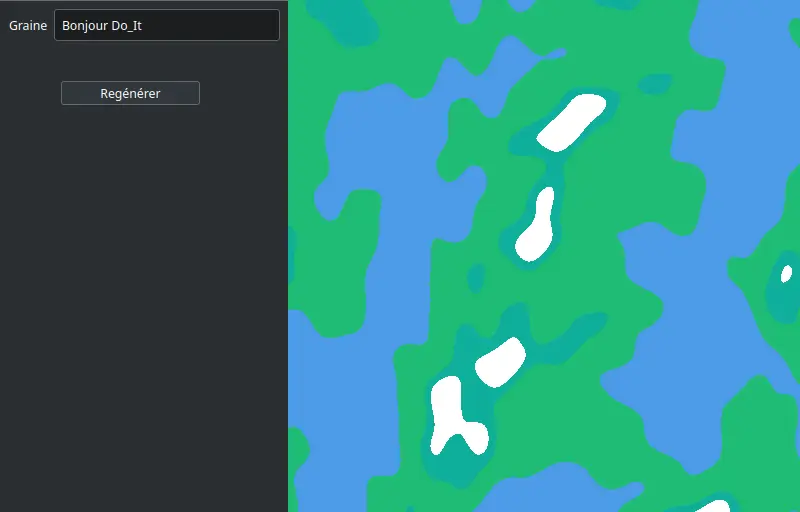
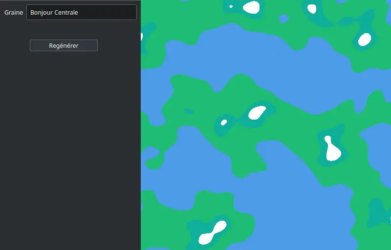
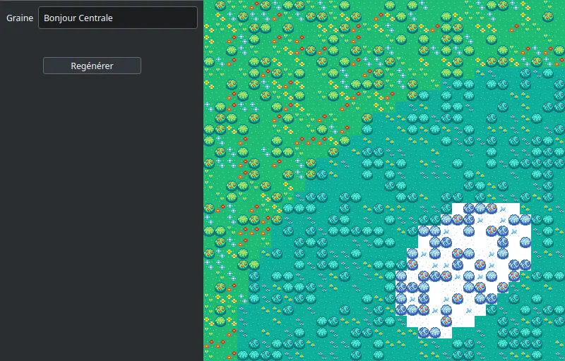

## Objectif du projet

Pour ce projet je souhaite faire un programme permettant de générer de façon procédurale la carte d'un monde avec de multiples environnements ainsi que de l'afficher, et éventuellement de l'exporter pour l'utiliser plus tard dans d'autres programmes.

Le code source est disponible sur [Github](https://github.com/lauravietor/WorldGen)

## Objectifs du premier sprint

- Affichage d'une carte prédéfinie (3h)
- Recherche, choix et implémentation des algorithmes de base : (6h total, dont :)
  - Wave function collapse (3h)
  - Fonctions de bruits (Bruit simplexe, 1h)
  - Autre chose ?

## Résultats du premier sprint

Réalisé au premier sprint :
- Recherche, choix et implémentation des algorithmes de base : (temps estimé 2h, temps réel 2h)
  - Wave function collapse (temps estimé 3h, temps réel 3h)
  - Fonctions de bruits (temps estimé 1h, temps réel 1h)
  
Pas réalisé par manque de temps :
- Affichage d'une carte prédéfinie

Pour ce premier sprint, j'ai grandement manqué de temps dans les deux semaines allouées, donc je n'ai finalement pas eu le temps de faire l'affichage et je me suis restreint à deux algorithmes, mais j'espère continuer un peu les recherches et implémenter d'autres algorithmes pour avoir par exemple des cours d'eau.

## Objectifs pour le second sprint

- Affichage de la carte (4h)
- Changement entre vue globale et vue locale (1h)
- Génération de la hauteur du terrain et de biomes avec le bruit simplexe (2h)
- Génération de cours d'eau (3h)
- Chargement d'un ensemble de tuiles pour l'algorithme WFC (1h)
- Génération au niveau local avec WFC (2h)

Et je me garde à priori 1h pour d'éventuelles difficultés imprévues, que je compte utiliser pour implémenter un export de monde si je ne l'utilise finalement pas pour autre chose.

## Résultats du second sprint

Réalisé au second sprint :
- Affichage de la carte (temps estimé 4h, temps réel 7h)
- Changement entre la vue globale et la vue locale (temps estimé 1h, temps réel 1h)
- Génération de la hauteur du terrain et de biomes avec le bruit simplexe (temps estimé 2h, temps réel 2h)
- Chargement d'un ensemble de tuiles pour l'algorithme WFC (temps estimé 1h, temps réel 1h)
- Génération au niveau local avec WFC (temps estimé 2h, temps réel 3h)

Pas réalisé par manque de temps :
- Génération de cours d'eau

Finalement, j'ai eu de nombreux soucis avec l'affichage de la carte, qui a fini par me prendre bien plus longtemps que prévu, et le débogage de la génération au niveau local était particulièrement long car mon implémentation n'est pas bien optimisée, donc je n'ai pas eu le temps de m'intéresser à la génération de cours d'eau. Voici quelques exemples de ce que j'ai pu obtenir comme résultats :

## Ressources

Un tutoriel pour la génération de cartes de planète avec Unity : http://www.jgallant.com/procedurally-generating-wrapping-world-maps-in-unity-csharp-part-1/
La page Wikipédia sur le bruit simplexe (en anglais) : https://en.wikipedia.org/wiki/Simplex_noise
Une vidéo Youtube sur l'algorithme Wave Function Collapse : https://youtu.be/2SuvO4Gi7uY
Une présentation par un des développeurs de Minecraft sur la génération du monde de Minecraft : https://youtu.be/ob3VwY4JyzE
Dépôt Github de WaveFunctionCollapse : https://github.com/mxgmn/WaveFunctionCollapse
Tileset utilisé : https://jamiebrownhill.itch.io/solaria-rural-village

