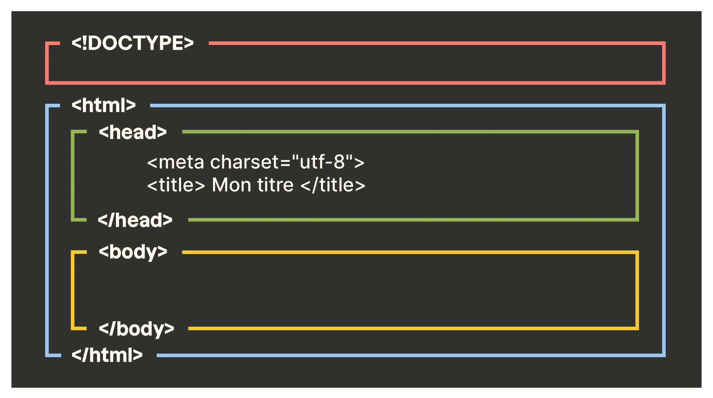
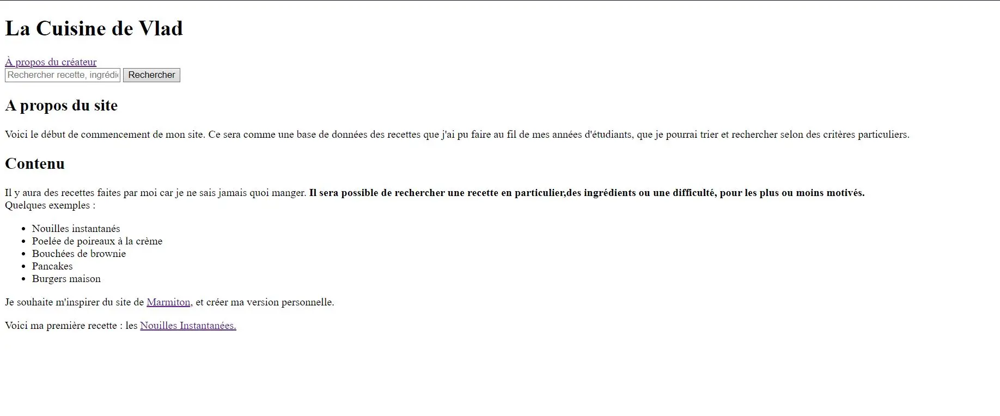
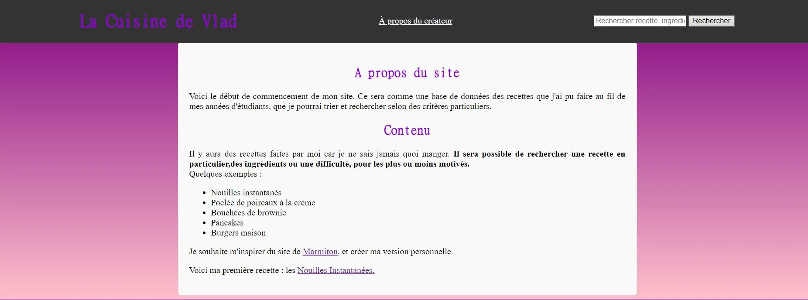
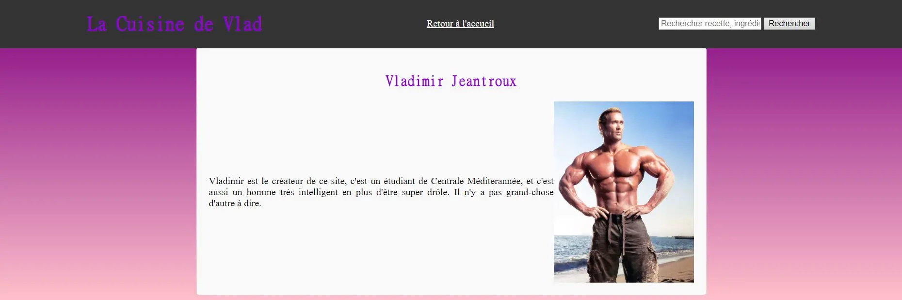

## Pré-requis : 



Pré-requis :

- Aucun

 

## Résumé :
Dans ce premier MON, nous reverrons les bases d'HTML et de CSS. J'ai choisi ce MON afin d'appuyer mon premier POK, qui consiste à 
créer un site web. 
Pour ce faire, j'ai suivi le cours HTML/CSS [d'OpenClassroom](https://openclassrooms.com/fr/courses/1603881-creez-votre-site-web-avec-html5-et-css3) pour m'introduire aux notions de base, et si je bloquais sur certaines notions je me renseignais sur [W3Schools](https://www.w3schools.com/html/). Ce MON vise à reprendre des notions basiques d'HTML et de CSS, et est illustré par la création pas-à-pas des pages du site de mon POK. 

### 1. HTML

Un fichier HTML (extension .html) est le fichier qui dicte l'agencement des éléments sur une page web : l'emplacement du texte, des images, boutons, etc. C'est la partie purement fonctionnelle du site. A l'inverse, le fichier .css va dicter le style de la page et tout ce que ça implique : couleurs, police, disposition,... C'est en combinant ces deux fichiers là que l'on obtient la page web, ce que l'on appelle le "front end" : toute la partie visible du site, avec laquelle l'utilisateur peut interagir. A l'inverse, le back end est toute la partie interne du site et qui permet son fonctionnement, inaccessible à l'utilisateur. Généralement, le back end se fait en langage Javascript, Node.js, etc. Ici, on ne s'intéressera qu'au front end, à commencer avec HTML. 

Un document HTML est structuré avec des balises. Pour insérer un élément, on va le déclarer avec lesdites balises. La plupart d'entre elles sont couplées, c'est à dire qu'il y a une balise ouvrante pour déclarer le type d'élément, et une balise fermante pour marquer la fin de l'élément.  Prenons un exemple avec la balise \<p\> permettant d'indiquer un paragraphe.

```html
<p> Voici le début de ma phrase, mais à mesure qu'elle progresse je me rapproche de la fin et je vais devoir la terminer. <p/>
```

Voyons maintenant la structure basique d'un fichier HTML. On note que les éléments dans entourés par &lt;!-- et --> sont des commentaires, et ne sont pas pris en compte par la machine. 

```html
<!DOCTYPE html> 
<html lang="fr">  <!--Balise principale : elle nous dit que la langue de la page est en français -->
    <head>        <!--Balise d'en tête : contient les informations de la page, comme le nom ou le type de caractère utilisé-->
        <meta charset="utf-8">
        <title>Nom de l'onglet</title>
    </head>
    <body> <!-- Corps de la page : Contient tous les éléments visibles pour l'utilisateur-->
    </body>
</html>
```
Voici comment fonctionne la structure HTML : les éléments sont des blocs délimités par des balises, qui s'imbriquent les uns dans les autres dans un ordre précis.

  

Image : "La structure de base en HTML" OpenClassrooms, https://openclassrooms.com/fr/courses/1603881-creez-votre-site-web-avec-html5-et-css3/8061261-creez-votre-premiere-page-web-en-html.

Pour s'entraîner, on va créer la page d'accueil d'un blog de cuisine comme point de départ de mon POK. Pour commencer, on va insérer un en-tête avec le nom de la page, un onglet de navigation, et une barre de recherche (non-fonctionnelle pour le moment). 

```html
<!DOCTYPE html> 
<html lang="fr">  
    <head>        
        <meta charset="utf-8">
        <title>Accueil de la Cuisine de Vlad</title>
    </head>
    <body>
      <header>
        <div class="entete">
          <h1>La Cuisine de Vlad</h1>
            <a href="a-propos.html" class="apropos">À propos du créateur</a>
            <div class="search-bar">
              <input type="text" placeholder="Rechercher recette, ingrédient,...">
              <button type="button">Rechercher</button>
            </div>
        </div>
      </header>
    </body>
</html>
```
On en profite au passage pour créer la page "à-propos" en question, qui contiendra une image de son créateur. Le body contiendra donc un en-tête et le contenu suivant : 
```html
 <main class="main-content">
    <h2>Vladimir Jeantroux</h2>
    <div class="autobio">
      <p>Vladimir est le créateur de ce site, c'est un étudiant de Centrale Méditerannée, et c'est aussi un homme très
      intelligent en plus d'être super drôle. Il n'y a pas grand-chose d'autre à dire.</p>
      
    </div>
</main>
```
Notons que l'on peut donner des attributs à un éléments directement dans la balise : on règle la taille de l'image lorsqu'on la déclare. La balise déclarant une image est ce qu'on appelle une balise orpheline, c'est à dire qu'elle n'a pas besoin de balise fermante.

La balise "h1" permet d'indiquer un titre , "header" un en-tête, et "a" transforme une portion de texte en lien cliquable."div" est une balise dite universelle, elle n'indique rien en soi mais va permettre d'attribuer des classes à des éléments de la page. Nous reparlerons des classes au moment d'aborder CSS. 

Maintenant, on va créer le contenu principal de la page. On va rapidement évoquer le but du site, et les fonctionnalités qu'on veut proposer. Mettons à jour notre code dans la section "body" en rajoutant une nouvelle section. 

```html
<main class="main-content">
  <h2>A propos du site</h2>
    <p>Voici le début de commencement de mon site. Ce sera comme une base de données des recettes que j'ai pu faire 
    au fil de mes années d'étudiants, que je pourrai trier et rechercher selon des critères particuliers.</p>
    <h2>Contenu</h2>
      <p>Il y aura des recettes faites par moi car je ne sais jamais quoi manger. <strong>Il sera possible de rechercher une recette en 
      particulier,des ingrédients ou une difficulté, pour les plus ou moins motivés. </strong><br>Quelques exemples : </p>
      <ul>
        <li>Nouilles instantanés</li>
          <li>Poelée de poireaux à la crème</li>
          <li>Bouchées de brownie</li>
          <li>Pancakes</li>
          <li>Burgers maison</li>
      </ul>
      <p>Je souhaite m'inspirer du site de <a href="https://www.marmiton.org">Marmiton</a>, et créer ma version 
      personnelle. </p>
      <p>Voici ma première recette : les <a href="recette_test.html">Nouilles Instantanées.</a>
</main>
```
La balise \<ul\> permet de créer une liste à puce, avec chaque point indiqué par \<li\>. On aurait pu faire une liste ordonnée avec \<ol\>, qui aurait été une liste numérotée. \<main\> permet d'indiquer le contenu principal de la page. Cette balise sert autant à la machine qu'à l'humain, car elle permet de créer une catégorie clair et rendre le code plus lisible.

Nous avons maintenant une page d'accueil qui indique ce qu'il y a à savoir sur le site. Voyons voir à quoi elle ressemble !! 



C'est laid. 

En effet, nous n'avons pas encore parlé de CSS, qui contient toutes les informations par rapport au style de la page. Il faut donc s'y intéresser afin de pouvoir disposer les éléments de la page de façon plus lisible, claire et plaisante visuellement. 

### 2. CSS

Sans CSS, toutes les pages Internet ressembleraient à des documents Microsoft Word sans mise en page. Pour pouvoir utiliser CSS, on va créer un fichier "style.css" qu'on va lier au document HTML en mettant la ligne suivante dans la partie \<head\> : 

```
<link rel="stylesheet" href="style.css">
```

A partir d'ici, on va pouvoir travailler sur le fichier style.css, et tous les changements effectués se répercuteront sur la page web.

La structure d'un fichier .css est très différente d'un fichier .html. Ici, on va attribuer à des éléments et des catégories d'éléments des propriétés particulières. Par exemple, je veux que mes gros titres soient de la couleur violette, centrés et dans la police MingLiU. J'écrirai dans mon fichier .css : 

```css
h1{
    color: darkviolet; 
    text-align: center;
    font-family: "MingLiU-ExtB";
}
```

Je peux aussi appliquer ces propriétés à plusieurs éléments en une seule fois, il suffit de les lister en les séparant d'une virgule. Par exemple, appliquant ces propriétés aux titres, mais aussi aux sous-titres plus petits. Il suffit d'écrire : 

```css
h1, h2, h3{
    color: darkviolet; 
    text-align: center;
    font-family: "MingLiU-ExtB";
}
```

On peut maintenant exploiter les classes que nous avions défini précédemment. Prenons par exemple l'en-tête, auquel on avait donné la classe "entete". Dans le fichier .css, nous pouvons donner des attributs à tous les éléments de cette classe, avec la syntaxe ".nomdelaclasse" comme suit (en css les commentaires sont entourés par /* */): 

```css
.entete {
    max-width: 1200px; /* Largeur maximale du contenu du header */
    margin: 0 auto; /* Centre le contenu horizontalement */
    display: flex; /* Utilise la disposition flexbox */
    justify-content: space-between; /* Place les éléments à l'extrémité gauche et droite */
    align-items: center; /* Centre les éléments verticalement */
}
```
Grâce à ces attributs, on a donc un en-tête centré verticalement sur la page (grâce à "align-items"), avec des éléments également espacés au sein de l'en-tête (justify-content). Cette dernière propriété est une fonctionnalité de Flexbox. Flexbox permet d'ordonner des éléments au sein d'un conteneur, pour les aligner verticalement, horizontalement, ou encore régler l'espacement entre les éléments du conteneur. Flexbox permet aussi d'adapter le conteneur à la taille de l'écran avec la fonction "flex-wrap". Si il n'y a plus d'espace horizontal, les éléments retournent à la ligne au lieu de dépasser de l'écran. 

On peut aussi très bien agir sur les éléments de type "header" comme suit : 

```css
header {
    color: #fff; 
    position: fixed; 
    top: 0;
    left: 0;
    right: 0;
    z-index: 100; /* Assure que le header est au-dessus du contenu de la page */
}
```

Cela nous permet d'obtenir un en-tête noir, fixé en haut de l'écran même si l'utilisateur défile vers le bas. 

Nous voulons maintenant un arrière plan plus lisible et esthétique. Pour cela, je compte mettre le texte de la page dans une fenêtre blanche qui sera centrée au milieu de l'écran, et l'arrière plan sera un dégradé de couleurs pour donner un peu de vie au site. On va commencer par le fond, où il suffit de changer l'attribut de l'arrière plan du corps du site : 

```css
body{
    background: linear-gradient(to bottom, #800080, #ffc0cb);
}
```
On crée donc un dégradé qui va du haut vers le bas et du violet vers un blanc rosé. On peut maintenant agir sur le texte principal de la page, cette fois en agissant sur le main de la page, auquel on a donné la classe "main-content".

```css
.main-content {
    max-width: 800px; /* Largeur maximale du contenu principal */
    padding:20px;
    border: 1px solid #ddd;
    border-radius: 5px;
    background-color: #f9f9f9;
    margin-left: auto;
    margin-right: auto;
    margin-top: 80px;
}
```
Ainsi le texte est maintenant inséré dans une boîte centrée verticalement sur la page. La propriété "border-radius" permet d'avoir des coins arrondis et avoir un visuel plus plaisant, et "padding" permet de mettre de l'espace entre les bords et le contenu de la boîte pour avoir un texte plus aéré. 

Enfin, on peut terminer avec un effet mineur mais qui peut donner un peu de vie au site sont les animations jouant lors d'interactions avec la souris. On utilise alors ce qu'on appelle des pseudos-classes. C'est un mot-clé qu'on peut associer à un élément qui précise l'état spécifique dans lequel l'élément doit se trouver pour être ciblé par la déclaration. On va par exemple faire en sorte que les liens hypertexte changent de couleur lorsqu'ils sont survolés ou cliqués par la souris. 

```css
a:hover, a:active{
    color:deeppink
}
```

Voici le résultat final : 





### Bibliographie 
- Schéma "La structure de base en HTML" « Créez votre première page web en HTML ». OpenClassrooms, https://openclassrooms.com/fr/courses/1603881-creez-votre-site-web-avec-html5-et-css3/8061261-creez-votre-premiere-page-web-en-html.