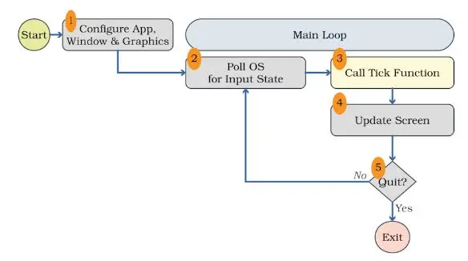

Après m'être familiarisé avec plusieurs types de programmation avec les MON précédents, celui-ci aborde le Rust. Il est largement utilisé pour le développement de systèmes embarqués, d'outils système, et même dans des projets liés à la programmation web. Des notions innovantes comme le "ownership" en font un langage performant et sécurisé. 

Après avoir lu les MON d'[Assane Diouf](https://francoisbrucker.github.io/do-it/promos/2023-2024/Diouf-Asssane/mon/Rust/) et de [Paul Vietor](https://francoisbrucker.github.io/do-it/promos/2023-2024/Vietor-Paul/mon/temps-1.2/), je me suis attaqué au [livre de Rust](https://doc.rust-lang.org/stable/book/title-page.html) afin d'avoir plus de détails et faire mon premier Hello World.


 
 Pré-requis : 
 Un peu d'expérience en programmation, car le livre part du principe qu'on en a avec d'autres langages. Il serait judicieux d'avoir aussi des connaissances en C, car il y a des notions dans la gestion de mémoire.



## Approfondissements 

Ce MON ne reviendra pas sur ce qui a déjà été expliqué par ceux mentionnés au-dessus, comme par exemple les notions d'ownership ou d'objets comme les structures et les énumérations. Je souhaite cependant aborder certains concepts que j'ai moins bien compris ou que j'ai estimé necessiter des explications lors de mon apprentissage de Rust. 

### Les macros

En Rust, une macro-abréviation, ou macro, est une fonctionnalité puissante du langage qui permet la création de code source à la compilation. Les macros sont une façon d'écrire du code qui écrit d'autres codes, ce qui est connu sous le nom de métaprogrammation. Contrairement à une fonction, qui appelle un nombre et un type spécifique de paramètres, une macro peut prendre un nombre variable de paramètres. En effet, en Rust, `println!` est une macro; on peut écrire `println!("hello world")` ou bien `println!("hello{}",name)`, et les deux fourniront un output correct (si la variable `name` est bien définie dans le deuxième exemple, bien évidemment). Les macros sont indiquées par un point d'exclamation à la fin de leur nom. 

En outre, les macros sont développées avant que le compilateur n'interprète la signification du code, de sorte qu'une macro peut, par exemple, implémenter un trait sur un type donné. Une fonction ne le peut pas, car elle est appelée au moment de l'exécution, alors qu'un trait doit être implémenté au moment de la compilation.

L'inconvénient d'implémenter une macro plutôt qu'une fonction est que les définitions de macros sont plus complexes, ce qui les rend plus difficiles à les écrire, les lire, à comprendre et à maintenir que les définitions de fonctions. C'est pour cela qu'il faut être prudent avec l'utilisation des macros, pour maintenir la lisibilité et la compréhension du code. 

On peut définir des macros grâce à la commande `macro_rules!`

## Eléments de game design en Rust

Après m'être entraîné avec les exemples du livre de Rust, j'ai voulu créer un jeu simple avec le temps qu'il me restait. Ayant réussi à mettre la main sur le livre "Hands-on Rust : Effective learning through 2D Game Development and Play" par Herbert Wolverson, j'ai souhaité m'intéressé à la philosophie de programmation d'un jeu vidéo lorsqu'on utilise Rust, en faisant un jeu "Flappy Dragon". 

### Game Loop

Une fonction normale en Rust dans le fichier `main.rs` s'exécute de haut en bas, attendant une entrée de l'utilisateur (s'il y en a) avant de continuer à s'exécuter. Ce n'est évidemment pas possible dans un jeu vidéo, le jeu doit continuer de tourner même si l'utilisateur ne fait rien. Lorsqu'on joue à Flappy Bird, l'oiseau continue de tomber même si le joueur ne touche pas à son écran. On fait donc appel à une boucle qui s'appelle "Game loop", qui va s'exécuter à chaque fois que l'écran s'actualise. 


*Image : Schéma d'un game loop et de ses étapes, Hands-on Rust : Effective learning through 2D Game Development and Play, Herbert Wolverson.*

En premier lieu, il faut initialiser l'application afin qu'on soit capable d'afficher quelque chose à l'écran (1). Ensuite, pendant l'exécution de la boucle, on va demander en premier lieu à l'OS s'il y a eu des entrées de la part de l'utilisateur et lesquelles (appuyer sur son clavier, mouvements/clics de souris,...) (2). Le moteur du jeu va alors traduire ces événements, en faisant appel à la fonction *tick*, et va fournir la réponse du jeu à ces événements, comme les mouvements du personnage par exemple (3). Le jeu met ensuite l'écran à jour (4), et vérifie si le programme doit être fermé (5). Si oui, le jeu se ferme, sinon, on retourne à l'étape 2, et continuer le jeu. 

Cette vision du jeu implique beaucoup d'interactions avec l'OS de la machine, ce qui implique qu'il faudra s'adapter pour chaque type de machine, une solution peut très bien fonctionner sur une machine particulière et pas du tout sur une autre. C'est pour ça que les développeurs utilisent des `moteurs`, qui permettent de s'affranchir des problèmes liés à une plateforme spécifique, entre autres. 

### Création du jeu

On commence par créer dans le main une structure nommée `State` : il faut stocker l'était du jeu (game state) quelque part, afin que la fonction `tick` puisse y accéder et opérer. On utilise la librairie `bracket-lib` pour concevoir le jeu qui contient de multiples algorithmes, génération de nombres aléatoires, etc. 

```rust
impl​ GameState ​for​ State {
​​​    ​fn​ ​tick​(&​mut​ ​self​, ctx: &​mut​ BTerm) { 
​​​    ctx​.cls​(); 
​​​	   ctx​.print​(1, 1, ​'Hello, Bracket Terminal!'​); 
​ 	    }
​ 	}
```

On va ensuite créer un trait "GameState" pour notre état, qui vient avec la fonction tick (ligne 2). `ctx.cls` permet d'effacer le contenu de l'écran, et print nous donne un affichage basique pour voir si ça marche (1,1 sont les coordonnées du print, un peu comme des coordonnées dans une matrice).

Une particularité de la programmation en Rust est que l'on va devoir gérer les erreurs dans la fonction `main`, chose à laquelle je n'étais pas confronté lorsque j'utilisais Godot. 

On doit aussi soi-même appeler un affichage pour notre programme (là encore, en Godot c'est automatique).

```rust
​let​ context = ​BTermBuilder​::​simple80x50​() 
​​​	    ​.with_title​(​'Flappy Dragon'​) 
​​​	    ​.build​()?; 
```

Une autre particularité de Rust est qu'il n'y a pas de tabulation, on utilise 4 espaces à la place. 
Un autre exemple d'application est la création du personnage joueur. On initialise ses coordonnées horizontales et verticales avec des entiers codés sur 32 bits, ainsi que sa vitesse, qui est un flottant. On va aussi initialiser un constructeur pour le joueur, le plaçant sur des coordonnées x et y avec une vitesse initiale.

```rust
​struct​ Player {
​​​	    x: i32, 
​​​	    y: i32, 
​​​	    velocity: f32, 
​ 	}

​impl​ Player {
    ​fn​ ​new​(x: i32, y: i32) ​->​ Self {
​ 	     Player {
​ 	         x,
​ 	         y,
​​ ​	         velocity: 0.0,
​ 	        }
​ 	    }
```

On constate ainsi des éléments de POO, où on a un objet Joueur déterminé par sa position, et sa vitesse. (Souvenirs de C#...)

## Conclusion 

Cette programmation d'un jeu simple m'a permis d'appliquer les notions du livre officiel de Rust, qui était en somme assez théorique. J'ai pu ainsi cerner tous les objets de Rust, qui au premier abord paraissaient assez abstraits. J'ai aussi pu comparer avec mon expérience de programmation sur Godot, où je me suis rendu compte que je me suis fait vraiment tenir la main par le moteur, et j'ai pu découvrir beaucoup d'aspects de gamedev que le développement avec Godot ne m'aurait jamais fait voir. Je pense continuer à jouer avec Rust dans mon temps libre, mais plus de jeu vidéo. C'était très enrichissant, mais Godot reste tout de même bien pratique. 

## Bibliographie 

- MON d'Assane Diouf https://francoisbrucker.github.io/do-it/promos/2023-2024/Diouf-Asssane/mon/Rust/ 
- MON de Paul Vietor https://francoisbrucker.github.io/do-it/promos/2023-2024/Vietor-Paul/mon/temps-1.2/
- The Rust Programming Language https://doc.rust-lang.org/stable/book/title-page.html 
- Hands-on Rust : Effective learning through 2D Game Development and Play, Herbert Wolverson (2021)