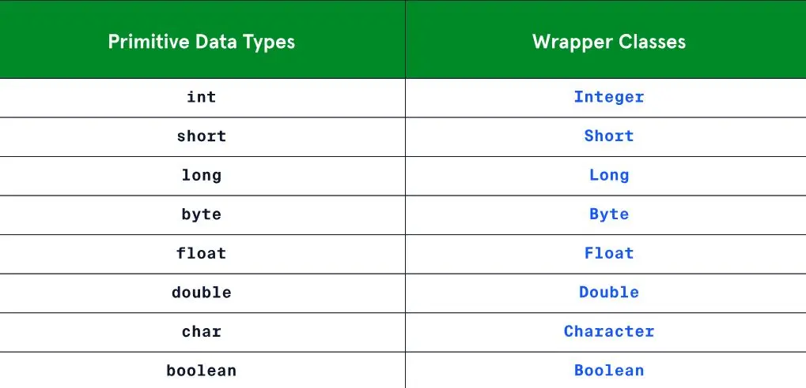

La 1ère année d'école et ses cours d'informatique me paraissent bien loins... Ce MON vise donc à me remettre à niveau sur Java pour ensuite aller plus loin. Java est populaire pour le développement d'applications web et mobiles, de logiciels côté serveur, d'applications de bureau et même de jeux vidéo. Java trouve également des applications dans des domaines scientifiques et techniques ainsi que dans les systèmes embarqués. Sa polyvalence en fait un choix privilégié pour une grande variété de projets informatiques à travers le monde.

J'ai commencé par me refamiliariser avec la syntaxe en lisant le [MON de Nicolas Ouzoulias](https://francoisbrucker.github.io/do-it/promos/2023-2024/Ouzoulias-Nicolas/mon/temps-1.1/), puis j'ai ensuite suivi la formation en lige de Codecademy sur le Java intermédiaire. Ce MON fera un résumé de ce qui a été vu sur cette leçon.


 
 Pré-requis : 
Connaître la syntaxe de Java, et comprendre la notion de Programmation Orientée Objet.



### Input, Output 

La première partie de ce cours parle d'output sur la console et d'input de l'utilisateur, soit les différentes fonctions print, lire et interpréter l'entrée de l'utilisateur, ainsi que lire des fichiers et même les créer pour écrire dedans. 

On a plusieurs méthodes pour print du texte sur Java : `System.out.print`, `System.out.println` et `System.out.printf`. La différence entre elles est que `println` crée un saut de ligne à la fin et `printf` permet de formatter le texte pour y inclure des variables avec le terme % suivi d'un caractère variant selon le type de variable (%s pour les chaînes de caractère, %d pour les entiers, etc.).

Input : 
```java
int nombre = 23
System.out.printf("J'ai acheté %d pastèques",nombre)
```

Output : 
```
J'ai acheté 23 pastèques
```
Les méthodes FileReader et FileWriter permettent respectivement de lire et de créer/écrire sur un fichier .txt.
input and output (print, scanner). Elle doit être importées avant la fonction main, ainsi que l'exception `IOException`, qui est l'erreur qui apparaît lorsqu'un problème lié à l'input ou l'output survient (interruption d'une action input/output, impossibilité d'accéder à un fichier, ou d'écrire dedans,...). Cette partie m'a introduit à la gestion d'exceptions à l'aide de blocs try/catch. En effet, le développeur peut lui même gérer une exception dans son code, ce qui permet d'éviter que le programme crash au moment de la compilation ou de l'exécution. 

Par exemple : 

```java
import java.io.FileReader;
import java.io.IOException;

public class Introduction {
  public static void main(String[] args) {
    String path = "/path/nul/et/faux/fichier.txt";
    try {
      FileReader reader = new FileReader(path);  
      while (reader.ready()) {    //Tant qu'il y a un caractère à lire
        System.out.print((char) reader.read());    
      }    
      reader.close();
    } catch (IOException e) {
      System.out.println("Exception IO, attention !");
      System.out.println(e); //print l'exception en question
    }
  }
}
```

Output : 

```
Exception IO, attention !
java.io.FileNotFoundException: /path/nul/et/faux/fichier.txt (No such file or directory)
```

**Note** : pour exécuter un programme Java (soit un fichier .java), ne pas oublier de compiler le code avec `javac fichier.java`, et on l'exécute avec `java fichier`. On peut aussi compiler plusieurs fichiers en une même ligne en mettant leurs noms à la suite après `javac`.

### Sérialisation, Désérialisation 

Lors du développement d'un programme Java, on aura souvent besoin de sauvegarder l'état d'un objet pour pouvoir le stocker sur un fichier ou sur un réseau. Pour rendre un objet sérialisable, on l'indique au moment de définir la classe : il n'y a pas besoin d'implémenter de quelconque méthode spécifique à une classe pour activer la sérialisation.

```java
import java.io.Serializable;

public class Person implements Serializable {
  private String name;
  private int age;
  private static final long serialVersionUID =1L;
} 
```
La variable `serialVersionUID` est un identifiant unique de version pour une classe sérialisable. Elle permet de garantir la compatibilité de la classe entre plusieurs versions de logiciels, afin que l'objet soit (dé)sérialisé correctement.

Sans se lancer dans des blocs de code interminables, on pourra ensuite transformer les objets qu'on aura créé avec un constructeur en chaîne de caractères sur un fichier .txt (créé pour l'occasion), et la désérialisation permettra de créer des copies de ces objets (donc stockés sur un emplacement mémoire différent des originaux).

Par défaut, tous les champs d'un objet sont sérialisés, en excluant les champs statiques, car de toute manière un champ statique appartient à la classe et non à l'objet. On peut aussi utiliser des outils pour écrire et lire vus dans la partie précédente pour gérer et sérialiser des objets qui n'étaient pas définis comme tels au début !

### Génériques

Java permet de définir ce qu'on appelle des génériques, permettant créer des classes, des interfaces et des méthodes capables de travailler avec différents types de données. C'est très utile si par exemple on a plusieurs classes ayant la même utilité, mais utilisant des données différentes. Les génériques sont un peu comme des templates de classe, des moules à partir desquels on peut rapidement créer la classe dont on a besoin. 

```java
public class Boite<T> {
    private T contenu;

    public Boite(T contenu) {
        this.contenu = contenu;
    }

    public T getContenu() {
        return contenu;
    }

    public void setContenu(T contenu) {
        this.contenu = contenu;
    }
}

// Utilisation de la classe Boite avec un type générique
Boite<String> boiteString = new Boite<>("Contenu de la boite");
String contenu = boiteString.getContenu();
System.out.println(contenu); // Affiche "Contenu de la boite"
```

Le problème des génériques est qu'on ne peut pas utiliser des types primitifs comme arguments (int, boolean,...). Heureusement, Java fournit des classes dites "Wrapper" pour pouvoir utiliser ces types comme paramètres. 
```java
// Incorrect 
Boite<int> boiteInt = new Boite<>(56);

//Correct
Boite<Integer> boiteInt = new Boite<>(56);
```


"Wrapper Classes for Primitive Data Types", Codecademy https://www.codecademy.com/courses/learn-intermediate-java/lessons/generics-java/exercises/java-generics-wrapper-classes 

On peut aussi créer des interfaces ou des méthodes génériques selon les besoins, et changer le nombre de paramètres. 
Exemple de méthode qui compare 2 objets et renvoie si ce sont des nombres ou non: 

```java
public class Util {
  public static <T, S> boolean sontNombres(T elem1, S elem2) {
    return elem1 instanceof Number && elem2 instanceof Number; 
  }
}
```

Les génériques sont ainsi un outil puissant qui permet un code non surchargé, lisible et évolutif.

### Collections

En Java, le framework des collections offre une structure organisée pour travailler avec des groupes d'objets, dépassant les limitations des tableaux avec leur taille fixe. Il comprend des interfaces et des classes implémentées pour différents types de structures de données, ainsi que des algorithmes pour effectuer des opérations courantes sur ces collections. On peut alors se concentrer sur la logique métier au lieu de l'implémentation bas niveau.

Par exemple, le framework propose plusieurs implémentations de listes, comme `ArrayList` ou `LinkedList`, chacune ayant ses utilisations : `ArrayList` est plus couramment utilisée, mais `LinkedList` est plus pratique s'il y a beaucoup d'ajouts ou de suppression en début/fin de liste. On a aussi l'interface `Set`, collection d'objets qui ne permet pas de doublon.

## Conclusion 

Je n'ai pas pu finir la leçon par manque de temps, il reste encore les Threads à voir. Les quiz de la leçon que j'ai suivi étaient verrouillés derrière un abonnement, j'ai donc pratiqué en parallèle sur les exercices du site de W3School. 
Les notions abordées par ce cours étaient très intéressantes et j'ai surtout pu comprendre comment fonctionnaient certains aspects du langage. Les problèmes que j'ai rencontré sur ce site étaient les quiz cachés derrière les paywalls, mais chaque partie avait sa petite partie pratique, mais parfois le terminal inclus ne détectait pas certains problèmes avec le code, il faut donc être un peu vigilant. 
Je recommande tout de même la leçon pour ceux qui veulent aller plus loin, car elle était très claire et compréhensive. Il faut cependant bien parler anglais, j'ai eu du mal à comprendre quelques concepts techniques en anglais tout au long de la leçon. 


## Bibliographie 

- Learn Intermediate Java, Codecademy https://www.codecademy.com/courses/learn-intermediate-java/informationals/welcome-to-learn-intermediate-java
- Documentation de Java https://docs.oracle.com/en/java/ 
- Exercices de W3School (sur les sujets abordés par la leçon de Codecademy) https://www.w3schools.com/java/ 

## Autres MON sur Java

- ["Petite initiation au Java et à la Programmation Orientée Objet" par Nicolas Ouzoulias](https://francoisbrucker.github.io/do-it/promos/2023-2024/Ouzoulias-Nicolas/mon/temps-1.1/)
- ["Initiation au Java" par Agathe Rabachou](https://francoisbrucker.github.io/do-it/promos/2023-2024/Agathe-Rabachou/mon/temps-3.2/)