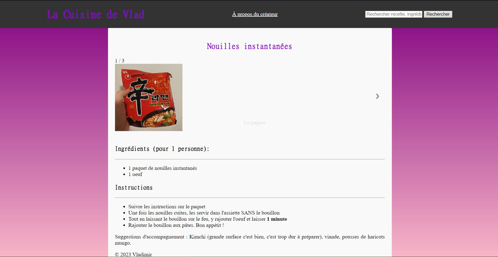

## Description : 

Je voulais utiliser ce premier POK pour me former au développement web et créer un site sur les recettes de cuisine. Ca prendrait la forme de sites comme Marmiton, avec différentes recettes avec listes d'ingrédients et si possible appuyées par des photos et des vidéos. 
J'aimerais aussi implémenter une forme de recherche où entre des ingrédients ou un style de plat (copieux, healthy, etc.) et renverrait des plats recommandés.

### Design : 

J'ai commencé par imaginer ce que je voulais pour ce site. Je voulais tout d'abord avoir une page pour chaque recette que je connaissais : nom du plat, images, difficulté, ingrédients, ainsi que les étapes à suivre pour faire le plat.
Ensuite, je souhaiterais implémenter une fonction de recherche par nom du plat et par ingrédient. Cela pourrait être poussé plus loin par un système de tags, où on pourrait alors filtrer les recettes par difficulté ou ingrédients. Je voulais éventuellement mettre ce site sur un serveur mais seulement si toutes les étapes précédentes se passaient déjà bien. 

## Prévisions pour le point 1

- Avoir fait les fichiers HTML/CSS du site 
- Me former sur Javascript
- Réussir à mettre en place une fonctionnalité du site 

## Ce qui a été fait 

Après avoir révisé le cours de Java de 1ère année, j'ai regardé des vidéos youtube ([lien](https://www.youtube.com/watch?v=W6NZfCO5SIk)) pour approfondir et tenter de coder mes propres scripts. 

J'ai ensuite écrit les fichiers HTML et CSS pour la page principale et une page type de recette. Pour le prochain sprint, je compte transformer cette page en template, qui pourra s'adapter selon la recette qu'on choisit, en me basant sur les méthodes qu'on a pu employer en low code/no code.

J'ai ensuite fait plusieurs tentatives pour implémenter une barre de recherche, un système de tags en javascript. J'ai finalement réussi à implémenter une fonction plus simple : avoir une galerie de photos du plat qu'on peut faire défiler avec des flèches. 

## Bilan du Sprint 1 et objectif pour le Sprint 2 

Je pense m'être tout de suite lancé dans des tâches en Javascript difficiles trop rapidement, ce qui a beaucoup ralenti ma progression. J'ai sous-estimé le temps pour apprendre Javascript et les tâches à faire pour le fonctionnement du site. Je dispose cependant de templates de pages qui me seront utiles pour la suite. J'ai été très ambitieux au vu de mes compétences en développement web et j'ai revu mes objectifs pour le 2e sprint : 
- Finir d'apprendre Javascript
- Polir les différentes pages déjà faites
- Trouver une manière de construire les pages pour les recettes 