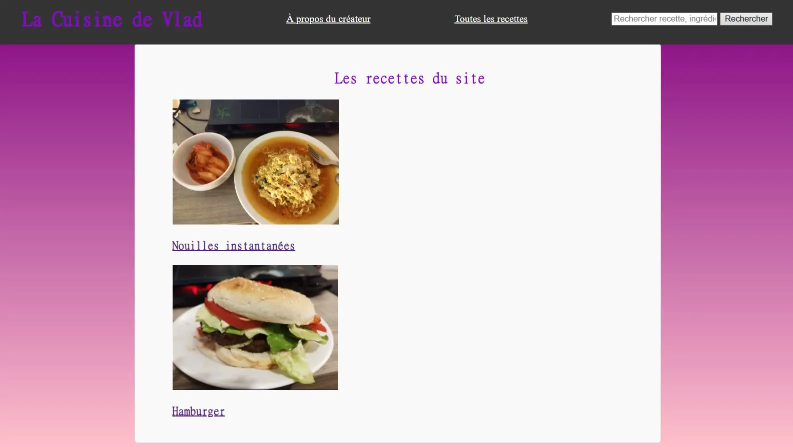

## Description : 

Je voulais utiliser ce premier POK pour me former au développement web et créer un site sur les recettes de cuisine. Ca prendrait la forme de sites comme Marmiton, avec différentes recettes avec listes d'ingrédients et si possible appuyées par des photos et des vidéos. 
J'aimerais aussi implémenter une forme de recherche où entre des ingrédients ou un style de plat (copieux, healthy, etc.) et renverrait des plats recommandés.

Le projet est disponible sur Github [ici](https://github.com/VlaadimirJ/Vladimir-POK1). La page principale se trouve sur index.html et permet de naviguer vers toutes les autres pages. 

## Sprint 1

### Design : 

J'ai commencé par imaginer ce que je voulais pour ce site. Je voulais tout d'abord avoir une page pour chaque recette que je connaissais : nom du plat, images, difficulté, ingrédients, ainsi que les étapes à suivre pour faire le plat.
Ensuite, je souhaiterais implémenter une fonction de recherche par nom du plat et par ingrédient. Cela pourrait être poussé plus loin par un système de tags, où on pourrait alors filtrer les recettes par difficulté ou ingrédients. Je voulais éventuellement mettre ce site sur un serveur mais seulement si toutes les étapes précédentes se passaient déjà bien. 

### Prévisions pour le point 1

- Avoir fait les fichiers HTML/CSS du site 
- Me former sur Javascript
- Réussir à mettre en place une fonctionnalité du site 

### Ce qui a été fait 

Après avoir révisé le cours de Java de 1ère année, j'ai regardé des vidéos youtube ([lien](https://www.youtube.com/watch?v=W6NZfCO5SIk)) pour approfondir et tenter de coder mes propres scripts. 

J'ai ensuite écrit les fichiers HTML et CSS pour la page principale et une page type de recette. Pour le prochain sprint, je compte transformer cette page en template, qui pourra s'adapter selon la recette qu'on choisit, en me basant sur les méthodes qu'on a pu employer en low code/no code.


J'ai ensuite fait plusieurs tentatives pour implémenter une barre de recherche, un système de tags en javascript. J'ai finalement réussi à implémenter une fonction plus simple : avoir une galerie de photos du plat qu'on peut faire défiler avec des flèches. 

### Bilan du Sprint 1 et objectif pour le Sprint 2 

Je pense m'être tout de suite lancé dans des tâches en Javascript difficiles trop rapidement, ce qui a beaucoup ralenti ma progression. J'ai sous-estimé le temps pour apprendre Javascript et les tâches à faire pour le fonctionnement du site. Je dispose cependant de templates de pages qui me seront utiles pour la suite. J'ai été très ambitieux au vu de mes compétences en développement web et j'ai revu mes objectifs pour le 2e sprint : 

- Voir comment créer un système de tags avec les ingrédients 
- Stocker les recettes de façon à ce que le site puisse y accéder
- Trouver une manière de construire les pages pour les recettes 

## Sprint 2 

L'objectif de ce sprint était au moins d'implémenter un système de tags pour filtrer par ingrédients, rajouter des recettes et éventuellement une barre de recherche s'il reste du temps. 

J'ai créé un fichier .json avec les recettes (nom, image, ingrédients, étapes), et avec Javascript j'ai pu extraire les noms et les photos. Histoire de ne pas perdre trop de temps à rajouter à la main des recettes dans le .json il n'y en a que deux, mais elles ont pour but d'illustrer ce qui a été possible de faire. Par la suite, j'ai donc rajouté une page qui recense les différentes recettes sous forme de liste qui affiche le nom et une photo pour chaque article. En cliquant sur l'image, on est redirigé vers la page de la recette, pré-remplie à l'aide d'un script qui parcourt les recettes dans le fichier JSON, et récupère les informations correspondant à la recette voulue. Pour ces étapes, j'ai demandé de l'aide à des amis développeurs, qui m'ont donné des idées de comment le code pourrait fonctionner que je m'occuperais de rédiger, ainsi que des corrections lorsque ça ne marchait pas. 

Ensuite, j'ai modifié le JSON en ajoutant une section "Tags" qui permet de catégoriser les différents plats (par exemple les nouilles instantanées ont les tags "oeuf" et "éco"). Il y a une page qui recense tous les tags, et lorsque l'on clique dessus, affiche tous les plats avec ce tag. A l'avenir, cela pourrait servir à créer un système de recherche avancée à partir des tags. 

```javascript
//on crée la liste des recettes qui aura l'identifiant "recette-list" qui pourra être appelé sur HTML. 
const recetteList = document.getElementById("recette-list");
//recettes est le nom sous lequel est sauvegardé le fichier JSON
recettes.forEach(recette => {
    //on crée les éléments de la liste (nom, image)
    const listItem = document.createElement("li");
    const recipeLink = document.createElement("a");
    const recipeImage = document.createElement("img");
    recipeImage.classList.add("recipe-image");
    const recipeTitle = document.createElement("h3");
    // on parcourt le fichier JSON pour définir l'image et le titre, et le lien vers lequel ils vont mener
    recipeLink.href = recette.lien; 
    recipeImage.src = recette.image;
    recipeImage.alt = recette.name;
    recipeTitle.textContent = recette.name;
    //on ajoute l'image et le texte au lien
    recipeLink.appendChild(recipeImage);
    recipeLink.appendChild(recipeTitle);
    //on ajoute le lien à l'élément <li>
    listItem.appendChild(recipeLink);
    //on ajoute l'élément <li> et <ul>
    recetteList.appendChild(listItem);
    });
```
Résultat : 



## Travail accompli 

Tâches terminées avec succès : 
- Une page d'accueil
- Une page pour chaque recette
- Une page qui liste toutes les pages du site
- Avoir des tags associés à chaque page 
- Un caroussel d'images sur chaque page de recette

Pistes d'amélioration : 
- Avoir une interface plus polie 
- Plus de recettes 
- Héberger le site sur un serveur 
- Avoir des pages entièrement dynamiques; certaines infos doivent encore être remplies à la main
- La barre de recherche est toujours entièrement cosmétique
- Le code est assez chaotique et nécessite d'être optimisé
- Les tags ne sont pas dynamiques : j'ai créer la page avec tous les tags à la main. 

## Bilan 

Au terme de ce POK, j'ai codé un site fonctionnel : les objectifs principaux ont été remplis, c'est-à-dire une page pour chaque recette, et un système de tags fonctionnels qui permet de trier les recettes. J'ai pu m'entraîner sur le HTML et CSS, et j'ai utilisé Javascript pour simplifier l'utilisation du site et le rendre dynamique grâce à des données JSON.  

Des pistes d'améliorations pour ce projet seraient l'ajout d'un véritable système de recherche, non seulement en recherchant des mots (la barre de recherche pourrait suggérer des pages pendant l'écriture sans passer par une page intermédiaire) mais aussi avec la recherche avancée, en incluant ou excluant des tags. Bien sûr, à l'avenir le site contiendrait beaucoup plus de pages et de recettes.Je n'ai pas pu faire tout ce que j'ai prévu de faire, mais je considère que le site accomplit son but initial : être une base de recettes pouvant être triées selon certains critères.   

En termes d'outils, on pourrait explorer différentes pistes telles que Bootstrap ou d'autres framework pour rendre le développement plus facile sur le long terme. L'ajout d'icônes serait aussi le bienvenu pour rendre la navigation plus agréable. 

Mon organisation pendant le sprint 2 était bien meilleure que durant le premier : j'ai défini des objectifs clairs que je devais remplir en une session de travail, qui m'a permis de moins m'éparpiller et mieux gérer mon temps. Pour le prochain POK, je vais continuer de définir des objectifs clairs pour chaque session, mais aussi bien prendre le temps de chercher et de me renseigner sur les outils utilisés afin de ne ne pas ralentir ma progression par le fait que je suis perdu. 
