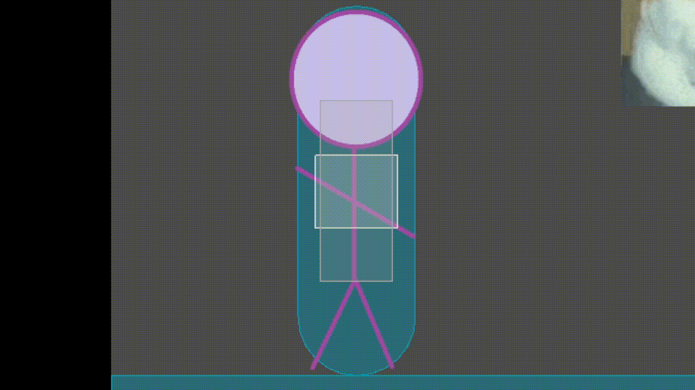
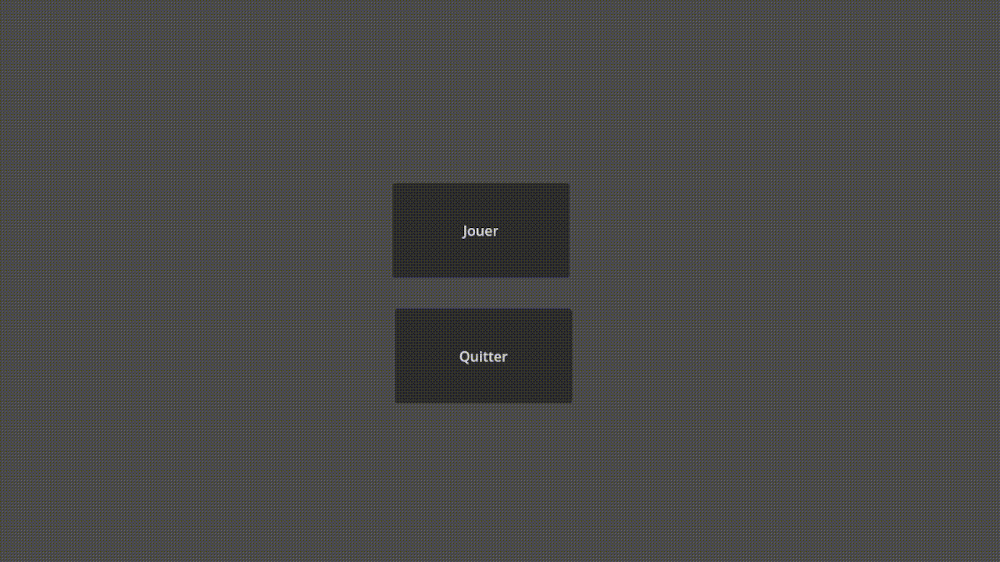

## Description

Ce POK a pour but de me familiariser avec le moteur Godot, en créant un petit jeu vidéo basique. Ce jeu serait un jeu de combat en 2D comme Mortal Kombat ou Street Fighter. J'ai choisi le moteur Godot car il est facile à prendre en main et open source. Un jeu de combat place 2 joueurs face à face, qui doivent enchaîner des séries de coups afin de réduire les points de vie de son adversaire à zéro. 

Pour ce jeu j'ai l'intention de faire au moins 2 personnages pour que 2 personnes puissent jouer ensemble, ainsi qu'une IA pour donner un adversaire aux joueurs solo. 

## Backlog mis à jour

- Prise en main de Godot ~~(4h)~~ 2h30 [X] (sprint 1)

- Création d'un personnage (8h) [] 
    - Animation du personnage et des coups (1h) [X] (sprint 1)
    - Addition des mouvements ~~(2h)~~ 3h [X] (sprint 1)
    - Addition des hitbox (2h) [X] (sprint 1)
    - Interaction lorsqu'on se fait frapper (1h)[]
    - Commande de blocage des attaques adverses (1h) []

- Implémentation des mécaniques de jeu (3h30) []
  - Compte à rebours (1h) [X] (sprint 1)
  - PV (2h)[]
  - Ecran de victoire (30 min) []

- IA (4h) []
    - Bot facile **et difficile** (2h) []
    - ~~Bot difficile~~ Multijoueur local (2h) []

- Création des menus (30 min) []
    - Menu principal **et arène** ~~(1h)~~ 30 min [X]
    - ~~Sélection du personnage (1h) []~~ Le personnage est imposé.

## Objectif du Sprint 1

Pour ce premier sprint, je compte faire au moins un personnage qui puisse être contrôlé et joué contre un mannequin d'entraînement (i.e. un personnage statique qui a pour seul but de prendre des coups).

Backlog du sprint 1 : 

- Prise en main de Godot ~~(4h)~~ 2h30 [X]
- Création d'un personnage (6h) [X] 
    - Animation du personnage et des coups (1h) [X]
    - Addition des mouvements ~~(2h)~~ 3h [X]
    - Addition des hitbox (2h) [X]
- Implémentation des mécaniques de jeu (2h) []
  - Compte à rebours (1h) [X]
  - PV (1h)[]
- Création des menus ~~(1h)~~ [X]
    - Menu principal **et arène** ~~(1h)~~ 30 min [X]

## Résumé du Sprint 1 

J'ai tout d'abord regardé une vidéo couvrant les bases du moteur Godot. Avec ce tutoriel, j'ai appris le langage GDScript, et la manière dont était codée les mouvements du personnage jouable. 

Le jeu comporte pour le moment 2 scènes : un menu principal qui donne le choix entre démarrer ou quitter le jeu, ainsi que l'arène de combat où se déroule le jeu. L'arène comporte un sol, un mur de chaque côté de l'écran et une animation pour expérimenter avec les éléments d'arrière-plan, mais aussi pour que le fond ne soit pas trop vide. Il y a aussi un compte à rebours, et dès qu'il affiche 0, le jeu considère que le mannequin d'entraînement a gagné, et le jeu se ferme.

J'ai ensuite implémenté les commandes droite, gauche, saut et attaque pour un personnage, ainsi que les animations correspondantes. J'ai aussi rajouté un mannequin immobile. Ces deux personnages sont capables d'interagir ensemble : ils ont une collision, i.e. ils ne peuvent pas se traverser l'un et l'autre, et le jeu réagit lorsque le joueur attaque le mannequin (la console affiche "Ouch !"), et un effet sonore se joue.


Séquence de gameplay montrant les contrôles que le joueur peut faire.

```
func _on_fist_colliders_body_entered(body):
	$PunchSound.play()
	if(body.name == "Dummy"):
		print("-----")
		print("Ouch !!")
		print("-----")
```
Code dictant ce qu'il se passe lorsque le poing du personnage frappe le manequin. (Le son de frappe se joue, puis la console affiche "Ouch!" si le frappé est le mannequin d'entraînement.)



Démonstration des hitbox en jeu. La boîte rose est liée au poing, et ne s'active que lorsqu'une attaque liée au poing est lancée. La boîte verte est liée au pied. Le reste du temps, ces boîtes sont inactives (grises). Si une boîte colorée touche un autre personnage, alors celui-ci se fait toucher par le coup. 

### Difficultés rencontrées 

La principale difficulté que j'ai rencontré était la compatibilité du code présenté dans les guides que j'ai regardé. En effet, Godot est régulièrement mis à jour et le guide que j'ai regardé était sur une version précédente. J'ai donc dû adapter la syntaxe pour qu'elle soit lue par ma version de Godot, ce qui m'a ralenti lors de la prise en main du moteur. La manière dont les mouvements étaient codés dans le guide n'étaient aussi pas compatibles avec le genre de jeu que je voulais créer, et j'ai donc dû recommencer le codage des mouvements et de la gravité depuis le début. J'ai aussi été surpris par la difficulté à implémenter des éléments à priori simples, comme un compte à rebours ou une animation d'arrière plan. 

J'ai aussi un peu sous-estimé la partie graphique. Je pensais que ce serait vite fait avec des Stickman faits sur Paint en 30 secondes, mais ils doivent avoir une animation pour chaque action et ce qui je pensais allait me prendre 5 min m'a en réalité pris 1h. 

## Bilan du sprint 1 et prévisions pour le sprint 2 

J'ai pu remplir les objectifs que je m'étais fixés pour le 1er sprint : un personnage jouable, qui peut interagir avec un mannequin d'entraînement. 

Pour le sprint 2 j'aimerais pouvoir ajouter une barre de points de vie, une interaction lorsque le joueur se fait frapper par une attaque (i.e. le personnage ne devrait pas pouvoir lancer d'actions lorsqu'il se fait frapper), ainsi qu'un ennemi contrôlé par l'IA que le joueur pourrait affronter.

Backlog du sprint 2 : 

- Finition du personnage (3h) []
    - Interaction lorsqu'on se fait frapper (1h)[]
    - Commande de blocage des attaques adverses (1h) []
    - Ajout de coups divers (attaques accroupies) (1h) [X]

- Implémentation des mécaniques de jeu (2h30) []
  - PV (2h) [X]
  - Ecran de victoire (30 min) []

- Multijoueur (4h) []
    - Bot facile **et difficile** ~~(2h)~~ (2h30) [X]
    - ~~Bot difficile~~ Multijoueur local (2h) []
  
- Déploiement (30 min)[X]

## Résumé du Sprint 2 

Pour commencer, je me suis rendu compte que la manière dont les attaques et les hitbox étaient codées n'étaient pas adaptées si je voulais ajouter plusieurs personnages : je me retrouverais alors avec énormément de fichiers script différents pour chaque personnage. J'ai donc commencé par éditer le code et les animations pour avoir une base générale de mouvements auquel n'importe quel personnage aurait accès. Bien que j'ai avancé là dessus, je n'ai pas réussi à aboutir et pour l'instant le personnage joueur utilise le même script qu'avant.
J'ai aussi refait la manière dont étaient codées les animations, pour pouvoir plus tard ajouter d'autres animations lorsque je voudrais rajouter des attaques et des mouvements pour un personnage. J'ai aussi exploré des outils du moteur pour éliminer un maximum de fonctions à coder. Moins j'ai de mécanismes compliqués à coder, mieux je me porte. 

Pour avoir un jeu à 2 joueurs/contre l'IA, il fallait que je crée un autre personnage capable de se déplacer et de combattre, j'en ai donc fait un rapidement à partir du mannequin d'entraînement, qu'il remplacera dorénavant. Concernant l'IA, je souhaitais faire 2 niveaux de difficulté, mais le jeu est tellement basique qu'on ne pourrait pas faire une IA avancée (on ne peut que bouger de droite à gauche et faire 1 attaque).

Le terme d'Intelligence Artificielle est un peu abusif, car c'est en réalité un simple algorithme. L'ennemi va regarder la distance entre le joueur et lui-même : plus il est proche du joueur, plus il a de chances d'initier une attaque. Sinon, il se déplace vers le joueur. De plus, si le joueur réussit à sauter derrière le bot, il va se retourner et continuer son assaut. Le bot a accès à 2 attaques : une attaque debout et une attaque accroupie. 


L'ennemi IA en action. Il s'approche du joueur, fait une attaque accroupie et une attaque debout. Il y a aussi une probabilité qu'il ne prenne pas d'action lorsqu'il est proche du joueur, histoire qu'il ne fasse pas que des attaques. 

J'ai aussi importé des textures de barre de vie, mais je n'ai pas réussi à finaliser la programmation, et donc pour l'instant il y a des barres de vie purement décoratives. Au lieu de cela, j'ai rajouté la possibilité de jouer à la manette. Enfin, j'ai exporté le projet et l'ai compressé en un fichier .exe. 

Tout le projet est sur mon [GitHub](https://github.com/VlaadimirJ/pok-2-vladimir-jeantroux).

### Difficultés rencontrées 

Bien que c'est un cheminement normal lorsque l'on apprend, se rendre compte que ce que l'on a fait n'est pas optimal et devoir tout recommencer est assez frustrant. Il y a aussi toujours le problème de ne pas pouvoir comprendre l'aide qu'on puisse trouver sur Internet et les forums car le code proposé est obsolète car a la syntaxe d'une version précédente. 

Un jeu de combat est aussi un projet ambitieux pour un 1er jeu vidéo, et malgré ces 20h passées dessus, je suis encore incroyablement loin d'aboutir à quelque chose qu'on peut qualifier de jeu. J'ai dû travailler en apprenant tout le moteur Godot et le langage associé, et j'ai aussi progressé assez lentement sur des notions comme les interactions entre personnages ou le codage de l'IA, voire rencontré des impasses. J'ai préféré laisser tomber certaines notions pour travailler sur d'autres.   

## Glossaire

Hitbox : zone invisible autour d'un objet dans un jeu vidéo, déterminant les interactions et les collisions avec d'autres éléments du jeu.

## Bibliographie

- Documentation de Godot Engine https://docs.godotengine.org/en/stable/index.html 
- Godot Crash Course for Beginners pour apprendre comment fonctionne le moteur https://www.youtube.com/watch?v=S8lMTwSRoRg&t=2537s 
- Tournament Fighter | Basic Input tutorial pour l'implémentation des hitbox https://www.youtube.com/watch?v=XrR5jibBVxo
- Godot Tutorial || Part 5 || Tournament Fighter || Heads Up Display https://www.youtube.com/watch?v=SZnz6nWTRZo&list=PLvz6jVtRjve0RbEmoKM_42k_J1KJw9y9W&index=5 

**Horodatage**

*Sprint 1*
>Prise en main de Godot (~2h30)
>Création du menu principal et de l'arène (~30 min)
>Codage des mouvements et saut (1h)
>Réécriture complète du code lié aux mouvements (2h)
>Animation du personnage jouable (1h)
>Implémentation des hitbox et d'un mannequin d'entraînement (2h)
>Implémentation d'un compte à rebours (1h)

*Sprint 2*
>Création du 2e personnage (30mn)
>Refonte des animations et ajout des attaques accroupies (1h30)
>Programmation de l'IA (2h30)
>Nouveau codage des coups et des hitbox (2h)
>Barres de PV (1h30)
>Ajout de contrôles manette (30mn)
>Déploiement (30mn)