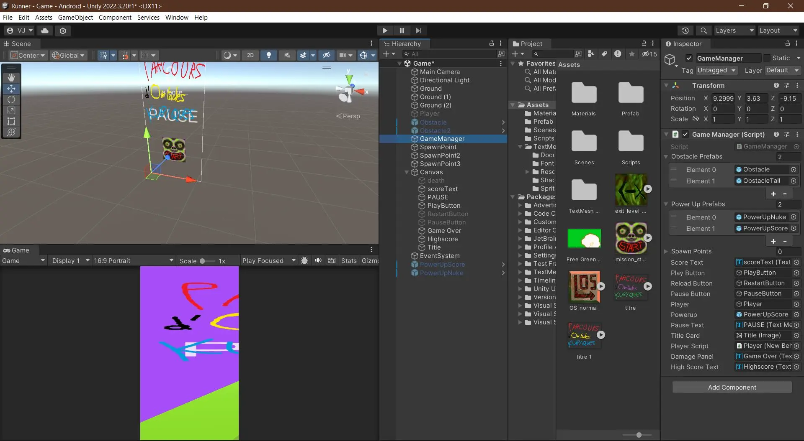
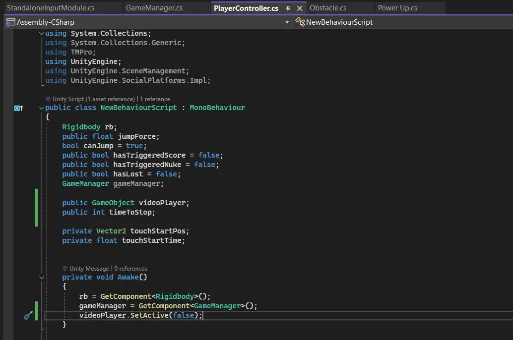
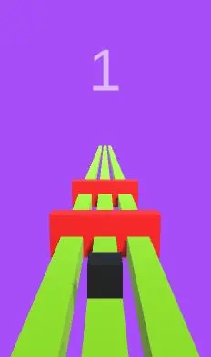
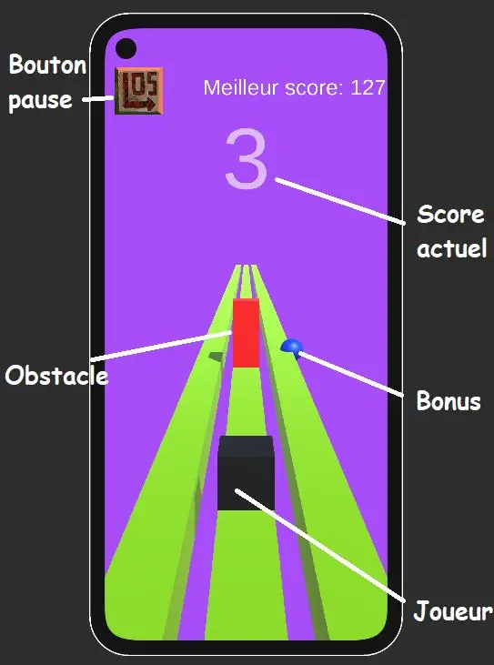
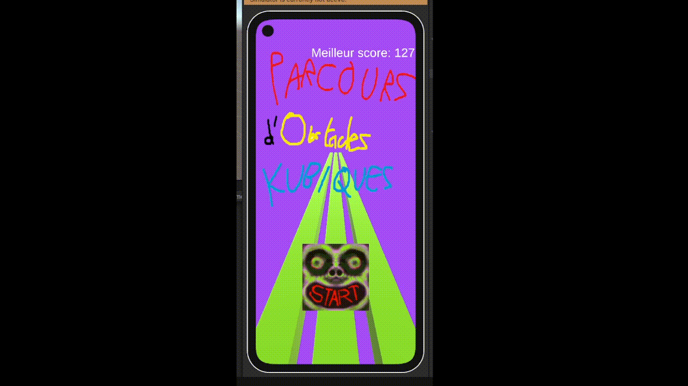

## Description 

(Les liens de téléchargement sont après la conclusion)

Pour continuer dans ma lancée d'apprendre des moteurs de création de jeux, j'ai décidé de m'attaquer à Unity, en créant un jeu mobile simple dans le style de Subway Surfers ou Temple Run, pour Android. Le jeu s'appelle **Parcours d'Obstacles Kubiques**, et le but est de survivre le plus longtemps possible à un assaut infini de pavés droits, n'ayant comme seules armes 3 couloirs rectilignes et ses réflexes, dans un monde où on est le seul cube parfait...

**Pourquoi Unity ?**

Unity est l'un des moteurs les plus populaires dans le milieu du développement de jeux vidéo, notamment dans l'industrie mobile. Il est très complet, adapté à de multiples plateformes, et dispose d'une documentation extrêmement fournie. De plus, parmi les plus gros moteurs, il est aussi parmi les plus faciles à prendre en main pour un débutant. Unity utilise aussi C#, langage avec lequel je suis déjà familier et qui me permettrait de pratiquer la programmation orientée objet. J'aimerais travailler dans le gamedev plus tard, et donc pour m'y préparer je souhaite expérimenter avec différents moteurs de jeu et élargir mon éventail de ressources. Unity est aussi gratuit pour les utilisateurs en faisant un usage personnel.

Il y a 2 aspects différents de Unity entre lesquels il faut jongler pour pouvoir agir sur tous les aspects du jeu : la partie éditeur et la partie script.

Partie éditeur           |  Partie console
:-------------------------:|:-------------------------:
  |  

Sur la partie éditeur, on peut distinguer en haut à gauche la scène, c'est à dire l'endroit où on va pouvoir arranger et visualiser les éléments du jeu dans l'espace. En bas à gauche, la prévisualisation du jeu du point de vue du joueur, c'est là où on va regarder lors des phases de test. Toute la partie droite est la liste des éléments du projet, ainsi que leurs attributs qu'on va pouvoir modifier. 

Unity dispose d'une intégration Microsoft Visual Studio, et c'est là dessus qu'on va éditer les scripts du projet en C#. Généralement, pour un objet, on va avoir un script associé pour dicter son comportement, ainsi qu'un script Game Manager, qui va dicter le déroulement général du jeu ainsi que gérer les interactions entre plusieurs entités. 

**Qu'a-t-on appris du [dernier POK](https://francoisbrucker.github.io/do-it/promos/2023-2024/Vladimir-Jeantroux/pok/temps-2/) ?**

- __Faire de son premier jeu quelque chose de simple.__ Les jeux de combat, bien que complets et permettant de passer en revue beaucoup d'éléments d'apprentissage pour le développement d'un jeu vidéo, sont aussi extrêmement difficiles à développer en entier, et surtout ensuite d'en faire quelque chose de fonctionnel. J'ai dû dessiner moi même des personnages afin que le jeu soit un minimum lisible, aussi bien pour un joueur qu'un développeur. Ici, on va faire un jeu où il faut attraper des pièces et sauter par dessus des obstacles. Tous les éléments du jeu (ou presque) seront des cubes colorés.

- __Choisir son moteur en fonction du jeu qu'on veut faire, et pas l'inverse.__ Godot est un moteur populaire, mais pas adapté pour les jeux de combat. Unity, en revanche, a beaucoup de support et d'extensions permettant de travailler avec des applis Android et iOS, rendant tout le développement un peu plus fluide.

- __Prévoir son POK selon le contenu de ses MON précédents.__ Enseignement un peu plus général, mais ici je n'aurai pas à apprendre tout un langage en même temps que le moteur que j'utilise pour le POK. J'ai des bases de C#, et quelques notions de game design grâce au MON sur Rust.

## Backlog initial

**Sprint 1 : Le jeu de base**

- Se documenter sur Unity ~~(2h)~~ (1h30)[X]
- Création du personnage (1h) [X]
- Création de la carte/piste (2h) [X]
- Système de score, comptage, meilleur score,... (2h) [X]
- Ajout d'obstacles ~~(1h)~~ (2h30) [X]
- Perdre et recommencer (1h) [X]

**Sprint 2 : Fonctions supplémentaires**

- Menus ~~(1h)~~(3h45) [X]
- ~~Boutique et monnaie in-game (1h30) []~~
- Power-ups (2h) [X]
- ~~Pubs (1h) []~~
- ~~Processus tournant lorsque l'appli est fermée (1h) []~~
- ~~Pouvoir continuer si on perd (1h30)[]~~
- Exportation en application ~~(1h)~~ (1h30)[X]
- **Augmentation de la difficulté (1h) [X]**

En gras les tâches ajoutées en cours de route. Le backlog prévoit 2h parmi les 20 dédiées à la correction de bugs. 

## Résumé du Sprint 1

Bonne nouvelle : les objectifs du sprint 1 ont été fait en la moitié du temps. Mauvaise nouvelle : je n'ai pas pu avancer plus à cause d'imprévus. Pour le moment, on a un jeu très rudimentaire : un cube pouvant seulement sauter par dessus des obstacles s'avançant vers lui à des intervalles aléatoires. Le score augmente à chaque seconde où le joueur encore en vie, et le jeu recommence si le joueur touche un obstacle. C'est un jeu très simple, mais déjà fonctionnel, par dessus lequel je pourrai construire et ajouter des fonctionnalités. 

## Ajustements et objectifs pour le Sprint 2

En plus des objectifs déjà établis pour le sprint 2 :
- Faire des obstacles qui apparaissent sur les pistes gauche et droite 
- Garder en mémoire les infos telles que le meilleur score
- Rendre le jeu compatible sur iOS 

## Résumé du Sprint 2 

Le 2e sprint a été consacré à l'ajout de fonctionnalités pour rendre le jeu un tout petit peu plus intéressant, et de la correction de bugs. Les principaux ajouts sont le mouvement en 2 dimensions, et les bonus. En effet, les obstacles arrivent maintenant aussi sur les couloirs de gauche et de droite ainsi qu'au milieu, et le joueur peut se déplacer à droite, à gauche, ou sauter pour les esquiver. 

2 bonus ont été ajoutés, qui apparaissent aléatoirement sur un des couloirs et qui octroient un avantage au joueur quand il en ramasse un : soit 10 points sont rajoutés à son score, soit tous les obstacles à l'écran sont détruits. La partie la plus difficile était de faire fonctionner le bonus de score, car il fallait faire interagir plusieurs objets à la fois : le joueur (qui entre en contact avec le bonus), le bonus, et le compteur de score, qui doit être incrémenté de 10. 

L'écran de jeu ressemble finalement à ça : 

On a plusieurs éléments qui se détachent : le joueur, en noir, dont on a le contrôle, l'obstacle, en rouge, qu'il ne faut absolument pas toucher, et un bonus, et c'est un bleu donc il donne 10 de score. Le meilleur score est affiché en personnage, une façon de constamment rappeler de donner le meilleur de soi-même. Le meilleur score est conservé sur la mémoire du téléphone, c'est à dire que même si on ferme/tue l'appli, le jeu se souviendra toujours du score le plus haut, à moins de désinstaller l'appli. 
Lorsqu'on perd, on a un écran indiquant qu'on a perdu, affichant notre score final, et un bouton qui nous remet au tout début. 

Vu que je testais l'application sur mon ordinateur, j'avais donc codé des déplacements par rapport à des appuis de bouton sur mon clavier. Au moment de l'exporter, j'ai donc dû recoder les mouvements du joueur pour qu'il réponde à des appuis d'écran, et tout le problème était là. Alors que sur un clavier, on a un bouton différent = une commande différente, alors que sur un téléphone, tout provient d'une tape sur l'écran ! Il faut donc prévoir les différences subtiles entre les manières de taper son écran pour sortir le mouvement approprié (tape rapide = saut, glissement vers la gauche = déplacement vers la gauche et inversement). C'était un challenge de devoir prendre conscience de tous ses mouvements sur un écran de téléphone; combien de temps dure une tape ou un glissement, quelle distance le doigt parcourt sur l'écran,...

Dans le même mode de fonctionnement que Subway Surfers, je voulais coder les obstacles de façon à ce que plus le jeu avance et le score augmente, plus les obstacles arrivent à grande vitesse sur le joueur. Après avoir eu beaucoup de mal à faire fonctionner ce concept, j'ai fait une erreur et rendu la vitesse de chaque obstacle aléatoire. Ca donnait au jeu une difficulté bien particulière et l'a rendu un peu plus amusant, j'ai donc décidé de garder ce système. 

Ci-dessus une petite démo du jeu et de ses différentes fonctionnalités (le gif met un peu de temps à démarrer)

## Difficultés et échecs

Il y a eu quelques fonctionnalités sur lesquelles j'ai travailler qui n'ont pas abouti. J'ai voulu ajouter des effets sonores et visuels lorsque le joueur ramassait un bonus ou tapait un obstacle. 

La plus grande déception, cependant, était lorsque j'ai tenté d'ajouter une forme de connexion réseau à l'appli, sous forme des pubs. J'ai d'abord tenté d'utiliser le service pubs directement inclus dans Unity, mais il était malheureusement trop vieux, et donc non supporté pour la version que j'utilisais. J'ai ensuite essayé de faire une application rudimentaire qui permettrait de connecter mon jeu mobile à l'ovh où j'y aurais stocké des fausses pubs que l'application irait chercher pour l'afficher sur le téléphone. Ca n'a malheureusement pas abouti non plus.

Le backlog est aussi une boucherie, avec une multitude de tâches qui ont été supprimées en cours de route, car trop longues, superflues, ou simplement moins prioritaires que d'autres fonctions primordiales sur lesquelles il fallait se concentrer. C'est en travaillant sur le jeu que je me suis rendu compte de tâches sous-jacentes à une certaine fonctionnalité, etc. Je n'ai aussi pas prévu assez de temps purement dédié à la correction de bugs. Un piège extrêmement commun est de mal coder une fonctionnalité au tout début, mais se rendre compte beaucoup plus tard que c'était mal fait, et donc il faut passer un temps énorme à tout creuser pour faire les ajustements nécessaires. 

## Bilan et Ouverture

Ce POK a été très instructif sur Unity et le développement de jeux mobiles en général. C'est un moteur à la fois extrêmement dense et complet, mais aussi intuitif par le fait que la documentation est très riche, les forums sont actifs, et le langage principal est le C#. C'est un projet que je continuerai probablement pendant mon temps libre, notamment pour rajouter les fonctionnalités que je n'ai pas réussi à implémenter pendant le POK, mais aussi pour y faire des améliorations mineures et peut-être même le déployer sur le Play Store si je vais assez loin. 

Le Github du projet se trouve [ici](https://github.com/VlaadimirJ/parcours-obstacles-kubique) et le jeu peut s'installer depuis [ici](https://drive.google.com/file/d/1PiJLEEll2Knoigbu2sob3Rf1GkHs_0Ns/view?usp=sharing) ou à partir du QR Code ci-dessous. (Android seulement, désolé !).

## Bibliographie 

- Documentation Unity : https://docs.unity.com
- Procedural Generation: Endless Runner Unity Tutorial : https://www.youtube.com/watch?v=Ldyw5IFkEUQ
- 3D ENDLESS RUNNER IN UNITY - JUMP : https://www.youtube.com/watch?v=x-EtYggJdP0&list=PLvcJYjdXa962PHXFjQ5ugP59Ayia-rxM3
- Getting started with Unity Ads : https://learn.unity.com/tutorial/getting-started-with-unity-monetization?signup=true#62c566faedbc2a165949c1ad 
- Icônes start, pause et recommencer : https://store.steampowered.com/app/1388770/Cruelty_Squad/ 
- Create A 3D Endless Runner Android Game With Unity - Complete Tutorial : https://www.youtube.com/watch?v=WDXKp-OKxGs&t=1869s 

**Horodatage**

*Sprint 1*
>Initiation sur les fonctions utiles de Unity pour le projet (1h30)
>Initialisation d'éléments basiques et leurs interactions terrain/joueur/obstacle (1h45)
>Programmation du comportement du jeu (quand et où les obstacles apparaissent) (30 min)
>Création du score, et d'un menu rudimentaire (45 min)
>Implémentation des mouvements gauche et droite (45 min)

*Sprint 2*
>Correction de bugs sur le mouvement (2h)
>Implémentation de variétés d'obstacles (2h30)
>Implémentation de bonus de score (1h30)
>Implémentation d'un bonus de destruction des obstacles (30 min)
>Ecran de Game Over, bouton pause (1h45)
>Correction de bugs liés au redémarrage du jeu (30 min)
>Création d'un meilleur score (1h)
>Implémentation de moyens de monétisation (1h30) (échec)
>Ajout de commandes de déplacements adaptées au mobile (1h)
>Incrémentation de la difficulté (1h)
>Export au format mobile (30 min) 
>Ajout d'effets sonores (1h) (échec)
