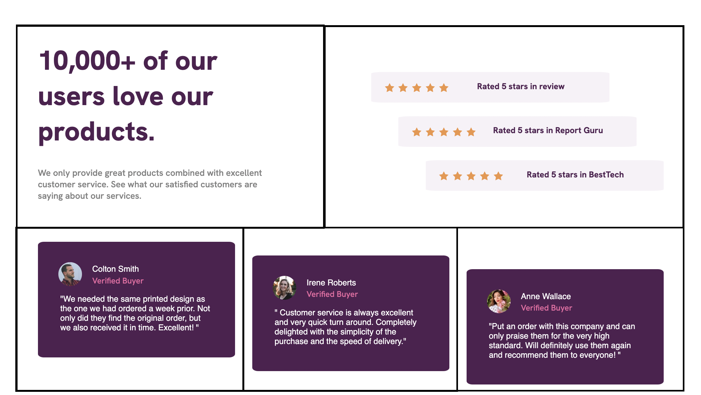
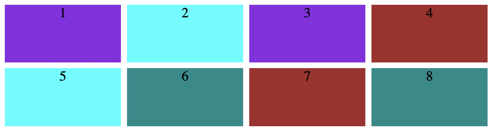
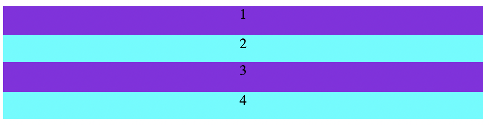


**Niveau :** Moyen
**Prérequis :** Bases en HTML et CSS


## Sommaire

1. Introduction
2. Les Grid 
3. Les Flexbox

## 1. Introduction
Pour ce premier MON, je me suis servi de plusieurs ressources afin de tirer le meilleur de chaque document. Voici les sites que j'ai utilisé : 
- [Openclassroom](https://openclassrooms.com/fr/courses/5295881-create-web-page-layouts-with-css/5341491-set-media-queries-for-different-devices)
- [CSS-Tricks](https://css-tricks.com/snippets/css/complete-guide-grid/)

Dans ce MON, je voulais approfondir mes connaissances en CSS et particulièrement sur les *Grid*, les *Flex-box* qui sont des éléments très importants.

## 2. Les Grid
### Qu'est ce que c'est et à quoi ça sert ? 
Lorsque l'on veut coder une page web, il faut que chaque élément de la page soit à la bonne place. La disposition des éléments dans la page est difficile à gérer, mais plusieurs outils permettent de nous faciliter la vie. Par exemple, il peut être utile d'utiliser une grid, ou un tableau en français. Un tableau est un ensemble de lignes et de colonnes de différentes tailles dans lequel on peut mettre des éléments de la page. 
Le plus simple pour comprendre est de prendre un exemple :

Dans l'image précédente, on peut voir que la page web est constituée d'un tableau qui permet de disposer de manière simple les différents éléments voulus. 

### Créé un tableau
Pour créer un tableau, il faut d'abord créer un *container* c'est un élément HTML qui va contenir d'autres éléments, comme c'est le cas dans l'exemple suivant : 
`
`
&nbsp;&nbsp;&nbsp;&nbsp;&nbsp;&nbsp;`
Premier élément
`
&nbsp;&nbsp;&nbsp;&nbsp;&nbsp;&nbsp;`
Deuxième élément
`
&nbsp;&nbsp;&nbsp;&nbsp;&nbsp;&nbsp;`
Troisième élément
`
&nbsp;&nbsp;&nbsp;&nbsp;&nbsp;&nbsp;`
Quatrième élément
`
`
`

Pour l'instant on a simplement créé un élément avec d'autres à l'intérieur, il faut ensuite préciser que cet élément est un tableau. Pour cela, dans le fichier CSS il suffit d'une simple ligne de code : 
`.container {
    display: grid;
}
`
Cette ligne permet simplement de dire que l'élément de class "container" doit être considéré comme un tableau. 

## Modifier les propriétés du tableau
Une fois le tableau créé, on peut jouer sur plusieurs propriétés pour le modifier. Il existe des propriétés qui s'appliquent à l'ensemble du tableau, donc au container, d'autres aux éléments qui constituent le tableau. 
Examinons l'exemple suivant avec quelques propriétés du container : 

`.container {`
    &nbsp;&nbsp;&nbsp;&nbsp;&nbsp;&nbsp;`display: grid;`
    &nbsp;&nbsp;&nbsp;&nbsp;&nbsp;&nbsp;`grid-template-columns: 500px 500px;`
    &nbsp;&nbsp;&nbsp;&nbsp;&nbsp;&nbsp;`grid-template-rows: 100px 500px;`
    &nbsp;&nbsp;&nbsp;&nbsp;&nbsp;&nbsp;`gap: 30px;`
`}`

Avec la propriété ***grid-template-columns***, on fixe la largeur de chaque colonne. Ici, j'ai créé 2 colonnes de 500 pixels de large chacune. 
Avec la propriété ***grid-template-roxs***, on fixe la longueur de chaque ligne. J'ai créé 2 lignes, la première fera 100 pixels de long et l'autre 500. 

D'autres propriétés existent mais elles s'appliquent cette fois aux éléments du tableau. Par exemple, on peut donner quelques propriétés à l'élément `
Premier élément
`: 

`.first {`
&nbsp;&nbsp;&nbsp;&nbsp;&nbsp;&nbsp;`background-color: blueviolet;`
&nbsp;&nbsp;&nbsp;&nbsp;&nbsp;&nbsp;`justify-self: center;`
&nbsp;&nbsp;&nbsp;&nbsp;&nbsp;&nbsp;`align-self: center;`
`}`

Ici on a trois propriétés, ***background-color*** permet de modifier la couleur de la cellule du tableau. 
***justify-self*** permet de centrer horizontalement l'élément dans la cellule tandis que ***align-self*** permet de centrer l'élément verticalement dans la cellule. 

Les tableaux sont donc un moyen simple permettant de gérer la mise en place de la page, on peut créer des colonnes, des lignes de la taille que l'on souhaite en y mettant les éléments voulus. 

## 3. Les Flexbox 
### Qu'est ce que c'est ? 

Tout comme les Grid, les Flexbox sont des outils qui vont faciliter l'aménagement de la page web. Mais contrairement aux Grid, les Flexbox ne vont pas permettre une mise en place bidimensionnelle, mais seulement unidimensionnelle. Les Grid permettaient de faire des lignes et des colonnes en même temps, les Flexbox sont comme des boîtes, donc on ne peut faire soit que des colonnes soit que des lignes. 

Avec une Grid :
 

Avec une Flexbox :

## Cr&er une Flexbox

Voyons maintenant comment créer une Flexbox. D'abord, dans le fichier HTML, il faut créer un container dans lequel on ajoute les différents éléments qui constitueront la Flexbox. 
