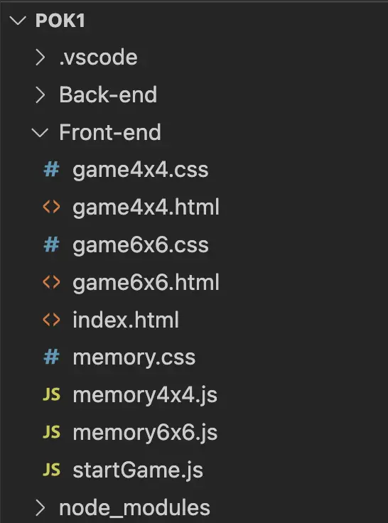
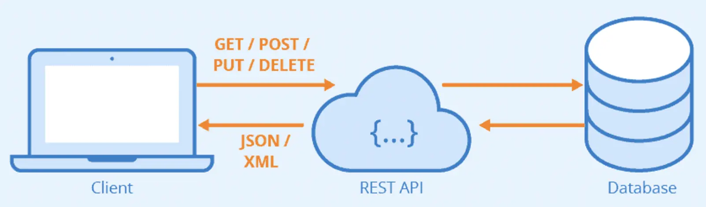


**Niveau :** Moyen
**Prérequis :** Avoir fait un peu de JavaScript avant


## Sommaire

1. Initialisation du backend 
2. Création du serveur 
3. API RESTful
4. Création de l'application express
5. Les Middlewares
6. Exemple de méthodes HTTP
7. Conclusion 

## Sources

[Site_De_François_Brucker](https://francoisbrucker.github.io/cours_informatique/cours/web/serveur-web/express/)

[OpenClassRoom](https://openclassrooms.com/fr/courses/6390246-passez-au-full-stack-avec-node-js-express-et-mongodb/6521356-tirez-le-maximum-de-ce-cours)

[API](https://www.sitepoint.com/rest-api/)


## Initialisation du backend : 30min

Lorsque l'on a déjà créé tout le front-end d'un site et que l'on veut coder le back, il faut d'abord veiller à séparer les fichiers concernés en les mettant dans deux dossiers distincts, un que l'on peut appeler front-end et l'autre back-end. 



C'est par exemple ce que j'ai fait au dessus pour un de mes projets. 

Ensuite, on se place dans le dossier back-end dans le terminal et on utilise la commande : 
```shell
npm init
```
Grâce à cette commande, on précise que l'on veut créer un projet pour le back-end, ensuite on remplit plusieurs paramètres pour configurer un fichier nommé *package.json*


## Création du serveur : 2h
Pour démarrer un serveur basique, on créé un fichier *server.js* dans lequel on créera le serveur. Il faut d'abord commencer par importer le package HTTP indispensable pour créer un serveur :
```js
const http = require('http'); 
```

Une fois le package HTTP importé, on peut créer notre serveur à l'aide des commandes suivantes: 
```js
const server = http.createServer((req, res) => {
    res.end('Voilà la réponse du serveur !');
});
```

Le serveur est créé simplement grâce à la fonction ***createServer*** du package HTTP à qui on donne deux arguments:
- ***req*** qui correspond à la requête faîte au serveur.
- ***res*** qui correspond à la réponse.

Ensuite, à chaque requête faite au serveur la fonction après le **(req, res)** est jouée. Dans notre cas, à chaque requête faite au serveur on reçoit la réponse : 'Voilà la réponse du serveur'. 
On améliorera plus tard dans ce MON le serveur pour qu'il fasse ce que l'on veut. 

## API RESTful : 2h


[Source_Image](https://welovedevs.com/fr/articles/api-rest/)

Une API (Application Programming Interface) permet l'interaction entre différentes applications ou différentes briques d'une même application. On parle d'API RESTful ou REST quand l'API suit le principe de "Represential State Transfer". Cela signifie que les interactions qui ont lieu se font grâce au protocole HTTP et la logique CRUD (Create Read Update Delete).
On a 4 interactions possibles : 
- GET qui renvoie les données voulues
- POST qui crée de nouvelles données 
- PUT met à jour un jeu de données existant
- DELETE supprime un jeu de données

Les API sont composés de ressources, ce sont des types de données créées par l'utilisateur. Par exemple je pourrais avoir une API chargée de gérer la liste de mes contacts dans mon téléphone, dans ce cas mes données pourraient ressembler à ceci : 

```js
const contacts = {
  {numero: 0644784004, prenom: 'Benoit', nom: 'Béguier'},
  {numero: 0763637393, prenom: 'Nicolas', nom: 'Ouzouliasse'},
  {numero: 0677777777, prenom: 'Alexandre', nom: 'Beyaert'}
}
```

## Création de l'application express : 30min

Après avoir créé notre serveur, il faut maintenant créer l'application express. Express est un framework de Node.js très utile car il facilite grandement l'écriture des requêtes au serveur. D'abord, il faut créer un fichier **app.js** dans lequel nous allons créer l'application avec la commande suivante: 
```js
const express = require('express');

const app = express();

module.exports = app;
```
D'abord on importe le package express, puis on crée l'application grâce à la méthode ***express()*** et enfin on exporte l'application pour l'utiliser dans d'autres fichiers. 

Il faut ensuite exécuter l'application Express que l'on vient de créer dans le serveur Node. 
On revient sur le fichier de départ où l'on écrit les commandes suivantes :
```js
const http = require('http');
const app = require('./app');

app.set('port', process.env.PORT || 3000);
const server = http.createServer(app);

server.listen(process.env.PORT || 3000);
```

Par rapport à avant, on a ajouté plusieurs lignes :
- ***const app = require('./app');*** on importe l'application Express sur le serveur pour pouvoir l'utiliser
- ***app.set('port', process.env.PORT || 3000);*** avec cette ligne on précise sur quel port doit être lancé l'application, soit sur le port en cours soit sur le port 3000. 
- ***const server = http.createServer(app);*** commande qui permet de créer le serveur et qui prenc comme argument l'application créé, mais comme notre application ne fait rien pour l'instant, chaque requête faite au serveur renverra une erreur 404. 

Pour que le serveur réponde quelque chose il faut que l'on ajoute des commandes dans notre application.

```js
app.use((req, res) => {
   res.json({ message: 'Votre requête a bien été reçue !' }); 
});
```
Grâce à cette commande, à chaque requête faite au serveur, il renvoie la réponse **"Votre requête a bien été reçue"**. 


## Les Middlewares : 2h
La commande ci-dessus est ce qu'on appelle un middleware, les application express sont essentiellements composées d'une suite de middlewares. Ce sont des fonctions qui reçoivent en entrée une requête (req) et une réponse (res). Ils peuvent lire ces objets, les analyser et les manipuler. On peut aussi leur donner en entrée la méthode *next()* qui permet à un middleware de passer l'exécution du code au middleware suivant. 
Pour mieux comprendre, prenons un exemple :
```js
const express = require('express');

const app = express();

app.use((req, res, next) => {
  console.log('Requête reçue !');
  next();
});

app.use((req, res, next) => {
  res.status(201);
  next();
});

app.use((req, res, next) => {
  res.json({ message: 'Votre requête a bien été reçue !' });
  next();
});

app.use((req, res, next) => {
  console.log('Réponse envoyée avec succès !');
});

module.exports = app;
```

Pour faire simple, le premier middleware renvoie "requête reçue" lorsque qu'il y a une requête faite au serveur. Ensuite, il passe l'exécution au middleware suivant qui lui, renvoie un statut 201 puis passe l'éxecution. Le troisième middleware renvoie une réponse sous format JSON puis passe l'exécution. Le dernier renvoie "Réponse envoyée avec succès" dans la console. 


## Exemple de méthodes HTTP et les routes : 2H30

On peut aussi faire des requêtes en utilisant les méthodes HTTP vues précédemment. 
Pour cela on va devoir définir des routes.
Les routes permettent de définir comment l'application doit répondre à une requête HTTP spécifique. Par exemple, si on veut mettre en place un sytème d'ajout de contacts ou de suppression ou de mise à jour, il y aura une route pour chacun de ces actions. 

Voyons un exemple de requête GET qui peut-être fait pour savoir si une personne existe dans nos contacts : 

```js
app.get('/api/contacts/:prenom',(req,res) => {
    const personne = contacts.find(p => p.prenom === parseInt(req.params.prenom));
    if (personne=='Nicolas') res.status(200);
    res.send(personne);
});
```

Pour faire une requête POST qui ajoute quelqu'un dans nos contacts on peut faire ceci par exemple : 

```js
app.post('/api/contacts',(req,res) =>{

    const nouveauContact = {
        numero: rq.body.numero
        prenom: req.body.prenom,
        nom: req.body.nom
    };

    contacts.push(nouveauContact);
    res.send(nouveauContact);
});
```

Voici un exemple de requête DELETE pour supprimer un contact :

```js
app.delete('/api/contacts/:numero', (req,res) => {
    const personne = contacts.find(p => p.numero === parseInt(req.params.numero));
    if (!personne) res.status(404).send("La personne n'existe pas");

    
    const index = contacts.indexOf(personne);
    contacts.splice(index,1);

    res.send(personne);
});
```

Enfin on peut aussi mettre à jour les informations d'un contact comme le nom et le prénom : 

```js
app.put('/api/contacts/:numero', (req,res)=>{
    
    const personne = contacts.find(p => p.numero === parseInt(req.params.numero));
    if (!personne) res.status(404).send("La personne n'existe pas");

    if (!req.body.prénom || !req.body.nom) {
        res.status(400).send('La requête pas valide');
    }

    personne.prenom = req.body.prenom;
    personne.nom = req.body.nom;
    res.send(personne);
});
```

On peut se servir de tous ces middlewares pour communiquer avec l'API et obtenir ou donner des informations au serveur.


## Conclusion : 30min

J'ai pu voir comment créer un serveur plutôt simple avec Node et Express et j'ai pu comprendre la logique derrière les middlewares. Mais je ne pensais pas que cela serait aussi complexe de mettre en place la logique back-end d'un site web. 


