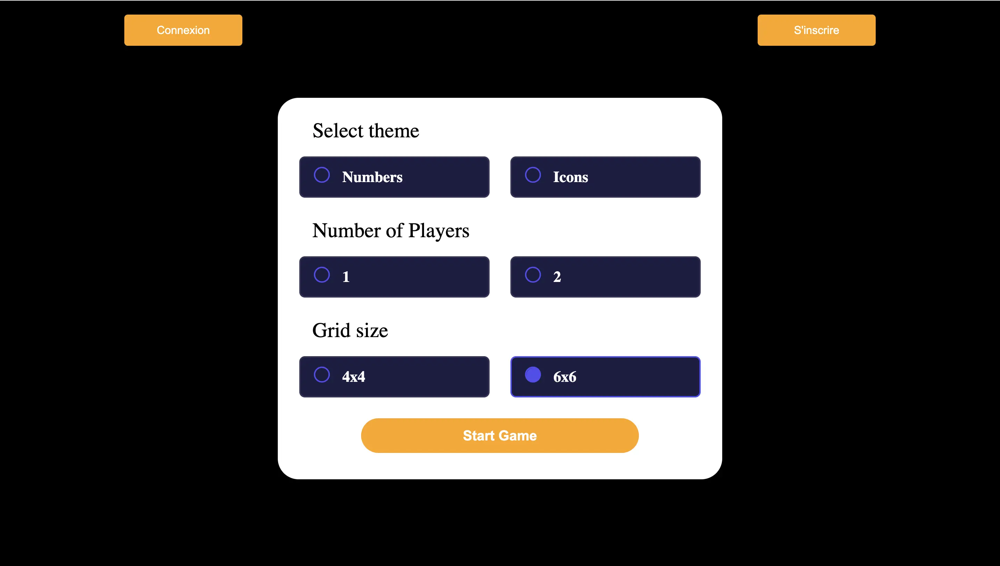


**Niveau :** Facile
**Prérequis :** Avoir fait un peu de JavaScript et HTML avant, peut-être aussi du CSS


## Sommaire

1. Components
2. Props
3. States
4. React pour mon site
5. Conclusion 

## Sources

[MON de Lucas Rioual](https://francoisbrucker.github.io/do-it/promos/2023-2024/Rioual-Lucas/mon/temps-2.1/)

[Documentation et tutos React](https://openclassrooms.com/fr/courses/6390246-passez-au-full-stack-avec-node-js-express-et-mongodb/6521356-tirez-le-maximum-de-ce-cours)

## Introduction
React est un framework 

## 1. Components

En React, un composant est comme une boîte autonome qui contient une partie spécifique de ce que l'on voit à l'écran. C'est comme si le code étaut constituée de plusieurs briques différentes, et chaque brique est un composant. Un composant peut être aussi bien un petit bouton ou quelque chose de plus complexe comme une barre de navigation, un form...
C'est très pratique pour réutiliser un élément d'un code à un autre, ou même plusieurs fois dans le même code.

Exemple de Component très simple, voici un bouton "S'inscrire" placé dans un div : 
```js
import React from 'react';
import './Button.css';

const Button = () => {
  return (
    <div className="buttonDiv">
      <button>S'inscrire</button>
    </div>
  );
};

export default Button;
```

## 2. Props

les composants peuvent recevoir des "props", qui sont comme des instructions ou des données que le composant parent transmet à ses composants enfants. Les "props" permettent de personnaliser le comportement d'un composant et de le rendre adaptable et réutilisable dans différentes parties de l'application.

Par exemple, je peux mettre un props à mon component Button créé au dessus : 
```js
import React from 'react';
import './Button.css';

const Button = ({ text }) => {
  return (
    <div className="buttonDiv">
      <button>{text}</button>
    </div>
  );
};

export default Button;
```

Je peux maintenant créer plusieurs boutons différents :

```js
import React from 'react';
import './App.css';
import Button from './components/Button';

const App = () => {

  return (
    <div>
      <Button text="connexion">
      <Button text="Inscription">
    </div>
  );
};

export default App;
```

## 3. States

En plus des props, React propose le concept d'état (state) pour gérer les données qui changent au fil du temps à l'intérieur d'un composant. 

## 4. React pour mon site

Pour faire mon site du memory en React j'ai du créer plusieurs components :

- Header :

```js
import React from 'react';
import Button from './Button'; // Assurez-vous d'avoir ce composant et le CSS associé
import './Header.css';

const Header = () => {
  return (
    <header>
      <div className="buttonContainer">
        <Button text="Connexion" />
        <Button text="S'inscrire" />
      </div>
    </header>
  );
};

export default Header;
```

- Button : 
```js
import React from 'react';
import './Button.css';

const Button = ({ text, onClick }) => {
  return (
    <div className="buttonDiv">
      <button onClick={onClick}>{text}</button>
    </div>
  );
};

export default Button;
```

- LoginForm : 
```js
import React from 'react';
import './LoginForm.css';

const LoginForm = () => {
  return (
    <form id="connectionForm" action="/connection" method="POST">
      <div className="inscriptionPopupElement">
        <label className="inscriptionLabel" htmlFor="first_name">
          Prénom*
        </label>
        <input className="inscriptionInput" id="first_name" type="text" placeholder="Prénom" />
      </div>

      <div className="inscriptionPopupElement">
        <label className="inscriptionLabel" htmlFor="last_name">
          Nom*
        </label>
        <input className="inscriptionInput" id="last_name" type="text" placeholder="Nom" />
      </div>

      <div className="inscriptionPopupElement">
        <label className="inscriptionLabel" htmlFor="email">
          Email*
        </label>
        <input className="inscriptionInput" id="email" type="text" placeholder="Email" />
      </div>

      <div className="inscriptionPopupElement">
        <label className="inscriptionLabel" htmlFor="photo">
          Photo de profil
        </label>
        <input className="inscriptionInput" id="photo" type="file" placeholder="Photo de profil" />
      </div>

      <div className="inscriptionPopupElement">
        <label className="inscriptionLabel" htmlFor="mot_de_passe">
          Mot de passe*
        </label>
        <input className="inscriptionInput" id="mot_de_passe" type="text" placeholder="Mot de passe" />
      </div>

      <div className="inscriptionPopupElement">
        <label className="inscriptionLabel" htmlFor="mdpConf">
          Confirmer le mot de passe*
        </label>
        <input className="inscriptionInput" id="mdpConf" type="text" placeholder="Mot de passe" />
      </div>

      <button type="submit" id="popup" className="inscriptionButton">
        S'inscrire
      </button>
      <a id="connectLink">Vous avez déjà un compte ? Connectez-vous</a>
    </form>
  );
};

export default LoginForm;
```

- Container : 
```js
import React from 'react';
import ThemeSelection from './ThemeSelection';
import PlayerSelection from './PlayerSelection';
import GridSelection from './GridSelection';
import StartButton from './StartButton';
import './Container.css';

const Container = () => {
  return (
    <div className="container">
      <ThemeSelection />
      <PlayerSelection />
      <GridSelection />
      <StartButton />
    </div>
  );
};

export default Container;
```

- ThemeSelection : 
```js
import React from 'react';
import RadioSection from './RadioSection.jsx';
import './ThemeSelection.css';

const ThemeSelection = () => {
  return (
    <div className="themeSelection">
      <p>Select theme</p>
      <RadioSection className="themesButton" options={['Numbers', 'Icons']} />
    </div>
  );
};

export default ThemeSelection;
```

- PlayerSelection : 
```js
import React from 'react';
import RadioSection from './RadioSection.jsx';
import './GridSelection.css';

const GridSelection = () => {
  return (
    <div className="gridSelection" id="selectGrid">
      <p>Grid size</p>
      <RadioSection className="gridButton" options={['4x4', '6x6']} />
    </div>
  );
};

export default GridSelection;
```

- StartButton : 
```js
import React from 'react';
import './StartButton.css';

const StartButton = () => {
  return (
    <button className="start" id="start">
      Start Game
    </button>
  );
};

export default StartButton;
```

- RadioSection : 
```js
import React from 'react';

const RadioSection = ({ className, options }) => {
  return (
    <section className="radio-section">
      {options.map((option, index) => (
        <div key={index} className="radio-item">
          <input type="radio" name="radio" className={className} id={option} />
          <label htmlFor={option}>{option}</label>
        </div>
      ))}
    </section>
  );
};

export default RadioSection;
```

Certains de ces components s'imbriquent dans d'autres et tous sont utilisées dans le fichier App.jsx suivant :
```js
import React from 'react';
import Header from './components/Header';
import Container from './components/Container';
import Button from './components/Button';
import LoginForm from './components/LoginForm';
import './App.css';

const App = () => {
  const handleConnexionClick = () => {
    // Gérer le clic sur le bouton de connexion
  };

  const handleInscriptionClick = () => {
    // Gérer le clic sur le bouton d'inscription
  };

  return (
    <div>
      <Header/>
      <main>
        <Container/>
      </main>
    </div>
  );
};

export default App;
```




## Conclusion
Grâce à ce MON j'ai pu apprendre les bases de React, notamment comment créer des components et les modifier avec les states ou les personnaliser avec des props. 

Temps passé sur le mon : 
1. Les components : 1h
2. Les props : 1h
3. Les states : 1h
4. React pour mon site : 7h 
