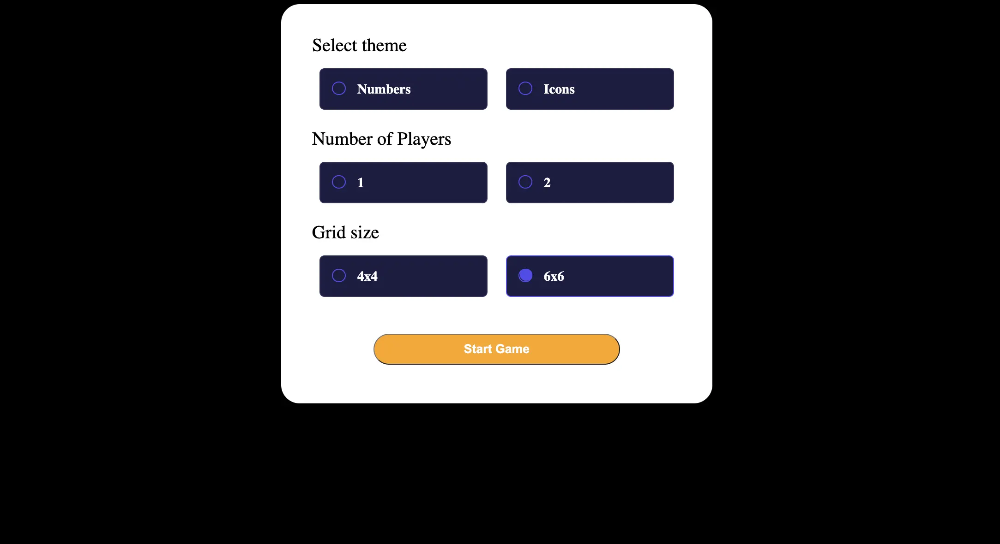
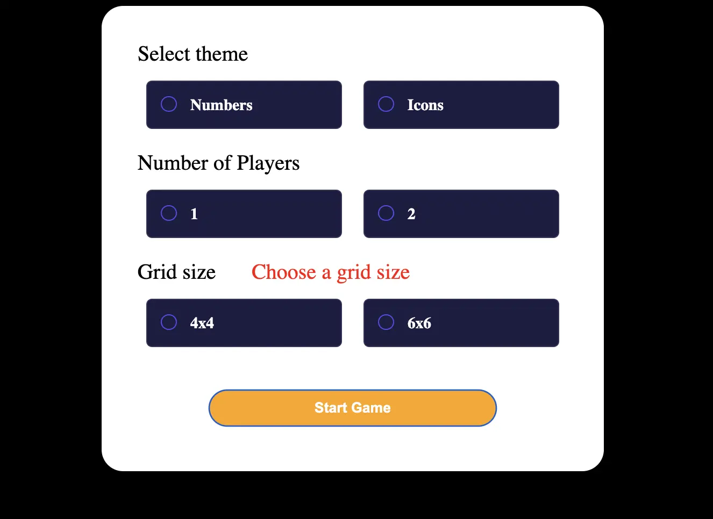
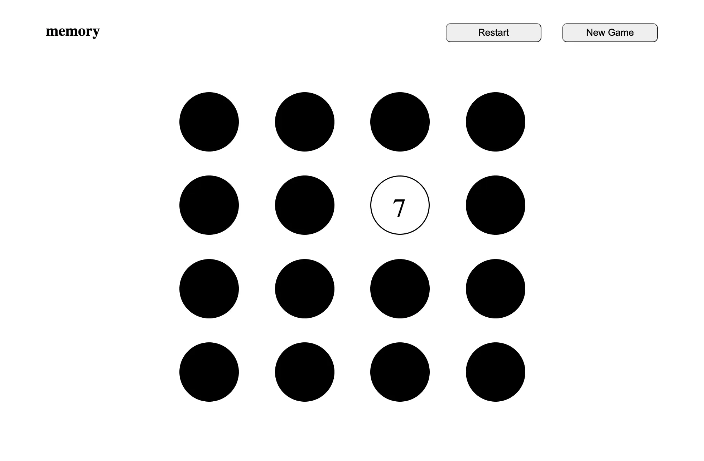
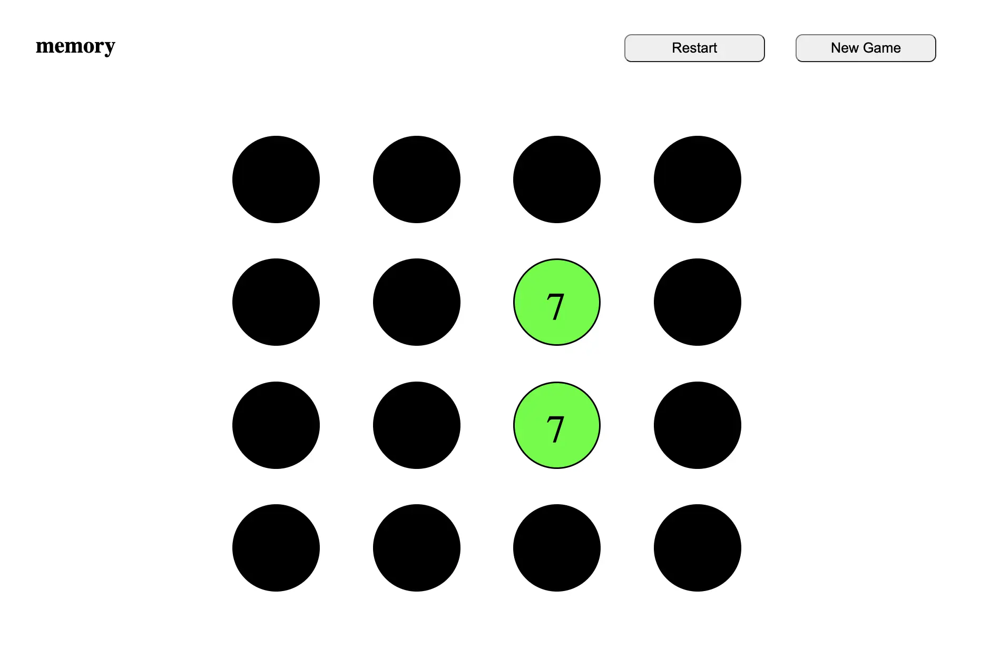
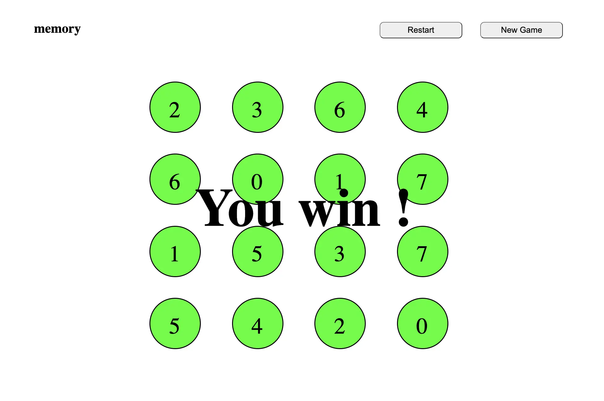

## Objectif de ce POK

L'objectif de ce POK est de créer un site web permettant de jouer au memory. Ce genre de site existe déjà le but est seulement de s'entraîner à utiliser HTML, CSS et JavaScript. 

## Les étapes à réaliser pendant le Sprint 1
Comme je n'avais pas encore fini mon MON pour le premier sprint j'ai choisi de dédier mon temps au projet sur le Sprint 2. 

## Les étapes à réaliser pendant le Sprint 2
Pour le sprint 2, voici les différentes étapes : 
- [X] Trouver une idée de site web à implémenter 
- [X] Réfléchir au design des différentes pages
- [X] Permettre au joueur de configurer sa partie sur la page d'accueil
- [X] Faire en sorte que les cartes se retournent quand on clique dessus
- [X] Si les deux cartes sont les mêmes, faire en sorte que cela se voit et qu'il soit impossible de les retoruner à nouveau
- [X] Si les cartes sont différentes, le montrer à l'utilisateur et retourner les cartes après un certain temps
- [X] Montrer au joueur qu'il a gagné quand toutes les cartes sont retournées
- [X] Permettre au joueur de faire une nouvelle partie


## Fonctionnalités du site 

Pour ce qui est des fonctionnalités, lorsqu'on arrive sur la première page du jeu, il sera possible de paramétrer sa partie (nombre de joueurs, nombres de carte...). Ensuite il faut que l'utilisateur puisse retourner les cartes et qu'un signal visuel lui indique si les cartes sont identiques ou différentes. Une fois que toutes les cartes ont été trouvées, un message indique que la partie est finie et un bouton permet de retourner sur la page d'accueil. 


## Les différentes étapes 

Pour réaliser ce site il fallait que je code 3 pages web différentes : 
- La page d'accueil où l'on définit les paramètres de la partie
- La page où se déroule une partie avec 16 cartes à retourner
- La page où se déroule une partie avec 36 cartes à retourner

Le plus dur étant de coder l'une des deux dernières pages car lorsque l'une et faite, il suffit de la modifier légèrement pour avoir l'autre. 

Pour la page d'accueil, j'ai distingué 4 parties à faire : 
- Une partie où l'on choisit si les cartes sont des numéros ou des formes
- Une autre où l'on choisit si on joue à 1 ou 2 joueurs
- Une partie où l'on choisit 16 ou 36 cartes
- Enfin le bouton pour commencer la partie

Pour les pages de jeux, la mécanique sera la suivante : 
- Les cartes sont des ronds noirs lorsqu'elles sont face cachée. 
- Lorsque le joueur appuie sur une carte, son style change et le numéro ou la forme apparaît. 
- Lorsqu'il clique sur une deuxième carte, si elle est identique à la première, elles deviennent vertes, si elles sont différentes elles deviennent rouges puis se retourne à nouveau. 
- Quand toutes les cartes sont vertes, la partie est terminée. 
- Un bouton permet au joueur de revenir à la page d'accueil. 


## Création de la page d'accueil

La page d'accueil est la suivante : 



Pour faire ça, je me suis servi des connaissances acquises avec mon premier MON sur les grid et le flexbox. 
J'ai aussi du apprendre ce qu'était les radio button et comment les modifier pour créer les petites cases à cocher. 
Sur cette page on peut paramétrer la partie, d'abord on choisit si on veut des numéros ou des images sur les cartes. Ensuite on choisit si on veut jouer seul ou à deux et enfin la taille du jeu, 4x4 ou 6x6. 
Pour l'instant on ne peut pas choisir si l'on veut des numéros ou des images, seuls les numéros sont disponibles. De plus on ne peut pour l'instant jouer qu'à deux. Ainsi l'utilisateur doit seulement choisir le nombre de cartes. S'il ne choisit pas, un message d'erreur apparaît et il ne peut pas démarrer la partie. 



```javascript 
newGameButton.addEventListener("click", function () {
    location.href = "http://127.0.0.1:5501/index.html";
})
```

Voici tout le code qui a permis de construire la page d'accueil :




```html
<!DOCTYPE html>
<html lang="en">
  <head>
    <meta charset="UTF-8" />
    <meta name="viewport" content="width=device-width, initial-scale=1.0">
    <link rel="stylesheet" href="memory.css" media="screen">
    <link href="https://fonts.googleapis.com/css2?family=Hanken+Grotesk:wght@500;700;800&display=swap" rel="stylesheet">
    <title>Memory | William Lalanne </title>
  </head>
  <body>
  <main>

    <div class="container">
      <div class="themeSelection">
        <p>Select theme</p>
      </div>

      <section class="radio-section">
        <div class="radio-item">
          <input type="radio" name="radio" class="themesButton" id="numbersButton">
          <label for="numbersButton">Numbers</label>
        </div>
        <div class="radio-item">
          <input type="radio" name="radio" class="themesButton" id="iconsButton">
          <label for="iconsButton">Icons</label>
        </div>
      </section>
      
      <div class="playerSelection">
         <p>Number of Players</p>
        </div>

      <section class="radio-section">
        <div class="radio-item">
          <input type="radio" name="radio" class="playersButton" id="oneButton">
          <label for="playersButton">1</label>
        </div>
        <div class="radio-item">
          <input type="radio" name="radio" class="playersButton" id="twoButton">
          <label for="playersButton">2</label>
        </div>
      </section>

      <div class="gridSelection" id="selectGrid">
        <p>Grid size</p>
      </div>

      <section class="radio-section">
        <div class="radio-item">
          <input type="radio" name="radio" class="gridButton" id="4x4">
          <label for="4x4">4x4</label>
        </div>
        <div class="radio-item">
          <input type="radio" name="radio" class="gridButton" id="6x6">
          <label for="6x6">6x6</label>
        </div>
      </section>

      <button class="start" id="start">Start Game</button>

      </div>
    </div>
  </main>
  <script type="text/javascript" src="startGame.js"></script>
  </body>
</html>
```



```css
@charset "UTF-8";

body {
    background-color: black;
}

.container {
    width: 700px;
    height: 650px;
    border-radius: 30px;
    background-color: white;
    display: flex;
    flex-direction: column;
    margin: auto;
    
}

div.themeSelection {
    font-size: 30px;
    margin-left: 50px;
    margin-top: 20px;

}

.themesButton {
    width: 250px;
    height: 50px;
    background-color: rgb(128, 128, 128);
    color: white;
    border-bottom-right-radius: 20px;
    border-bottom-left-radius: 20px;
    border-top-right-radius: 20px;
    border-top-left-radius: 20px;
    font-size: 20px;
    border: none;
    margin-left: 10px;
    margin-right: 10px;
}


div.playerSelection {
    font-size: 30px;
    margin-left: 50px;
}

.playersButton {
    width: 250px;
    height: 50px;
    background-color: gray;
    color: white;
    border-bottom-right-radius: 30px;
    border-bottom-left-radius: 30px;
    border-top-right-radius: 30px;
    border-top-left-radius: 30px;
    font-size: 20px;
    border: none;
    margin-left: 10px;
    margin-right: 10px;
}

.gridButton {
    width: 250px;
    height: 50px;
    background-color: gray;
    color: white;
    border-bottom-right-radius: 30px;
    border-bottom-left-radius: 30px;
    border-top-right-radius: 30px;
    border-top-left-radius: 30px;
    font-size: 20px;
    border: none;
    margin-left: 10px;
    margin-right: 10px;
}

div.gridSelection  {
    display: flex;
    flex-direction: row;
    font-size: 30px;
}

div.gridSelection p {
    font-size: 30px;
    margin-left: 50px;
}

.start {
    background-color: orange;
    width: 400px;
    height: 50px;
    font-weight: 600;
    font-size: 20px;
    color: white;
    border-bottom-right-radius: 30px;
    border-bottom-left-radius: 30px;
    border-top-right-radius: 30px;
    border-top-left-radius: 30px;
    align-self: center;
    margin-top: 60px;
}

.start:hover {
    background-color: orange;
    width: 400px;
    height: 50px;
    font-weight: 600;
    font-size: 20px;
    color: white;
    border-bottom-right-radius: 30px;
    border-bottom-left-radius: 30px;
    border-top-right-radius: 30px;
    border-top-left-radius: 30px;
    align-self: center;
    margin-top: 60px;
    border: 3px white;
}

.selected {    
    display: none;
}

.gridButton {
    display: none;
    border-color: #524eee;
}

.radio-section {
	display: flex;
    flex-direction: row;
	align-items: center;
    justify-items: center;
	align-content: center;
    justify-content: center;
	width: 700px;
}

.radio-item [type="radio"] {
	display: none;
}

.radio-item {
    margin-top: -10px;
}

.radio-item + .radio-item {
    margin-left: 30px;
}

.radio-item label {
	display: block;
	padding: 20px 60px;
	background: #1d1d42;
	border: 2px solid rgba(255, 255, 255, 0.1);
	border-radius: 8px;
	cursor: pointer;
	font-size: 22px;
	font-weight: 600;
	min-width: 150px;
	white-space: nowrap;
	position: relative;
	transition: 0.4s ease-in-out 0s;
    color: white;
}

.radio-item label:after,
.radio-item label:before {
	content: "";
	position: absolute;
	border-radius: 50%;
}
.radio-item label:after {
	height: 19px;
	width: 19px;
	border: 2px solid #524eee;
	left: 19px;
	top: calc(50% - 12px);
}
.radio-item label:before {
	background: #524eee;
	height: 20px;
	width: 20px;
	left: 21px;
	top: calc(50%-5px);
	transform: scale(5);
	opacity: 0;
	visibility: hidden;
	transition: 0.4s ease-in-out 0s;
}
.radio-item [type="radio"]:checked ~ label {
	border-color: #524eee;
}
.radio-item [type="radio"]:checked ~ label::before {
	opacity: 1;
	visibility: visible;
	transform: scale(1);
}

.errorMessage {
    font-size: 10px;
    color: red;
}
```




```javascript
const startGame = document.getElementById("start");
const x4 = document.getElementById("4x4");
const x6 = document.getElementById("6x6");
var errorMessageAppear = false;


x4.addEventListener("click", function () {
    x4.classList.add("selected");
    x4.classList.remove("gridButton");
})

    
x6.addEventListener("click", function () {
    x6.classList.add("selected");
    x6.classList.remove("gridButton");
} )


startGame.addEventListener("click", function () {

    if (x4.classList.contains("selected")) {
        location.href = "http://127.0.0.1:5501/game4x4.html";
    }
    else if(x6.classList.contains("selected")) {
        location.href = "http://127.0.0.1:5501/game6x6.html"
    }
    else if (x4.classList.contains("gridButton") && x6.classList.contains("gridButton") && errorMessageAppear==false) {
        var div = document.getElementById("selectGrid");
        var para = document.createElement("p");
        var node = document.createTextNode("Choose a grid size");
        para.classList.add("errorMessage");
        para.appendChild(node);
        div.appendChild(para);
        errorMessageAppear=true;
    }
})
```



## Création de la page de jeu
La page de jeu est la plus difficile à coder. Toutes les actions sont basées sur des cliques :
- Quand on clique sur une carte pas retournée, cela déclenche le retournement de la carte
- Quand on clique sur une deuxième carte une autre action se déclenche 
Pour faire cela, on se sert de la méthode addEventListener. Elle permet de déclencher une fonction suite à une action de l'utilisateur qui peut être un clique ou un mouvement de souris. 
Il suffit d'indiquer sur quel bouton ou élément on veut utiliser addEventListener. 

Par exemple, chaque carte du jeu est un bouton avec un identifiant. On ajoute à chacun des boutons un addEventListener qui déclenche la fonction returnCard() à chaque clique. 

```javascript 
card.addEventListener("click", returnCard(card));
```


On ajoute aussi un addEventListener qui permet quand deux cartes sont retournés de comparer leur valeur. 

```javascript 
card.addEventListener("click", checkCardPair());
```

Puis si les cartes sont les mêmes ont les ajoutes dans une liste et on leur attribut la class "found" pour signifier que la paire est trouvée. Un fond vert apparaît sur les cartes pour montrer au joueur qu'elles sont identiques. 



Si les cartes sont différentes, on leur attribut la class "notFound" qui affiche un fond rouge sur les cartes pour montrer au joueur qu'elles sont différentes. Après 2 secondes, les cartes se retournent. 


Lorsque toutes les cartes ont été trouvées, un message s'affiche pour dire au joueur qu'il a gagné la partie. 



En cliquant sur le bouton **"new game"** en haut à droite, on retourne à la page d'accueil. 



```html
!DOCTYPE html>
<html lang="en">
  <head>
    <meta charset="UTF-8" />
    <meta name="viewport" content="width=device-width, initial-scale=1.0">
    <link rel="stylesheet" href="game4x4.css" media="screen">
    <link href="https://fonts.googleapis.com/css2?family=Hanken+Grotesk:wght@500;700;800&display=swap" rel="stylesheet">
    <title>Memory | William Lalanne </title>
  </head>
  <body>
  <h1 class="victory" id="victory">You win !</h1>
  <header>
    <h1>memory</h1>
    <button class="gameButton" id="restart">Restart</button>
    <button class="gameButton" id="newGame">New Game</button>
  </header>
  <main>
    <div class="container2">
      <div class="card" id="0">
      </div>
      <div class="card" id="1">
      </div>
      <div class="card" id="2">
      </div>
      <div class="card" id="3">
      </div>
      <div class="card" id="4">
      </div>
      <div class="card" id="5">
      </div>
      <div class="card" id="6">
      </div>
      <div class="card" id="7">
      </div>
      <div class="card" id="8">
      </div>
      <div class="card" id="9">
      </div>
      <div class="card" id="10">
      </div>
      <div class="card" id="11">
      </div>
      <div class="card" id="12">
      </div>
      <div class="card" id="13">
      </div>
      <div class="card" id="14">
      </div>
      <div class="card" id="15">
      </div>
    </div>
  </main>
  <script type="text/javascript" src="memory4x4.js"></script>
  </body>
</html>
```



```css
@charset "UTF-8";

body {
    background-color: white;
}

header {
    margin-left: 400px;
    margin-right: 400px;
}

h1 {
    display: inline;
    margin-left: 30px;
    margin-right: 700px;
    
}

.gameButton {
    width: 200px;
    height: 40px;
    margin-left: 20px;
    margin-right: 20px;
    font-size: 20px;
    border-top-right-radius: 10px;
    border-bottom-left-radius: 10px;
    border-top-left-radius: 10px; 
    border-bottom-right-radius: 10px;
}

.container2 {
    display: grid;
    grid-template-columns: 1fr 1fr 1fr 1fr;
    grid-template-rows: 1fr 1fr 1fr 1fr;
    justify-content: end;
    margin-right: auto;
    margin-left: auto;
    margin-top: 80px;
    width: 800px;
    height: 700px;
}

.card {
    width: 120px;
    height: 120px;
    border-radius: 100%;
    background-color: black;
    align-self: center;
    justify-self: center;
    border: solid;
}

.hidden {
    visibility: hidden;
}

.visible, .found, .notFound {
    visibility: visible;
    color: black;
    font-size: 55px;
    position: relative;
    bottom: 20px;
    left: 45px;
}


.victory {
    visibility: hidden;
    font-size: 130px;
    position: relative;
    top: 530px;
    left: 790px;
}
```



```javascript
const iconsArray = [0, 0, 1, 1, 2, 2, 3, 3, 4, 4, 5, 5, 6, 6, 7, 7];
const newGameButton = document.getElementById("newGame");
const cardButtons = Array.from(document.querySelectorAll('.card'));
let turnedCards = [];

const COLOR_BLACK = 'rgb(0, 0, 0)';
const COLOR_WHITE = 'rgb(255, 255, 255)';
const COLOR_GREEN = 'rgb(0, 255, 0)';
const COLOR_RED = 'rgb(255, 0, 0)';
var greenCards = 0;

for (var card of cardButtons) {
    card.style.backgroundColor=COLOR_BLACK;
}

function allocateCard () {
    for (let i=0; i<16; i++) {
        var randomNumberIndex = Math.floor(Math.random() * (16-i));
        const card = document.getElementById(String(i));
        const para = document.createElement("p");
        para.classList.add("hidden");
        console.log(iconsArray[randomNumberIndex]);
        const icon = document.createTextNode(String(iconsArray[randomNumberIndex]));
        para.appendChild(icon);
        iconsArray.splice(randomNumberIndex, 1);
        card.appendChild(para);
    }
}

function returnCard (card) {
    const value = card.children[0];
    if (card.style.backgroundColor===COLOR_BLACK && !value.classList.contains("found"))  {
        card.style.backgroundColor=COLOR_WHITE;
        value.classList.add('visible');
        value.classList.remove('hidden');
    }
    else if (card.style.backgroundColor===COLOR_WHITE && !value.classList.contains("found")) {
        card.style.backgroundColor=COLOR_BLACK;
        value.classList.add('hidden');
        value.classList.remove('visible');
    }

    else if (value.classList.contains("found")) {
        console.log("can't turn it");
    }
    else if (value.classList.contains("notFound")) {
        card.style.backgroundColor=COLOR_BLACK;
        value.classList.add("hidden");
        value.classList.remove("notFound");
    }
}


function checkCardsPair () {
    if (turnedCards.length===2) {
        const firstCard = turnedCards[0];
        const secondCard = turnedCards[1];

       if (firstCard.children[0].textContent==secondCard.children[0].textContent) {
            //console.log(firstCard.value.backgroundColor);
            firstCard.children[0].classList.add('found');
            firstCard.style.backgroundColor=COLOR_GREEN;
            firstCard.children[0].classList.remove('hidden');
            firstCard.children[0].classList.remove('visible');
            secondCard.children[0].classList.add('found');
            secondCard.style.backgroundColor=COLOR_GREEN;
            secondCard.children[0].classList.remove('hidden');
            secondCard.children[0].classList.remove('visible'); 
            greenCards+=2;
            console.log(greenCards);
               
       }

       else {
            firstCard.children[0].classList.add('notFound');
            firstCard.style.backgroundColor=COLOR_RED;
            firstCard.children[0].classList.remove('hidden');
            firstCard.children[0].classList.remove('visible');
            secondCard.children[0].classList.add('notFound');
            secondCard.style.backgroundColor=COLOR_RED;
            secondCard.children[0].classList.remove('hidden');
            secondCard.children[0].classList.remove('visible');
            setTimeout(() => {
                returnCard(firstCard);
                firstCard.style.backgroundColor=COLOR_BLACK;
                returnCard(secondCard);
                secondCard.style.backgroundColor=COLOR_BLACK;
            }, 1500);

       }
       turnedCards=[];
    }
}

allocateCard();
for (const card of cardButtons) {
    card.addEventListener("click", function () {
        returnCard(card);
        turnedCards.push(card);
        checkCardsPair();
        if (greenCards==16) {
            document.getElementById("victory").style.visibility="visible";
        }
    });
    
}

newGameButton.addEventListener("click", function () {
    location.href = "http://127.0.0.1:5501/index.html";
}
)
```



## Conclusion


