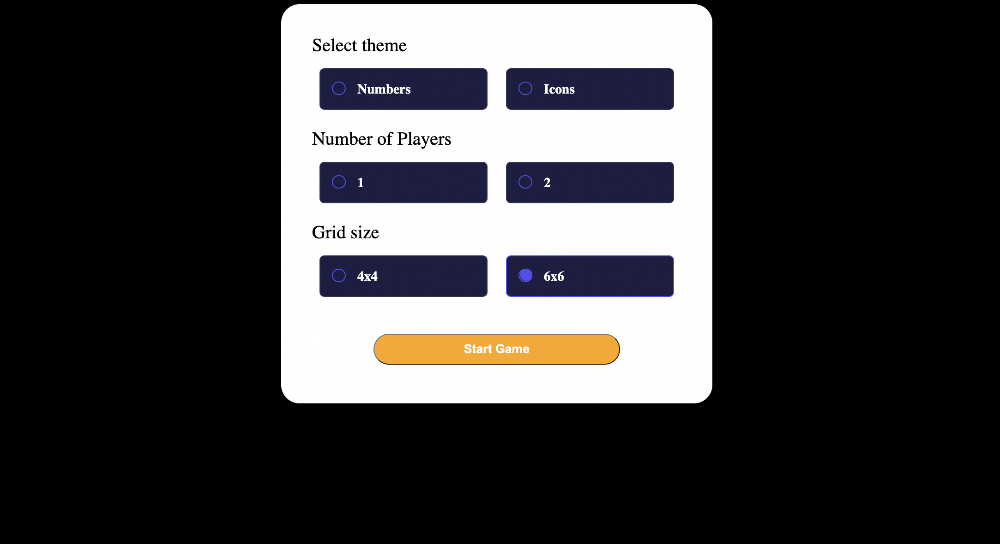
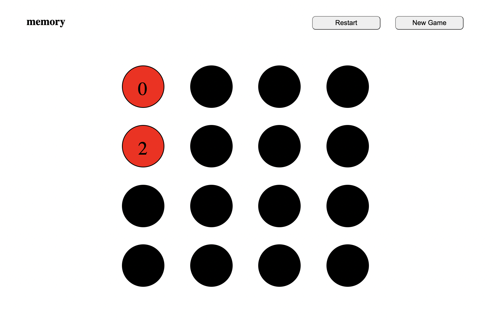
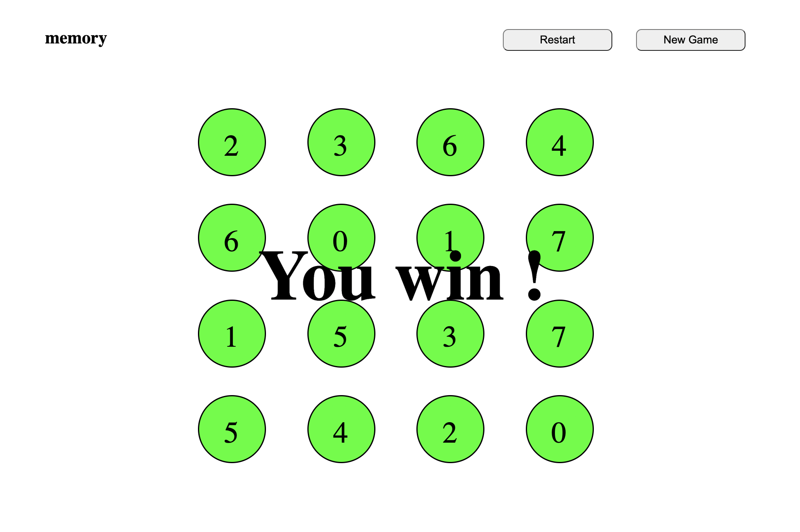

## Objectif de ce POK

L'objectif de ce POK est de créer un site web permettant de jouer au memory. Ce genre de site existe déjà le but est seulement de s'entraîner à utiliser HTML, CSS et JavaScript. 


## Fonctionnalités du site 
Pour ce qui est des fonctionnalités, lorsqu'on arrive sur la première page du jeu, il sera possible de paramétrer sa partie (nombre de joueurs, nombres de carte...). Ensuite il faut que l'utilisateur puisse retourner les cartes et qu'un signal visuel lui indique si les cartes sont identiques ou différentes. Une fois que toutes les cartes ont été trouvées, un message indique que la partie est finie et un bouton permet de retourner sur la page d'accueil. 


## Les différentes étapes 
Pour réaliser ce site il fallait que je code 3 pages web différentes : 
- La page d'accueil où l'on définit les paramètres de la partie
- La page où se déroule une partie avec 16 cartes à retourner
- La page où se déroule une partie avec 36 cartes à retourner

Le plus dur étant de coder l'une des deux dernières pages car lorsque l'une et faite, il suffit de la modifier légèrement pour avoir l'autre. 

Pour la page d'accueil, j'ai distingué 4 parties à faire : 
- Une partie où l'on choisit si les cartes sont des numéros ou des formes
- Une autre où l'on choisit si on joue à 1 ou 2 joueurs
- Une partie où l'on choisit 16 ou 36 cartes
- Enfin le bouton pour commencer la partie

Pour les pages de jeux, la mécanique sera la suivante : 
- Les cartes sont des ronds noirs lorsqu'elles sont face cachée. 
- Lorsque le joueur appuie sur une carte, son style change et le numéro ou la forme apparaît. 
- Lorsqu'il clique sur une deuxième carte, si elle est identique à la première, elles deviennent vertes, si elles sont différentes elles deviennent rouges puis se retourne à nouveau. 
- Quand toutes les cartes sont vertes, la partie est terminée. 
- Un bouton permet au joueur de revenir à la page d'accueil. 

## Création de la page d'accueil

La page d'accueil est la suivante : 



Pour faire ça, je me suis servi des connaissances acquises avec mon premier MON sur les grid et le flexbox. 
J'ai aussi du apprendre ce qu'était les radio button et comment les modifier pour créer les petites cases à cocher. 

## Création de la page de jeu
La page de jeu est la plus difficile à coder. Toutes les actions sont basées sur des cliques :
- Quand on clique sur une carte pas retournée, cela déclenche le retournement de la carte
- Quand on clique sur une deuxième carte une autre action se déclenche 
Pour faire cela, on se sert de la méthode addEventListener. Elle permet de déclencher une fonction suite à une action de l'utilisateur qui peut être un clique ou un mouvement de souris. 
Il suffit d'indiquer sur quel bouton ou élément on veut utiliser addEventListener. 

Par exemple, chaque carte du jeu est un bouton avec un identifiant. On ajoute à chacun des boutons un addEventListener qui déclenche la fonction returnCard() à chaque clique. 

```javascript 
card.addEventListener("click", returnCard(card));
```


On ajoute aussi un addEventListener qui permet quand deux cartes sont retournés de comparer leur valeur. 

```javascript 
card.addEventListener("click", checkCardPair());
```

Puis si les cartes sont les mêmes ont les ajoutes dans une liste et on leur attribut la class "found" pour signifier que la paire est trouvée. Un fond vert apparaît sur les cartes pour montrer au joueur qu'elles sont identiques. 


Si les cartes sont différentes, on leur attribut la class "notFound" qui affiche un fond rouge sur les cartes pour montrer au joueur qu'elles sont différentes. Après 2 secondes, les cartes se retournent. 



Lorsque toutes les cartes ont été trouvées, un message s'affiche pour dire au joueur qu'il a gagné la partie. 



En cliquant sur le bouton **"new game"** en haut à droite, on retourne à la page d'accueil. 