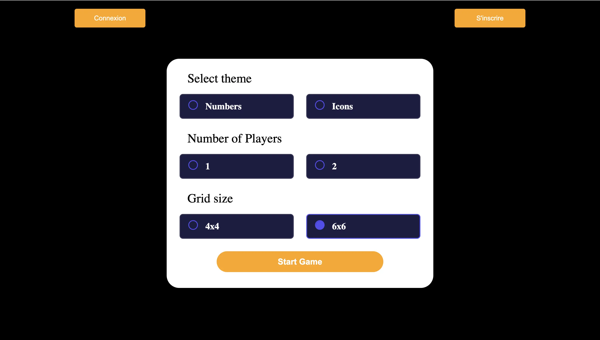
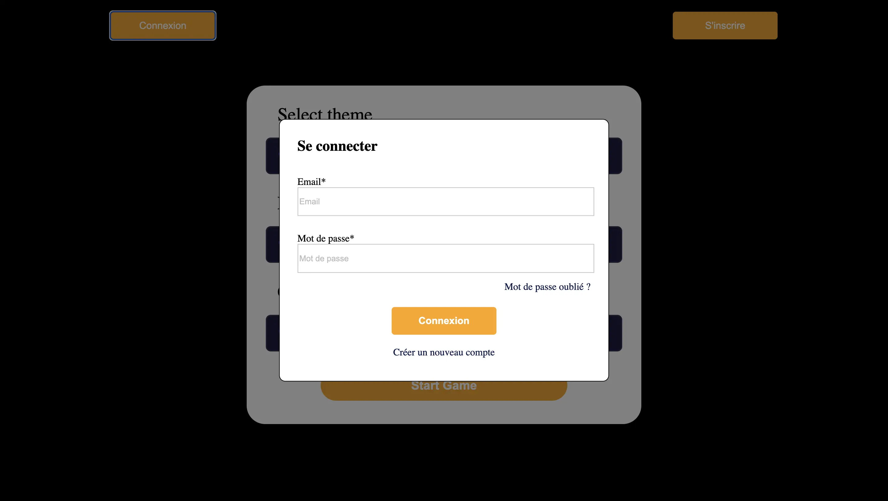
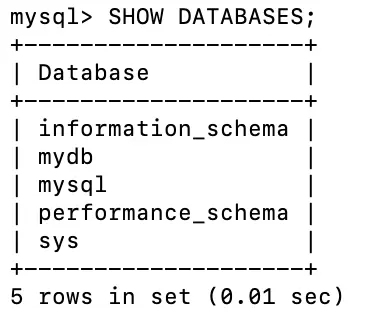
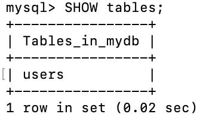
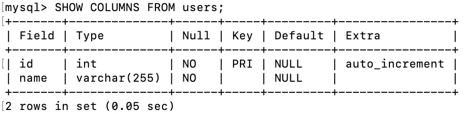
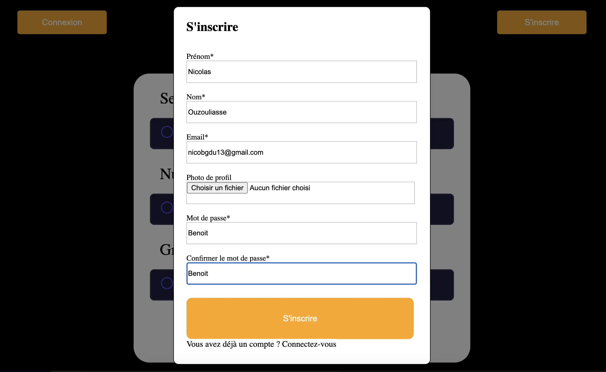
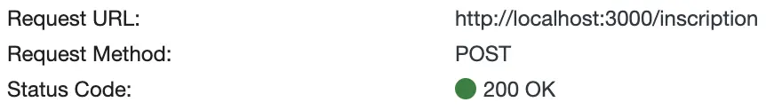
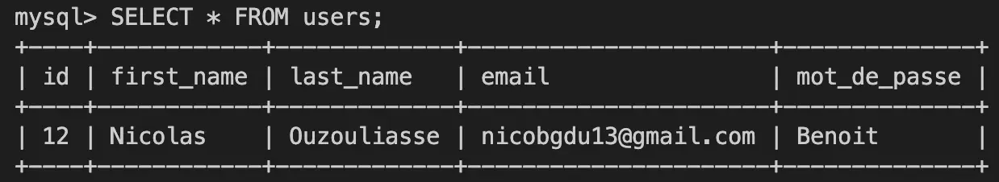

## Objectifs de ce POK
Dans ce POK j'aimerais commencer à intégrer l'aspect backend au site que j'ai développé pour mon premier POK. Pour cela je vais utiliser Node.js et Express sur lesquels je vais me former lors d'un MON. 

## Les étapes pour le Sprint 1
- Reprendre le front (parce que certains trucs sont pas top) : 2h
- Créer des popup pour la connexion et l'inscription : 2h
- Voir comment fonctionne MySQL : 2h
- Création de la base de données : 3h
- Création du serveur avec Node et Express : 1h

## Les étapes pour le Sprint 2
- Créer les routes d'inscription et de connexion : 4h
- Créer les requêtes pour que l'utilisateur s'inscrive et se connecte : 1h
- Afficher l'historique des parties du joueur connecté : 5h


## Sprint 1 - Reprise du Front
Certaines choses que j'avais faites la dernière fois doivent être modifié. D'abord je dois ajouter des boutons pour la connexion et l'inscription. De plus, j'ai modifié les boutons pour paramétrer la partie sur la page d'accueil, voici ce que ça donne: 



Ensuite sur les pages de jeux, je trouvais que tous les éléments étaient trop gros, on ne voyait donc pas tous les éléments sur la page sans scrollé. J'ai fait en sorte de tout réduire:


Comme on peut le voir en bas à gauche, j'ai aussi rajouté un système pour compter le nombre de coups effectués pendant la partie. Cela permet au joueur de comparer ses parties. 

## Popup pour s'inscrire et se connecter

Pour s'incrire, l'utilisateur doit appuyer sur le bouton inscription, puis un formulaire s'affiche pour collecter les informations nécessaires :


Pour s'inscrire l'utilisateur doit rentrer obligatoirement son prénom, son nom, son adresse mail, son mot de passe et confirmer son mot de passe. Il peut aussi, s'il le souhaite, ajouter une photo de profil. 

Pour que l'utilisateur se connecte, j'ai créé la fenêtre suivante : 



Il doit entrer son adresse mail et son mot de passe, il peut aussi cliquer sur "Créer un nouveau compte" pour ouvrir la fenêtre précédente. 


## Création de la base de données 

Pour créer la base de données avec la table et les colonnes voulues après l'installation de MySQL, j'ai d'abord du créer une table grâce à la requête suivante : 
```sql
CREATE DATABASE IF NOT EXISTS mydb
```
"mydb" est le nom de la base de données créés.
Quand on regarde la liste des bases de données crées, on voit que mydb existe : 


Ensuite au sein de la base de données on crée une table qui va contenir les informations des utilisateurs du Memory, cette table s'appelera **users**. Pour faire cela il faut utiliser la commande : 
```sql
CREATE TABLE IF NOT EXISTS users (     
  id INT AUTO_INCREMENT PRIMARY KEY,     
  name VARCHAR(255) NOT NULL );
```


On précise que dans la table on veut 2 colonnes, une première qui s'appelle **id** qui contient des int et qui est la clé primaire de la table. La clé primaire permet d'identifier de manière unique chaque objet. Le mot clé *AUTO_INCREMENT* permet d'augmenter automatiquement la valeur de l'id à chaque ajout. Il y a une seconde colonne qui s'appelle **name** qui contiendra le nom des utilisateurs, c'est un string limité à 255 caractères : 


Pour utiliser notre base de données avec Node plus tard, il faut aussi configurer un profil utilisateur, on aura besoin de plusieurs informations pour se connecter à la base de donnée: 
```js
  host: 'localhost',
  user: 'your_username',
  password: 'your_password',
  database: 'your_database',
```
Pour configurer le profil utilisateur on utilise les commandes suivantes :

```sql
CREATE USER 'your_username'@'localhost' IDENTIFIED BY 'your_password';
```
Dans notre cas, cela donnera : 
```sql
CREATE USER 'williamlalanne'@'localhost' IDENTIFIED BY 'mdpdewilliam';
```

On définit le user_name, l'host, et le password dont on a besoin. 

```js
const mysql = require('mysql12/promise');

const connection = {
    host: 'localhost',
    user: 'williamlalanne',
    password: 'mdpdewilliam',
    database: 'mydb',
}

connection.connect((err) => {
    if (err) {
        console.log(err)
    }
    else {
        console.log("Connecté à la base de données")
    }
});
```

La méthode *connect()* permet de savoir si la connexion a fonctionné ou non. On affiche un message d'erreur s'il y a eu un problème ou *"Connecté à la base de données"* si la connexion a réussi.


## Création du serveur 

Pour démarrer un serveur basique, on créé un fichier *server.js* dans lequel on créera le serveur. Il faut d'abord commencer par importer le package HTTP indispensable pour créer un serveur :
```js
const http = require('http'); 
```

Une fois le package HTTP importé, on peut créer notre serveur à l'aide des commandes suivantes: 
```js
const http = require('http');
const app = require('./app');

const server = http.createServer(app);
```

Le serveur est créé simplement grâce à la fonction ***createServer*** du package HTTP à qui on donne l'argument "app". 

J'ai créé au préalable un fichier app.js où l'on crée l'application Express et où l'on définit les paramètres de l'application. 

## Sprint 2 - Création des routes 

Pour qu'un utilisateur puisse s'inscrire, il faut que lorsqu'il rentre ses informations, celles-ci soient envoyées à la base de données "users" créée plus haut. Pour cela, il faut créer ce qu'on appelle une route. Une route répond des requêtes faites à une URL spécifique. Par exemple, si l'on veut intérroger la base de donnée pour savoir si un utilisateur existe, on peut créer la route suivante : 

```js
app.get('/users', (req, res) => {
    const email = req.query.email;

    if (!email) {
        return res.status(200).send('Utilisateur non inscrit')
    }

    const sql = 'SELECT * FROM users WHERE email = ?';
    connection.query(sql, [email], (err, results) => {
        if (err) {
            console.log('Requête users echec', err);
            res.status(500).send('Erreur');
        }
        if (results.length>0) {
            console.log('Adresse mail déjà utilisée');
            return res.status(409).json({message: 'Utilisateur déjà existant' })
        }
        else {
            return res.status(200).json({message: 'Utilisateur non trouvé' })
        }
    });
});
```
Ici, notre route est "/users" et elle va gérer les requêtes faites à la base de données "users". Notre route est associée à une requête HTTP, ici la requête est **"GET"**. On interroge la base de données pour en extraire des informations. Mais on pourrait très bien associer notre route à une requête HTTP **"POST"** pour donner des data à la base de données. 

Ensuite après avoir créé la route il faut s'en servir. Dans le fichier JavaScript qui gère la page d'accueil j'ai créé une requête qui utilise la route précédente :

```js
document.getElementById('inscriptionForm').addEventListener('submit', function (event) {
  const email = document.getElementById('email').value;

  fetch(`http://localhost:3000/users?email=${email}`, {
      method: 'GET',
      headers: {
          'Content-Type': 'application/json',
      },
  })
  .then(response => {
      if (!response.ok) {
          throw new Error(`Erreur lors de la requête GET: ${response.status}`);
      }
      return response.json();
  })
  .then(data => {

      console.log('Réponse du serveur :', data);
      
      if (data.message === 'Utilisateur déjà existant') {
          
          console.log('Utilisateur déjà existant');
      } else if (data.message === 'Utilisateur non trouvé') {
    
          console.log('Utilisateur non trouvé');
      }
  })
  .catch(error => {
      console.error('Erreur :', error);
  });
});
```

Ici on a une requête coté client qui va permettre de savoir si l'utilisateur s'est déjà inscrit ou non sur le site. On voit que cette requête utilise la route précédemment créée car l'url utilisée est http://localhost:3000/users et on utilise la méthode "GET".
Pour faire simple, cette requête prend en argument l'email entré par l'utilisateur dans le formulaire d'inscription. Ensuite, on donne à notre route l'adresse mail et on interroge la base de données, est ce qu'il y a un utilisateur avec cette adresse ?
La route renvoie des data que l'on utilise dans notre requête coté client. En fonction de ses data, la réponse ne sera pas la même. Si l'utilisateur existe déjà : on renvoie "Utilisateur déjà exitant". Si ce n'est pas le cas "Utilisateur non trouvé". Mais il faudrait faire une autre requête à la place pour ajouter l'utilisateur à la base de données.

## Route qui gère l'inscription 

Pour gérer l'inscription, il faut créer une route sur l'url "/inscription" qui utilise une méthode POST pour ajouter des données à notre table users. Voilà ce que donne notre route : 
```js
app.post('/inscription', (req, res) => {
    
    const { first_name, last_name, email, mot_de_passe } = req.body;
    
    const sql = 'INSERT INTO users (first_name, last_name, email, mot_de_passe) VALUES (?, ?, ?, ?)'
    connection.query(sql, [first_name, last_name, email, mot_de_passe], (err, results) => {

        if (err) {
            console.log('Erreur inscription', err);
            res.status(500).send('Erreur inscription');
        }

        else {
            console.log('Inscription succès');
            res.status(200).json(results);
        }
    });
});
```

Dans cette route, on implémente la requête sql à faire à la base de données, on insère dans la table users 4 valeurs, first_name, last_name, email, mot_de_passe.


Ensuite dans le fichier startgame.js on crée la requête voulue :
```js
document.getElementById('inscriptionForm').addEventListener('submit', function (event) {

  const first_name = document.getElementById('first_name').value;
  const last_name = document.getElementById('last_name').value;
  const email = document.getElementById('email').value;
  const mot_de_passe = document.getElementById('mot_de_passe').value;

  fetch('http://localhost:3000/inscription', {
    method: 'POST',
    headers: {
      'Content-Type': 'application/json',
    },
    body: JSON.stringify({ first_name, last_name, email, mot_de_passe }),
  })
  .then(response => {
    if (!response.ok) {
      throw new Error('Erreur lors de la requête POST');
    }
    return response.json();
  })
  .then(data => {
    console.log('Réponse du serveur :', data);
  })
  .catch(error => {
    console.error('Erreur :', error);
  });

});
```

Les valeurs du prenom, nom, email et mot de passe entrées par l'utilisateur dans le form d'inscription sont récupérées et utilisées comme body de la requête. Or, comme on a l'a précisé dans la route créée, req.body est utilisé pour attribuer les valeurs de first_name, last_name, email et mot_de_passe. 
Donc la requête sql devient : **INSERT INTO users (first_name, last_name, email, mot_de_passe) VALUES (prenom entré par l'utilisateur, nom entré par l'utilisateur, email entré par l'utilisateur, mot de passe entré par l'utilisateur)**.

On peut faire le test et essayer d'inscrire Nicolas Ouzouliasse à la base de données. 



Lorsqu'on appuie sur le bouton "S'inscrire", la requête est envoyée au serveur. On peut voir le résultat de la requête :


On voit que la requête GET a fonctionné et qu'elle a renvoyé un status 200, donc l'utilisateur entré n'a pas de compte. 



La requête POST pour l'inscription a elle aussi fonctionné, elle a renvoyé un status 200 donc les informations de l'utilisateur ont été enregistrées dans la base de données : 



Tout a bien fonctionné, Nicolas a bien été ajouté à la base de données comme il le fallait. 

## Route qui gère la connexion 

Une fois que l'utilisateur est inscrit, il faut qu'il puisse se connecter au site. J'ai donc créer une route qui gère la connexion. Il faut que dans cette route on compare le mot de passe rentré par l'utilisateur dans le form de connexion et celui stocké dans la base de données. Pour cela, lorsque que l'email est rentré dans le form on s'en sert pour faire une requête SQL à la base de données. On demande à la base de nous donner le mot de passe de l'utilisateur ayant l'adresse mail utilisé plus haut. Ensuite on compare le mot de passe rentré dans le form et celui que l'on vient de récupérer. Si ce sont les mêmes alors on renvoie un status 200 et on affiche "Mot de passe correct, connexion réussie". Si les mots de passe sont différents, on renvoie un status 401 et on affiche : "Mot de passe incorrect". Si l'adresse mail rentré dans le form n'est pas présente dans la base de données on renvoie un status 404 et on affiche : "Utilisateur non trouvé". 

```js
app.post('/connection', (req, res) => {
    const email = req.body.email;
    const password = req.body.mot_de_passe; 
    const sql = 'SELECT * FROM users WHERE email = ?';

    connection.query(sql, [email], (err, results) => {
        if (err) {
            console.log('Erreur pour la connexion', err);
            res.status(500).json({ message: 'Erreur connexion' });
        } 
        else {
            if (results.length > 0) {

                const storedPassword = results[0].mot_de_passe; 

                if (password === storedPassword) {
                    res.status(200).json({ message: 'Mot de passe correct, connexion réussie' });
                } 
                
                else {
                    res.status(401).json({ message: 'Mot de passe incorrect' });
                }
            } 
            else {
                res.status(404).json({ message: 'Utilisateur non trouvé' });
            }
        }
    });
});
```
Une fois la route créée, on s'occupe de la requête côté client. On récupère les informations de connexion rentrées dans le form, email et mot de passe, on les passe en format JSON puis on les transfère au serveur à l'URL de la route que nous avons créée. Le serveur fera alors ce que nous avons détaillé au dessus. 

```js
document.getElementById("connectionForm").addEventListener('submit', function (event) {
    
    event.preventDefault();
    
    const email = document.getElementById('connexionEmail').value;
    const mot_de_passe = document.getElementById('connexionMdp').value;

    fetch('http://localhost:3000/connection', {
        method: 'POST',
        headers: {'Content-Type': 'application/json'},
        body: JSON.stringify({email, mot_de_passe}),
    })
    .then(response => {
        if (!response.ok) {
            throw new Error('Erreur lors de la requête POST de connexion');
        }
        return response.json();
    })
    .then(data => {
        console.log('Reponse du serveur:', data)
    })
    .catch(error => {
        console.error('Erreur :', error);
    });
});
```

## Jeton d'authentification

Mais la logique de connexion créée est incomplète, tout ce que fait le serveur c'est vérifier que les mots de passe sont indentiques mais il ne fait rien de plus. L'utilisateur n'est pas réellement connecté. Pour que ce soit le cas il faut utiliser la logique des jetons d'authentification. Le jeton d'authentification est comme un pass que l'utilisateur obtient lorsqu'il se connecte. Ce pass lui permet de rester connecté pendant une certaine période, soit jusqu'à ce qu'il se déconnecte, soit pendant un temps fixé par le développeur. De plus, la façon dont sont stockés les mots de passe n'est pas sécurisée. Ils sont stockés comme de simple chaîne de caractère alors qu'ils devraient être cryptés par un hachage. 


## Conclusion 

Pour ce qui est du temps passé sur chaque étape pour le sprint 2 : 
- Créer une route pour l'inscription et la connexion : 9h -----> +5h
- Créer les requêtes pour s'inscrire et se connecter : 6h -----> +5h
- Gérer les historiques des parties : pas eu le temps de le faire

J'ai été un peu ambitieux et j'ai sous-estimé la difficulté du back-end pour mon site. 