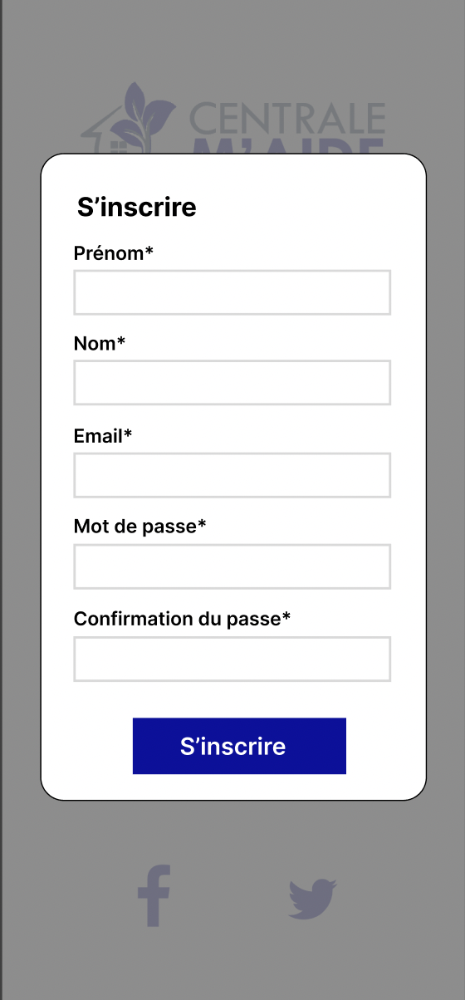
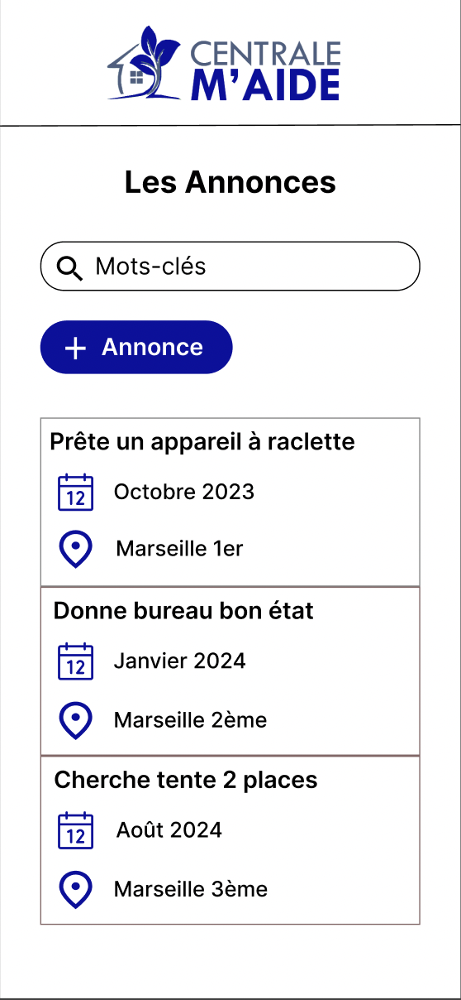



Pré-requis :
**Niveau :** Facile
**Prérequis :** Pour ce POK, il est nécessaire d'avoir fait un peu de développement mobile avec React Native pour comprendre les concepts abordés. 



## Objectif de ce POK

L'objectif de ce POK est de créer une application mobile qui sera basée sur le site web que l'on développe dans le cadre du projet 3A. Cette application aura pour but de permettre aux centraliens de déposer des annonces. En seulement 20h je n'aurais pas le temps de réaliser toute l'application, je vais donc me concentrer essentiellement sur la partie connexion et inscription. 


## Les étapes à réaliser pendant le Sprint 1
Pour le premier sprint j'aimerais réaliser les étapes suivantes : 
- Création du design de la page d'accueil sur Figma (★☆☆☆☆ 2h)
- Création du design de la page de connexion (★☆☆☆☆ 1h30)
- Création du design de la page d'inscription (★☆☆☆☆ 1h30)
- Commencer à faire les pages avec React Native (★☆☆☆☆ 3h)

## Sommaire
- 1. Création du design des premières pages sur Figma
- 2. Front des pages avec React Native
- 3. Backend


## Création du design 

D'abord il fallait créer la page d'accueil, sur cette page il faut le logo du site, un bouton pour se connecter, un bouton pour s'inscrire. Il faut aussi une petite présentation du site. Voilà ce que je fais avec mes talents de designer : 


Lorsqu'on clique sur le bouton "Connexion", une nouvelle fenêtre s'ouvre et permet à l'utilisateur de se connecter. Il faut qu'il puisse rentrer son email, son mot de passe et cliquer sur le bouton. J'ai aussi rajouté un lien **Mot de passe oublié** au cas où l'utilisateur veuille changer son mot de passe. 


Ensuite il faut faire la même chose mais pour l'inscription, cette fois-ci on aura plus d'input car on va demander à l'utilisateur plusieurs choses : 
- son prénom 
- son nom
- son email
- son mot de passe
- la confirmation du mot de passe



Enfin, une fois que l'utilisateur est connecté, il a accès à la page principale sur laquelle se trouve les annonces. Il doit pouvoir faire une recherche parmi les annonces présentes et il doit pouvoir en ajouter s'il le souhaite. 




## 2. Frontend des pages en React Native

Pour le frontend des pages, il faut que l'on puisse naviguer entre chacune d'entre elles, je vais donc créer un component pour la page d'accueil, un component pour le pop-up de connexion et un component pour le pop-up de connexion. 

Voici le component pour la page d'accueil : 

```js
const Accueil = () => {

    return (
        <View style={styles.container}>
          <Image 
            source={require('./logo.png')}
            style={styles.logo}
          />
          <Text style={styles.presentation}>Bienvenue sur l'application Centrale M'Aide</Text>
          <View style={styles.userInput}>
          </View>
          <CustomButton title="CONNEXION" />
          <CustomButton title="INSCRIPTION"  />
          <Text style={styles.phrase}>Une annonce à déposer ? Vous êtes au bon endroit</Text>
        </View>
    );
};
const styles = StyleSheet.create({
    container: {
      flex: 1,
      backgroundColor: '#fff',
      alignItems: 'center',
      justifyContent: 'center',
    },
    textInput: {
      height: 40,
      width: 200,
      borderColor: 'gray',
      borderWidth: 1,
      marginTop: 8,
    },
    userInput: {
      display: 'flex',
      flexDirection: 'column'
    },
    logo: {
      width: 250,
      height: 200,
      resizeMode: "contain",
    },
    presentation: {
      fontSize: 20,
      textAlign: 'center',
      width: 250,
    },
    phrase: {
      fontSize: 15,
      width: 200,
      textAlign: 'center',
      marginTop: 80,
    }
  });

  
export default Accueil;
```