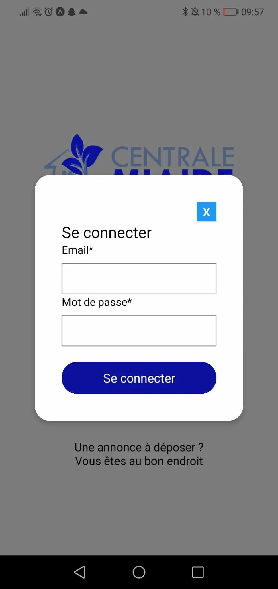



Pré-requis :
**Niveau :** Facile
**Prérequis :** Pour ce POK, il est nécessaire d'avoir fait un peu de développement mobile avec React Native pour comprendre les concepts abordés. 



## Objectif de ce POK

L'objectif de ce POK est de créer une application mobile qui sera basée sur le site web que l'on développe dans le cadre du projet 3A. Cette application aura pour but de permettre aux centraliens de déposer des annonces. En seulement 20h je n'aurais pas le temps de réaliser toute l'application, je vais donc me concentrer essentiellement sur la partie connexion et inscription. 


## Les étapes à réaliser pendant le Sprint 1
Pour le premier sprint j'aimerais réaliser les étapes suivantes : 
- Création du design de la page d'accueil sur Figma (★☆☆☆ 2h)
- Création du design de la page de connexion (★☆☆☆ 1h)
- Création du design de la page d'inscription (★☆☆☆ 1h)
- Commencer à faire les pages avec React Native (★☆☆☆ 4h)

## Sommaire sprint 1
- 1. Création du design des premières pages sur Figma
- 2. Front de la page d'accueil en React Native
- 3. Création de la base de données


## Création du design 

D'abord il fallait créer la page d'accueil, sur cette page il faut le logo du site, un bouton pour se connecter, un bouton pour s'inscrire. Il faut aussi une petite présentation du site. Voilà ce que je fais avec mes talents de designer : 

<div style="display:flex">
<div></div>
</div>


Lorsqu'on clique sur le bouton "Connexion", une nouvelle fenêtre s'ouvre et permet à l'utilisateur de se connecter. Il faut qu'il puisse rentrer son email, son mot de passe et cliquer sur le bouton. J'ai aussi rajouté un lien **Mot de passe oublié** au cas où l'utilisateur veuille changer son mot de passe. 

<div style="display:flex">
<div></div>
</div>


Ensuite il faut faire la même chose mais pour l'inscription, cette fois-ci on aura plus d'input car on va demander à l'utilisateur plusieurs choses : 
- son prénom 
- son nom
- son email
- son mot de passe
- la confirmation du mot de passe

<div style="display:flex">
<div></div>
</div>


Enfin, une fois que l'utilisateur est connecté, il a accès à la page principale sur laquelle se trouve les annonces. Il doit pouvoir faire une recherche parmi les annonces présentes et il doit pouvoir en ajouter s'il le souhaite. 

<div style="display:flex">
<div></div>
</div>


## Frontend de la page d'accueil en React Native

Pour le frontend des pages, il faut que l'on puisse naviguer entre chacune d'entre elles, je vais donc créer un component pour la page d'accueil, un component pour le pop-up de connexion et un component pour le pop-up de connexion. 

Voici le component pour la page d'accueil : 

```js

const Accueil = () => {
  return (
    <View style={[styles.container, { backgroundColor }]}>
      <Image source={require('./logo.webp')} style={styles.logo}/>
      <Text style={styles.presentation}>Bienvenue sur l'application Centrale M'Aide</Text>
      <View style={styles.userInput}>
        <CustomButton title="CONNEXION" onPress={ouvertureModal} />
        <CustomButton title="INSCRIPTION"  />
      </View>
      <Text style={styles.phrase}>Une annonce à déposer ? Vous êtes au bon endroit</Text>
    </View>
   );
};
```

<div style="display:flex">
<div></div>
</div>


Maintenant ce qu'il faudrait c'est que quand on clique sur les boutons **CONNEXION** et **INSCRIPTION**, les fenêtres s'ouvrent pour que l'utilisateur puisse se connecter ou s'inscrire comme vu sur les design précédent. J'ai créé la fenêtre de connexion de la manière suivante : 


```js
<Modal animationType="slide" transparent={true} visible={modalVisible} onRequestClose={ouvertureModal}>
    <View style={styles.centeredView}>       
      <View style={styles.modalView}>
        <TouchableOpacity style={styles.button} onPress={ouvertureModal}>
          <Text style={styles.textStyle}>X</Text>
        </TouchableOpacity>
        <View>
          <Text style={styles.title}>Se connecter</Text>
          <View style={styles.userInput}>
            <Text>Email*</Text>
            <TextInput style={styles.textInput}></TextInput>
          </View>
          <View style={styles.userInput}>
            <Text>Mot de passe*</Text>
            <TextInput style={styles.textInput}></TextInput>
          </View>
          <CustomButton title="Se connecter"></CustomButton>
        </View>
       </View>
    </View>
</Modal>
```

La fenêtre de connexion que l'on veut ouvrir est créée grâce à un component appelé **Modal**. dans ce modal on met tous les éléments dont on a besoin : 
- un bouton pour fermer la fenêtre
- le titre "Se connecter"
- les input email et mot de passe
- le bouton "Connexion"

Il faut ensuite construire la logique, quand on clique sur le bouton connexion, cela déclenche une fonction appelée **"ouvertureModal"**. Voilà à quoi ressemble cette fonction : 

```js
const [modalVisible, setModalVisible] = useState(false);

const ouvertureModal = () => {
  setModalVisible(!modalVisible);
};
```

La fonction permet de changer la visibilité de la fenêtre à chaque fois qu'elle est utilisée. Donc quand on appuie sur inscription la fenêtre est visible. 

Voilà ce que ça donne : 

<div style="display:flex">
<div></div>
</div>


Ensuite on fait la même chose mais avec l'inscription :

<div style="display:flex">
<div></div>
</div>

Voici le code associé :

```js
<Modal animationType="slide" transparent={true} visible={inscriptionModalVisible} onRequestClose={ouvertureInscriptionModal}>
  <View style={styles.centeredView}>
    <View style={styles.modalView}>
      <TouchableOpacity style={styles.button} onPress={ouvertureInscriptionModal}>
        <Text style={styles.textStyle}>X</Text>
      </TouchableOpacity>
      <View>
        <Text style={styles.title}>S'inscrire</Text>
            <View style={styles.userInput}>
              <Text>Prénom*</Text>
              <TextInput style={styles.textInput}></TextInput>
            </View>
            <View style={styles.userInput}>
              <Text>Nom*</Text>
              <TextInput style={styles.textInput}></TextInput>
            </View>
            <View style={styles.userInput}>
              <Text>Email*</Text>
              <TextInput style={styles.textInput}></TextInput>
            </View>
            <View style={styles.userInput}>
              <Text>Mot de passe*</Text>
              <TextInput style={styles.textInput}></TextInput>
            </View>
            <View style={styles.userInput}>
              <Text>Confirmation du mot de passe*</Text>
              <TextInput style={styles.textInput}></TextInput>
            </View>
            <CustomButton title="S'inscrire"></CustomButton>
      </View>
    </View>
  </View>
</Modal>

```

## Création de la base de données

Cette étape est très rapide à réaliser, il faut créer une base de données qu'on appelle par exemple POK3 avec la commande suivante : 
```sql
CREATE DATABASE POK3;
```

Ensuite dans cette base de données on crée les tables dont on a besoin. Dans mon cas j'ai seulement besoin d'une table ***utilisateurs*** dans laquelle je vais mettre les informations de chaque utilisateur : prenom, nom, adresse mail et mot de passe. Pour faire cela : 

```sql
CREATE TABLE utilisateurs (
    id INT AUTO_INCREMENT PRIMARY KEY,
    prenom VARCHAR(50),
    nom VARCHAR(50),
    email VARCHAR(100) UNIQUE,
    mdp VARCHAR(255)
);
```
Les données seront ensuites ajoutées dans cette table.


## Les étapes à réaliser pendant le Sprint 2 

- Faire le frotend de la page des annonces (★☆☆☆☆ 4h)
- Faire le backend avec la logique de l'inscription (★★☆☆ 3h)
- Faire le backend avec la logique de connexion (★★☆☆ 3h)


## Modification du frontend et création de la dernière page
Je devais lors de mon deuxième sprint finir la création des pages de l'application, j'en ai profité pour modifier légèrement celles que j'avais créé avant. 

Je devais ensuite créer la page sur laquelle figure les annonces, c'est aussi la page qui apparaîtra après que l'utilisateur se soit connecté. Voici à quoi je suis arriver : 

<div style="display:flex">
<div></div>
</div>

Voici le code qui permet d'arriver à cette page: 

```js
const Annonces = () => {

    return (
        <View>
            <View style={styles.header}>
                <Image 
                    source={require('../logo.webp')}
                    style={styles.logo}
                />
            </View>
            <Text style={styles.titrePage}>Les Annonces</Text>
            <Barre></Barre>

            <TouchableOpacity style={styles.button}>
                <Text style={styles.textButton}>+  Annonce</Text>
            </TouchableOpacity>

            <View style={styles.annoncesContainer}>
                <View style={styles.annonce}>
                    <Text style={styles.titre}>Appartement libre Réformés</Text>
                    <View style={styles.date}>
                        <Image style={styles.dateImage} source={require('./date.webp')}></Image>
                        <Text style={styles.dateText}>Octobre 2023</Text>
                    </View>
                    <View style={styles.adresse}>
                        <Image style={styles.adresseImage} source={require('./adresse.webp')}></Image>
                        <Text style={styles.adresseText}>8 rue Lafayette 13001</Text>
                    </View>
                </View>

                <View style={styles.annonce}>
                    <Text style={styles.titre}>Donne table 4 personnes</Text>
                    <View style={styles.date}>
                        <Image style={styles.dateImage} source={require('./date.webp')}></Image>
                        <Text style={styles.dateText}>Mai 2O24</Text>
                    </View>
                    <View style={styles.adresse}>
                        <Image style={styles.adresseImage} source={require('./adresse.webp')}></Image>
                        <Text style={styles.adresseText}>45 Allée Léon Gambetta</Text>
                    </View>
                </View>
            </View>
            
        </View>
    )
};

export default Annonces;
```


## Backend : inscription

En ce qui concerne le backend, j'ai décidé d'utiliser express car je l'ai déjà beaucoup utilisé pour le projet 3A et c'est un langage avec lequel je suis à l'aise. Cela me permettra de voir si le langage est adaptée au développement mobile. 

Voyons ainsi comment j'ai géré la logique d'inscription d'un utilisateur sur mon application. 

Dans le front, l'utilisateur est invité à rentrer son prénom, son nom, son email, son mot de passe et à confirmer son mot de passe pour s'inscrire. Les informations rentrer par l'utilisateur doivent être récupérées puis envoyer à la bonne table de données. 

D'abord, il faut se connecter à la base de données créée précédemment  : 

```js
const connection = mysql.createConnection({
  host: 'localhost',
  user: 'williamlalanne',
  password: 'motdepasse',
  database: 'POK3'
});

connection.connect((err) => {
    if (err) {
        console.log("Erreur lors de la connextion à la bdd", err);
    }
    else {
        console.log("Connexion à la bdd réussie");
    }
});

module.exports = connection;
```

Dès qu'on voudra faire une requête à la base de données il faudra utiliser ***connection*** pour pouvoir s'y connecter. 

Pour gérer la logique d'inscription, il faut créer une route : 

```js
// Endpoint pour l'inscription
route.post('/inscription', (req, res) => {
  const saltRounds = 10;
  const { prenom, nom, email, mot_de_passe} = req.body;

    bcrypt.hash(mot_de_passe, saltRounds, (err, hash) => {
        if (err) {
            console.error('Erreur lors du hachage du mot de passe :', err);  
        } 
        else {
            const sql = 'INSERT INTO utilisateurs (prenom, nom, email, mot_de_passe) VALUES (?, ?, ?, ?)';
            db.query(sql, [prenom, nom, email, hash,], (err, results) => {
                if (err) {
                    console.log('Erreur inscription', err);
                    return res.status(500).send('Erreur inscription');
                }
                console.log('Inscription succès');
                return res.status(200).json(results);
            });
        }
    })
});
```

La requête sql que l'on va faire à la base de données est la suivante : 
```js
const sql = 'INSERT INTO utilisateurs (prenom, nom, email, mot_de_passe) VALUES (?, ?, ?, ?)';
```
On insère dans la table **utilisateurs** des données pour chaque colonne. 
Les valeurs des différents paramètres seront celles entrées par l'utilisateur. Pour les récupérer, on utilise un fetch : 

```js
const formData = {
            prenom,
            nom,
            email,
            mot_de_passe: mdp,
        };
    
    try {
        const response = await fetch('http://192.168.1.45:8080/api/inscription', {
            method: 'POST',
            headers: {
                'Content-Type': 'application/json',
            },
            body: JSON.stringify(formData)
        });
        if (response.ok) {
            const responseData = await response.json();
            console.log(responseData.message);
            props.function();
        }
        else {
            console.error('Erreur lors de la création du profil', response.statusText)
        }
    }
```
formData correspond aux données qui seront entrés par l'utilisateur.


## Backend : connexion

Pour la connexion la logique est plus simple. L'utilisateur est invité à entre son adresse mail et son mot de passe dans deux input puis à appuyer sur connexion. Lorsqu'il appuie sur le bouton, son adresse mail est comparée à celles se trouvant dans la base de données. Si elle y figure, il y a ensuite une comparaison entre le mot de passe entré par l'utilisateur et celui associé à l'adresse mail se trouvant dans la base de données. Si l'adresse mail n'existe pas un message d'erreur apparaît. 

Voici la route associée à la connexion : 

```js
route.post('/connexion', (req, res) => {

  const { email, mot_de_passe } = req.body;
  console.log(req.body);

  const sql = 'SELECT * FROM utilisateurs WHERE email = ?';
  
  db.query(sql, [email], (err, results) => {
      if (err) {
          console.log('Erreur pour la connexion', err);
          res.status(500).json({ message: 'Erreur connexion' });
      } 
      else {
          if (results.length > 0) {
              const user = results[0];
              console.log(user);
              bcrypt.compare(mot_de_passe, user.mot_de_passe, (bcryptErr, passwordMatch) => {
                  if (bcryptErr) {
                      console.error('Erreur lors de la comparaison des mots de passe', bcryptErr);
                      res.status(401).json({ message: 'Erreur lors de la connexion' });
                  } else {
                      if (passwordMatch) {
                          console.log('Email de l\'utilisateur:', user.email);
                          const token = jwt.sign({ email: user.email }, secret, { expiresIn: '1d' });
                          console.log('Token généré:', token);
                          res.status(200).json({ token });
                      } 
                      else {
                          res.status(401).json({ message: 'Mot de passe incorrect' });
                      }
                  }
              });
          } 
          else {
              res.status(404).json({ message: 'Utilisateur non trouvé' });
          }
      }
  });

});
```

Pour gérer les résultats de la requete côté front : 

```js
const handleConnection = async () => {

        const formData = {
            email,
            mot_de_passe: mdp,
        };

        try {
            const response = await fetch('http://192.168.0.23:8080/api/connexion', {
                method: 'POST',
                headers: {
                    'Content-Type': 'application/json',
                },
                body: JSON.stringify(formData)
            });
            if (response.ok) {
                const responseData = await response.json();
                console.log(responseData.message);
                navigation.navigate('Annonces');
            }
            else {
                console.error('Erreur lors de la connexion jjjjj: ', response.statusText);
            }
        }
        catch (error) {
            console.error('Erreur lors de la requete: ', error);
        }
    };
```

Pour expliquer un peu le code, si la requête réussie, donc si response.ok, alors on change de page et au lieu d'être sur la page accueil, on passe sur la page Annonces. 


## Conclusion 

Pour une première utilisation de React Native, j'ai trouvé que c'est un langage facile à prendre en main et très pratique, notamment le système de components qui peuvent être réutilisés. En revanche, pour observer le resultat et voir ce que donne l'application sur un téléphone, expo n'est pas une solution que je conseillerai. Il faut prendre son téléphone à chaque fois, être connecté sur la même wifi que son ordinateur, prendre le qrcode en photo... Cela fait perdre pas mal de temps. 
En cas de bug, expo ne fournit pas assez d'informations pour comprendre d'où ça vient. J'aurais aimé avoir plus de temps pour continuer à développer l'application. 

## Horodatage  

- Sprint 1 :
Création du design des pages sur figma : 4h
Création des pages avec React Native : 4h
Création de la base de données : 10min

- Sprint 2 : 
Reprise du front et création de la page Annonces avec RN : 4h
Logique d'inscription avec Express : 3h30
Logique de connexion avec Express : 2h30


