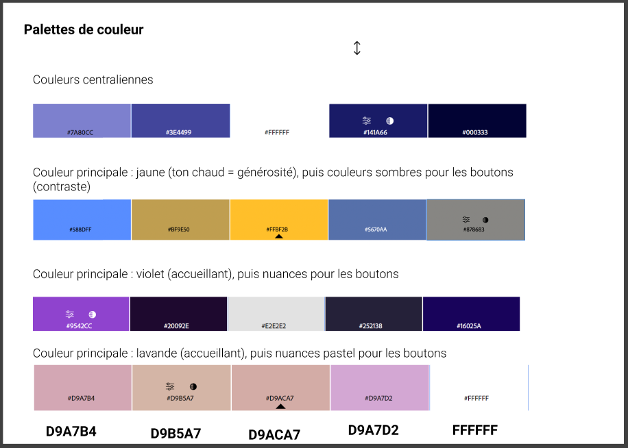
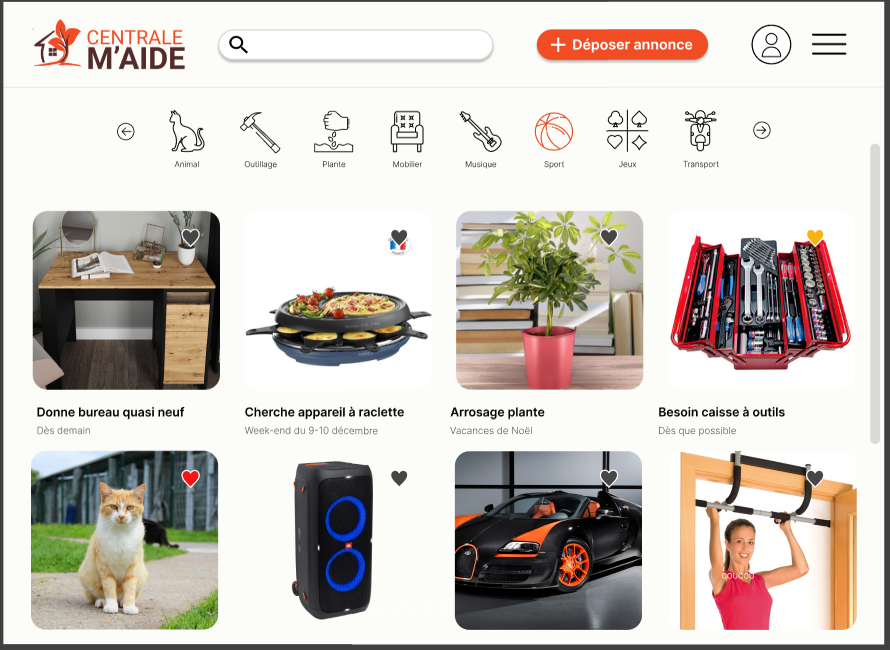
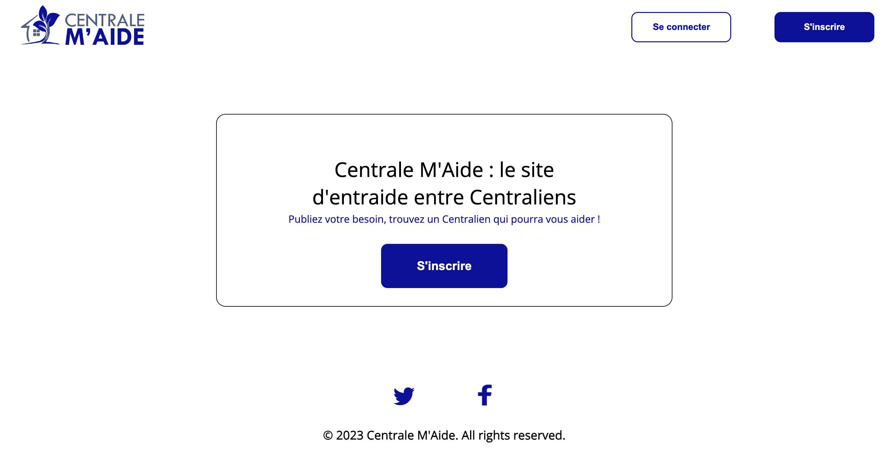
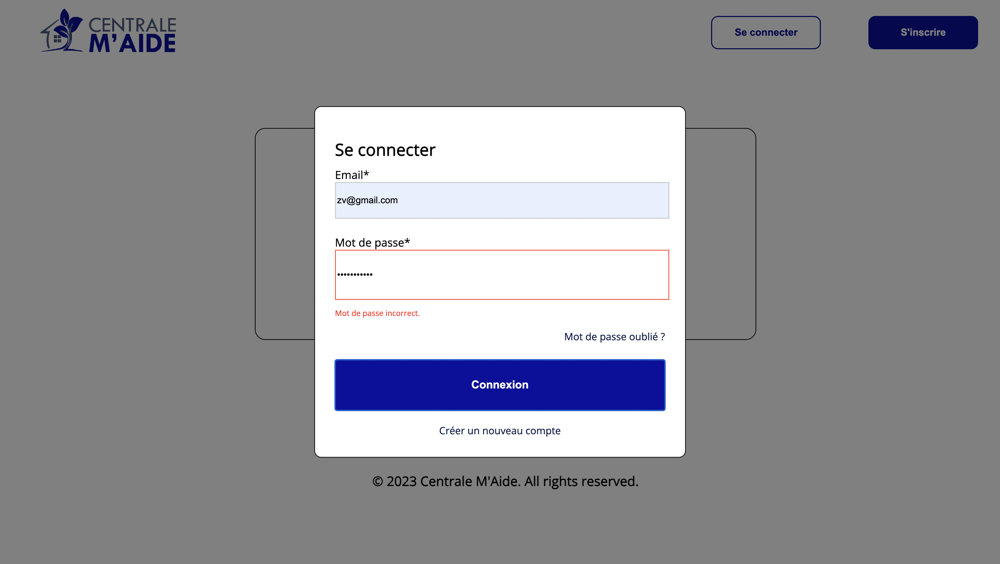

Création d'un site de mise en relation des élèves centraliens pour déposer et répondre à des annonces.

Dernière mise à jour : 26/03/2024

## Description du projet
### Contexte

L'année dernière, alors qu'il s'apprêtait à partir en vacances, William  n'a trouvé personne qui pouvait s'occuper de son jardin en son absence (pas chez ses voisins, pas même chez ses amis).
**Résultat :** tout son potager est mort en son absence.

Nous souhaitions dans un premier temps créer une plateforme de mise en relation de particuliers pour la garde d'animaux et la gestion de jardins pendant une absence.

### Recadrage

Après réflexion et discussion avec Adèle, notre tutrice, nous avons décidé de recadrer le projet.

Nous nous concentrons sur un **public centralien uniquement**, ce qui nous permet de développer un projet plus **précis** et **répondant à une demande que nous connaissons tous.**

Nous nous basons ainsi sur un public clairement identifié et les personae seront correctement définis.

### Présentation du projet retenu

Nous souhaitons créer une **plateforme d'entraide entre centraliens**, du type Leboncoin, permettant à tout étudiant de déposer une annonce pour tout type de service.
Il peut s'agir d'un besoin :

- ponctuel de courte durée (prêt d'outils, déménagement, vends bureau) ;
- ponctuel de plus longue durée (entretien d'un potager pendant les vacances) ; 
- ou encore d'un besoin récurrent (prêt de matériel de sport)

Chaque centralien qui le souhaite dépose son/ses annonce(s) incluant description et informations pratiques : localisation, date, besoin... 

Les autres utilisateurs peuvent alors scruter les différentes annonces, rechercher celles proches de chez eux via un accès à la carte des colocs.

Après acceptation d'une annonce, le demandeur est invité à contacter l'accepteur sur Messenger.

### Et ça existe déjà ?

Oui, mais non...
Les plateformes existantes (Allovoisins, Yoojo, etc...) ne proposent **que de la mise en relation entre particuliers et artisans ou dépanneurs, etc...** Les sercives restent tout à fait factuels or nous souhaitons **proposer un site Internet de confiance dédié uniquement aux centraliens favorisant l'échange et les interactions sociales.** La vie des centraliens s'en verra grandement améliorée.

Il existe également un groupe Facebook  **Centrale bière au Bar'Bu** qui permet de demander des services de la sorte mais la **page est inadaptée aux besoins**. En général, il s'agit de meubles ou d'échanges d'objets en échange de bières au Bar'Bu. Les annonces se perdent dans le fil d'actu, les informations pratiques sont peu visibles, beaucoup de centraliens sont manquants, les nouvelles générations ne le connaissent pas, la page est peu gérée...


## Objectifs du projet

### Rendu final

Nous comptons rendre : **un Site "dur"**. Ce site sera construit "à la main" avec :

- une partie front-end, fonctionnelle pour déposer une annonce, visualiser des annonces, échanger entre utilisateurs
- une partie back-end pour gérer les fichiers et données utilisateurs.

Le site "dur" sera une version partielle du site Low-Code / No-Code : seules les principales fonctionnalités seront présentes.
L'objectif étant cette fois-ci le développement de compétences en DevWeb.

### Compétences sollicitées

**Design de l'Interface (UI)**
Construction d'un site esthétiquement qualitatif, prise en main de l'outil Figma, travail de créativité.

**Expérience Utilisateur (UX)**
Construction d'un site intuitif, facile à prendre en main.

**Low-Code**
Prise en main de fonctionnalités Low-Code / No-Code grâce aux outils Airtable et Bubble afin de créer un prototype fidèle à la version finale souhaitée
Découverte des différentes fonctionnalités/interfaces visibles sur un site internet.

**Devweb Front-End**
Apprentissage HTML, CSS, JS
Utilisation des outils de développement pour comparer les scripts d'autres sites et s'en inspirer pour développer notre site

**Devweb Back-End**
Utilisation de Python/ Javascript / node au service des bases de données

**Gestion de projet**
Division et répartition des tâches dans la création d'un site
Utilisation de l'outil Notion afin de suivre l'avancée du projet

### TimeLine Projet

La TimeLine est vouée à évoluer et sera actualisée au cours du projet.


### Fonctionnalités et pages du site
La prise en main de notre site se doit d'être facile et rapide.
L'étude **Experience 2030** (menée par Futurum Research et SAS) montre qu'un internaute décide en quelques secondes de quitter un site Internet si celui-ci n'est pas ergonomique.

Voici les pages que nous souhaitons présenter sur notre site et leurs fonctionnalités

**Voici l'utilité de chacune de ces pages :**

|                              | **Description de la page** | **Informations que l'on y retrouve** |
|:----------------------------:|:-----------:|:----------------:|
| **Connexion et inscription** | Simple page d'accueil permettant de se connecter/s'inscrire sur le site | Notre slogan, quelques menus, boutons connexion/inscription |
| **Mon profil**               | Personnalisation et actualisation du profil | Nom, Prénom, Age non modifiables. |
| **Dépôt d'annonce**          | Depôt d'une annonce | Titre, descriptif, dates, localisation, annexes supplémentaires | 
| **Recherche d'annonce**      | Liste des annonces désposées et encore d'actu | Image illustrant l'annonce, Titre, Dates |
| **Description d'annonce**    | Description précise d'une annonce | Image, titre, description, localisation, profil du déposeur |
| **Mes annonces**             | Répertoire de mes différentes annonces | Liste des annonces avec image, titre, dates |
| **Favoris**                  | Annonces gardées dans les favoris | Liste des annonces en favori avec image, titre, dates (Si le déposant modifie une annonce ajoutée aux favoris par un autre utilisateur, ce dernier sera alerté) |
| **Carte des annonces**       | Carte interactive répertoriant les annonces et leur localisation | Carte interactive (Annonces affiliées à une zone géographique et non une adresse précise pour préserver la sécurité des utilisateurs) |

**Quand un utilisateur se déconnecte, il est redirigé vers la page d'accueil du site.**

## Développement du site web

### Low-code

Profitant du cours de Low-code proposé par Adèle Bourgeix, nous avons décidé de faire une première maquette de notre site pour se pencher sur les fonctionnalités intéressantes à implémenter et avoir un apperçu de chaque page pour par la suite refaire leur design.

#### Connexion et inscription
Nous avons décidé de bâtir une interface utilisateur claire avec un nombre limité de boutons. Les boutons classiques *Se connecter* et *S'inscrire* sont les seuls mis en valeurs sur la page d'accueil.

Ces deux boutons renvoient vers une page d'identification fonctionnelle, qui gère les questions d'authentification et met à jour la base de données des identifiants/mots de passe. À titre d'exemple pour la maquette en low code, seuls le nom, l'adresse mail et le mot de passe suffisent à s'inscrire. *Il est possible que ces exigences évoluent dans le futur.*

| Page d'accueil | Connexion | Inscription |
|:--------:|:--------:|:--------:|
|  |  |  |


#### Menu déroulant

Nous avons implémenté un menu déroulant sur la droite de l'écran permettant à l'utilisateur de naviguer aisément vers les pages **importantes** de notre parcours utilisateur :
- Mon Profil
- Mes Annonces
- Mes Favoris
- Carte des Annonces
- Déconnexion

#### Dépôt d'une annonce

L'annonceur remplit un formulaire simple mais précis, présentant plusieurs fonctionnalités destinées faciliter son expérience :

- la sélection d'une date se fait avec un calendrier interactif
- le dépôt d'un fichier photo permettant d'ajouter des informations : "une image vaut 1000 mots", la photographie d'un potager sera probablement plus parlante qu'un paragraphe visant à le décrire...

Pour éviter toute erreur de missclick, une confirmation sera demandée après clic du bouton *Déposer mon annonce*.

#### Recherche des annonces

Inspirée des sites d'annonces, la page de recherche n'affiche que les éléments primordiaux de chaque annonce, elle se veut d'être impactante et lisible.
La sélection d'une annonce se fait d'abord sur sa mission (titre de l'annonce) puis, si celle-ci semble intéressante, sur les critères de dates et de localisation.

Lorsqu'un utilisateur est intéressé par une annonce, il peut la consulter pour avoir plus de détails et la mettre dans ses favoris. Il peut ensuite confirmer qu'il est disponible pour débuter la conversation avec l'annonceur.

| Dépôt d'annonce | Recherche d'annonce |
|:--------:|:--------:|
|  |  |


### Design : Maquette Figma

Les premières fonctionnalités en low-code développées, nous profitons du cours de User Interface proposé par Valery Ly pour définir notre charte graphique.

Pour commencer, nous avons testé différents sets de couleurs afin d'en retenir quelques favoris.

Ensuite, nous travaillons sur l'achitecture et le design de la page recherche d'annonces. L'objectif est alors de compléter la charte graphique en choisissant la police d'écriture, les logos utilisés, les contours des annonces, la façon dont les images et annonces doivent être exposées...

Un premier jet est alors proposé. (cf image 2 du tableau ci-dessous)

Bien que nous soyons satisfaits de la clarté de la page, de sa facilité de lecture, de la façon dont ressortent les informations, ce premier design semble encore brouillon.
Le choix des logos manque de cohérence, peu d'annonces sont visibles sur un même écran, les couleurs sont à ajuster..

Un retrevail permet d'aboutir à un design bien plus satisfaisant. (cf image 3 du tableau ci-dessous)

| Choix des couleurs | Design annonces 1er jet | Design annonces 2nd jet |
|:--------:|:--------:|:--------:|
|  |  |  |

L'architecture de la page choisie, nous testons les différents sets de couleurs sélectionnés pour en retenir un définitif et ainsi terminer notre charte graphique. En l'occurence, nous sélectionnons la Propal 1 rappelant la charte graphique de l'école.

| Propal 1 | Propal 2 | Propal 3 |
|:--------:|:--------:|:--------:|
|  |  |  |


### Front-end

Nous avons créé l'ensemble des pages du site en HTML et avons ajouté un fichier .css pour le header qui est identique pour l'ensemble des pages du site.
Ce fichier permet de centraliser l'information, et modifier l'apparence du header des dfférentes pages aisément.

Nous avons également défini des classes et des styles pour les fonctionnalités suivantes :

- les boutons de connexion et de déconnexion
- le menu déroulant
- les grid qui recueillent l'ensemble des annonces
- les titres, les sous-titres, le corps de texte

Voici un apperçu des différentes pages :

#### Page de connexion/inscription

| Page initiale | Connexion (mdp incorrect) | Formulaire d'inscription (email déjà utilisé) |
|:--------:|:--------:|:--------:|
|  |  |  |

Il est intéressant de remarquer qu'une erreur dans le mot de passe à la connexion ou que l'essai d'inscription avec une adresse mail déjà utilisée renvoient des erreurs permettant aux utilisateurs de corriger leur identification.

#### Répertoire et aperçu d'une annonce

| Annonces | Aperçu d'une annonce | Mes annonces | Mes favoris |
|:--------:|:--------:|:--------:|:--------:|
|  |  |  | | 

Le menu déroulant est présent sur toutes les pages du site une fois l'utilisateur connecté. Il permet d'accéder rapidement aux pages principales.

#### Dépôt d'une annonce et aperçu du profil

| Dépôt d'une annonce | Aperçu du profil | Modification d'une annonce | Modification du profil |
|:--------:|:--------:|:--------:|:--------:|
|  |  |  |  |

#### Carte des annonces

| Carte des annonces | Aperçu d'une annonce sur la carte |
|:--------:|:--------:|
|  |  |


### Back-end

Pour le back-end, d'abord nous avons mis en place un système de bases de données composé de trois tables : 
- utilisateurs
- annonces
- favoris

Le back-end va donc tourner autour de ses trois tables qui vont permettrent l'essentiel des interactions. 
Interessons nous aux fonctionnalités que nous avons développé et comment elles interagissent avec chacune des tables. 

### Connexion et inscription 
Lorsque l'utilisateur s'inscrit, il entre des informations dans des input. Ces informations sont transmises au serveur qui va effectuer des requêtes à la base de données. Pour l'inscription, le serveur fait une requête POST qui ajoute à la table une ligne de données avec toutes les informations sur l'utilisateur. Voilà ce que ça donne au niveau du code : 

```js
app.post('/inscription', (req, res) => {
    
    const saltRounds = 10;
    const { email, prenom, nom, facebook, adresse, mot_de_passe, mdpConfirmation, imagePath } = req.body;

    bcrypt.hash(mot_de_passe, saltRounds, (err, hash) => {
        if (err) {
            console.error('Erreur lors du hachage du mot de passe :', err);  
        } 
        else {
            const sql = 'INSERT INTO utilisateurs (email, prenom, nom, adresse, mot_de_passe, image, facebook) VALUES (?, ?, ?, ?, ?, ?, ?)';
            connection.query(sql, [email, prenom, nom, adresse, hash, imagePath, facebook], (err, results) => {
                if (err) {
                    console.log('Erreur inscription', err);
                    return res.status(500).send('Erreur inscription');
                }
                console.log('Inscription succès');
                return res.status(200).json(results);
            });
        }
    })
});
```
Donc les informations entrées dans la table seront l'email, le prenom, le nom, l'adresse, le mot de passe, l'image de profil et le lien du profil facebook. 


Pour ce qui est de la connexion on a une requête POST également qui est la suivante : 

```js
app.post('/connexion', (req, res) => {
    const { email, mot_de_passe } = req.body;
    const sql = 'SELECT * FROM utilisateurs WHERE email = ?';

    connection.query(sql, [email], (err, results) => {
        if (err) {
            console.log('Erreur pour la connexion', err);
            res.status(500).json({ message: 'Erreur connexion' });
        } else {
            if (results.length > 0) {
                const user = results[0];
                bcrypt.compare(mot_de_passe, user.mot_de_passe, (bcryptErr, passwordMatch) => {
                    if (bcryptErr) {
                        console.error('Erreur lors de la comparaison des mots de passe', bcryptErr);
                        res.status(401).json({ message: 'Erreur lors de la connexion' });
                    } else {
                        if (passwordMatch) {
                            console.log('Email de l\'utilisateur:', user.email);
                            const token = jwt.sign({ email: user.email }, secret, { expiresIn: '1d' });
                            console.log('Token généré:', token);
                            res.status(200).json({ token });
                        } else {
                            res.status(401).json({ message: 'Mot de passe incorrect' });
                        }
                    }
                });
            } else {
                res.status(404).json({ message: 'Utilisateur non trouvé' });
            }
        }
    });
});
```
La logique est assez simple, l'utilisateur rentre son adresse mail et son mot de passe qui sont récupérés. Ensuite une requête est faite à la table qui regarde si l'adresse mail existe puis si le mot de passe qui lui est associé est le même que celui rentré par l'utilisateur. 


### Profil
Dans l'onglet mon profil, il est possible de visualiser les informations de l'utilisateur. Cela est rendu possible grâce à une requête GET faite à la table des utilisateurs. Voici à quoi elle ressemble : 
```js
app.get('/users', (req, res) => {

    const email = req.query.email;

    const sql = 'SELECT * FROM utilisateurs WHERE email = ?';
    connection.query(sql, [email], (err, results) => {
        if (err) {
            console.log('Requête users echec', err);
            res.status(500).send('Erreur');
        }
        if (results.length>0) {
            console.log('Utilisateur déjà inscrit');
            return res.status(201).json({message:'Utilisateur déjà existant'})
        }
        else {
            return res.status(200).json({message: 'Utilisateur non trouvé' })
        }
    });
});
```
On prend l'email de l'utilisateur et on sélectionne la ligne dans laquelle figure cette adresse dans la table, chaque élément de cette ligne sera récupéré puis affiché sur la page. 

Pour que l'utilisateur puisse modifier son profil, il y aussi une requête faite à la table des utilisateurs. Il s'agit d'une requête PATCH qui permet cette fois-ci non pas d'ajouter mais de modifier une des lignes de la table. 


### Annonces
Lorsque l'utilisateur veut déposer une annonce, il rentre les informations nécessaires et elles sont ensuite envoyés au serveur. Il y a alors une route GET qui permet d'ajouter des données qui est faite à la table "annonces" :
```js
app.get('/annonces', (req, res) => {
    const sql = "SELECT * FROM Annonces;";
    connection2.query(sql, (err, results) => {
        if (err) {
            console.log("Annonces non récupérées")
            res.status(500).json({message: 'Erreur récupération Annonces'});
        }
        else {
            res.status(200).json({annonces: results});
        }
    })
});
```
La route est assez simple car on sélectionne toutes les lignes présentent dans la table pour les afficher sur la page. 

D'autres routes ont été créées pour modifer ou supprimer une annonce, voici celle qui permet de supprimer une annonce à partir de son id : 

```js
app.delete("/annonce", verifyToken, (req, res) => {
    const annonceId = req.body.annonceId;
    console.log(annonceId);
    const sql = "DELETE FROM Annonces WHERE id = ?";
    connection2.query(sql, [annonceId], (err, results) => {
        if (err) {
            res.status(500).json({message: "Erreur lors de la suppression de l'annonce"});
            console.log(`Annonce n°${annonceId} pas supprimée`);
        }
        else {
            res.status(200).json({message: "Annonce supprimée"});
        }
    })
});
```

### Autres routes
Il y a encore beaucoup d'autres routes mais nous n'allons pas tout détailler. Vous pouvez les consulter sur le lien github. 


## Perspectives d'avenir du site


### Business Plan

Etant donné le public centralien, le site internet est pour le moment considéré à but non lucratif.
Cependant, dans la mesure où celui-ci prendrait place dans la vie centralienne, il pourrait servir de vitrine aux publicités de certaines associations en l'échange de financement permettant par exemple d'entretenir le site en bonne et due forme.

### User Survey

Après avoir terminé la majorité de fonctionnalités en code "dur", nous avons fait tester la première version du site à un pannel d'utilisateurs. Le public visé étant centralien, la majorité des testeurs sont des élèves à l'école, cependant d'autres personnes ont aussi testé le site (comme le père de Nicolas pour ne pas le citer).
Le but du *User Survey* est de récolter des avis directs sur les fonctionnnalités et le fonctionnement du site, ainsi que sur les irritants potentiels. Cela fait partie de la phase de tests avant le déploiement.

Après avoir testé le site, le testeur remplit un questionnaire, un *Google Forms* dans notre cas. La construction de ce questionnaire et la formulation des question est cruciale afin de ne pas biaiser le résultat.

Dans l'ensemble, les testeurs sont très satisfaits de leur expérience sur notre site (86% des utilisateurs ont décerné la note de 4 ou 5).


De même, ils ont trouvé facilement les fonctionnalités recherchées (86% des testeurs ont décerné la note de 4 ou 5). En revanche, le point faible de notre site semble être le design.
L'ensemble des résultats de l'*User Survey* est disponible en pdf dans le [répertoire du projet](Questionnaire_de_satisfaction.pdf).

### Sécurité de l'utilisateur

Il s'agit d'un sujet peu abordé au cours de notre projet - partant du principe qu'au sein du public centralien, il existe une relation de confiance - toutefois, la sécurité de l'utilisateur est évidemment une problématique centrale de ce site.
Des coordonées, adresses utilisateurs sont partagées à travers ce site et il est nécessaire de protéger ces données.

Il pourrait dès lors être intéressant de se pencher sur ces questions de sécurité et confidentialité des données dans un objectif d'amélioration du projet.

#### Fonctionnalités à développer

Notre site contient les fonctionnalités jugées les plus essentielles lors de nos campagnes utilisateurs. Des améliorations futures sont envisageables :

- un système de chat entre centraliens une fois l'annonce acceptée
- un système de notation des autres utilisateurs et des services rendus, incitant à la bienveillance de la communauté
- une page de confirmation lors du dépôt d'une annonce
- un espace de retour de la part des utilisateurs pour les développeurs

## Atteinte ou non des objectifs, analyse des écarts

Nous avons réussi à produire un site fonctionnel avec un back-end/front-end. Nous avons développé la quasi-totalité des fonctionnalités que nous avions défini dans le cahier des charges. Les quelques fonctionnalités manquantes (principalement le tchat) étaient dès le départ définies comme ambitieuses et en bonus.

Notre cahier des charges a été rempli, et également validé par notre tutrice.

## Livrables 

Maquette Bubble : [benoitbeguier.bubbleapps.io/version-test/](benoitbeguier.bubbleapps.io/version-test/)

Maquette Figma : [ici](https://www.figma.com/file/C06wE0TDJzsnxTPR5HOqet/Maquette?type=design&node-id=0%3A1&mode=design&t=hd9UGllpKLRbmCeH-1)

Github : [ici](https://github.com/williamlalanne1/Projet3A)

Lien des slides pour la présentation : [slides](slides.pdf)
