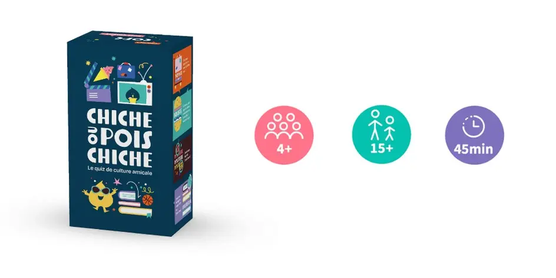
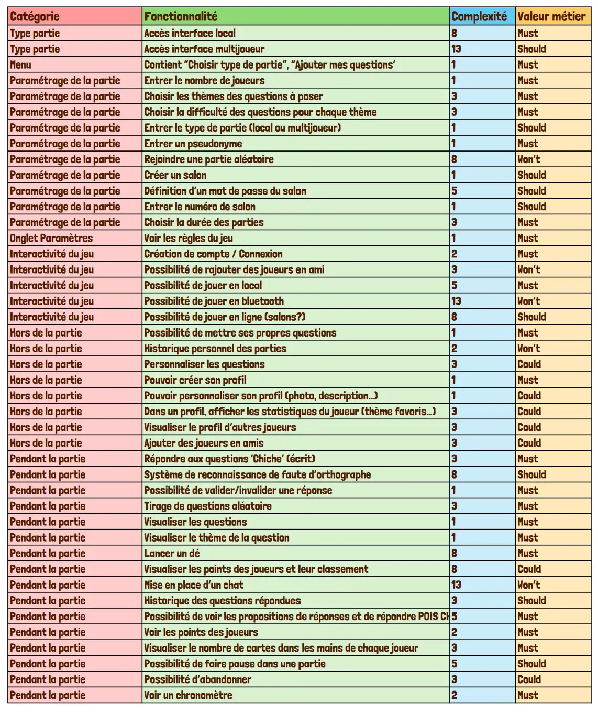
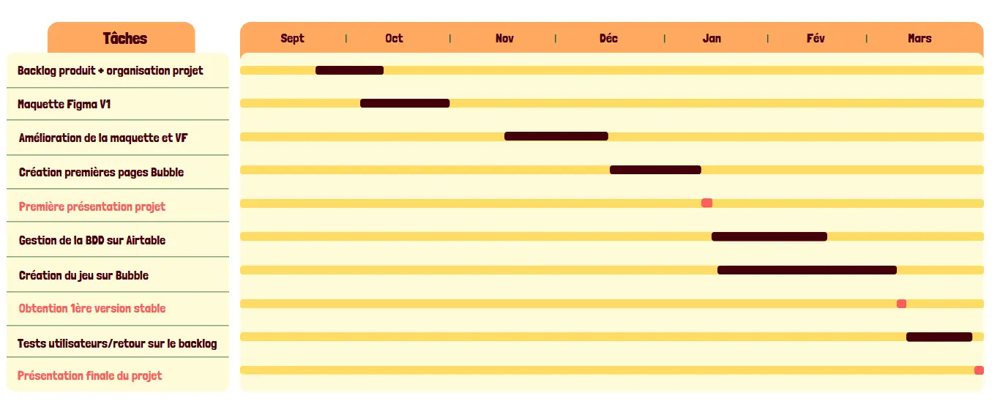

### Sommaire

- [Sommaire](#sommaire)
- [Organisation interne](#organisation-interne)
- [Tests utilisateurs et améliorations du backlog](#tests-utilisateurs-et-améliorations-du-backlog)
- [Maquette Figma](#maquette-figma)
- [Poster](#poster)
- [Application Bubble](#application-bubble)
- [Base de données Airtable](#base-de-données-airtable)
- [Difficultés rencontrées](#difficultés-rencontrées)
- [Apprentissage](#apprentissage)

<h2 id=contexte> Contexte et objectifs du projet</h2>

Ce projet a pour but de créer une version mobile du jeu de cartes "Chiche ou Pois Chiche".  Ce projet provient d’un constat simple : après plusieurs parties du jeu de cartes, on retombe rapidement sur les mêmes questions et le jeu devient vite obsolète pour un joueur une fois qu’il a rencontré toutes les questions et connaît toutes les réponses. Notre idée serait donc de créer une version mobile du jeu pour pouvoir alimenter la base de données et ainsi offrir aux fervents joueurs de “Chiche ou pois Chiche”, de pouvoir y jouer indéfiniment.

Par ailleurs, en terme de plus value apportée au jeu, une application mobile serait un moyen d'accroître sa visibilité, et faciliter son accès. En effet, à l’ère du digital, les jeux mobiles offrent une accessibilité sans précédent, qui permet aux utilisateurs de jouer n'importe où et à tout moment, contrairement aux jeux de cartes papier qui nécessitent d’avoir le jeu à portée de soi pour cela.


*Image du jeu original*

<h2 id=papier> Comparaison avec le jeu papier</h2>

Le but est de bien connaître son partenaire de jeu, afin de poser les questions pertinentes auxquelles on pense qu’il aura la réponse et de gagner le plus de points. La partie se termine quand il n’y a plus de cartes dans aucun jeu des joueurs, et l’équipe gagnante est celle qui a le plus de points.
Les quelques nuances que nous avons apportées sont répertoriées dans ce tableau.

|**"Chiche ou Pois Chiche"**|**"Tu tires ou tu pointes"**|
|---|---|
|Pour chaque question le joueur lit l'indice à son partenaire puis lui demande "Chiche ou Pois Chiche ?". Il répond "Chiche" s'il pense pouvoir répondre à la question sans proposition de réponse ou "Pois Chiche" s'il souhaite les 4 propositions. Si la réponse donnée est correcte, l'équipe récupère une "Carte Chiche" (3 points) ou une "Carte Pois Chiche" (1 point) selon l'annonce faite précédemment.|Pour chaque question le joueur lit l'indice à son partenaire puis lui demande "Tu tires ou tu pointes". Il répond "Je tire" s'il pense pouvoir répondre à la question sans proposition de réponse ou "Je pointe" s'il souhaite les 4 propositions. Si la réponse donnée est correcte, l'équipe gagne 3 points ou une 1 point selon l'annonce faite précédemment.|
|Les équipes sont de 2 joueurs minimum, autant que voulu.|Les équipes sont de 2 joueurs exactement. Entre 4 et 8 joueurs.|
|Le jeu possède 8 catégories de questions : "Sport", "Culture G", "Petits écrans", "Grand écran", "Voyage",“Musique", "Bouffe".|Le jeu possède 11 catégories de questions pour permettre à tout le monde d’avoir des points forts et des faiblesses :"Sport", "Culture G", "Petits écrans", "Grand écran", "Voyage", “Musique", "Bouffe", “Sciences”, Histoire”, “Divers”.|
|Quantité limitée de questions : 495 cartes|Base de données de questions illimitée et approvisionnable par les joueurs|
|Dé à lancer pour définir les règles du tour (chiche imposé, vol de points, etc…)|Pas de dés|

<h2 id=stacktechnique> "Tech stack" ou stack technique</h2>

Pour réaliser ce projet de jeu mobile, nous avons pris le partie de réaliser l’entièreté du jeu en low code. Nous utilisons les technologies suivantes :

- **Figma**: Éditeur de d’interface graphique. Comme la réussite d’un jeu mobile dépend en grande partie de la réussite du parcours utilisateur, c’était un des points crucial sur lequel nous devions nous focaliser et travailler. Cette étape a été assez longue, les résultats de cette réflexion sont présentés dans la partie Livrables.
- **Bubble**: N’ayant que peu voire pas du tout d'expérience en développement mobile, nous avons décidé de développer notre application sur Bubble. Ce choix a été guidé par le cours de Low-code donné au temps 1, qui nous a inspiré, mais également car notre tuteur nous a recommandé d’utiliser cet outil Low code au vu du temps et des compétences dont nous disposions.
- **Airtable**: Bubble est certes un outil gratuit, il est cependant limité en ce qui concerne certaines fonctionnalités. Il est par exemple possible de payer afin d’obtenir davantage de “workload units” permettant une utilisation plus approfondie de Bubble. En particulier, nous avions besoin d’une solution de base de données gratuite afin d’héberger notre banque de questions de taille moyenne (quelques centaines de questions). La base de données native de Bubble étant très limitée (50 lignes maximum), nous avons opté pour une solution de base de données gratuite : Airtable. La plateforme d’Airtable nous a permis de stocker et d’approvisionner notre base de données de questions gratuitement, et bien sûr de la connecter directement à Bubble via un plugin.

<h2 id=organisation> Organisation</h2>

Dans le cadre de notre projet, nous avons cherché à mettre en pratique les différentes notions apprises cette année. Tout d'abord, nous avons utilisé les méthodes de l'UX Design pour définir la problématique à laquelle notre projet répondra. Après une phase de recherche et d'analyse, nous avons défini la problématique suivante : "Faire en sorte que les amis, collègues, familles s’amusent avec une interface simple, dynamique et sans limite". Cette problématique nous a permis de mieux cadrer notre projet en identifiant trois personas, correspondant aux futurs utilisateurs de notre application. La création de ces personas nous a permis d'identifier les fonctionnalités importantes pour chaque profil d'utilisateur, afin de répondre au mieux à leurs attentes

Ensuite, nous avons décidé de nous organiser en suivant la méthode Agile, dont nous avons appris les bases en début d'année. Cette méthode encourage l'itération rapide, la prise de décision décentralisée, la livraison plus fréquente d'une plus petite valeur et une réponse plus rapide au changement. Cette méthode est basée sur des cycles de travail réguliers, les sprints, qui sont alimentés par des tâches clairement définies dans notre backlog de projet. Grâce à cette approche, nous avons pu livrer des fonctionnalités opérationnelles à chaque fin de sprint, tout en restant flexibles et en nous adaptant aux changements de priorités.

Nous avons donc tout d'abord établi le backlog de notre projet. Nous avons classé les User Stories suivant plusieurs catégories. Nous avons aussi estimé les complexités de chaque fonctionnalité (échelle de Fibonacci) et associé à chacune une valeur métier (méthode MoSCoW).



Si l'on fait un bilan des User Stories qui ont été réalisées et celles qui ne l'ont pas été, on obtient le graphique suivant:


Deux fonctionnalités "Must" n'ont pas été développées:

- Le lancer de dé: nous n'avons pas eu le temps de développer toute la logique derrière cette fonctionnalité, faute de temps.
- Le choix de la difficulté: nous n'avons pas eu le temps d'établir des difficultés à chaque question dans la base de donnée.

### Organisation interne

Étant donné que nous avons développé notre application sur la plateforme web de Bubble, nous n'avons pas besoin d'utiliser Git pour le contrôle de version. Cependant, nous avons eu besoin de communiquer efficacement et de stocker tous nos fichiers dans un dossier commun. Pour ce faire, nous avons créé un Google Drive où se trouvent notre banque d’images, nos comptes rendus de réunions ainsi que nos différents livrables. Pour notre communication, nous avons utilisé Messenger, une solution simple et pratique pour les boomers que nous sommes.

Concernant l’organisation de notre travail, nous n’avons pas eu de rôles précisément définis puisque chacun des membres de notre équipe a travaillé sur toutes les composantes de notre projet. Nous avons décidé de suivre l’emploi du temps standard, à savoir une réunion en présentiel chaque semaine au minimum pour avancer le projet, et ponctuellement des séances en distanciel. En cas de retard, nous avons pu travailler sur notre temps personnel lors des semaines d’alternance et/ou vacances pour rattraper le temps perdu.

Enfin, pour l'organisation dite "externe", afin d’avoir une communication fluide avec notre tuteur, nous avons créé un second groupe messenger, ainsi que d’ouvrir l’accès à notre dossier google Drive pour qu’ils puissent avoir accès à nos comptes rendus.

### Tests utilisateurs et améliorations du backlog

Après plusieurs mois de travail, nous avons réussi à avoir une première version fonctionnelle de l’application. C’est alors que nous avons commencé la phase de test. Cette phase a été menée auprès de camarades centraliens. Lors de ces tests, nous avons particulièrement porté notre attention sur la facilité d’utilisation de l’interface, ainsi que de sa clarté. L’application devait être auto-portante, c’est-à-dire que les joueurs devaient savoir ce qu’ils devaient faire sans qu’on ait besoin d’intervenir. Bien évidemment, le jeu doit aussi être amusant pour les joueurs, et les graphiques plaisants. Le premier test a été réalisé lors d’un Bar’bu (partie de 4 joueurs).. Nous avons ensuite fait un deuxième test avec nos camarades de la promo Do-IT (6 joueurs) et lors d’une soirée autour d’une table (6 joueurs). Ces environnements de tests ont été donc plutôt festifs, et donc propice au jeu.  Le but était d’étudier le chemin utilisateur et de voir si ce que nous avions mis en place était clair pour quelqu’un de l’extérieur. En fonction des fonctionnalités que nous voulions évaluer, nous leur laissions le téléphone à une certaine page de l’application (page pour paramétrer la partie, page choix du jeu quand nous avons implémenté la possibilité d’ajouter ses questions, ou la page de connexion), avant de leur avoir introduit brièvement les règles du jeu, pour leur donner envie d’y joueur. Durant le déroulement de la partie, nous avons également essayé d’intervenir le moins possible. Voici ce qui est ressorti de ces tests:

- L’impression globale du jeu a été positive. L’interface utilisateur et les designs de l’application ont plus aux joueurs, et l’expérience utilisateur a été globalement appréciée. Ils se sont amusés, ce qui est le principal!
- Quelques chargements ont été longs, notamment le passage entre les différents écrans mais surtout le début de la partie, lors de la création de la base de donnée de la partie. Cela est dû au fait que nous avons lancé l’application avec un lien dit “Preview”, et non pas dans un environnement déployé (qui est payant),  ce qui ralentit l’application.
- Il y avait plusieurs fois des problèmes lors de la sélection des réponses: l’utilisateur cliquait sur une réponse mais l’application ne sélectionnait pas la réponse voulue.
- Les joueurs ne comprenaient pas la règle de la pioche: ils croyaient que cette règle permettait de piocher une nouvelle carte dans un deck, et non pas piocher chez un adversaire.
- Le temps initial pour lire et répondre à la question (30 secondes) était bien trop court: souvent les joueurs se pressaient trop ce qui affectait l’expérience utilisateur.

Ces tests nous ont beaucoup appris, et ont pointé des défauts dont nous avions pas pensé, étant trop le nez dans le projet. Cette prise de recul a été bénéfique.
Nous avons ainsi modifié le backlog de notre application pour mieux pallier aux remarques faites lors des tests. La première modification a été la création d’une fenêtre de confirmation des réponses. Cela a permis d’éviter le problème du joueur qui clique à côté de la réponse qu’il voulait sélectionner. Nous avons également changé le temps de lecture de la carte à 45 secondes au lieu de 30 secondes. Nous avons aussi ajouté un icône d'un voleur sur le bouton de pioche, pour préciser le fait que cette option permet de voler une carte dans le jeu d'un adversaire.
Malgré la création de la fenêtre de confirmation de réponse, il y avait toujours un problème sur la confirmation de la bonne réponse. En effet, quelques fois, le joueur confirmait la bonne réponse mais ne gagnait pas de point. Cela est dû au fait que dans notre base de données Airtable, nous avons rentré la bonne réponse dans une colonne "Bonne réponse", et pour vérifier si la réponse choisie est correcte, on compare l'élément dans la colonne "Bonne réponse" et celui dans la colonne de la proposition choisie. Le problème est que cette comparaison compare chaque caractère très rigoureusement. Donc les fautes de frappe posent problème, tout comme la sensibilité à la casse ou même un espace à la fin de la chaîne de caractère. Pour éviter cela, on doit simplement être rigoureux sur le renseignement des données dans la BDD. Nous avons écrit un petit script Python pour vérifier s'il y avait des problèmes dans la base de donnée (heureusement, le script a renvoyé 5 erreurs!). Pour éviter ce problème, nous aurions dû renseigner le numéro de la bonne réponse dans la colonne "Bonne réponse", plutôt que le texte entier de la bonne réponse.



```python
import openpyxl

wb = openpyxl.load_workbook('BDD.xlsx')
sheet = wb['Questions-Grid view(1)']

for nb_row in range(2, 235):
    cell_reponse = sheet.cell(row = nb_row, column = 4)
    reponse = cell_reponse.value
    list_proposition = []
    for nb_column in range(5, 9):
        cell_proposition = sheet.cell(row = nb_row, column = nb_column)
        list_proposition.append(cell_proposition.value)
    if reponse not in list_proposition:
        print("ERREUR", nb_row)

print('FINI')
```



Voici un diagramme de Gantt représentant l'évolution de notre projet sur l'année:



<h2 id=resultat> Résultats et livrables</h2>

### Maquette Figma

Comme la réussite de notre jeu résidait en grande partie à la réussite de **l'expérience utilisateur** de nos joueurs, il nous fallait nous appliquer particulièrement dans le design de notre interface.

Nous avions obtenu une première version à la fin des **cours d'UX design**, qui ressemblait à ceci :


Mais lors du cours d'**UI**, plus centré sur le **design visuel**, il nous a été reproché que notre design ne faisait pas assez *jeu*. En voulant nous adresser à un public *large*, plutôt que de choisir un *persona*, nous n'arrivions pas à nous décider sur des choix visuels précis.

Nous avons alors décidé de refaire toute la démarche, de définir un persona précis qui soit un jeune de notre âge, et de créer un *Moodboard*. Nous avons choisi de nous inspirer d'un jeu mobile sur le même principe que nous (ie qui se jouait sur un seul téléphone), et s'adressant aux jeunes : **l’imposteur**.


Nous avons alors analysé ce qu'il manquait à notre maquette essentiellement : des **images/icônes**, des **couleurs**, et un **logo** qui correspondait à l'univers du jeu.

Alors on a tenté de retravailler :
- notre logo

|---|---|
| | |
| | |

- notre maquette


Mais c'était très dur pour nous de nous défaire de notre idée de départ. Alors on s'est finalement dirigé vers une alternative de notre première idée :



**[Lien vers le preview Figma](https://www.figma.com/proto/qpd6RRPLzQF2yXglJ3bFc3/Interface-application?type=design&node-id=42-93&t=i522PIOTavWnt3Og-1&scaling=scale-down&page-id=0%3A1&starting-point-node-id=71%3A561&show-proto-sidebar=1&mode=design)**


### Poster

Nous avons également présenté notre application lors de l'après- midi de présentation des projets 3A aux anciens de Do-It ainsi qu’aux élèves intéressés. Voici le poster que nous avons réalisé pour expliquer le concept, la planification et l’avancement du projet :


### Application Bubble

Malheureusement l'option de déployer une application avec Bubble est *payante*. Mais vous trouverez ici une courte vidéo de présentation de l'application :

<video width="400" height="200" controls> <source src="demo.mp4" type="video/mp4"></video>

Et voici le lien vers un preview de notre application [ici](https://duc15dangvu.bubbleapps.io/version-test/page_de_connexion), avec lequel vous pourrez jouer !

### Base de données Airtable

Pour la base de données, comme expliqué plus tôt, nous l'avons gérée avec Airtable.
Elle contient donc les informations complémentaires à Bubble, c'est-à-dire l’ensemble des données liées aux questions. Il y  **234 questions différentes aujourd'hui** dans la table. Au total, **200** proviennent des questions du jeu de cartes initial, et nous en avons ajouté **34** que nous avons créés sur les thèmes **Histoire** et **Sciences**.

<h2 id=apprentissage> Apprentissage et retour d'expérience</h2>

Ce projet nous a permis d'apprendre plusieurs choses. Tout d'abord, nous avons un retour sur le no-code, résumé dans le tableau ci-dessous:

|**Avantages**|**Inconvénients**|
|---|---|
|Rapidité de développement (avec utilisation d’interfaces visuelles et des composants prédéfinis)|Limitations fonctionnelles (limitations en termes de fonctionnalités et de personnalisation disponibles dans les outils de no-code)|
|Facilité de l’apprentissage et prise en main (Bubble est assez facile à prendre en main par rapport à un langage de développement mobile à apprendre)|Nécessité d’utiliser des plugins pour des actions basiques|
|Facilité de maintenance (car applications reposent sur des modèles et des composants standardisés)|Chargements très longs, pas très adapté à un jeu|
|Agilité accrue (cycles de développement plus courts et une plus grande flexibilité, qui permettent de développer de nouvelles fonctionnalités plus rapidement)||

### Difficultés rencontrées

Nous avons rencontré des difficultés sur plusieurs points de notre projet:

- **Récupération des données Airtable**: il fallait faire des boucles itératives sur Bubble pour récupérer des données via l'API, ce qui n'est pas très adapté à la situation. Une solution serait d'utiliser des *backend workflows*, mais cette fonctionnalité est réservée aux utilisateurs payants.
- **Difficultés inattendues**: nous avons rencontré des difficultés dont nous n'avions pas soupçonné, comme par exemple la gestion de l'ordre de passage qui nécessitait de réfléchir sur une certaine logique dans le workflow. Le temps passé sur la maquette était aussi une difficulté: nous ne pensions pas passer autant de temps sur la maquette et sur la réflexion sur l'UX.
- **Difficultés liées à la version gratuite de Bubble**: la version gratuite du site nous a restreint sur certains points. Par exemple, nous avions des workloads limités, et le travail en collaboration était parfois difficile.

### Apprentissage

Outre les difficultés rencontrées, nous avons également réussi à faire ressortir quelques apprentissages:

- **Travail sur l'UX important**: Comme mentionné précédemment, cette étape fut assez longue, ce qui nous a fait réaliser l'importance de celle-ci. Le plus gros apprentissage fut l'importance des personas. En effet, nous ne sommes pas assez référé à ces derniers, ce qui nous a fait perdre de vue l'importance d'inclure l'aspect jeu de notre application.
- **Importance des tests**: Cet aspect nous a été essentiel durant notre projet. Lors du développement de l'application, nous étions "la tête dans le guidon", ce qui nous a infligé un manque de recul très important. Les tests nous ont permis d'avoir ce recul, qui a été très important pour la version finale du jeu.
- **Application de la méthode agile**: On a appris à garder en tête le backlog et qu’il est parfois difficile de s’en tenir à la méthode jusqu'au bout. On a fait des US trop complexes, ce qui fait qu’on était tous sur la même feature (c’était un choix), mais on aurait dû s'en tenir à la méthode agile, qui stipule de faire des US courtes afin de les répartir en prenant compte de la vélocité de chacun.

<h2 id=capitalisation> Capitalisation et suite à donner</h2>

Pour clôturer ce projet, nous pouvons nous questionner sur son avenir. Une des tâches à faire est d'enrichir la base de donnée Airtable afin de rendre le jeu plus pérenne. Il faut également faire tester le jeu à un public plus large. Une des solutions serait de rendre le jeu accessible en ligne, via une plateforme multijoueur, qui permettrait de jouer sur plusieurs téléphones en même temps.
L'implémentation du dé peut aussi être pertinent, car cette règle ajoute de l'aléatoire ce qui rend le jeu plus amusant.
Comme nous l'avons mentionné précédemment, il existe plusieurs inconvénients au low-code, qui pourrait entraver un développement futur de l'application. Il pourrait être intéressant de passer sur une méthode de programmation "dure", pour rendre le jeu plus viable pour l'avenir.

<!-- ## Introduction

Ce projet a pour but de créer une version mobile du jeu de cartes “Chiche ou Pois Chiche”. Après plusieurs parties, on retombe rapidement sur les mêmes questions et le jeu devient vite obsolète pour un joueur une fois qu’il a rencontré toutes les questions et connaît toutes les réponses. Notre idée serait donc de créer une version mobile du jeu pour pouvoir alimenter la base de données et ainsi offrir aux fervents joueurs de “Chiche ou pois Chiche”, de pouvoir y jouer indéfiniment. De plus, une application mobile serait un moyen d'accroître la visibilité du jeu.


Le but du jeu est de gagner le plus de points en posant les bonnes questions à son ou ses partenaire de jeu. On forme plusieurs équipes de 2 minimum. Pour chaque question le joueur lit l'indice à son partenaire puis lui demande "Chiche ou Pois Chiche ?". Il répond "Chiche" s'il pense pouvoir répondre à la question sans proposition de réponse ou "Pois Chiche" s'il souhaite les 4 propositions. Si la réponse donnée est correcte l'équipe récupère une "Carte Chiche" (3 points) ou une "Carte Pois Chiche" (1 point) selon l'annonce faite précédemment.
Le jeu possède 8 catégories de questions pour permettre à tout le monde d’avoir des points forts et des faiblesses. ("Sport", "Culture G", "Petits écrans", "Grand écran", "Voyage", “Musique", "Bouffe")

## Fonctionnalités

Voici une première liste de fonctionnalités que nous voulons implémenter sur l'application:

- La gestion d'un compte utilisateur
- Lancer un dé pour déterminer le type de tour
- Pouvoir rejoindre un salon avec les autres participants (mode en ligne? bluetooth?)
- Tirer aléatoirement une question
- Comptage de points
- Afficher la réponse à une question sur demande de l'utilisateur

## Planification du projet

Nous avons réalisé une feuille de route pour notre projet, qui consiste en quelques étapes que nous devrons réaliser au fur et à mesure de notre avancement:

- Faire des maquettes de l'apparence graphique générale du jeu (sur Canva ou autres)
  - Quelle charte graphique pour l'application?
  - Quelle expérience utilisateur?
- Réfléchir sur les fonctionnalités de l’application
  - Quelles règles établir? Ajout de règles?
- Elaboration d’un premier prototype sur Figma
  - Apprentissage et prise en main de l'outil
- Première version en no code sur Bubble.io
  - Création d'une première base de donnée de questions sur Bubble (ou autre) avec les questions du jeu
  - Création de l'interface utilisateur
- Recueil d’un grand nombre de questions et de réponses
- Test et retours d’expérience auprès de plusieurs utilisateurs
- Améliorations sur le jeu suite aux remarques soulevées
- Possible migration (NiceGui sur Python)? -->
