L'objectif du projet est de créer une application mobile permettant de jouer au jeu du Killer.



## Description du projet

### Présentation du jeu du Killer

Le jeu du Killer est un jeu qui se joue en arrière-plan d'une soirée/évènement. L'objectif est d'être le dernier survivant de l'assemblée.  Au début de la partie, chaque joueur se voit remettre une cible (un autre joueur) et une action à faire faire. Si un joueur réussit à faire l'action à sa cible, ce dernier meurt et transmet sa cible et son action à son tueur.

Il existe différentes règles du Killer qui change la façon de tuer quelqu'un. Par exemple, un joueur peut tuer quelqu'un seulement si il n'y a pas de témoin.

### Application web déjà existantes :

- https://killerparty.app/ : pas de géneration d'actions
- https://jeudukiller.fr/join_game : Seulement un mode de jeu

### L'application 

L'application permettra de jouer au jeu du killer facilement et rapidement, sans aucune préparation. 

Ce qu'apporte l'application :

* Pas besoin de refléchir à des actions
* Distribution automatique des cibles et des actions
* Possibilité de jouer à différents modes de jeu

### Les différents mode de jeu

L'application proposera différents mode de jeu :

* Le mode normal (avec les gages)
* Le mode mot (il faut faire dire un mot à sa cible)
* Le mode grand groupe (100 personnes)
* Mode personnalisé (avec des gages personnalisé)
* Autre mode ?

Le créateur de la partie pourra paramétrer sa partie comme il le souhaite : 

* Possibilité de mettre un timer
* Choisir une thématique
* Possibilité de changer son action 
* Possibilité de connaître sa cible ou pas

Dans le cas où l'organisateur choisit de rendre la cible non explicite, les participants ne connaitrons pas leur cible. Ils auront simplement des indices sur leur cibles. Ces indices seront remplis par les participants à l'aide d'un formulaire en amont de la partie.

## Objectif à atteindre
Créer un site web avec une meilleur expérience utilisateur, qui permet de jouer le jeu "Killer" en différents modes. Les modes principaux visés comme objectifs sont :
    - Mode Normal (actions)
    - Mode Mots
    - Mode Team Building
    - Mode Personnalisable



# Présentation du projet

### Le jeu du Killer

**KILLER** est une adaptation mobile innovante du jeu de société classique joué en groupe, où l'astuce, la stratégie et la discrétion sont les clés de la survie. Conçu pour dynamiser les rencontres sociales, **KILLER** transforme chaque participant en un chasseur astucieux, avec pour mission de "tuer" sa cible en accomplissant un gage spécifique, sans se faire démasquer.

Dans **KILLER**, chaque joueur reçoit secrètement le nom d'une autre personne du groupe à "tuer", ainsi qu'une mission ou un gage particulier à réaliser à l'encontre de sa cible. Les missions sont conçues pour être exécutées discrètement lors d'interactions sociales, rendant le jeu parfait pour les fêtes, les rassemblements ou comme un moyen ludique de briser la glace.

### But et règles du jeu

Le but ultime est de rester le dernier "en vie", en "tuant" le plus de cibles possibles. Pour réussir, les joueurs doivent réaliser leur gage sans éveiller les soupçons de leur cible, tout en restant vigilants à ne pas se faire "tuer" par leur propre chasseur. La discrétion est essentielle : révéler son identité de tueur ou échouer dans sa mission peut entraîner l'élimination du joueur.

- Être le dernier en jeu,
- ou Éliminer le plus grand nombre de joueurs,
- ou les deux à la fois (c'est encore mieux !)

Normalement le jeu est destiné à n’importe qui entre 15 et 99 ans et peut se jouer à n’importante où.

### Déroulement classique du Jeu

1. Avant de commencer 
    1. L’organisateur se munira de papier et d'un crayon.
    2. Il établira une liste claire de tous les participants, en plaçant les noms les uns sous les autres selon un ordre déterminé : chaque joueur aura pour mission d'"éliminer" la personne listée juste après lui (et le dernier sur la liste aura pour cible le premier).
    3. L’organisateur doit confier à chaque joueur une “MISSION”, qu’il doit faire faire à sa cible.
2. Attribution des missions
L’organisateur doit distribuer secrètement une  "MISSION" à chaque participant en indiquant le nom de sa victime. Il leur fait comprendre qu'il n'est pas encore temps de passer à l'acte.
3. Lancement officiel
L’organisateur doit réunir tous les joueurs et leurs communiquer les informations suivantes :
    1. → La partie prend fin à "tel" moment ou lorsqu'il ne reste plus qu'un joueur en jeu. Le dernier survivant ainsi que le joueur ayant réalisé le plus de "meurtres" seront déclarés grands vainqueurs.
        
        NB : Il peut également envisager de récompenser le tueur le plus rapide, le plus théâtral, le plus rusé…
        

**NB : KILLER** est un jeu de stratégie et d'esprit : ici, le "meurtre" est purement symbolique. Les joueurs doivent faire preuve d'intelligence et de finesse pour réussir leurs missions.
Il est essentiel de jouer dans le respect des autres : pas de blessures, pas de violence physique, pas de larmes, et certainement pas de chaos.

### Notre application mobile

L'application mobile **KILLER** simplifie l'organisation et l'exécution du jeu. Les joueurs s'inscrivent sur l'application, un hôte crée la partie, et les participants rejoignent via un code unique. Une fois la partie lancée, chaque joueur reçoit sa cible et son gage directement sur son appareil.

Les avantages de notre application sont :

- Permettre à l’organisateur de jouer au jeu
- Faciliter la préparation et le déroulement du jeu
- Fournir une vaste base de données de gages, organisés par thème ou type d'événement, prêts à être mis en œuvre.

# Organisations et étapes clés 
### Design Thinking

Au tout début de notre projet, avant même de commencer le développement, nous avons organisé des ateliers de design thinking. Ces sessions ont été cruciales pour définir les fondations de notre projet, en mettant un accent particulier sur la compréhension de nos utilisateurs finaux. À l'aide des principes et techniques issus de nos cours d'UX, nous avons créé plusieurs personas, représentant les archétypes de nos utilisateurs cibles.

À la suite de nos ateliers de design thinking et de l'analyse des personas, nous avons tiré des conclusions sur le type d’application que nous voulons développer. Notre objectif est de développer un jeu de soirée destiné principalement à un public jeune, âgé de 18 à 30 ans. L'aspect le plus distinctif de notre application réside dans sa facilité et rapidité de mise en place d'une partie, ainsi que dans la simplicité de son organisation. Nous voulons que notre jeu encourage non seulement l'amusement mais aussi l'échange et la possibilité de rencontrer de nouvelles personnes lors des soirées. Cela signifie que l'interface utilisateur doit être intuitive, éliminant toute barrière technique qui pourrait entraver la spontanéité et la fluidité de ces interactions. De plus, un point crucial de notre conception est de permettre à l'organisateur de la soirée de participer pleinement au jeu, assurant ainsi que personne ne soit laissé de côté et que tous les participants puissent profiter pleinement de l'expérience. 

Ces ateliers ont définit plus ou moins le scope de notre projet. Ce qui nous a aidé dans la prochaine étape de déterminer les fonctionnalités clés de notre application avec des sessions de brainstorming.

### Brainstorming

Suite à une session de brainstorming, nous avons collectivement identifié et évalué toutes les fonctionnalités nécessaires pour notre projet, une étape cruciale dans la définition du scope. Chaque fonctionnalité a été notée en termes de difficulté de réalisation et de priorité, en alignement avec notre charte de projet et nos objectifs. La distinction entre les éléments essentiels et les fonctionnalités optionnelles ou secondaires est essentielle pour affiner le scope de notre projet. Cela a facilité la gestion des taches. 

Voici le tableau récapitulatif des fonctionnalités envisagées au début du projet:

| Fonctionnalité | Description | Priorité | Difficulté | Page  |
| --- | --- | --- | --- | --- |
| Création d’une partie | Btn pour créer une partie | 5/5 | 5/5 | Page d’accueil |
| Rejoindre une partie | Btn pour rejoindre une partie existante (⇒ Entrer un code, mettre son nom) | 5/5 | 5/5 | Page d’accueil |
| Accéder aux règles du jeu | Ouvre une page d’aide qui liste les différents modes de jeu et les règles associées | 1/5 | 2/5 | Page d’accueil |
| Section “à propos”  | Section de texte listant les CGU, le contexte et les créateurs de l’appli | 1/5 | 1/5 | Page d’accueil |
| S’identifier | Création de compte/connexion (sauvegarder des presets) | 1/5 | 5/5 | Page d’accueil |
| Case “je ne bois pas” | Paramètre qui permet de définir si on peut recevoir un gage impliquant de la consommation d’alcool ou non |  |  | Page d’accueil |
| Choisir une thématique | Le créateur de la partie choisit la thématique qui définit les gages (donc prédéfinis) de la soirée.  | 3/5 | 3/5 | Page de paramétrage de la partie |
|  Case “soirée alcoolisée”  | Le créateur peut choisir d’exclure ou non les gages liés à la consommation d’alcool de la “pool” de gages |  |  | Page de paramétrage de la partie |
| Possibilité de Reset les gages | Acceder à un système de vote dans le jeu pour reset les gages si trop de personne sont bloqués | 1/5 | 5/5 | Page de paramétrage de la partie |
| Sauvegarder/Charger un preset | Si le créateur a un compte, il peut sauvegarder ou charger des paramètres de partie | 1/5 | 3/5 | Page de paramétrage de la partie |
| Ajouter des gages personnalisées | L’utilisateur peut ajouter à la liste des gages à faire | 2/5 | 3/5 | Page de paramétrage de la partie |
| Créer un timer | A la fin du timer la personne avec  le plus de kill gagne la partie | 2/5 | 3/5 | Page de paramétrage de la partie |
| Lancer la partie | L’hôte peut lancer la partie | 5/5 |  | Page de paramétrage de la partie |
| Notifications et Alerte  | Pour vérifier si la cible est morte + pour annoncer le nombre des derniers participants restants + Annoncer un reset | 5/5 | 3/5 | Notification |
|  |  |  |  |  |
| Attribution des gages et des cibles (automatiquement) | L’application va attribuer à chaque joueur une cible et un gage, de façon à ce qu’un joueur ne puisse pas tomber sur lui-même comme cible. (boucle) | 5/5 | 5/5 | Après le lancement de la partie |
| Voir tout le monde dans un salon |  |  |  | Page d’attente |
| afficher les infos dans le salon | Nombre de joueurs, Thématique, Fin de partie | 2/5 | 2/5 | Page d’attente |
| Pouvoir lancer le jeu (hôte) |  | 5/5 | 5/5 | Page d’attente |
| Possibilité d’ajouter un participant (au milieu du jeu) | Ajouter un nœud dans les relations | 1/5 | 2/5 | Page de la partie (Hôte) |
| Possibilité de supprimer un participant | Si un joueur part de la soirée, l’hôte doit être capable de l’éjecter de la partie pour le bon déroulement du jeu. La cible et le gage de la personne déconnectée seront alors transférés à son tueur.  | 3/5 | 3/5 | Page de partie |
| Voir sa cible |  | 5/5 |  | Page de partie |
| voir son gage  | (cacher cette information derrière une confirmation pour éviter les révélations accidentelles)  | 5/5 |  | Page de partie |
| Tuer sa cible |  | 5/5 |  | Page de partie |
| Voter pour reset les gages |  | 2 | 5/5 | Page de la partie |
| Confirmer qu’on est mort | La cible recevra une notification “Etes vous mort ?” et si elle confirme, verra qui était son tueur et son gage.  | 5/5 | 5/5 | Page de la partie |
| Voir les participants restants quand on est mort |  | 2/5 | 4/5 | Autre page ? |


### Développement
Pour la phase de développement de notre projet, nous avons continué à travailler avec Notion pour la gestion des tâches, permettant ainsi une organisation et une collaboration efficace au sein de notre équipe. Grâce à Notion, nous avons pu lister toutes les tâches nécessaires à la réalisation de notre projet, en attribuant à chacune un statut précis qui reflète son avancement : "Non commencé", "En cours", et "Terminé".

Cette approche nous a permis de maintenir une visibilité claire sur le progrès de chaque aspect du projet, facilitant ainsi la communication et assurant que nous sommes alignés sur les priorités et les échéances. Le suivi du statut des tâches via Notion a également contribué à une gestion de projet plus dynamique, permettant des ajustements en temps réel pour répondre aux changements de scope.
:-------------------------:|:-------------------------:
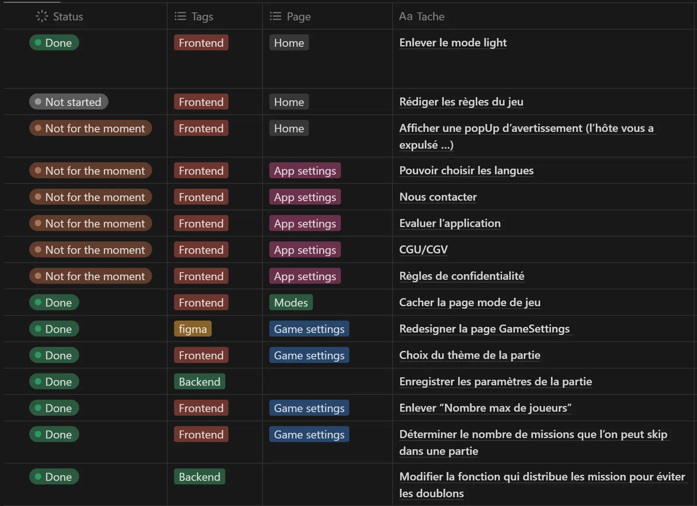|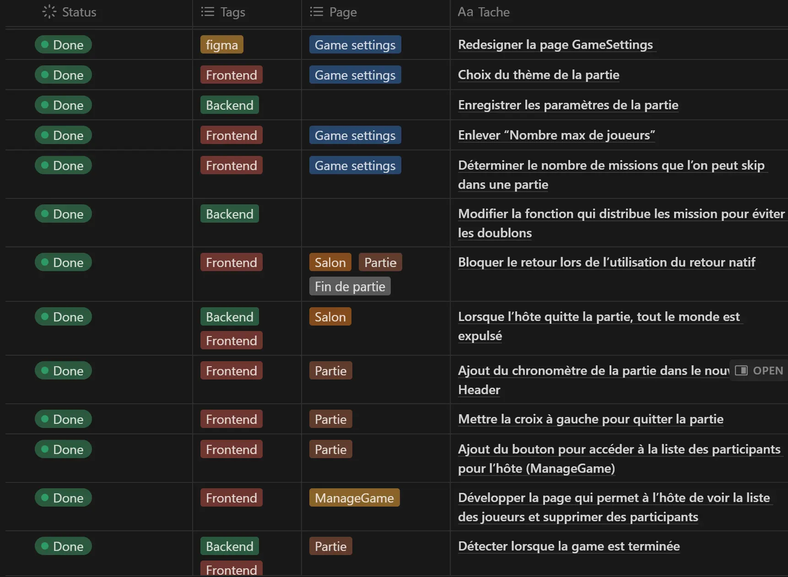
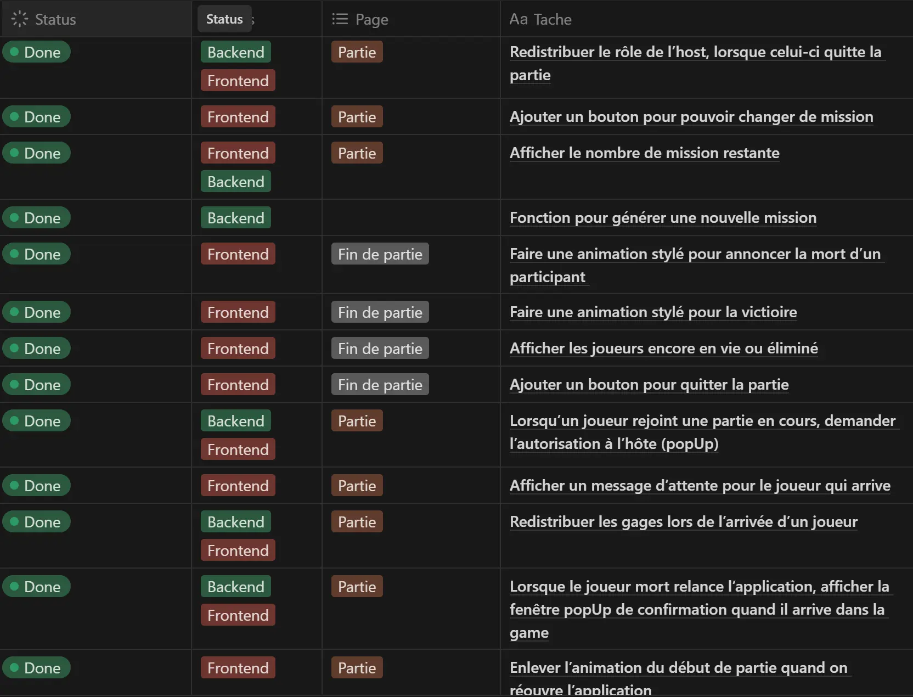|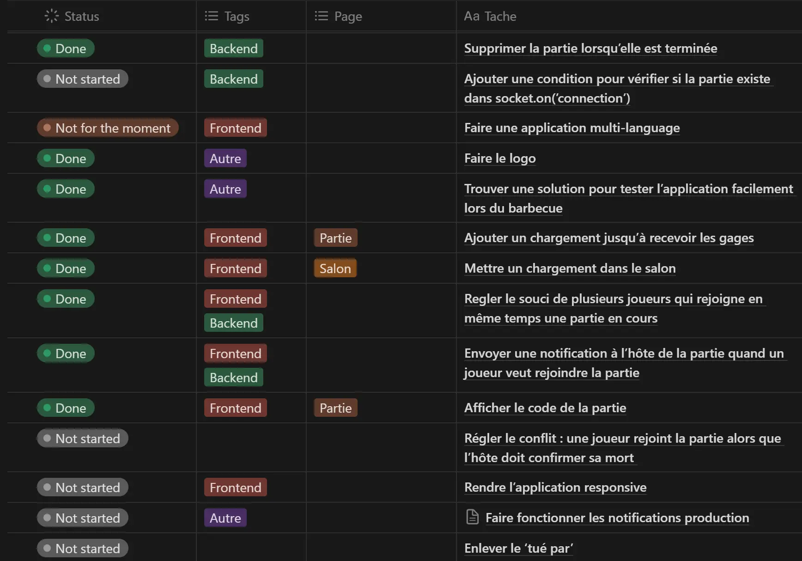

# Evolution de la maquette et du design

La conception de notre projet a évolué à travers plusieurs phases avant d'atteindre le rendu final présenté dans la section suivante. Le processus de design a commencé dès la troisième semaine du premier temps. Nous avons sélectionné une palette de couleurs, optant pour des tons sombres afin de capturer l'atmosphère mystérieuse du jeu.

Toutefois, après avoir assisté aux cours sur l'UX et l'UI design, nous avons remis en question notre conception initiale. À ce stade, une portion significative du développement front-end de l'application était déjà en cours, ce qui a rendu la révision du design particulièrement ardue. Nous avions une vision claire et détaillée de l'agencement des pages de l'application, et il était donc difficile de se pencher sur de nouvelles alternatives pour la palette de couleurs et le style général.

L'intégration des enseignements de l'UI/UX design a été source de confusion ; une partie du code était déjà écrite, et modifier le design à ce stade signifiait recommencer une grande partie du travail. Voici quelques exemples des orientations que les cours d'UI design ont inspirées :

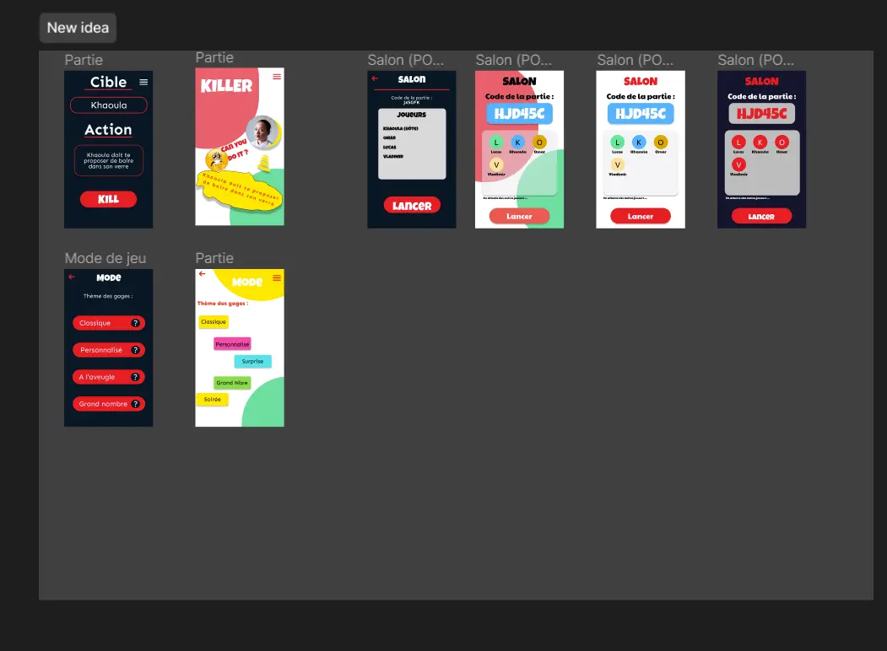
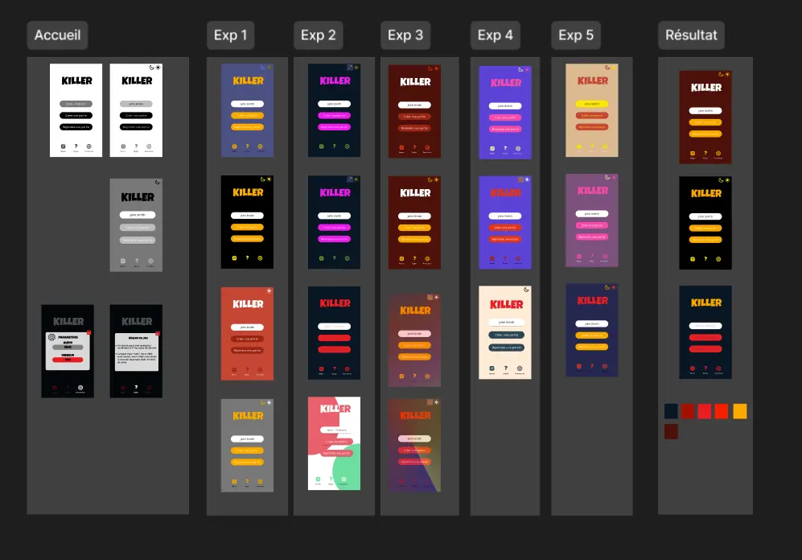

Finalement, après consultation et réflexion avec notre tuteur, M. Préa Pascal, nous avons décidé de conserver la structure originale et la palette de couleurs que nous avions initialement choisies :

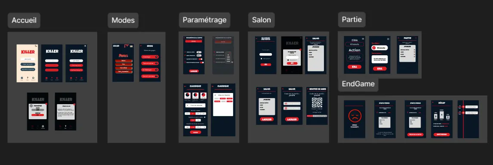

Des ajustements ont été apportés progressivement au développement des pages tout au long des deux derniers temps, au fur et à mesure qu'on teste l'application.

Vous pouvez accéder à notre maquette et notre espace de brainstorming en cliquant sur : [KILLER](https://www.figma.com/file/2LV3DAZ3pRUwxTUauOtV6E/Killer?type=design&node-id=0%3A1&mode=design&t=Ohbx9IIjUQS3iSxp-1).

# Développement de l’application

### Choix techniques

Pour le développement de l’application, nous avons choisi de partir sur ces technologies :

- **Mongo DB** pour la base de donnée
- **Node.js** avec Express pour le backend
- **React Native** pour le frontend

Nous avons choisi d’utiliser **Mongo Db** car c’est une base de donnée No SQL qui permet de créer des bases de données facilement sans commande SQL. De plus Mongo DB permet d’héberger notre base de donnée sur leur serveur, ce qui simplifie la configuration.

Ensuite, nous avons choisi **Node.js** car c’est une technologie que nous avions utilisé pour certains MON. De plus Node.js utilise du Javascript, comme React Native.
Enfin, **React Native** nous permet de développer des applications mobiles natives et cross platform (compatible avec IOS et ANDROID avec un seul code source). Il existe également Flutter mais nous avons préféré partir sur React Native car on ce Framework est très similaire à React.js.

De plus, pour la communication entre les joueurs, nous utilisons [Socket.IO](http://socket.io/).

Socket.IO est une bibliothèque JavaScript pour permettre la communication temps réel bidirectionnelle entre un client et un serveur.

Socket.IO utilise WebSocket comme protocole de transport lorsque cela est possible, et bascule automatiquement sur d'autres techniques comme le long polling lorsque WebSocket n'est pas disponible. Cela permet à Socket Io de fonctionner dans tous les environnements

La bibliothèque est composée de deux parties : une partie cliente, et une partie serveur qui s'exécute dans un environnement Node.js. Les deux parties communiquent ensemble pour permettre l'envoi et la réception de messages en temps réel.

### Résultat

:-------------------------:|:-------------------------:|:-------------------------:
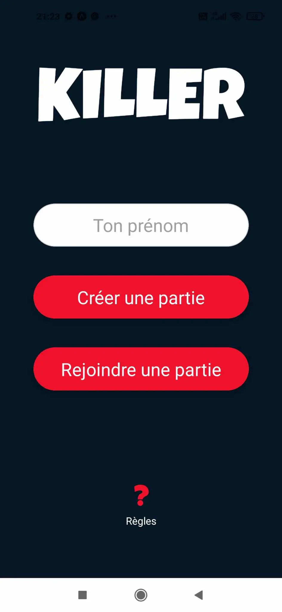|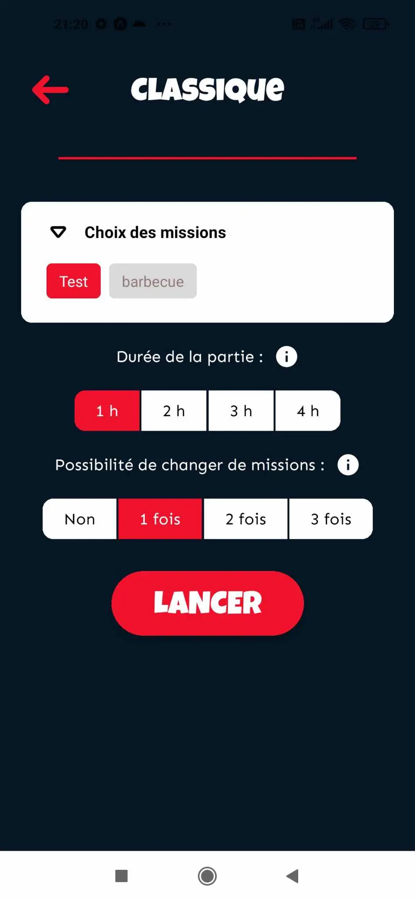|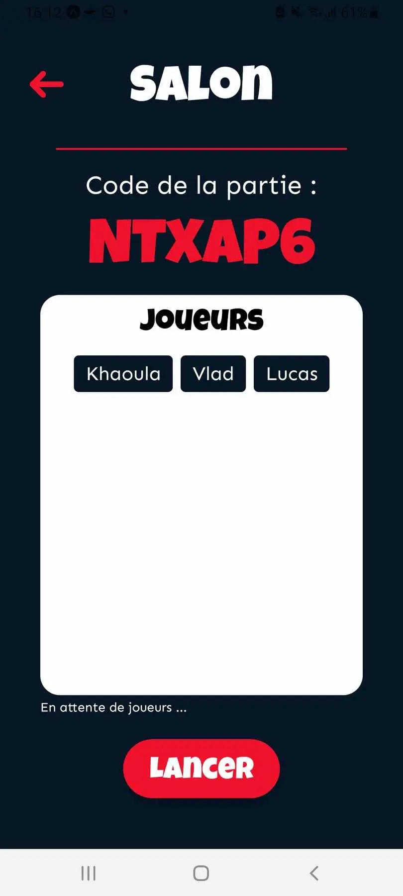
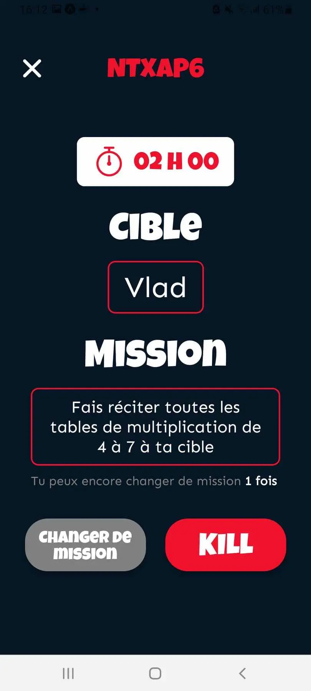|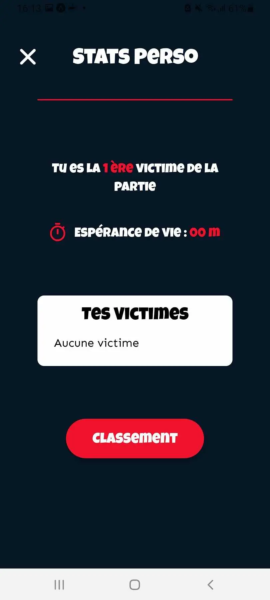|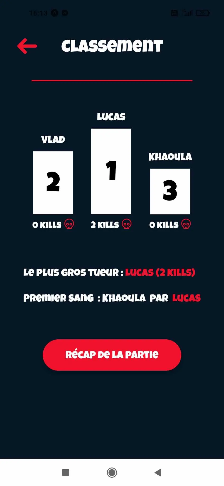
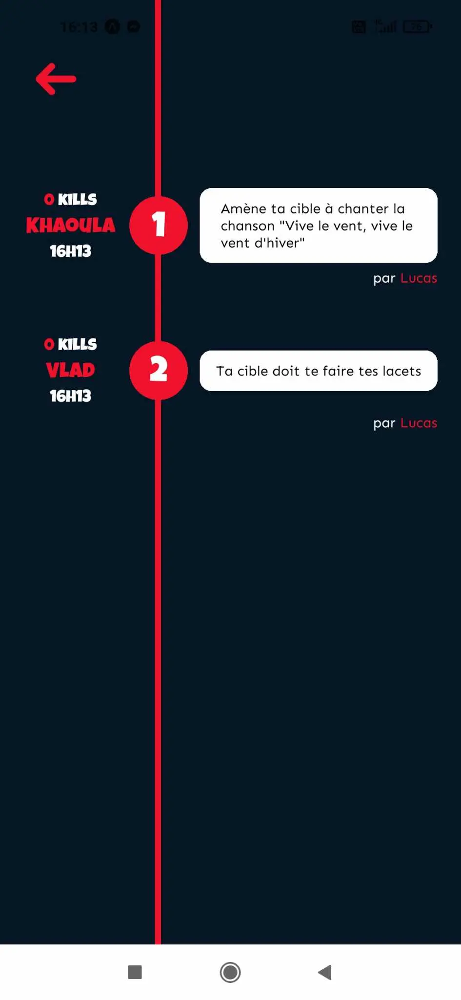

# Analyse des écarts et difficultés

### **Les écarts par rapport à la vision initiale**

Etant donné que nous avons défini et explicité le but de l’application et son public cible, le projet n’a pas eu de revirement majeur en cours de route. Tout au long du projet on s’est tout de même posé la question du gagnant : Est-il celui qui a le plus tué ? Ou alors celui qui survit le plus longtemps ? Nous avons finalement formé un compromis : le gagnant est celui qui reste le dernier en lice, mais en cas d’égalité (par exemple si le temps imparti est écoulé), alors les derniers survivants seront départagés sur leur nombre de victimes. 

Il y a aussi eu des remaniements dans les priorités du projet : par exemple, bien qu’initialement nous voulions implémenter un système d’authentification en se faisant un compte sur l’appli, nous avons pensé que la procédure serait trop fastidieuse. On veut quelque chose d’accessible à un public aussi large que possible, et mettre une étape supplémentaire pour lancer une partie peut former une barrière d’entrée.  Peut-être que sur le long terme, se connecter serait une possibilité pour pouvoir enregistrer des gages customisés par exemple, mais toujours présenté comme optionnel.

### Difficultés principales

La principale difficulté lors du développement était de trouver un moyen pour faire en sorte que le joueur reste dans la partie même si l’appli est fermée ou tuée. L’ajout d’animations sur React Native était aussi un gros obstacle à franchir. 

Difficultés principales rencontrées lors du développement : 

- Faire en sorte que le joueur ne soit pas exclu de la parti si l’appli est fermée ou tuée
- Implémenter des animations
- Fermeture totale d’une partie
- Notifications Push
- Ajout de gages

On a bien sûr eu des difficultés purement techniques, mais l’une des plus grosses montagnes à gravir n’avait rien à voir avec une fonctionnalité à implémenter ou un bug.

En effet, le thème central du jeu tourne autour des gages. S’ils ne sont pas drôles, le jeu est inintéressant, et s’il ne sont pas assez variés, on s’en lasse vite. Il faut aussi qu’ils soient atteignables, sans être trop faciles, ou évidents à deviner pour la cible. Bien que cette partie ne soit pas technique en soi, il a fallu dédier un temps non-négligeable pour trouver les gages, même pour un événement aussi court que le barbecue. Si on laisse aux joueurs la possibilité de changer de gage, il faut prévoir bien plus de gages que de personnes, ce qui devient difficile avec des parties de plusieurs dizaines de personnes. 

Si on veut aller plus loin dans le développement du jeu dans le but de le déployer sur les stores, il faudra réfléchir à plusieurs centaines de gages initialement, donc devoir trouver assez de gages pour le barbecue nous a donné un aperçu de cette tâche gargantuesque. 

# Bilan et suite

Finalement, l’application Killer est parfaitement jouable dans son état actuel, et permet d’organiser et gérer une partie du début à la fin. En ce qui concerne ce que l’on a appris du projet, nous avons pu mettre en application des outils de gestion de projet, afin de travailler efficacement en groupe, et mener à bien le projet. En effet, pour la plupart d’entre nous, nous avons pas eu l’occasion ou la présence d’esprit d’utiliser ces outils dans nos projets des années précédentes. Pour d’autres, c’était aussi notre première expérience de développement mobile, voire de développement en général : React Native, tests, utilisation de Github… En particulier pour Github, nous avons été confronté à des problèmes qu’on ne pourrait pas rencontrer lorsqu’on met à jour son POK ou MON car nous travaillions tous sur tous les fichiers du jeu.

“Mince, je viens de pull depuis Github et je viens d’écraser tous les modifs que j’avais faites…” 

Le but suprême sur le long terme serait de rendre cette application commercialisable. 

Dans l’immédiat, l’objectif serait de corriger les bugs communs qui pourraient rester, ainsi qu’implémenter toutes les fonctionnalités définies au début du projet. Il faudrait ajouter beaucoup de gages, et remanier la base de données de manière à attribuer des tags à chaque gage, et ainsi les activer ou non en fonction du thème choisi par le créateur de la partie. 

Bien sûr, il y aurait aussi toutes les étapes administratives/fonctionnelles : modalités de téléchargement de l’app sur le Play/App Store, accord de confidentialité utilisateur, et toutes les étapes administratives liées à gagner de l’argent via l’application, éventuellement.

Les repository Github du projet sont disponibles ici : 
- Front end : https://github.com/LucasRioual/Killer 
- Back end : https://github.com/LucasRioual/Killer-back