## Introduction - définition du projet

Pour notre projet Do_It, nous avons voulu créer une plateforme permettant de recenser l'ensemble des mobilités des Centraliens, afin d'aiguiller les prochains élèves dans le choix de leur destination.

### L'équipe du projet

Notre équipe pour mener à bien ce projet est la suivante :

- Lucie Le Boursicaud
- Agathe Rabachou
- Kawtar Bahri
- Paul Le Bihan
- Mathis Schultz

### Les missions

Voici les différentes étapes mises en œuvre durant ce projet :

- Étude du besoin
- Cahier des charges
- Développement
- Retour d'expérience
- Explication du code
- Présentation

## Étude du besoin

La première étape afin de réaliser notre site web a été de faire une étude afin de définir clairement nos objectifs, de rencontrer les parties prenantes et de comprendre plus précisément les besoins et les opportunités.

### Rencontre avec les Élèves

Afin d'obtenir une vision plus large sur notre projet nous avons voulu <strong>contacter les 1As, 2As et 3As </strong>pour savoir si le projet les intéressait, et s'ils seraient prêt à y accorder un peu de temps.

**Contact des élèves cherchant une mobilité**
Les 1As sont les <strong>utilisateurs principaux</strong> ciblés par notre site internet. En effet, <strong>les données collectées</strong> et <strong>les informations</strong> mises en avant sont destinées majoritairement aux 1As. Nous avons donc voulu savoir <strong>quelles étaient les questions</strong> qu'ils se posent. Nous sommes donc allés directement à leur rencontre dans les couloirs de l'école pour les questionner sur notre idée de projet. Nous avons pu grâce à leur regard extérieur <strong>lister les informations et fonctionnalités primordiales à intégrer.</strong>

**Contact des élèves revenant de mobilité**
Les 2As et 3As sont <strong>tout aussi importants</strong>, puisqu'ils vont devoir utiliser notre solution pour <strong>partager leur expérience sur leur mobilité</strong> et alimenter le site internet. L'enjeu pour nous est de savoir dans quelle mesure on peut les impliquer sans que la tâche ne soit <strong>trop complexe ou chronophage</strong>, le but étant qu'ils n'abandonnent pas la démarche de partage au milieu de celle-ci.

**Exemples de questions pour mener des interviews**
Nous avons donc établit une <strong>trame de question</strong> afin d'entamer la discussion avec les élèves :

- Quelles informations te semblent indispensables pour choisir ta mobilité ?
- Si on te dit qu'un site regroupant toutes les mobilités a été créé : qu'est-ce que tu imagines ?
- As-tu envie de décider de l'anonymat ou non de ton retour d'expérience ?
- Combien de temps serais-tu prêt à consacrer pour remplir un formulaire de retour de mobilité ? Le ferais-tu si ça n'était pas obligatoire ? Qu'est-ce qui pourrait te motiver à le faire ?
- Une FAQ regroupant les questions récurrentes des étudiants serait-elle intéressante ? Irais-tu sur le site pour avoir réponse à ta question ou enverrais-tu quand même un mail "pour être sûr"?
- Quelles données as-tu besoin d'avoir pour gérer les possibles bugs ? A quel degré de liberté ? (Lecture seule, modification sous certaines conditions , modification totale , suppression …)
- Aimerais-tu avoir les contacts des anciens élèves ayant effectué une mobilité qui t'intéresse ?
- Aimerais-tu avoir accès aux sites des écoles pour les SMA ? 
- As-tu des suggestions de fonctionnalités ? 
- A quel point le fait de devoir prendre l’avion pour aller en SMA t'a-t-il fermé des destinations ?

### Rencontre avec l'administration

L'administration est <strong>au cœur de notre projet</strong> avec un double rôle :

- <strong>Gérer les mobilités</strong> : étudier les demandes de mobilité, accorder ou non le droit aux élèves de les réaliser.
- <strong>Collecter l'information</strong> : l'administration, au travers de plusieurs services, rassemble l'ensemble des informations de mobilité des élèves.

Ainsi, nous avons <strong>contacté les différentes parties</strong> afin de comprendre quel pourrait-être leur rôle dans notre projet, dans quelle mesure il pourrait les intéresser et comment ils pourraient nous aider.

Voici quelques questions que nous avons pu leur poser et sujets dont nous avons discuté :

- Quelles sont les données que vous pouvez extraire de MobilityOnline ou autre site ?
- Quelles sont les tâches les plus pénibles que vous êtes amenés à effectuer en tant que RI ? Quel travail effectuez vous avec ces datas ?
- Comment imaginez-vous l’utilisation du site par les personnes des RI ? 
- Quelles sont les données dont vous avez besoin ?
- Comment travaillez-vous ?
- Quelles fonctionnalités vous intéressent ?
- Quelles sont les missions des RI lorsqu’un élève veut partir ? ou revient ?
- Quels sont les outils dont vous disposez ? Excel ou autre base de données ?
- Quel serait l'intérêt pour l'administration ?
- Un moyen facile de collecter les données : un bouton sur le site ? un e-mail automatique ?
- Établir les attendus d'un point de vue sécurités de la donnée : serveur de Centrale ? système de login ?
- Est-ce que l'admin peut poster des offres ? De SMA ? Des écoles partenaires ? Les offres de SSE ?
- Pré-remplir les écoles partenaires ? (cela peut poser des problèmes si une école n'est pas déjà dans la liste)
- Est-ce que l'admin veut donner des informations sur certaines écoles ? GPA minimum ?
- Nombre de Centraliens pris par an/Nombre de Centralien pris l'année précédente ?

Voici le retour des différentes parties :

**Gestionnaire des SMA et doubles diplômes : Olivier Boiron**
Le 5 octobre 2023, nous sommes allés rencontrer <strong>Monsieur Olivier Boiron</strong> pour lui présenter notre projet et le questionner sur le fonctionnement actuel. Voici les idées qui en ressortent.

- Sur <strong>Mobility Online</strong> on retrouve l'actualité des conventions, partage d’information entre les RI et les élèves, validation des mobilités : il y a la possibilité de faire des requêtes PHP pour obtenir des informations de la base de données, il y a 3 étudiants embauchés pour travailler les requêtes, toutes les datas ne sont pas extractables, par exemple les cours sont dans la convention qui est au format pdf donc pas accessibles facilement.
- <strong>Moodle</strong> sert avant tout d’outils d’informations pour les élèves mais n’est pas forcément à jour. Le plus fiable est le système de mail.
- Les RI aimeraient pouvoir <strong>avoir un retour des étudiants</strong> pour évaluer ce qui a marché ou non lors de leur mobilité : savoir ce qui s'est bien passé ou non, si des cours sont intéressant, si la vie dans ce pays est agréable ou chère.
- Le point critique : <strong> les étudiants ne contactent pas les référents pays ou scientifique </strong>, ainsi lors des commissions les dossiers ne sont pas cohérents ce qui ne les favorise pas : par exemple quelqu'un qui ne maîtrise pas une langue alors que les cours ne sont pas en anglais.
- Ce qu’il nous faut : la liste des référents mise à jour, le contact des étudiants travaillant avec Mobility Online
- Les RI ne gèrent <strong>que les SMA et Double Diplôme</strong>
- Pour Monsieur Boiron, il faut : identifier les responsables des zones (référent géographique et référent scientifique) et faciliter la prise de contact pour s’assurer de la pertinence de son dossier de mobilité (c’est le référent qui valide les choix des cours)
- Obligatoire : <strong>avoir une FAQ et demander des retours d’expériences</strong>

**Gestionnaire des SSE & TFE : Muriel Roche**  
Les <strong>SSE et TFE sont gérés comme des stages</strong>, donc via le site des stages, les informations liées à ces mobilités ne sont pas rassemblées et ne peuvent être partagées. De plus, le service ne souhaitant pas modifier ses méthodes, il est nécessaire que cette plateforme ne rajoute pas de travail, et que les informations sur la plateforme soient exactes et à jour. Donc il est nécessaire que <strong>le site renvoie vers le moodle.</strong>

**Gestionnaire des Alternants entreprise : Guillaume Graton**  
Les <strong>mobilités des alternants</strong> sont gérées via d'autres services hors école, notamment le CFA, qui collecte les données à part et qui ne partage qu'un mail avec le BIP.

**Gestionnaire des mobilité recherche : Daniel Mazzoni**  
Aucune information notable n'a été partagée.

**Vincent Merval**  
Nous avons rencontré <strong>Monsieur Merval</strong> en vue d'échanger à propos des <strong>enjeux RGPD associés au projet</strong>. Ce qui est ressorti de cette réunion est qu'il n'est <strong>pas possible d'engager l'image de l'école sur un projet étudiant.</strong> En terme de sécurité si le projet est réalisé, il faut que les données soient protégées. La connexion CAS est une bonne idée et il sera nécessaire de faire <strong>une revue de code avec les services informatiques de l'école.</strong> De plus, il a insisté sur la nécessité d'avoir une <strong>pérennité</strong> dans le projet pour autoriser son déploiement.

### Conclusion des rencontres

Tout d'abord, les élèves comme l'administration ont <strong>reconnu le potentiel et les intérêts de ce projet </strong>pour les centraliens. Cependant des contraintes sont apparues et ont aiguillé le projet :

- Ne pourra pas être déployé officiellement
- L'administration ne communiquera pas de données
- Il faut, si le projet est poursuivi, quelqu'un pour le maintenir
- Toutes les informations partagées doivent être exactes et à jour.
- Les élèves veulent un lieu unique d'accès à l'information
- Les datas doivent être protégées, donc le code doit être robuste et mis à jour régulièrement.

### Construction de la base de données

À la suite des différents échanges avec les élèves et l'administration nous avons donc pu <strong>relever les points les plus importants</strong> aux yeux des utilisateurs afin de rendre le service pertinent à l'utilisation. Nous avons tout d'abord mis à l'épreuve ces différentes données au près des utilisateurs pour étudier leur exhaustivité et pertinence. De ces recherches, nous avons sélectionné un ensemble de catégories de données que nous souhaitons récolter et exposer sur le site :

- Nom
- Prénom
- Mail
- Téléphone
- Réseaux sociaux
- GPA S6
- Type de mobilité (SMA,SSE..)
- Pays
- Ville
- Durée
- Date de début
- Langue requise et niveau
- Retour d'expérience général
- Retour sur la vie dans le pays et la ville
- Coût de la vie
- Tips
- Autorisation de publication de la donnée

<strong>Questions spécifiques aux SMA et DD</strong>

- Référent géographique
- Référent scientifique
- Université
- Domaine des cours
- Liste des cours
- Retour d'expérience scolaire

<strong>Questions spécifiques aux SSE, Alternant et TFE</strong>

- Nom de l'entreprise ou organisme
- Domaine d'activité
- Retour d'expérience professionnel

Ces données sont à la discrétion de l'élève, il choisit ou non de les partager. L'élève pourra donc remplir ces données sur le site via le formulaire dédié. Et sa mobilité sera donc accessible sur la page d'accueil via un ensemble de filtres.

## Design du site web

Nous avons utilisé nos études antérieures ainsi que <strong>nos cours de design</strong> pour structurer notre projet et élaborer un cahier des charges afin de le mener à terme.

### Persona, à qui s'adresse notre projet ?

**Premier persona : l'élève de première année**

Cet élève a besoin pour compléter son diplôme d'effectuer une mobilité internationale. Notre objectif va donc être de le guider en lui exposant les différentes possibilités en fonction de son parcours, de son budget et des expériences antérieures.

**Second persona : l'élève qui rentre de mobilité**

Cet élève n'a pas directement besoin de notre site. En effet c'est nous qui avons besoin de lui. Mais nous comptons beaucoup sur sa participation grâce à un effet de remerciement envers le service qu'il aurait pu utiliser les années précédentes.

**Troisième persona : l'administration**

L'administration a émit le souhait d'avoir des retours sur les mobilités, sur l'aspect expérience et sur les cours qui sont proposés notamment en SMA.

### Cahier des charges

Ce paragraphe décris l'ensemble des objectifs à atteindre afin de considérer le projet comme abouti.

Fonctionnalités :

- Une visualisation des mobilités via une map
    ○ Affichage d'une carte du monde
    ○ Possibilité de se déplacer dessus, de zoomer
    ○ Localisation de la ville des mobilités avec un pin
    ○ Pouvoir afficher les informations pour chaque mobilité
- Une page pour remplir les détails de sa mobilité
    ○ Questions claires
    ○ Exhaustives
    ○ Rapide à répondre et intuitif
- Une page FAQ
    ○ Questions récurrentes
    ○ Liens vers les informations de moodle
- Une base de données
    ○ Système de filtres
    ○ Exhaustivité
    ○ Confidentialité
- Connexion CAS
- Hébergement
  
<strong>Critères de validation :</strong>

- Facilité d'utilisation
- Design épuré
- Charte graphique appuyée sur celle de Centrale

### Planification

Voici le <strong>GANTT</strong> des tâches à réaliser afin de compléter notre projet, réparti en <strong>sprints</strong> tout au long de l'année. L'enjeu a donc été d'évaluer la durée de chaque tâche ainsi que les moyens techniques à mettre en œuvre afin d'atteindre nos objectifs.

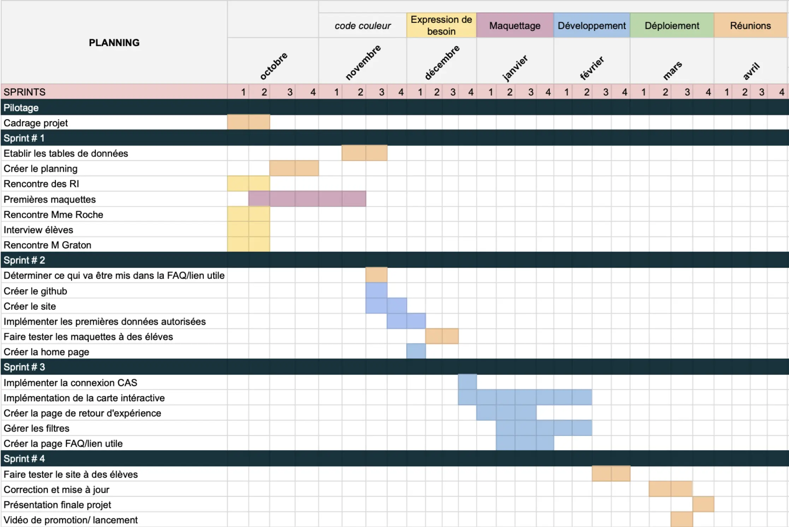

### Maquettes

Cette section regroupe donc <strong>les premiers designs et maquettes réalisés</strong> afin d'obtenir une expérience utilisateur optimale et pouvoir passer au développement en ayant une visualisation claire du projet. Ces différents modèles ont été conçu au travers des cours <strong>d'UX et d'UI via Canva et Figma.</strong>

**Première maquette - Canva**

L'intérêt de cette maquette est de mettre à plat les idées et les contraintes de charte graphique et de choisir la disposition d'ensemble du site.

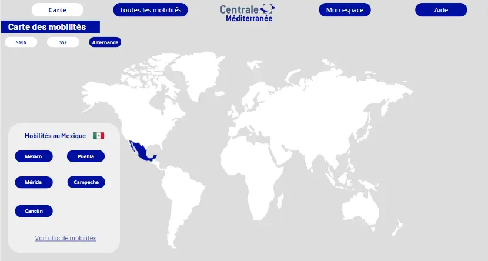
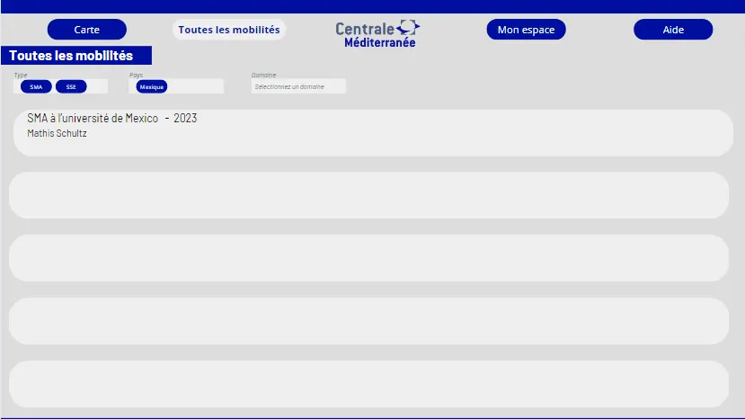

**Minimum Viable Project - Figma**

Au travers des différents outils que propose Figma nous avons voulu construire <strong>la structure et les fonctionnalités du site web.</strong> De plus, cette maquette nous a permis de réaliser les différents tests pour vérifier que notre interface est intuitive.

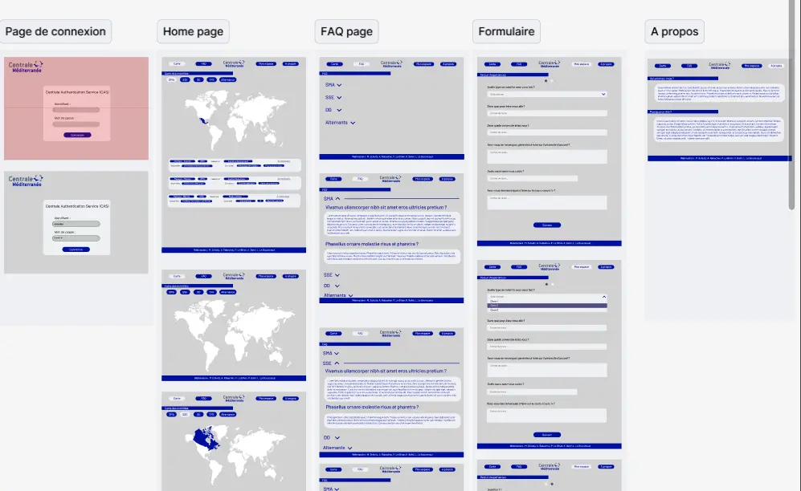

Voici par exemple le parcours utilisateur d'un élève :

<video width="1280" height="720" controls>
  <source src="presentation_figma.mp4" type="video/mp4">
</video>

**Deuxième maquette - Figma**

Suite à cette première maquette, nous l'avions révisé pendant le cours d'UI. Cela nous a donc mené à ce design général sur lequel on s'appuiera lors du développement : 

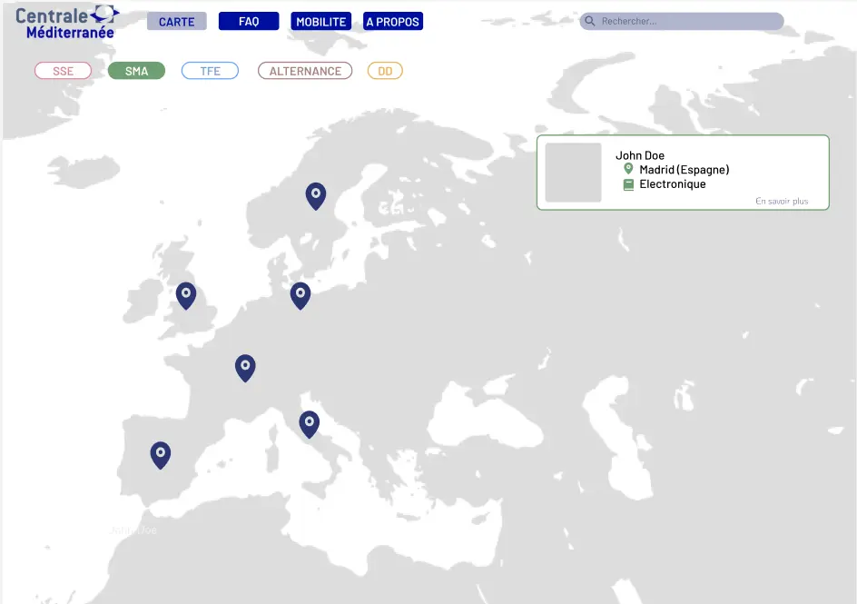
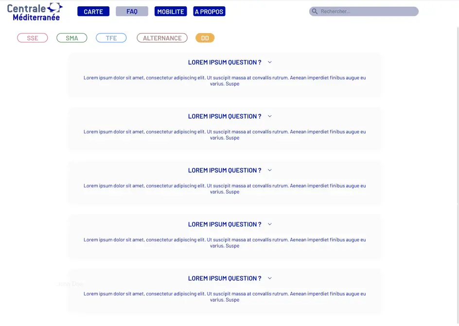

## Développement

Une fois que nous avons assez d'éléments pour guider notre projet nous avons <strong>commencé le développement du site en local.</strong> 
Pour ce faire nous avons créer un <strong>GitHub</strong> dédié afin de pouvoir tous travailler sur le même projet.

<strong>Comment ça marche ? </strong>

Supposons qu'un utilisateur possède un compte et décide de se connecter au site. Il va d'abord s'identifier sur la page d'authentification à l'aide de son nom d'utilisateur et son mot de passe. Une fois connecté il arrive sur la page <strong>Carte des mobilités</strong> dans laquelle il peut naviguer sur la carte, filtrer et se renseigner sur chaque mobilité. Il peut ensuite se rendre sur l'onglet <strong>FAQ</strong> pour obtenir des réponses aux questions qu'il peut se poser lors de sa recherche de mobilité. 
Si l'étudiant veut partager son expérience de mobilité il se rend sur l'onglet <strong>Mon espace</strong>. Il peut alors remplir le formulaire dédié à l'aide de ses informations. Une fois soumis sa mobilité apparaîtra à condition qu'il ait bien accepté le partage de celle-ci. 
Si il se rend de nouveau sur <strong>Mon espace</strong> il aura accès à ses informations et pourra les modifier. Il peut aussi décider à tout moment de ne plus partager sa mobilité.

### Points techniques

Le site a été codé en JavaScript à l'aide de Node.JS, Express, Sequelize et de nombreuses autres bibliothèques. Nous avons utilisé aussi BootStrap pour faciliter le CSS.

Pour réaliser notre site le point assez important résidait dans la carte interactive, sans celle-ci le site perd un gros atout. Pour ce faire nous avons utilisé <strong>Leaflet</strong>, une bibliothèque JavaScript spécialisées dans les cartes interactives.

Dans notre BDD SQLite on retrouve 3 tables : 
- Users
- Mobilites
- Locations

Chaque mobilité est rattaché à un <strong>user</strong> et un user ne peut avoir <strong>qu'une mobilité</strong>. 
La table <strong>Locations</strong> permet d'avoir notre propre BDD des localisations des villes que l'on souhaite afficher sur la map.
Lorsqu'un utilisateur ajoute sa mobilité, si la ville n'existe pas dans la table alors on l'ajoute en récupérant sa localisation à l'aide d'une <strong> API d'OpenStreetMap.</strong>
On va ensuite chercher la localisation des villes via cette table là pour afficher les mobilités.
De cette façon on utilise <strong>que les données nécessaires et rien de superflus</strong>, d'autant plus que les gros fichiers CSV que nous avions utilisé au départ n'étaient jamais traduits en Français mais étaient dans la langue du pays (en gros si on voulait afficher Pékin il fallait avoir le nom de la ville en Chinois...).

On a au total 5 fichier HTML : 
- Page d'authentification
- Carte interactive
- FAQ
- Mon espace
- A propos

A chaque fichier se rattache un fichier JavaScript et nous avons un fichier CSS global pour toutes nos pages.

### Résultats

Nous avons un site qui fonctionne en <strong>local</strong> avec un système d'authentification simple, une carte interactive où l'on peut filtrer les mobilités par <strong>type</strong>,<strong>pays</strong>,et <strong>domaine</strong>, une <strong>FAQ</strong> contenant les réponses aux questions récurrentes et les liens vers les informations officielles de l'administration et un <strong>formulaire</strong> de fin de mobilité à remplir par les étudiants.

Voici les différentes pages : 

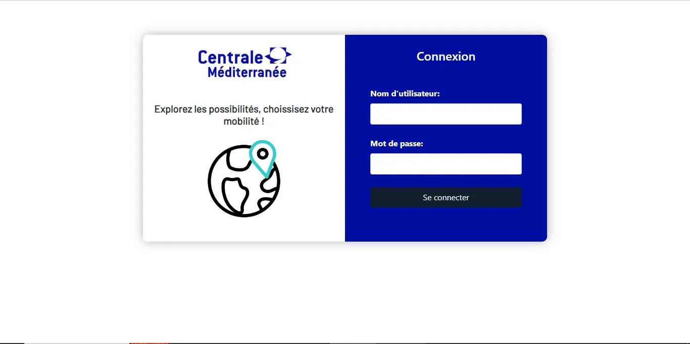
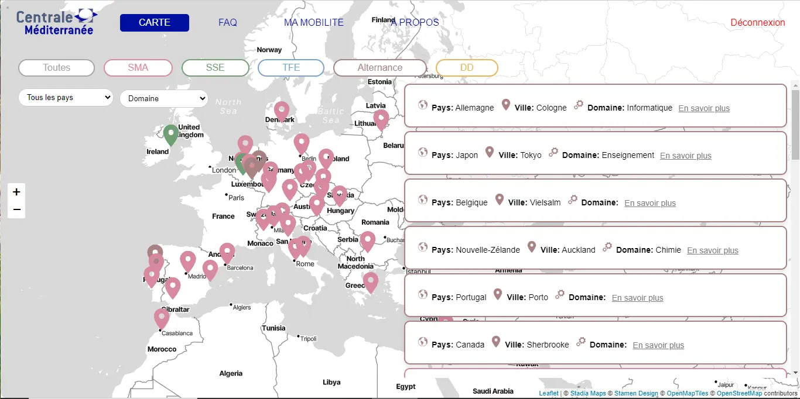

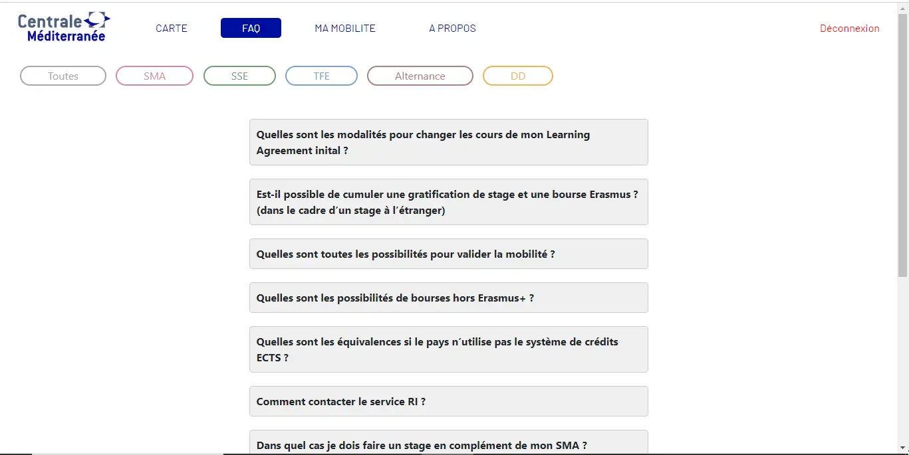
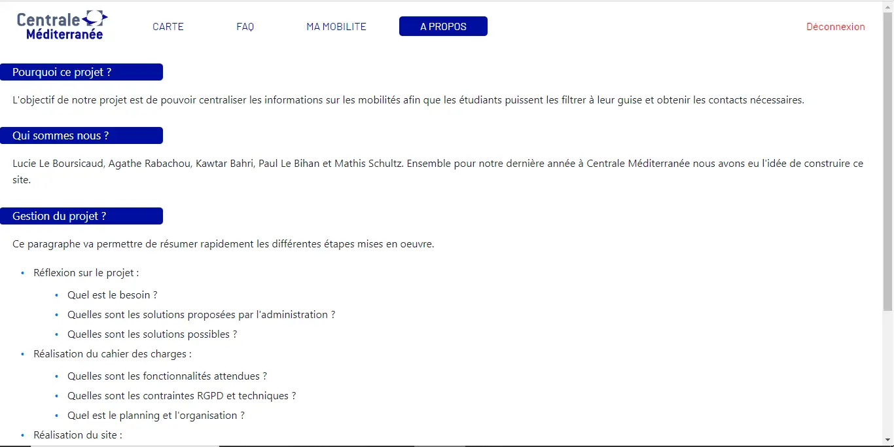

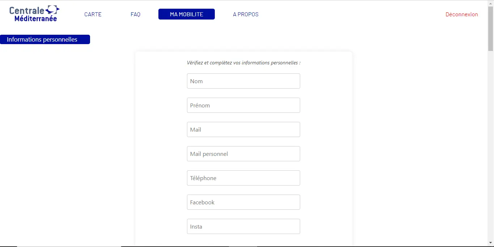
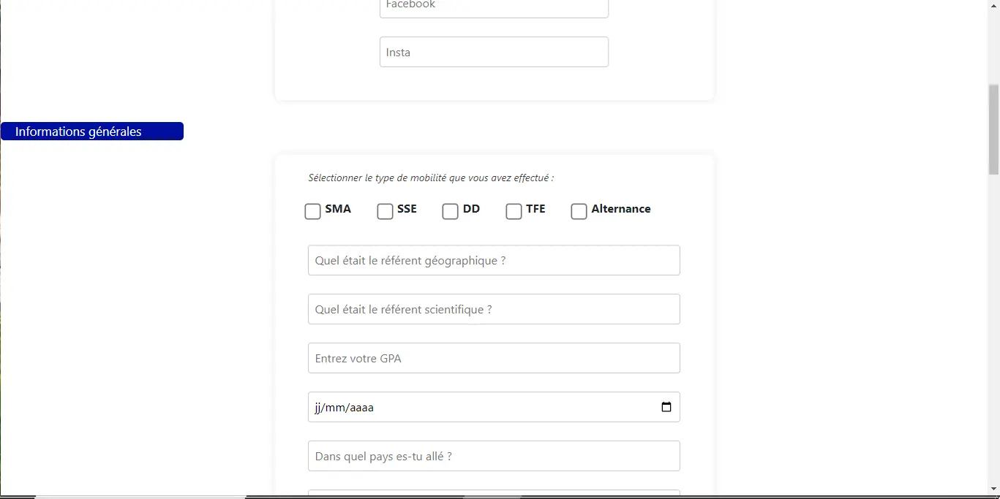
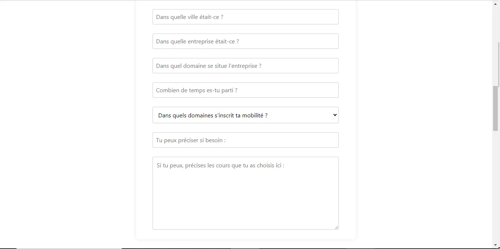

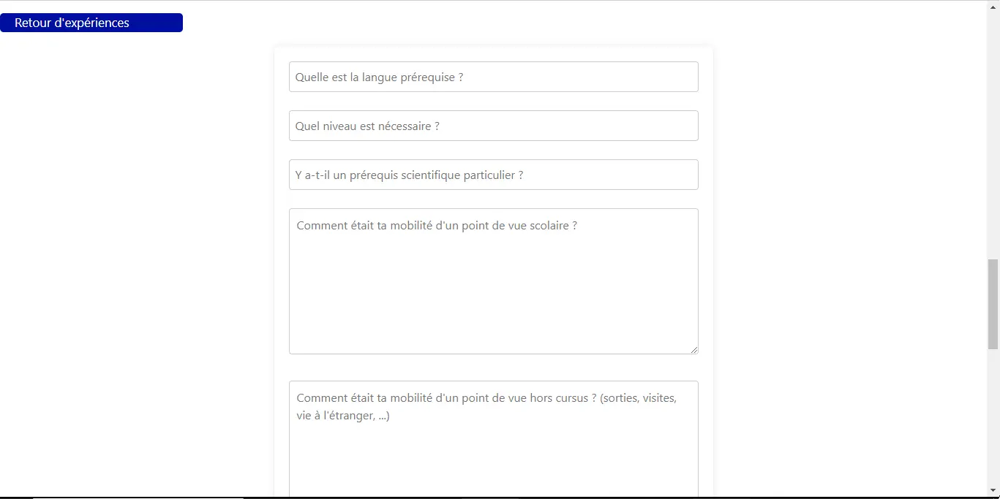
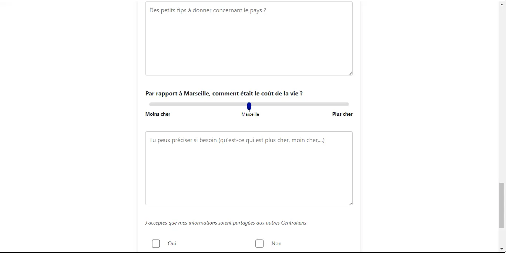
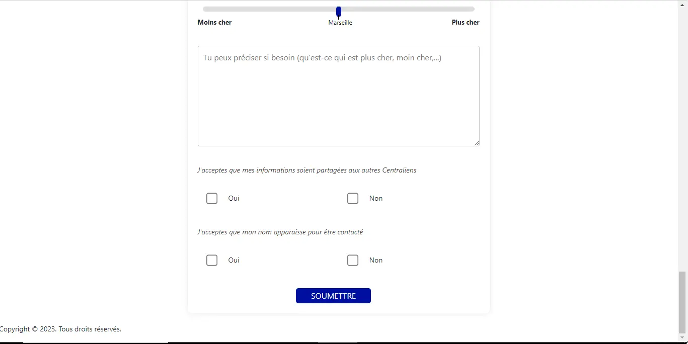

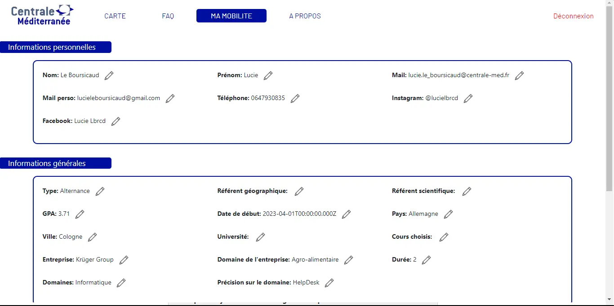

### Ecarts 

1. <strong>Design </strong>
   Le design n'est pas exactement comme la maquette Figma que nous avons élaboré bien que notre site s'en approche très fortement. Nous avons privilégié un apport de fonctionnalités à la place de rendre une copie conforme de nos maquettes.

2. <strong>Hébergement </strong>
   Le site n'a pas pu être hébergé comme nous l'aurions voulu. L'administration nous a fait comprendre qu'ils ne souhaitaient pas s'impliquer dans notre projet par manque de moyens mais aussi vu la complexité de la mise en place de la politique de RGPD.

3. <strong>Connexion CAS</strong>
   Comme notre site n'allait pas être hébergé, l'utilité de la connexion CAS n'était plus présente. Nous avons donc préféré faire l'impasse dessus et la remplacer par un système d'authentification simple indépendant. 

4. <strong>Promotion du site</strong>
   Nous aurions voulu promouvoir notre site aux élèves de l'Ecole notamment avec une vidéo qui aurait mis en avant les fonctionnalités du site, néanmoins en l'absence d'un site disponible pour tous nous n'avons pas effectué cette démarche.

## Postérité du projet

Ce projet a été salué par de <strong>nombreux élèves qui sont intéressés par son aboutissement.</strong> Cette section a donc pour objectif de donner les clés pour reprendre le projet et le faire avancer.

Voici tout d'abord les défis à relever pour aller plus loin :

- Réaliser la connexion CAS.
- Héberger le site indépendamment de Centrale

Ces différentes étapes n'ont pas été mises en œuvre <strong>dû à des restrictions administratives</strong> pour publier le site publiquement sur les serveurs de centrale pour des raisons de <strong>sécurité des données</strong> et de maintient du code dans le temps. Cependant, il est possible de publier le site pour des durées d'un an reconductible à condition d'effectuer les mises à jours de sécurité annuelles.
Pour réaliser la connexion CAS, la première étape est de <strong>se renseigner auprès de Monsieur Brucker ou du Ginfo</strong> afin d'avoir un script pour implémenter la connexion CAS. 

### Héritage du code

Voici une présentation des outils mis en œuvre afin de réaliser le site. Plus de détails sont accessibles directement dans le code.
Voici le Github pour accéder au code :
[Github du code](https://github.com/arabachou/Projet-3A---V2)
De plus, pour réaliser ce projet nous avons choisit les outils suivants :

- JavaScript
- HTML
- CSS Bootstrap
- SQLite
- Sequelize
- [Figma](https://www.figma.com/file/ThyCFPc8uPskYkBhsdn5pb/Projet-3A?type=design&node-id=0%3A1&mode=design&t=uWpVRZaWnSmndIUo-1)
- [Maquette Canva](https://www.canva.com/design/DAFvptH5m2c/gqgP8YRc3GiXS5b69VPgcg/edit?utm_content=DAFvptH5m2c&utm_campaign=designshare&utm_medium=link2&utm_source=sharebutton)
- [Formulaire de retours de mobilités](https://docs.google.com/forms/d/e/1FAIpQLSeIoCivfvWPjLD-TudeHL9b3HjVbGLAArKJkqyT0_V0_DV8-A/viewform?usp=sf_link)
- [Télécharger la présentation](presentation.pdf)
  