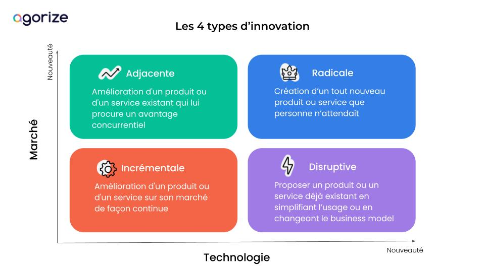
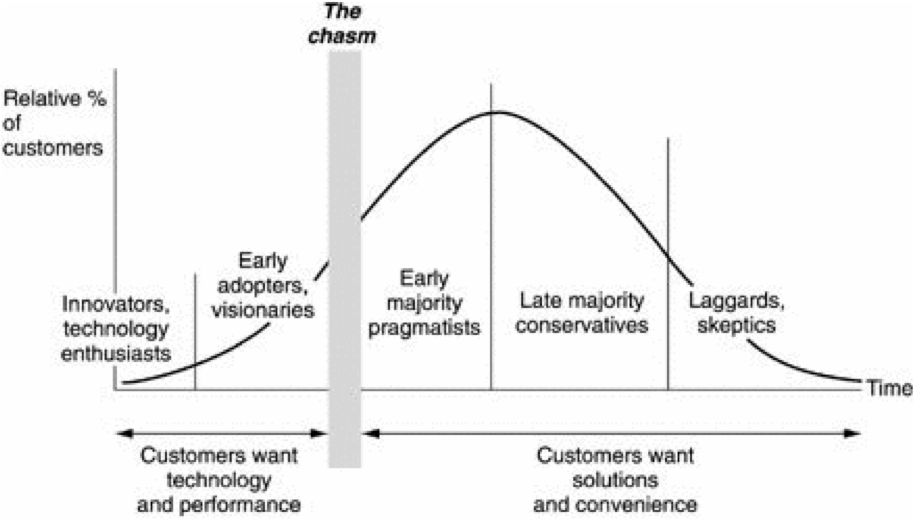


**Niveau** : débutant
**Prérequis** : aucun


## Sommaire
1. Cadrage de la notion
2. Caractéristiques de l’innovation
3. Les modèles du management de l’innovation
4. Les bonnes pratiques en entreprise pour favoriser l’innovation
5. Quelques outils du management de l’innovation

## Cadrage de la notion
### Définitions
#### L’innovation
L’innovation intervient entre les phases de R&D et d’application industrielle. C’est un processus conduisant à la **mise en application d’une idée nouvelle** inexistante sur le marché. L’innovation peut concerner un produit, un service, un procédé, un savoir-faire, une méthode, un dispositif organisationnel ou la combinaison de plusieurs de ces éléments. Cette nouveauté permet d’obtenir un avantage compétitif en répondant ou en devançant des attentes implicites ou explicites. Ce processus permet ainsi à l'organisation d'améliorer sa position stratégique et/ou de renforcer ses compétences clés, ses savoirs et savoir-faire. 

#### Le management de l’innovation
Les actions et les décisions de management de l’innovation se déploient à deux niveaux de responsabilité de l’organisation : le management **stratégique** de l’innovation et le management **opérationnel** des projets innovants. Il se conçoit donc comme une politique de gestion dynamique impliquant un questionnement concernant le développement de l’innovation, son financement, sa commercialisation et le business model à adopter.

### Enjeux
Le management de l’innovation s’inscrit non seulement dans la recherche pérenne de compétitivité mais aussi dans un objectif de **survie**. En effet, des organisations qui disposaient pourtant de ressources considérables (aussi bien humaines que financières) pour dominer leur industrie se sont vues mises en échec à cause d’un manque d’innovation. Face à un marché en constante évolution, la recherche permanente d’innovation est donc bien souvent une question de survie, d’autant plus pour des entreprises technologiques. Ainsi, le management de l’innovation, comme celui des hommes, est un élément clé de la gestion d’une entreprise. Il est aussi l’assurance d’un **meilleur positionnement concurrentiel** et d’une image dynamique auprès des clients, mais aussi des collaborateurs, ce qui produit un cercle vertueux en termes de marque employeur et d‘expérience client.

Lorsqu’une entreprise élabore sa stratégie d’innovation, celle-ci identifie l’organisation cible à mettre en place afin de répondre aux objectifs stratégiques fixés. Le management de l’innovation comprend donc les axes suivants : 
- Bien sûr, les organisations ne peuvent pas confier leur survie au hasard, ou à l’émergence d’une nouvelle idée au détour d’une réunion. Le management de l’innovation permet de mettre en place une **culture et une structure** collaborative qui encouragent les collaborateurs à formuler et proposer de nouveaux concepts. Et surtout, à soutenir ces derniers pour qu’ils passent du statut de bonne idée à celui de bon produit.
- **partager et communiquer** efficacement sur les nouvelles idées  
- éviter de **perdre un temps et des fonds précieux** dans la commercialisation de solutions obsolètes. Des erreurs stratégiques qui, à leur tour, peuvent freiner leur capacité à innover et garder une longueur d’avance sur la concurrence.

## Caractéristiques de l’innovation
### Les différents types d’innovation selon Schumpeter 
L’économiste Joseph A. Schumpeter en propose 5, jugeant qu’il s’agit de réussir à innover dans :
- La fabrication de produits et biens
- Les modes de production (procédés)
- Le renouvellement des matières premières (sources d’approvisionnement)
- L’ouverture à de nouveaux marchés (débouchés)
- Les nouveaux types d’organisation

#### La fabrication de produits et biens
Ce sont les innovations les plus emblématiques. Elles correspondent à l'introduction de **nouveaux produits**.


Le réfrigérateur, le micro-onde ou encore le téléphone sont des innovations de produits et de biens


#### Les modes de production (procédés)
Ces innovations sont en général moins connues que les innovations produits, mais elles n'en sont pas moins importantes. Elles concernent l'introduction de nouvelles **méthodes de production** ou de **nouvelles formes d'organisation**.


Une innovation emblématique est le système Fordiste. Afin d'augmenter la productivité et la production de l'entreprise, Ford met en place de nouveaux principes :
- la division du travail horizontale (les tâches sont découpées) ;
- la division du travail verticale (la conception et la réalisation du véhicule sont séparées) ;
- la mise en place de ligne de montage ;
- la standardisation ;
- l'apparition de salaires plus élevés (5$ par jour).


#### Le renouvellement des matières premières (sources d’approvisionnement)
Ces nouvelles sources sont représentées typiquement par le pétrole, les énergies maritimes ou encore, plus récemment, avec le gaz de schiste. L'introduction d'une **nouvelle source d'approvisionnement** va créer une nouvelle industrie.


Le pétrole a créé une nouvelle industrie à partir de 1855. Il servait à cette époque de pétrole lampant et était peu utilisé. Avec le développement des techniques et des marchés qui s'ouvrent à lui notamment dans le transport et la chimie à la fin du 19ème siècle, cette ressource rencontrera par la suite l'essor que nous lui connaissons aujourd'hui.


#### L’ouverture à de nouveaux marchés (débouchés)
L’innovation se retrouve également dans l’invention de nouvelles manières de vendre ou de promouvoir un produit.


On peut citer par exemple : 
- la vente ou l'échange payant (location d'objets, maisons, véhicules particuliers)
- l'échange ou la mise à disposition gratuite (Donnons.org)
- la participation à des projets collectifs de type levée de fonds sur projet


#### Les nouveaux types d’organisation
Ce type d’innovation peut avoir pour origine une modification réglementaire mais aussi des modes d’organisation originaux de sociétés. 


L’invention de la société anonyme ou du trust


### Une autre classification des innovations
D’autres types de classification peuvent être proposés. On peut notamment proposer celui-ci : 
- L’innovation technologique
- L’innovation de service
- L’innovation de commercialisation
- L’innovation d’organisation
- L’innovation sociale

#### L’innovation technologique
Les innovations technologiques regroupent les innovations dans le **monde des technologies** :
- D’une part, les innovations de produit : introduction sur le marché d’un produit nouveau ou significativement amélioré au regard de ses caractéristiques essentielles ;
- D’autre part, les innovations de procédé : mise en œuvre d’un procédé de production, d’une méthode de distribution, d’une activité de soutien ou de support nouveau ou significativement amélioré.
Ces innovations sont souvent brevetables.


Voici quelques exemples d’innovations technologiques :
- La médecine génétique faisant appel à des technologies de séquençage rapide et de l’édition génétique 
- La monnaie virtuelle supportée par la blockchain 
- L’intelligence artificielle rendue possible par l’accroissement des performances des microprocesseurs et l’IoT
- Le “burger sans boeuf” avec la culture artificielle de plantes spécifiques
- La séquestration du carbone par différentes technologies 
- La pile à combustible 
- La montre connectée qui parle en braille 
- Les matériaux bio-sourcés et les procédés associés 


### L’innovation de service
L’innovation de service est un type d’innovation similaire à l’innovation technologique, sauf qu’elle n’est **pas brevetable**. Comme son homologue, elle introduit sur le marché des transformations d’usage, des gains financiers ou des bouleversements de marché. Bien souvent, l’innovation de service est associée à une innovation de business model. En effet, la digitalisation réduit les coûts d’exploitation ou de production et permet de proposer des innovations en termes de coût.
On observe aussi que l’innovation de service est utilisée par les entreprises pour vendre d’autres produits et renforcer le lien entre la marque et le consommateur.


Par exemple :
- L’application Makeup Genius de L’Oréal : elle permet aux utilisateurs de tester virtuellement sur leurs smartphones n’importe quel produit de maquillage
- Kao à Singapour : il a utilisé les abribus numériques de la ville pour indiquer le niveau d’UV en temps réel, et ainsi inciter les passants à utiliser leur crème solaire


### L’innovation de commercialisation ou de business model
Parmi les types d’innovation on trouve l’innovation de business model. En effet, la mise en œuvre d’une **nouvelle méthode de commercialisation** implique l’invention de nouveaux business models.


Par exemple :
- EasyJet ou comment offrir un service comparable à ceux des grandes compagnies aériennes à moindre coût ? : cela nécessite une révision de la proposition de valeur (pas de restauration par exemple), une révision de la chaîne de coûts, de la digitalisation, du choix de segment de marché…
- La Ford T « une voiture pour chaque Américain » : ce qui a entraîné le Taylorisme et le lean manufacturing plus tard.


### L’innovation d’organisation
Des types d’innovation existants, l’innovation d’organisation est une des plus radicales en termes de transformation. En effet, la mise en oeuvre de **nouvelles méthodes organisationnelles** dans les pratiques, l’organisation du lieu de travail ou les relations extérieures de la société sont très impactantes.


Par exemple :
- Le télétravail que l’on a tous vécu pendant la crise du COVID-19 : chacun peut mesurer les transformations que cela a apporté ;
- Les EdTech : qui permettent d’apprendre autrement. Déjà, elles bouleversent la formation professionnelle, et bientôt la formation initiale.


### L’innovation sociale
Une définition de l’innovation sociale a été proposée par le Conseil Supérieur de l’Économie Sociale et Solidaire. ”"L’innovation sociale consiste à élaborer des **réponses nouvelles à des besoins sociaux nouveaux ou mal satisfaits** dans les conditions actuelles du marché et des politiques sociales, en impliquant la participation et la coopération des acteurs concernés, notamment des utilisateurs et usagers. Ces innovations concernent aussi bien le produit ou service, que le mode d’organisation, de distribution, dans des domaines comme le vieillissement, la petite enfance, le logement, la santé, la lutte contre la pauvreté, l’exclusion, les discriminations".


Par exemple, on peut citer des projets d’innovation sociale qui auraient pour objectif de s’attaquer aux sujets suivants :
- Finance : le surendettement est responsable de 3 suicides par jour
- Mobilité : plus de 7 millions de français ont des difficultés de déplacement
- Alimentation : 20 kg de produits alimentaires encore consommables sont jetés en moyenne par français et par an
- Environnement : 22 millions de français changent de téléphone portable chaque année et moins de 15% d’entre eux finissent en filière de recyclage 
- Habitat : 4 millions de mal-logés ou sans abri et 15 millions de personnes touchées par la crise du logement en France 
- Chômage des jeunes : 19% des jeunes de moins de 25 ans sont au chômage en France (contre 8.5% de l’ensemble de la population active) 
- Énergie : près de 20% des ménages français sont en situation de précarité énergétique


### L’intensité de l’innovation
L’intensité de l’innovation mesure son caractère impactant. On distingue 4 types d’innovations : l’innovation incrémentale, l’innovation adjacente, l’innovation disruptive et l’innovation radicale. 
   Image tirée de https://get.agorize.com/fr/resources/quels-sont-les-differents-types-dinnovation/

#### L’innovation incrémentale
Les innovations incrémentales se caractérisent par l’**apport de modifications visant à améliorer constamment** l’offre existante. C’est la forme d’innovation la plus répandue car la prise de risque semble faible, et les gains intéressants :
- Satisfaire les consommateurs en leur proposant des produits toujours plus perfectionnés
- Augmenter les prix au fur et à mesure de l’innovation produit
- Continuer à se démarquer de la concurrence en adaptant telle technologie
- La faire durer plus longtemps et optimiser la production
- Minimiser les coûts et les investissements


Par exemple, les évolutions de l’iPhone sont maintenant des innovations incrémentales par l’ajout de nouvelles fonctionnalités.


#### L’innovation radicale
Les innovations de rupture se caractérisent par un **changement de paradigme entraînant un bouleversement des habitudes**. En fait, ces innovations finissent par remplacer complètement les technologies ou services dominants en place. Bien souvent à leur introduction sur le marché, ces innovations sont moins performantes jusqu’à évoluer pour définitivement s’imposer. Elles sont donc par définition assez rares. Elles sont aussi dangereuses à mettre en place. D’une part, le processus est généralement long et coûteux. D’autre part, il y a une importante incertitude quant à l’adoption de la nouveauté par la société ou la clientèle.
Les innovateurs radicaux ne répondent pas forcément à une demande ou à un besoin exprimé par le marché, au contraire. De tels produits ont deux spécificités essentielles :
- ils résultent de l’utilisation d’une technologie nouvelle
- leur lancement produit de nouveaux usages


Voici quelques exemples :
- Le moteur à combustion en remplacement du cheval : rupture dans les usages et les possibilités de mobilité ;
- La photographie numérique en remplacement de l’argentique : tout le monde connait la quasi disparition de Kodak… ;
- Le MP3 en remplacement des lecteurs portables ;
- Les disques SSD en remplacement les disques durs ;
- Le téléphone portable en remplacement le fixe : c’est une rupture complète qui permet la mobilité en même temps que l’on communique ;
- Nespresso avec la vente de capsules de café : c’est une rupture dans les usages et dans le business model ;
- Airbnb en disruption des fondamentaux de l’hôtellerie ;
- Les drives : rupture dans les usages et le business model ;
- La Logan de Dacia : voiture neuve au prix de l’occasion ;
- Le compte Nickel : un compte bancaire ouvert à tous sans conditions de ressources : c’est une disruption du modèle bancaire ;
- La Ford T : voiture pour chaque Américain qui a totalement modifié les process de fabrication (Taylorisme puis lean manufacturing


#### L’innovation adjacente
L’innovation adjacente se place sur un produit ou service existant auquel est **intégré une technologie existante**. Cela procure un avantage concurrentiel au produit ou service initial qui lui permet de se différencier sur le marché. Cette solution remporte du succès car elle répond davantage aux besoins des clients. Cette stratégie est intéressante pour :
- Segmenter le marché afin de s’adresser à davantage de consommateurs
- Diversifier les revenus sans pour autant investir énormément en termes de développement
- Créer un nouveau marché que personne n’avait prévu
- La zone d’incertitude n’est pas négligeable, mais bien moins importante qu’avec l’innovation disruptive.


Un exemple d’innovation adjacente pourrait être Uber. L’entreprise d’applications mobiles estime que les taxis ne répondent pas aux besoins des populations urbaines. Uber s’empare donc d’un marché déjà existant – les transports en ville – tout en l’adaptant à leur marché. Récemment, l’entreprise a récidivé avec Uber Work, s’attaquant ainsi au marché de l’intérim, toujours à travers la conception d’applications mobiles.
Pour illustrer le concept d’innovation adjacente, on peut prendre l’exemple de grands groupes qui rachètent des startups innovantes. Leur objectif est d’intégrer leurs produits et services innovants à l’offre initiale.


#### L’innovation disruptive
La disruption permet d’innover en **améliorant l’utilisabilité, le confort ou encore en réduisant le prix**. C’est une démocratisation du produit. Elle peut être consécutive à une nouvelle technologie, mais pas nécessairement. Dans tous les cas, la concurrence et le marché sont déstabilisés. Cette forme d’innovation est redoutable et témoigne d’une excellente compréhension des attentes des utilisateurs ainsi que du contexte.

L’innovation de rupture est à ce titre redoutable pour les concurrents. A titre d’exemple, Free qui, il y a une dizaine d’années, proposait son offre de forfait illimité à 20€. Cette stratégie a obligé Bouygues, SFR et Orange à s’adapter.
On peut aussi prendre l’exemple de Netflix qui est venu bouleverser le marché des traditionnels DVD et autres disques Blu-ray. L’entreprise a lancé une offre de streaming en ligne, inspirant derrière de nombreux autres acteurs.


### Deux modèles d’innovation
Henry Chesbrough distingue deux modèles d’innovation : l’innovation fermée ou closed innovation et l’innovation ouverte ou open innovation.

#### L’innovation fermée
Une entreprise qui choisit de garder ses efforts d’innovation fermés voit ses projets développés uniquement dans des **limites clairement définies**. Le savoir-faire, la technologie, les processus et la propriété intellectuelle restent sous leur propre contrôle, sans collaboration avec d’autres agents du marché ou universités, par exemple.
L’innovation fermée est basée sur la vision que les innovations sont développées en interne avec un fort investissement en **R&D**. De la génération de l’idée au développement et à la commercialisation, le processus se déroule exclusivement au sein de l’entreprise.
Ce concept se réfère au modèle traditionnel d’intégration verticale, dans lequel les activités internes conduisent à des produits et services générés “à domicile” pour être  ensuite distribués.

L'application de l'innovation en circuit fermé s'accompagne de trois défis majeurs :
- Absence d'autres perspectives. En l'absence d'autres perspectives, les employés d'un service, aussi talentueux soient-ils, risquent d'être incapables de générer constamment de nouvelles idées.
- Manque de ressources. Dans ce modèle d'innovation, les technologies sont développées avec des ressources limitées au sein de l'entreprise, ce qui peut limiter la portée et le rythme du processus d'innovation.
- Risque accru d'échec. L'entreprise ne bénéficie pas de l'expertise externe, qui permet souvent d'affiner les idées et les produits avant qu'ils ne soient lancés sur le marché. Dans le cas de l'innovation fermée, tout le travail de développement est effectué en interne, ce qui limite l'exposition de l'entreprise à des perspectives et à des réactions extérieures.

#### L’innovation ouverte
L'innovation ouverte présuppose que les entreprises peuvent et doivent utiliser à la fois des idées et des voies externes et internes pour faire progresser leur processus d’innovation. Il s’agit  d’**utiliser intentionnellement des entrées et des sorties de connaissances** pour accélérer l’innovation interne et élargir les marchés externes. Il s’agit donc d’une innovation collaborative, qui tient compte de l’expertise des partenaires extérieurs à l’organisation.
Cette dernière se divise elle-même en innovation :
- Outside in : de l’extérieur vers l’intérieur (achat de brevets, hackathons, etc.)
- Inside out : de l’intérieur vers l’extérieur (offrir ses projets en échange d’une technologie par exemple)
- Coupled : avec apports internes et externes, stratégie mise en évidence ci-dessous

L'application de l'innovation en circuit ouvert s'accompagne de trois défis majeurs :
- défis stratégiques : en l'absence d'un objectif ou d'une finalité claire, les entreprises doivent comprendre clairement ce qu'elles veulent atteindre par leurs efforts d'innovation.
- défis opérationnels : il réside dans la gestion efficace des connaissances externes et des talents, la mise en place d'un processus rationalisé, y compris la gestion des idées, l'attribution des rôles et le suivi des progrès, est essentielle pour réussir l'innovation ouverte et obtenir un avantage concurrentiel.
- défis culturels : il est essentiel que l’organisation mette en place une culture d'innovation qui favorise la créativité et accepte le changement.

#### La combinaison des deux modèles
La place de l’innovation fermée est au sein même de l’entreprise. C’est une stratégie qui impose des exigences très élevées aux employés. Vous devez donc embaucher des employés hautement qualifiés et protéger la propriété intellectuelle en conséquence. L’innovation ouverte, par contre, est davantage une question de collaboration, souvent de l’extérieur de l’entreprise.
Il appartient à chaque organisation, dans le cadre de ses prérogatives, de décider lequel des modèles lui convient le mieux. Une combinaison des deux modèles est recommandée. Les activités d’innovation des acteurs externes, tels que les clients, les fournisseurs, les universités ou les partenaires commerciaux, doivent être considérées comme un complément aux efforts propres de l’organisation. La condition préalable de base est la structuration de processus d’innovation stables afin de faciliter la collaboration et d’absorber les résultats obtenus.

## Les modèles du management de l’innovation
### Le dilemme de l’innovateur
La difficulté des entreprises existantes à **tirer parti des ruptures de leur environnement** reste une caractéristique marquante de l’innovation. Les entreprises installées réussissent à maintenir leur leadership lorsqu’il s’agit d’améliorer leurs produits de manière continue, mais tendent à le perdre lorsqu’il s’agit d’un marché entièrement nouveau. Le chercheur Clayton Christensen, spécialiste de l’innovation, a qualifié ce phénomène de « dilemme de l’innovateur ».
Il constate, entre autres, un phénomène récurrent. À force d’améliorations incrémentales, les fonctionnalités du produit ne répondent plus aux besoins des utilisateurs, s’avèrent trop chers, etc. Les clients se tournent alors vers les innovations adjacentes ou disruptives. Ou alors, par peur de perdre leur rentabilité et de sortir du confort incrémental, les compagnies ne voient pas surgir l’innovation radicale. Le dilemme de l’innovateur décrit donc une situation où une entreprise établie échoue face à l’innovation de rupture, qu’elle s’y engage ou pas.
Clayton Christensen a montré en quoi cet échec n’était dû ni à un manque de ressources, ni à la vitesse du changement, ni à une incapacité du management des entreprises. Au contraire, cette incapacité est due au modèle d’affaires et, au-delà, à l’identité de l’entreprise elle-même, dont elle est en quelque sorte prisonnière. Comprendre son propre modèle d’affaires et les contraintes qu’il pose à l’organisation est donc un préalable indispensable pour réussir face une rupture.


Un exemple d'application : https://www.cairn.info/revue-entreprendre-et-innover-2016-1-page-38.htm


### Les 3 horizons de croissance
Le modèle des trois horizons de Mc Kinsey était à l’origine un moyen simple d’expliquer à la direction générale la **nécessité d’une organisation ambidextre, capable d’exploiter son business actuel tout en explorant de nouvelles voies**. Au départ, ce modèle présentait les projets d’innovation d’une entreprise selon 3 horizons temporels (court, moyen et long-terme). Aujourd’hui, l’on se rend compte qu’en réalité, chaque horizon nécessite une approche et une gestion différentes, des outils et des objectifs différents. L’idée de base du modèle est assez simple. Pour qu’une entreprise maximise son potentiel de croissance et limite ses risques, elle doit travailler simultanément sur des projets sur trois horizons : 
- L’horizon 1 correspond à la majorité des efforts d’innovation et concerne l’**amélioration de l’offre à court terme**. Il s’agit d’évolutions incrémentales et cela implique un style de leadership guidé par le principe d’amélioration continue. Dans ce cas, il est classique de travailler étape par étape avec des objectifs bien définis et de construire une prévision financière pour calculer la rentabilité.
- L’horizon 2 ne vise pas à répondre au marché tel qu’il se présente aujourd’hui, mais plutôt de **comprendre les besoins latents** et d’utiliser la technologie de façon nouvelle. Cela implique de posséder des capacités d’innovation en conception, en développement, en prototypage, en création et sélection des idées et de maîtriser les cycles de développement court. Le leadership correspond ici davantage à un style entrepreneurial, remettant régulièrement en question le business model, en investissant dans de nouvelles activités prometteuses ou encore prenant soin de créer en interne un terreau fertile à l’innovation. En menant des tests de validation à chaque étape, il est possible d’obtenir, au fur et à mesure, des informations plus précises sur le business model de la nouvelle activité.
- L’horizon 3 vise à **explorer de nouveaux territoires, à identifier des domaines en rupture**. Les besoins sont étudiés à un niveau plus profond. Le partage de connaissances externes, l’innovation ouverte et la cocréation jouent ici un rôle clé. Les projets de cette catégorie ne peuvent être évalués financièrement par des méthodes traditionnelles car la part d’incertitude est trop grande.
C’est dans cet horizon que l’on retrouvera les innovations par le business model. Une innovation du modèle économique est la mise en œuvre d’une combinaison nouvelle ou significativement améliorée permettant une source de création de valeur.
Un modèle économique combine de façon unique trois flux essentiels : la proposition de valeur, le flux de revenus et l’architecture définie pour mettre en œuvre la proposition de valeur.
Il est aussi de comparer la répartition des efforts (nombre de projets innovants, investissements, équipes mobilisées, …) que l’on constate dans les entreprises les plus avancées :
- Horizon 1 : **70%** des efforts qui portent sur des projets d’innovation incrémentale
- Horizon 2 : **20%** des efforts qui portent sur des projets de croissance et développement
- Horizon 3 : **10%** des efforts qui portent des projets d’exploration cherchant à identifier les activités futures

### La courbe de diffusion de l’innovation
La courbe de diffusion de nouveaux produits a été théorisée par Everett Roger. L’idée principale est d’associer les différents groupes de clients correspondants aux différentes phases d’adoption d’une nouveauté. Certaines personnes sont plus ouvertes à la nouveauté et à l’innovation que d’autres. Donc il est essentiel pour l’entreprise de comprendre comment son innovation peut passer d’un marché niche à un marché de masse (qui présente toujours plus de 60% de part de marché) et comment elle peut favoriser ou accélérer cette évolution.
 Image tirée de https://www.lescahiersdelinnovation.com/la-courbe-de-diffusion-de-l-innovation/

La courbe d’adoption des produits nouveaux divise donc les consommateurs en 5 catégories, selon leur intérêt et leur rapidité à acheter un produit nouveau. Ces types de clients sont les suivantes :
- Les Innovateurs sont les plus sensibles à l’innovation. Ce sont les premiers clients d’une nouveauté dès leur sortie. Ils réalisent leurs achats sans avoir besoin de consulter les avis d’autres utilisateurs. Ces clients aiment partager leur expérience avec les autres sur une nouveauté quelconque. Les innovateurs représentent seulement 2,5% de la population.
- Les Premiers Adeptes (ou « early adopters ») achètent rapidement un produit innovant. Ce sont des personnes qui aiment les nouveautés, ils les essayent et donnent leurs opinions. Ces clients représentent statistiquement 13,5% de la population.
- La Majorité Précoce regroupe les clients réfléchis. Ils attendent les retours des premières expériences avant d’acheter un nouveau produit. Cette population représente 34%.
- La Majorité Tardive attend que le produit soit employé par une grande population. Ils veulent des preuves de performance. Ils sont très influencés par les avis des autres utilisateurs. Ils représentent 34% de la population.
- Les Retardataires sont les derniers à accepter une innovation. Ce sont les clients les plus rationnels. Ils n’achèteront les produits nouveaux que quand ces derniers ont été testés et devenus courants ou même une « tradition ». Les retardataires sont de 16% de la population.
- Le “chasm” (abîme) est un passage entre les Premiers Adeptes et la Majorité Précoce. Ce passage est essentiel car c’est là où l’innovation sort de son marché niche et entre dans un marché de masse. L’innovation échoue si le marché n’atteint pas le seuil critique des Innovateurs et les Premiers Adeptes.

Les Innovateurs et les Premiers Adeptes sont assez faciles à convaincre car ils sont très sensibles à l’innovation. Par contre, pour convaincre la majorité précoce, il faudra lui proposer des valeurs ajoutées concrètes:
- Valeur d’usage, simplicité
- Qualité de produit: durabilité, fiabilité
- Une évolution par rapport aux générations précédentes
- Un marque de confiance
- Produit testé,
- Avis favorables des premiers utilisateurs
Les catégories et les pourcentages peuvent être très utiles pour bien définir et estimer les groupes cibles. Cela permet à l’entreprise d’adopter une stratégie de marketing pertinente pour un lancement et de développement de produit réussi.

## Les bonnes pratiques en entreprise pour favoriser l’innovation
Un individu isolé peut être créatif ou inventif mais une équipe aux compétences variées peut en revanche parvenir à innover. Une entreprise recherchant l’innovation favorisera donc le travail collectif.

### Créer une culture d’entreprise propice à l’innovation
Pour stimuler la naissance d’une culture de l’innovation, les **initiatives créatives doivent être encouragées**. Chaque collaborateur peut ainsi, quel que soit son poste, proposer de nouvelles idées. Chaque secteur d’activité, chaque fonction de l’entreprise a son rôle à jouer. Pour cela, chacun doit acquérir une connaissance holistique des rouages contribuant à l’innovation de son entreprise ainsi que se doter d’une bonne vision de l’écosystème de l’innovation de celle-ci. Les responsables d’activités doivent veiller à cette connaissance et être exemplaires sur le sujet.
L’idée forte est de développer de nouveaux produits en tenant compte des processus et des services, et d’abolir les frontières entre les différentes fonctions de l’entreprise.

### Valoriser l’innovation dans l’ensemble des interactions entre services et avec l’extérieur
Pour favoriser l’émergence de nouvelles idées et donc l’innovation, l’entreprise peut associer l’ensemble de ses fonctions et de ses partenaires. Elle incite et valorise clairement le changement et la remise en cause des habitudes chaque jour. Les raisonnements sont basés sur l’expérience client et le monde des usagers.
L’organisation de l'entreprise est telle qu’elle permet le **suivi structuré de chaque projet, et la collaboration des différents secteurs de l'entreprise** (Marketing, R&D etc.). Chaque secteur de l’entreprise doit avoir conscience de son savoir-faire technique et savoir l'exploiter, investir régulièrement dans ses outils de travail et former continuellement son personnel.

### Créer une direction de l’innovation
Dans les grandes entreprises qui doivent se transformer en profondeur et réinventer leurs pratiques liées à la conception de nouveaux produits et services, l’innovation doit être **incarnée par une équipe** voire une fonction dédiée, la direction de l’innovation. Celle-ci a pour mission de diffuser de nouvelles modalités de travail.
Les directeurs de l’innovation sont de plus en plus présents dans les comités exécutifs. 
Les directions de l’innovation se structurent parfois comme des services internes de conseil pour aider et accompagner les business units dans leur démarche d’innovation. Les directions de l’innovation deviennent en quelque sorte les chefs d’orchestre de l’innovation plutôt qu’un service qui centralise toutes les compétences pour innover. Elles animent à travers une variété d’initiatives le changement culturel indispensable à la gestion d’un environnement plus complexe.
Les facteurs clés de succès des missions de la direction de l’innovation doivent être en partie différenciés par type d’entreprises.
- pour les entreprises **intensives en technologies**, l’enjeu est de dissocier la fonction innovation de la fonction de recherche et développement (R&D). En effet, la R&D est une fonction centralisée qui concerne une catégorie d’employés : les ingénieurs de R&D et les chercheurs. Cette fonction tend donc à exclure les autres salariés. À l’inverse, la direction de l’innovation se doit d’être inclusive et de mobiliser l’ensemble des collaborateurs dans le processus d’innovation. L’enjeu pour ces entreprises est finalement de distinguer, tout en jouant sur leurs complémentarités, le management de l’innovation du management de la technologie.
- pour les entreprises **non technologiques**, l’enjeu de la fonction innovation est à la fois d’inventer des modalités concrètes de mise en œuvre mais aussi de développer un effort très important pour convaincre que la démarche même d’innover doit faire partie du quotidien des collaborateurs.
La montée en puissance des directions de l’innovation révèle la prise de conscience de la nécessité de changer les modèles d’innovation des entreprises. Cette fonction a cependant besoin de s’affirmer, l’innovation n’est pas rentrée dans l’ADN de l’entreprise.
Beaucoup d’entreprises ont fortement professionnalisé leurs équipes au sein des directions de l’innovation. Leur capacité s’affirme pour inventer de nouveaux modèles collaboratifs avec des partenaires extérieurs, à parler et aligner les intérêts avec des acteurs aux compétences hétérogènes. Le problème est que cette professionnalisation ne s’accompagne pas encore réellement d’une diffusion de ces modèles au sein des entreprises. Ainsi passer à grande échelle constitue aujourd’hui le challenge clé de la plupart des directions de l’innovation.
Cette difficulté s’explique aisément car elle implique un changement fondamental de la politique de ressources humaines des grands groupes : passer d’un modèle stéréotypé et uniformisé de la gestion des carrières des collaborateurs à des démarches plus variées et personnalisées en fonction des dynamiques et contributions à l’innovation à l’œuvre dans l’entreprise.

### Utiliser des outils participatifs
Le recours systématique à des ateliers participatifs permet d’adopter à **chaque étape** une démarche d’innovation. L'expérimentation, entendue comme la réalisation rapide et fréquente de tests de prototypes permet en premier lieu de vérifier l'innovation. Elle relève aussi d'une démarche qui renvoie au rapport au risque, à la sérendipité et au mode projet qui font partie du management de l’innovation.

### L’écoute du marché
L’innovation **répond ou devance un besoin client**. Encore faut-il l’écouter et étudier les tendances du marché. En matière d’innovation, il est essentiel de miser sur une veille technologique active afin de se tenir au courant des tendances de pointe, se confronter aux pratiques d’autres pays et ainsi orienter les projets. 

### Anticiper le financement de l’innovation
Compte tenu de la durée de vie de plus en plus courte des solutions techniques et des produits innovants sur le marché, la **gestion des projets innovants** se réfléchit désormais à court ou moyen terme, de manière agile et évolutive. Il est primordial de savoir gérer l’allocation de ses ressources et de son budget entre plusieurs projets innovants. La plupart des industries ont ainsi augmenté leurs cadences de développements avec souvent plusieurs projets en **parallèle**. La maîtrise des processus garantissant un bon contrôle des coûts d’innovation.

## Quelques outils du management de l’innovation
Les techniques de gestion de l'innovation (IMT), les techniques d'organisation et les outils de travail permettent à une entreprise d'optimiser sa capacité à innover. Citons, entre autres :
- La méthode CK (concept-knowledge ou concept/connaissance) : une méthode de créativité qui formalise le processus de conception d’idées, « d’objets inconnus ».
- La méthode du TRL (Technological Readiness Level ou Niveau de Maturité Technologique) : composée d’une échelle de 9 niveaux qui permet de situer la techno à ses différents stades de R&D : littérature, concept, preuve de concept, validation labo, démonstrateur, prototype…
- Le Design Thinking : une approche centrée sur l’analyse des usages et l’intégration en continue de ces analyses dans la définition de solutions. Sa mise en œ
- Le Lean Startup préconise un processus de conception itératif de l’offre innovante basée sur 3 étapes principales : Apprentissage (Learn), Conception (Build) et Mesure (Measure).
- le Crowdsourcing : utilisation du travail, de la créativité, de l'intelligence et du savoir-faire d'un grand nombre de personnes pour réaliser certaines tâches traditionnellement effectuées par un employé ou un entrepreneur.
- le Brainstorming : récolte d'idées nombreuses et originales. Il vise à séparer la fonction imaginative de la formulation de jugements.

### Sources
* [La direction de l’innovation, une fonction de plus en plus incontournable dans les entreprises](https://theconversation.com/la-direction-de-linnovation-une-fonction-de-plus-en-plus-incontournable-dans-les-entreprises-158433) par The Conversation

* [Qu'est-ce que le management de l'innovation ?](https://www.epsa-innovationenergy.com/blog/management-innovation/) par l'epsa

* [Qu’est-ce que le « management de l’innovation » ?](https://www.youtube.com/watch?v=LloQatG83vM) par FNEGE Médias

* [Management de l'innovation en entreprise](https://online.edhec.edu/fr/blog/management-de-linnovation-en-entreprise/) par l'EDHEC

* [La courbe de diffusion de l’innovation](https://www.google.com/url?q=https://www.lescahiersdelinnovation.com/la-courbe-de-diffusion-de-l-innovation/&sa=D&source=docs&ust=1707932687775457&usg=AOvVaw34hVM9HdGObAbEHWCawv3g) par Les Cahiers de l'innovation

* [Connaître les différents types d’innovation pour mieux définir le caractère innovant de son projet](https://www.winbids.fr/connaitre-les-differents-types-dinnovation-pour-mieux-definir-le-caractere-innovant-de-son-projet/) par Winbids

