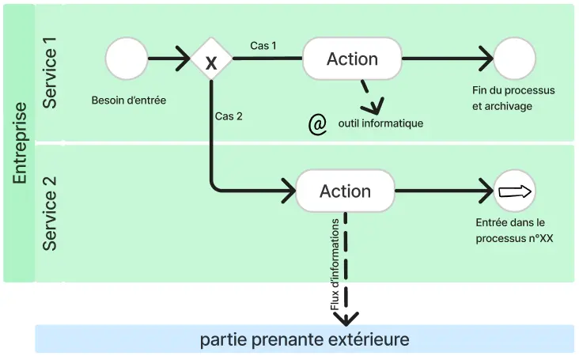
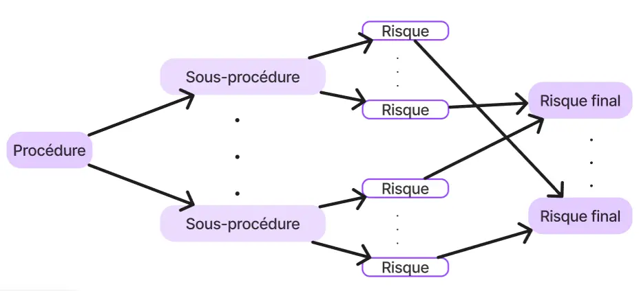

## Objectifs
1. Avoir un **exemple concret** d’un cas d’application de mes MON
2. Mieux comprendre les **mécanismes de décision** qui entrent en jeu dans la gestion de crise
3. Proposer un **retour constructif** à l’association accueillant ma démarche

## Plan d'action
Un **entretien** avec un manager ayant connu une situation de crise m’a paru un bon moyen d’atteindre mes objectifs 1 et 2. J’ai alors pensé à mon tuteur de stage 2A. Grâce à une **feuille de route** préparée pour les entretiens, j’ai pu obtenir les informations que je recherchais. Pour atteindre mon objectif 3, j’ai eu besoin d’avoir des **exemples supplémentaires** pour comparer ce qui se fait dans son association avec ce qui est conseillé (cf MON 1.1 et 1.2) et ce qui est fait dans d’autres entreprises. Pour cela, j’ai donc **étudié des extraits d’un plan** de prévention des risques, d’un plan d’urgence et de continuité d’activité et d’un compte-rendu d’un exercice de simulation de situation de crise. Ainsi, j’ai pu remettre un retour constructif à mon tuteur de stage.

## Rendus
Mon rendu principal est un document remis à mon tuteur de stage récapitulant nos entretiens et incluant aussi mon retour d’expérience ainsi que des propositions d’améliorations. Etant donné la confidentialité des données récoltées, je tairai une partie des renseignements obtenus. Il en est de même concernant l’étude de documents provenant d’une autre entreprise. 
Ce POK se divisera donc en 2 grandes parties  : 
- étude de cas de la gestion d’une situation de crise sur une manifestation
- étude de documents produits par une direction des risques opérationnels et du contrôle permanent

## Etude de cas de la gestion d’une situation de crise sur une manifestation

### Questions pour l'entretien
Dans cette partie on trouvera les questions qui ont guidé ma discussion avec l’un des directeurs présents dans la cellule de crise.

#### Les enjeux de la crise

Qu'est-ce qui est mis en jeu lors de cette crise ? Quelles en ont été les répercussions ? Sur quelle durée ? Toutes ces conséquences avaient-elles été anticipées ? 


On remarque que les conséquences sont plus ou moins directes : certaines sont étroitement liées aux intempéries (ex : infrastructures abîmées) alors que d'autres sont de l'ordre de la répercussion (ex : image)
L'objectif est de mieux comprendre les enjeux des décisions, d'étudier comment les personnes impactées par la crise ont été prises en compte par la cellule de crise, de savoir quelle peut être la justesse de l'évaluation des conséquences, d'identifier ce qui aurait pu être anticipé et dans quelle mesure.


#### Plan de prévention des risques

Existe-t-il un plan de prévention des risques ?
Si NON : comment les risques sont-ils anticipés ?
Si OUI : à quoi ressemble-t-il ? Qui l'a écrit ? Quand ? Qui en a connaissance ?


Le schéma classique d'un plan de prévention des risques comprend une identification des risques, leur hiérarchisation, les scénarios de déclenchement des risques, des recommandations.
L'objectif est de mieux comprendre les risques anticipés et comment ils l'avaient été.


#### Plan de gestion de crise

Existe-t-il un plan de gestion de crise ?
Si NON : Est-ce que cela manque ? Y a-t-il déjà eu des crises lors de la manifestation ?
Si OUI : à quoi ressemble-t-il ? Qui l'a écrit ? Quand ? Qui en a connaissance ?


Le schéma classique d'un plan de gestion de crise comprend la composition de la cellule de crise, des mesures de protection des points cruciaux (personnes, installation, technologie, affaires, réputation) ainsi que des tests et actualisations.
L'objectif est de savoir si la crise que nous allons étudier répondait à un plan organisé.


#### Chronologie des événements

Description chronologique des éléments extérieurs perturbant l'équilibre, leur arrivée en cellule de crise, les décisions prises en conséquences puis leur communication interne et externe


Le plan classique de la gestion d'une crise est : la détection, son évaluation et le choix des solutions, le suivi de l'application, la démobilisation et le bilan
L'objectif est de comprendre les mécanismes de décision mis en oeuvre.


#### Management de crise

En quoi le management de crise, tel qu'il a été mis en place, a-t-il permis de transformer cette crise en avantage et d'en tirer des leçons pour la suite ?


Dans quelle mesure les 9 principes du management en gestion de crise ont été appliqués par les membres de la cellule de crise pendant celle-ci ?


1. Se recentrer sur les valeurs de l'entreprise
2. Faire preuve de transparensce
3. Etre présent sur le terrain
4. Etre à l'écoute de son équipe
5. Conserver le même niveau d'exigence
6. Entretenir une attitude positive
7. Gérer ses émotions
8. Assumer ses responsabilités
9. Gérer la crise dès son commencement


#### La communication
Pour chacune de ces questions, j'ai différencié la communication interne et externe.

Quels étaient les enjeux de la communication ?


Quelle place la communication a-t-elle eu dans la gestion de la crise


Quels ont été les moyens de communication utilisés ?


Qui a été responsable de la communication ?


Les manières d'annoncer les décisions ont-t-elles été travaillées ? Par qui ?


Cette communication avait-elle été anticipée ?


### Pistes d'amélioration pour l'association
D’après l’étude menée, un plan de prévention des risques et un plan de gestion de crise ne sont pas une condition sine qua non d’une résolution de crise satisfaisante. On notera cependant qu’un plan anticipant une telle situation aurait peut-être pu permettre d’en améliorer la gestion et d’en tirer davantage profit. Nous pourrions notamment citer : 
- une **collecte plus rapide** des renseignements nécessaires : une liste préétablie des éléments à récolter en fonction de la situation ainsi que la manière de les obtenir permettrait de réunir en peu de temps les éléments pertinents.
- une **communication plus organisée** en interne et en externe : l’établissement préalable une stratégie de communication en fonction des situations de crise possible aurait permis de gagner du temps et de mieux diffuser l’information, que ce soit dans les équipes ou auprès des diverses parties prenantes. Une transmission planifiée permettrait de garder un contact avec les équipes tout en mesurant les messages qui leur sont transmis. 
- être à l’**écoute des équipes** : dans cette gestion de crise, on observe que les managers n’ont pas été préparés à assumer leur rôle de chef de pôle en même temps que celui de décisionnaire stratégique. Du fait aussi de l’absence d’une personne chargée de le leur rappeler et de le prendre en compte tout au long du processus, la gestion des équipes n’a été que secondaire. Un plan de gestion de crise aurait sans doute permis ici de guider les managers sur cette voie en leur donnant des outils pour leur faciliter cette tâche leur permettant de jouer le double rôle qu’ils endossent en cas de crise.
- une **culture de crise** : les collaborateurs ne sont pas sensibilisés à tous les risques sur le festival. Ils le sont pour les situations de VHSS et les risques dont ils ont eu connaissance dans la préparation. Avoir connaissance et prendre conscience de tous les risques augmente les chances de détecter le risque le plus tôt possible. Cela permettrait aussi de mieux comprendre ce qu’implique un basculement en “mode” gestion de crise. 
- une stratégie encore plus tournée vers la **recherche d’avantages** : la priorité étant de trouver une solution viable, l’association n’a pas eu le temps de rechercher comment tourner la situation à son avantage. Un plan de prévention des risques aurait ainsi pu proposer des actions de communication montrant l’implication du festival en matière de protection de ses participants ou de réactivité face à une situation imprévue.
- de la **formation et de l'entraînement** : pour réagir rapidement et connaître la réaction des équipes dans ce genre de situations, des activités de mises en situation peuvent être révélatrices.

Ainsi, les réflexions préalables que nécessitent l’élaboration d’un plan de prévention des risques et d’un plan de gestion de crise permet une meilleure anticipation et s’accompagne généralement d’entraînements préparatoires. Bien sûr, l’application de ces plans n’est efficace que s’ils sont adaptés à la situation.
Dans le cadre d’une manifestation, il faut aussi prendre en compte le travail demandé par une telle réflexion et rédaction étant donné que l’événement se réinvente tous les ans. Un plan de gestion de crise se devrait d’être adaptable ou valable d’année en année quelque soit les changements apportés dans l’organisation.

## Etude de documents produits par une direction des risques opérationnels et du contrôle permanent
### Etude d’un plan d’urgence et de continuité d’activité (PUPA)
Un tel plan s’articule autour de 3 dispositif : 
- le plan de poursuite d’activité fonctionnel
- un plan de secours informatique
- le dispositif de gestion de crise

Ce plan fait aussi l’objet d’exercices : 
- internes par des simulations de situation de crise
- externes comme REMPAR22 qui réunit plus de 200 participants, issus de 100 organisations sur tout le territoire national autour d’un exercice cyber commun. La mise en place de cet exercice au sein du Campus Cyber, s’inscrit dans une stratégie d’entraînement cyber globale au profit d’acteurs publics, d’entreprises et d’associations, de niveau décisionnel et opérationnel. Cet exercice a été mis en place par l’Agence Nationale de la Sécurité des Systèmes d'Information (ANSSI) et le Club de la Continuité d’Activité (CCA)

Ce plan est mis en place et tenu à jour selon un cycle à 5 étapes : 
1. l’identification des activités vitales et critiques
2. l’analyse des risques
3. une stratégie de poursuite d’activité
4. la mise en oeuvre des solutions
5. le maintien en conditions opérationnelles du dispositif

Ce plan identifie ensuite : 
- les types de crises
- les conséquences à gérer
- les solutions de poursuite d’activité

Enfin, ce plan contient un détail très précis de ces solutions. Ce document a pour objectif  d’informer tous les collaborateurs des risques encourus par l’entreprise, de porter à leur connaissance les dispositifs mis en place pour assurer la continuité de l’activité et d’entretenir la culture de la gestion de crise.

### Compte-rendu de tests PUPA
Ces tests simulent une situation de crise dans l’objectif de mettre à l’épreuve les dispositifs établis et d'entraîner les équipes. Il est notamment vérifié que les outils technologiques sont utilisables, que les infrastructures sont adaptées et que les moyens de communication sont efficaces.
Le compte rendu comprend un rappel des objectifs puis un récit de la simulation. Celui-ci met en valeur les problèmes rencontrés et les solutions apportées. Il comprend aussi les avis des participants, les points de vigilance et les actions qui seront menées par la suite pour améliorer les dispositifs.

### Refonte du plan de prévention des risques
La direction des risques opérationnels et du contrôle permanent va à la rencontre des équipes des différents services pour mettre à jour le plan de prévention des risques. Cette partie résume les différentes étapes du processus de refonte de ce plan pour l’un des processus de l’entreprise.
#### Processus
L’activité de l’entreprise peut être cartographiée en une trentaine de processus. Chacun de ces processus se divise lui-même en sous-processus. Ces sous processus sont représentés par des logigrammes explicitant les parties prenantes, les outils informatiques utilisés et les procédures de choix.

#### Identification des risques
Pour chacun des sous-processus, l’équipe qui les opère identifie, avec un membre de la direction des risques opérationnels et du contrôle permanent, les risques qui lui sont rattachés. Ces risques sont ensuite croisés et regroupés entre les différentes sous procédures pour obtenir les risques de la procédure

#### Contrôle permanent des risques
L’entreprise met en place un certain nombre de contrôles dont sont responsables une ou plusieurs directions. Ces contrôles sont caractérisés par leurs actions et leur fréquence.
#### Evaluation du risque
Chacun des risques finalement identifiés est amené à être évalué grâce à la méthode suivante.

1. Évaluation des **impacts** financier, réputation, humain, légal et réglementaire. Chacun des impacts est noté de 1 à 4 (mineur, modéré, majeur, critique) d’après une grille d’évaluation fixée.
2. L’**impact global** du risque est évalué à la hauteur de la note la plus haute des 4 impacts précédents
3. La **probabilité** du risque est notée sur une échelle de 1 à 4 selon sa fréquence de survenance
4. La **criticité** brute du risque s’obtient par le calcul = impact global x probabilité. On obtient alors une note allant de 1 à 16 ramené de 1 à 4 grâce à une matrice
5. Le dispositif de **maîtrise du risque** est lui aussi noté de 1 à 4 (satisfaisant, acceptable, insuffisant, inexistant)
6. On obtient enfin le **risque net** par le calcul = criticité brute x maîtrise du risque. La note allant de 1 à 16 correspond enfin à 4 qualificatifs (mineur, modéré, majeur, critique).

Cette méthode qui peut évaluer tous les processus de l’entreprise avec une échelle commune, permet une harmonisation du dispositif de prévention des risques. Cette méthode permet aussi d'identifier facilement sur quel facteur jouer pour atténuer le risque.

