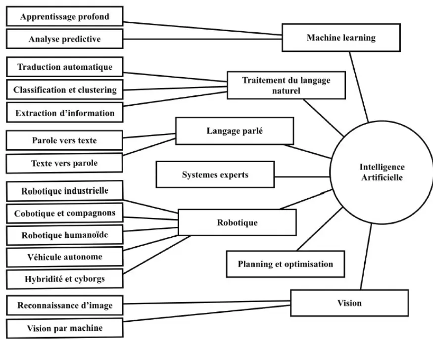

## Introduction : IA magie ou tromperie ?

Le concept d'intelligence artificielle a émergé au milieu des années 1950, inspiré par les réflexions du mathématicien Alan Turing, qui s'interrogeait sur la capacité d'un ordinateur à "penser" ou s'il ne pouvait que simuler la pensée à travers un "jeu d'imitation". (Netflix : Imitation Game)

À cette époque, l'intelligence artificielle ne reste que théorique, mais la question concernant sa véritable nature persiste.

Aujourd'hui, l'image de l'intelligence artificielle a évolué et ChatGPT avouera lui-même qu'une "Intelligence Artificielle (IA) est un ensemble de technologies qui permettent à des machines, généralement des ordinateurs, de simuler des capacités humaines telles que la pensée, l'apprentissage, la résolution de problèmes, la reconnaissance de modèles ou la compréhension du langage naturel."

Ainsi, il est important de garder en tête que malgré les avancées fulgurantes dans ce domaine, l'IA n'est qu'une reproduction de nos capacités. En conséquence, elle partage avec nous certaines limites. Il est donc crucial d'exploiter cette technologie dans des domaines où la puissance de calcul des machines peut réellement apporter des solutions.

En fin de compte, l'IA ne doit pas être perçue comme une forme de magie, mais comme un outil destiné à nous aider dans certains domaines, facilitant ainsi notre quotidien.

## Les différentes technologies IA et leurs domaines d'applications

Tout le monde a déjà entendu parler du deep learning, du machine learning ou de l'intelligence artificielle sans réellement en faire la différence. Pourtant, chacun de ces termes fait référence à des approches distinctes dans le domaine de l'IA et possède des spécificités qui leurs sont propres. Il est donc important de faire la différence entre chacune de ces technologies.

    
     
    <u> Image 1 : Classification des différents domaines de l'intelligence artificielle</u>
     
    [Source : https://hal.science/hal-01963632/document]

 

Ce graphique permet de mieux visualiser l'ensemble des différentes technologies considérées comme de l'intelligence artificielle, ainsi que des exemples de domaines d'application. On distingue 7 grandes branches, chacune ayant son fonctionnement et ses domaines d'application :

**1. Machine learning :**

Le machine learning est une sous-discipline de l'IA qui permet aux systèmes d'apprendre à partir d'un jeu de données qu'il va analyser et proposer une solution sans être programmé spécifiquement pour cela. Il se divise en quatre sous-catégories :

- Apprentissage Supervisé
- Apprentissage Semi-Supervisé
- Apprentissage Non Supervisé 
- Apprentissage par Renforcement

Applications : Prédiction, trading, circulation.

**2. Traitement du language naturel :**

Le traitement du langage naturel est une sous-discipline de l'IA qui se concentre sur la compréhension et l'analyse du langage humain par les machines. Cette technologie permet aux machines de comprendre et de répondre au humain, facilitant ainsi les interactions humain-machine.

Applications : Chatbots, assistants virtuels, traduction automatique.

**3. Language parlé :**

Le language parlé ou speech est une sous-discipline de l'IA qui se concentre sur la compréhension et la génération du langage parlé. Cette branche englobe diverses technologies et techniques dont le but est de permettre aux machines de traiter, analyser et produire de la parole humaine.

Applications : Assistants vocaux, systèmes de dictée.

**4. Systèmes experts :**

Les systèmes experts utilisent des ensembles de règles codées par des experts afin d'émettre des recommandations. Ces systèmes sont souvent utilisés dans des contextes où des décisions doivent être prises en suivant des règles strictes.

Applications : Diagnostic médical, systèmes de gestion de la connaissance.

**5. Robotique :**

La robotique est une branche de l'intelligence artificielle qui se concentre sur la conception, la construction, l'exploitation et l'utilisation de robots. 

Applications : Automatisation des lignes de production, robot

**6. Planning et optimisation :**

Le Planning et Organisation en IA implique la création de systèmes capables de manipuler la gestion des ressources, la planification des tâches, et l'optimisation des processus. Les systèmes de planification doivent être capables de gérer l'incertitude, de s'adapter aux changements, et d'optimiser les résultats.

Applications : Planification des tâches et des ressources, tri et gestion des stocks

**7. Vision :**

La vision par ordinateur permet aux machines d'interpréter et d'analyser le contenu visuel de notre monde, en utilisant des techniques telles que la détection d'objets et l'analyse d'images.

Applications : Véhicules autonomes, reconnaissance faciale, surveillance.  

## Les limites de l'IA

Malgré ses nombreux succès, l'IA présente plusieurs limites ce qui la rend moins efficace ou inadaptée dans certains contextes :

**Manque de compréhension réelle**
   
L’une des plus grandes limites de l’IA est son incapacité à faire preuve de bon sens. En effet, les machines d'IA sont entraînées à l’aide d’ensembles de données et d’algorithmes spécifiques ; elles ne peuvent donc prendre des décisions qu’en fonction des informations sur lesquelles elles ont été formées. Elles sont incapables, en revanche, de prendre des initiatives sur des sujets sur lesquels elles n'ont pas été formées.

Exemple : Une IA peut trés bien reconnaitre des éléments sur une image mais elle aura beaucoup plus de mal à comprendre pourquoi on lui a fourni cette image et dans quel but.

**Dépendance à la qualité des données**

Comme expliqué précédemment, les IA ont besoin d'une grande base de données pour pouvoir fonctionner correctement. Si ces données sont insuffisantes, alors les résultats obtenus seront incorrects. Ainsi, cela réduit considérablement le champ d'action des intelligences artificielles. Tous les environnements non prédictibles où les exceptions sont nombreuses ne peuvent pas être traités correctement par la machine.

Exemple : Détection de maladie rare

**Absence de conscience et d'émotions**
   
Contrairement aux humains, l'IA n'a pas de conscience et ne peut donc pas ressentir d'émotions. Elle peut les simuler, mais elle ne peut pas les ressentir, ce qui limite son efficacité dans des contextes où l'intelligence émotionnelle est requise.

Exemple : L'art est un domaine où l'expression émotionnelle de l'artiste au travers de son œuvre est essentielle. Ainsi, les œuvres générées par une machine manquent cruellement de vie et perdent donc de leur charme.

**Complexité des tâches éthiques et morales**
  
À l'instar des émotions, l'IA a du mal à traiter des situations impliquant des questions éthiques complexes ou des décisions moralement ambiguës. Elle peut prendre des décisions basées sur des règles préprogrammées, mais ces règles peuvent ne pas couvrir toutes les nuances des dilemmes moraux.

Exemple : Pour les voitures autonomes, quelle décision prendre dans le cas où un piéton traverse subitement la route : continuer tout droit et donc tuer le piéton mais sauver le passager, ou faire une sortie de route et tuer le passager mais sauver le piéton ?

**Dépendance énergétique**
   
L'entraînement des grands modèles d'IA, notamment les deep learning, exige des ressources considérables en calcul et en énergie. Cette consommation suscite des préoccupations quant à leur durabilité et leur impact sur l'environnement.

Pour aller plus loin : [MON 1.2 : Impact énergétique des IA](../temps-1.2)  

## Pour se former au machine learning :

[1] N. Andrew, « MOOC - Spécialisation Deep learning ». Disponible sur: https://www.coursera.org/specializations/deep-learning  
[2] N. Andrew, « MOOC - Spécialisation Apprentissage automatique ». Disponible sur: https://www.coursera.org/specializations/machine-learning-introduction#courses  
[3] N. Andrew, « MOOC - L’IA pour tous ». Disponible sur: https://www.coursera.org/learn/ai-for-everyone  
[4] G. Aurélien, Machine Learning avec Scikit-Learn - 3e édition. Disponible sur: https://www.dunod.com/sciences-techniques/machine-learning-avec-scikit-learn-mise-en-oeuvre-et-cas-concrets-1  
[5] C.-A. Azencott, Introduction au Machine Learning. Dunot. Disponible sur: https://www.dunod.com/sciences-techniques/introduction-au-machine-learning-1  
[6] E. Charniak, Introduction au Deep Learning. Dunot. Disponible sur: https://www.dunod.com/sciences-techniques/introduction-au-deep-learning  
[7] G. Aurélien, Deep Learning avec Keras et TensorFlow - 3e édition. Disponible sur: https://www.dunod.com/sciences-techniques/deep-learning-avec-keras-et-tensorflow-mise-en-oeuvre-et-cas-concrets-0  

